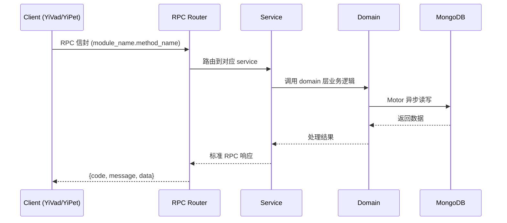

---

doc_type: module
prd_task_id: "YA-09-177"
title: "YA-09-177: 自适应温度采样 — 基于上下文动态调整采样温度、意图温度预设与自适应重复惩罚 — 开发任务"
status: 需求已编写
priority: P2
owner: 陈铭
roles: [engineer]
created: 2026-09-11
updated: 2026-09-11
project: YiAi
project_id: yiai
prd_month: "202609"
estimate_frontend: 0.3
source_prd: "183-需求-自适应温度采样.md"
source_okr: [yiai-002]
related_tests: ["183-test-自适应温度采样"]

type: task
---

# YA-09-177: 自适应温度采样 — 基于上下文动态调整采样温度、意图温度预设与自适应重复惩罚 — 开发任务

> **文档职责**: 本文档定义**怎么做、为什么这么做、实际做成什么样**（HOW），不含产品目标与测试用例。

> 来源 PRD: [183-需求-自适应温度采样.md](../../prds/2026-09/183-需求-自适应温度采样.md)
> 需求编号: YA-09-177 · 优先级: P2 · 人天: 0.3d

---

<a id="sec-1"></a>
## 一、架构概览


<a id="sec-2"></a>
## 二、文件清单

```

<a id="sec-3"></a>
## 三、模块设计

### 1. 核心组件

```python
 domain/temperature/models.py

from enum import Enum
from pydantic import BaseModel, Field
from datetime import datetime

class IntentCategory(str, Enum):
    """意图分类。"""
    FACTUAL_QA = "factual_qa"           # 事实问答
    CODE_GENERATION = "code_generation"  # 代码生成
    CREATIVE_WRITING = "creative_writing"  # 创意写作
    ANALYSIS = "analysis"               # 分析推理
    TRANSLATION = "translation"         # 翻译
    SUMMARIZATION = "summarization"     # 摘要
    BRAINSTORMING = "brainstorming"     # 头脑风暴
    INSTRUCTION = "instruction"         # 指令执行
    CHITCHAT = "chitchat"              # 闲聊
    UNKNOWN = "unknown"                 # 未知

class DialoguePhase(str, Enum):
    """对话阶段。"""
    EXPLORATION = "exploration"    # 探索阶段：高多样性
    CONVERGENCE = "convergence"    # 收敛阶段：需要精确
    STABLE = "stable"              # 稳定阶段：保持

# ... (完整实现见 PRD)
```

### 2. 核心组件

```python
 domain/temperature/intent_presets.py

class IntentPresets:
    """意图温度预设表：基于业界最佳实践和实验数据。"""

    PRESETS: dict[IntentCategory, TemperaturePreset] = {
        IntentCategory.FACTUAL_QA: TemperaturePreset(
            intent=IntentCategory.FACTUAL_QA,
            temperature=0.2,
            top_p=0.9,
            repeat_penalty=1.05,
            description="事实问答需要高精度，低温度减少幻觉",
        ),
        IntentCategory.CODE_GENERATION: TemperaturePreset(
            intent=IntentCategory.CODE_GENERATION,
            temperature=0.1,
            top_p=0.95,
            repeat_penalty=1.0,
            description="代码生成需要确定性，极低温度确保语法正确",
        ),
        IntentCategory.CREATIVE_WRITING: TemperaturePreset(
            intent=IntentCategory.CREATIVE_WRITING,
            temperature=0.9,
            top_p=0.95,
            repeat_penalty=1.15,
# ... (完整实现见 PRD)
```

### 3. 核心组件


<a id="sec-4"></a>
## 四、数据流



**调用链路**: `Client → RPC Router → Service → Domain → MongoDB`  
**响应格式**: `{code: 0, message: "ok", data: ...}`  
**异步模型**: 全链路 `async/await`，Motor 异步 MongoDB 驱动。

<a id="sec-5"></a>
## 五、实施路线图

**预估人天**: 0.3d

按依赖顺序排列，每步可独立验证和提交：

| 步骤 | 内容 | 涉及文件 | 验证方式 | 人天 |
|------|------|---------|---------|------|
| 1 | 定义数据模型（IntentCategory、TemperaturePreset、TemperatureConfig、DiversityMetrics、AdaptiveRepeatPenalty、TemperatureEffectiveness） | `domain/temperature/models.py` | Pydantic 校验通过，枚举完整 | 0.02 |
| 2 | 实现意图温度预设表（10 种意图的 temperature/top_p/repeat_penalty 映射） | `domain/temperature/intent_presets.py` | 每种意图有预设，温度范围合理 | 0.03 |
| 3 | 实现多样性监控器（n-gram 重复检测、熵计算、自 BLEU、重复判断） | `domain/temperature/diversity_monitor.py` | 重复文本检测准确，指标计算正确 | 0.04 |
| 4 | 实现温度控制器（意图识别、预设匹配、上下文自适应、用户覆盖、范围约束） | `domain/temperature/temperature_controller.py` | 三级优先级策略正确，范围约束生效 | 0.06 |
| 5 | 实现自适应重复惩罚适配器（基于多样性动态调整 repeat_penalty） | `domain/temperature/repeat_penalty_adapter.py` | 重复度高时惩罚增加，正常时恢复 | 0.04 |
| 6 | 实现效果追踪器（温度-满意度关联分析、预设效果排行） | `domain/temperature/effectiveness_tracker.py` | 记录正确，分析结果合理 | 0.03 |
| 7 | 实现温度采样服务 RPC（adaptive_temperature、presets、preference、effectiveness、analytics） | `services/temperature/temperature_service.py` | 所有 RPC 接口正常响应 | 0.06 |
| 8 | 集成到 chat_service（调用温度服务获取自适应温度） | `chat_service.py` | 聊天回复使用自适应温度 | 0.02 |

**总计：0.3d**


<a id="sec-6"></a>
## 六、代码审查检查清单

- [ ] `IntentCategory` 包含 10 种意图分类
- [ ] `TemperaturePreset` 包含 temperature、top_p、repeat_penalty 三个核心参数
- [ ] 意图温度预设表覆盖所有意图，温度范围合理（0.1-1.0）
- [ ] 温度控制器三级优先级：意图预设 → 上下文自适应 → 用户覆盖
- [ ] 上下文调整幅度限制在 ±0.2
- [ ] 多样性监控器支持 n-gram 重复检测、熵计算、自 BLEU 分数
- [ ] 自适应重复惩罚范围 1.0-1.5，正常时恢复至 1.1
- [ ] 用户覆盖温度范围约束在 0.0-1.5
- [ ] 效果追踪器记录温度-满意度关联数据
- [ ] `ruff` 代码规范通过
- [ ] `mypy` 类型检查通过


<a id="sec-7"></a>
## 七、风险评估

| 风险 | 概率 | 影响 | 等级 | 缓解措施 | 应急预案 |
|------|------|------|------|----------|----------|
| 意图识别错误导致温度设置不当 | 中 | 中 | 中 | 意图分类使用高置信度模型，低置信度退回 unknown 预设 | 允许用户手动覆盖温度 |
| 温度频繁调整导致输出不稳定 | 低 | 中 | 低 | 调整幅度限制在 ±0.2，相邻两轮变化不超过 0.3 | 锁定温度，禁止自动调整 |
| 多样性指标对中文短文本不准确 | 中 | 低 | 低 | 对短文本（< 50 字）放宽阈值 | 短文本不使用多样性调整 |
| 重复惩罚过高导致输出不自然 | 低 | 中 | 低 | 惩罚上限 1.5，正常时恢复至 1.1 | 固定重复惩罚 |
| 意图识别延迟影响聊天体验 | 低 | 中 | 低 | 使用 3B 小模型做意图分类，延迟 < 200ms | 缓存意图（同一会话复用） |


<a id="sec-8"></a>
## 八、回滚方案

| 回滚场景 | 回滚方式 | 影响范围 | 恢复时间 |
|----------|----------|----------|----------|
| 自适应温度导致输出质量下降 | 关闭自适应，使用固定温度 0.7 | 温度采样 | 1min |
| 意图识别延迟过高 | 关闭意图识别，所有请求使用默认温度 | 温度预设 | 1min |
| 重复惩罚过高导致输出不自然 | 关闭自适应重复惩罚，使用固定 1.1 | 重复惩罚 | 1min |

**回滚验证：**
- 聊天服务正常，温度恢复为固定值
- `ruff` + `mypy` 检查通过

