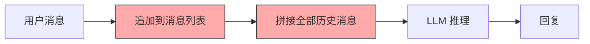
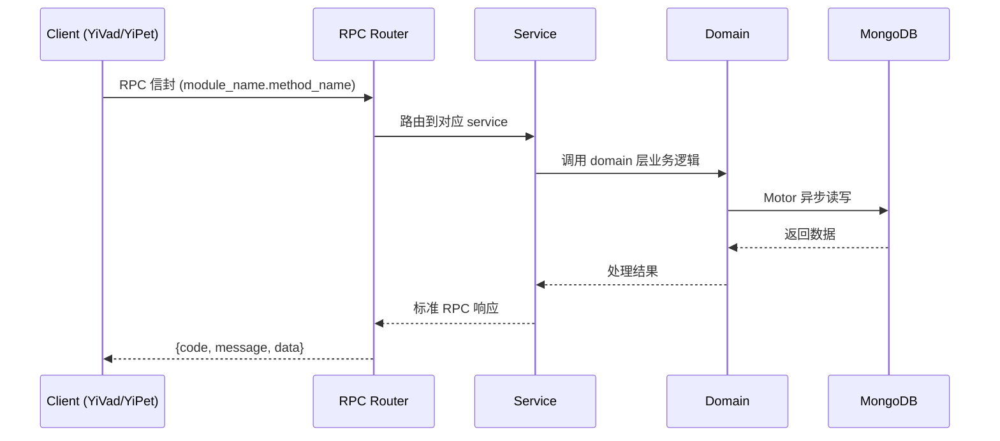

---

doc_type: module
prd_task_id: "YA-09-132"
title: "YA-09-132: 多轮对话状态追踪 — 槽位填充 + 意图转移 — 开发方案"
status: 需求已编写
priority: P2
owner: 陈铭
roles: [engineer]
created: 2026-09-11
updated: 2026-09-14
project: YiAi
project_id: yiai
prd_month: "202609"
estimate_frontend: 0.5
source_prd: "184-需求-多轮对话状态追踪.md"
source_okr: [yiai-001]
related_tests: ["184-test-多轮对话状态追踪"]

type: task
---

# YA-09-132: 多轮对话状态追踪 — 槽位填充 + 意图转移 — 开发方案

> **文档职责**: 本文档定义**怎么做、为什么这么做、实际做成什么样**（HOW），不含产品目标与测试用例。

> 来源 PRD: [184-需求-多轮对话状态追踪.md](../../prds/2026-09/184-需求-多轮对话状态追踪.md)
> 需求编号: YA-09-132 · 优先级: P2 · 人天: 0.5d

---

<a id="sec-1"></a>
## 一、架构概览



<a id="sec-2"></a>
## 二、文件清单

```

<a id="sec-3"></a>
## 三、模块设计

### 1. 核心组件

```python
 domain/dialogue_state/models.py

from enum import Enum
from pydantic import BaseModel, Field
from datetime import datetime
from typing import Any

class DialogueAct(str, Enum):
    """对话行为分类。"""
    QUESTION = "question"            # 提问
    COMMAND = "command"              # 指令/请求
    CLARIFICATION = "clarification"  # 澄清/追问
    FEEDBACK = "feedback"            # 反馈（正面/负面）
    STATEMENT = "statement"          # 陈述/信息提供
    GREETING = "greeting"            # 问候/寒暄
    CONFIRMATION = "confirmation"    # 确认/否认
    UNKNOWN = "unknown"              # 未知

class SlotType(str, Enum):
    """槽位类型。"""
    ENTITY = "entity"             # 实体（人名、地名、组织）
    PREFERENCE = "preference"     # 偏好（语言、风格、格式）
    CONSTRAINT = "constraint"     # 约束（时间、预算、范围）
    TEMPORAL = "temporal"         # 时间（日期、期限）
    NUMERIC = "numeric"           # 数值（金额、数量）
# ... (完整实现见 PRD)
```

### 2. 核心组件

```python
 domain/dialogue_state/slot_extractor.py

import json
import re
import asyncio
from datetime import datetime

class SlotExtractor:
    """槽位提取器：LLM 结构化提取 + 正则预提取 + 槽位合并。"""

    SLOT_EXTRACTION_PROMPT = """从以下用户消息中提取关键信息（槽位）。请严格按照 JSON 格式返回。

槽位类型:
- entity: 实体（人名、地名、组织、产品名）
- preference: 偏好（语言、风格、格式、喜好）
- constraint: 约束（时间限制、预算限制、范围限制）
- temporal: 时间（日期、截止日期、时间段）
- numeric: 数值（金额、数量、百分比）
- contact: 联系方式（邮箱、电话、地址）

用户消息: "{message}"

对话上下文（已有槽位）:
{existing_slots}

# ... (完整实现见 PRD)
```

### 3. 核心组件


<a id="sec-4"></a>
## 四、数据流



**调用链路**: `Client → RPC Router → Service → Domain → MongoDB`  
**响应格式**: `{code: 0, message: "ok", data: ...}`  
**异步模型**: 全链路 `async/await`，Motor 异步 MongoDB 驱动。

<a id="sec-5"></a>
## 五、实施路线图

**预估人天**: 0.5d

按依赖顺序排列，每步可独立验证和提交：

| 步骤 | 内容 | 涉及文件 | 验证方式 | 人天 |
|------|------|---------|---------|------|
| 1 | 定义数据模型（DialogueAct、Slot、Intent、DialogueState、IntentShiftResult、ContextWindowConfig） | `domain/dialogue_state/models.py` | Pydantic 校验通过，枚举完整 | 0.02 |
| 2 | 实现对话行为分类器（8 种行为标签） | `domain/dialogue_state/dialogue_act_classifier.py` | 准确率 > 80%，延迟 < 200ms | 0.03 |
| 3 | 实现槽位提取器（正则预提取 + LLM 结构化提取 + 合并） | `domain/dialogue_state/slot_extractor.py` | 槽位提取准确率 > 75%，支持 6 种槽位类型 | 0.06 |
| 4 | 实现意图转移检测器（语义相似度 + 槽位变化联合判断） | `domain/dialogue_state/intent_shift_detector.py` | 转移检测准确率 > 80% | 0.04 |
| 5 | 实现状态管理器（状态更新、槽位 CRUD、阶段推断、持久化） | `domain/dialogue_state/state_manager.py` | 状态流转正确，槽位 CRUD 正常 | 0.05 |
| 6 | 实现上下文优化器（状态摘要 + 槽位上下文 + 选择性消息注入） | `domain/dialogue_state/context_optimizer.py` | 节省 token 比例 > 20%，关键信息不丢失 | 0.04 |
| 7 | 实现状态持久化（MongoDB 读写、状态恢复） | `domain/dialogue_state/state_repository.py` | 跨会话恢复正常 | 0.03 |
| 8 | 实现状态追踪服务 RPC（process、get_state、slot CRUD、intent_shift、optimize） | `services/dialogue_state/dialogue_state_service.py` | 所有 RPC 接口正常响应 | 0.03 |

**总计：0.3d**


<a id="sec-6"></a>
## 六、代码审查检查清单

- [ ] `DialogueAct` 包含 8 种行为标签：question、command、clarification、feedback、statement、greeting、confirmation、unknown
- [ ] `SlotType` 包含 7 种槽位类型：entity、preference、constraint、temporal、numeric、contact、custom
- [ ] `DialogueStage` 包含 5 个阶段：opening、information_gathering、problem_solving、confirmation、closing
- [ ] 槽位提取器支持正则预提取（日期、邮箱、金额）
- [ ] 槽位提取器使用 LLM + JSON Schema 进行结构化提取
- [ ] 意图转移检测使用语义相似度（< 0.5）和槽位变化（> 50%）双重条件
- [ ] 状态管理器支持槽位 CRUD 和意图历史
- [ ] 上下文优化器基于状态选择性注入摘要和槽位上下文
- [ ] 状态持久化仅保存槽位和状态摘要
- [ ] `ruff` 代码规范通过
- [ ] `mypy` 类型检查通过


<a id="sec-7"></a>
## 七、风险评估

| 风险 | 概率 | 影响 | 等级 | 缓解措施 | 应急预案 |
|------|------|------|------|----------|----------|
| 槽位提取错误（提取了无关信息） | 中 | 中 | 中 | 置信度阈值 0.7，低置信度槽位不注入 System Prompt | 用户可手动删除错误槽位 |
| 意图转移误判（同话题不同表述） | 中 | 中 | 中 | 语义相似度 + 槽位变化双重条件，减少误判 | 提高相似度阈值至 0.6 |
| 上下文优化丢失关键信息 | 中 | 高 | 中 | 状态摘要 + 槽位上下文保留关键信息 | 关闭优化，使用完整上下文 |
| 状态持久化性能影响 | 低 | 低 | 低 | 异步持久化，不阻塞对话流程 | 仅内存模式，关闭持久化 |
| 对话行为分类延迟 | 低 | 低 | 低 | 使用 3B 小模型，延迟 < 200ms | 缓存分类结果（同会话复用） |


<a id="sec-8"></a>
## 八、回滚方案

| 回滚场景 | 回滚方式 | 影响范围 | 恢复时间 |
|----------|----------|----------|----------|
| 槽位提取质量差 | 关闭槽位提取，使用纯消息列表 | 对话状态追踪 | 1min |
| 意图转移误判率高 | 关闭意图转移检测，不重置槽位 | 槽位管理 | 1min |
| 上下文优化丢失信息 | 关闭优化，使用完整消息列表 | 上下文窗口 | 1min |

**回滚验证：**
- 聊天服务正常，消息列表完整
- 对话状态接口返回空状态
- `ruff` + `mypy` 检查通过

