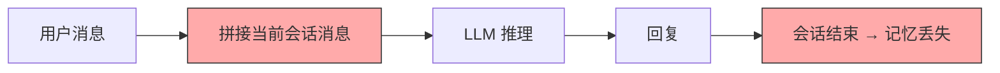
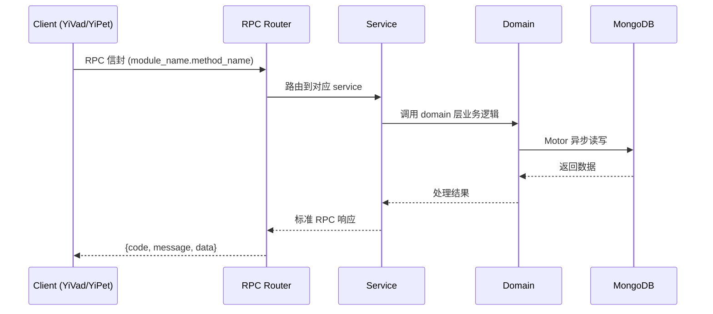

---

doc_type: module
prd_task_id: "YA-09-135"
title: "YA-09-135: 个性化记忆系统 — 长期用户记忆 + 衰减 — 开发方案"
status: 需求已编写
priority: P2
owner: 陈铭
roles: [engineer]
created: 2026-09-11
updated: 2026-09-14
project: YiAi
project_id: yiai
prd_month: "202609"
estimate_frontend: 0.5
source_prd: "185-需求-个性化记忆系统.md"
source_okr: [yiai-001]
related_tests: ["185-test-个性化记忆系统"]

type: task
---

# YA-09-135: 个性化记忆系统 — 长期用户记忆 + 衰减 — 开发方案

> **文档职责**: 本文档定义**怎么做、为什么这么做、实际做成什么样**（HOW），不含产品目标与测试用例。

> 来源 PRD: [185-需求-个性化记忆系统.md](../../prds/2026-09/185-需求-个性化记忆系统.md)
> 需求编号: YA-09-135 · 优先级: P2 · 人天: 0.5d

---

<a id="sec-1"></a>
## 一、架构概览



<a id="sec-2"></a>
## 二、文件清单

```

<a id="sec-3"></a>
## 三、模块设计

### 1. 核心组件

```python
 domain/memory/models.py

from enum import Enum
from pydantic import BaseModel, Field
from datetime import datetime
from typing import Any

class MemoryType(str, Enum):
    """记忆类型。"""
    PREFERENCE = "preference"        # 用户偏好（语言、风格、格式）
    FACT = "fact"                    # 用户事实（姓名、职业、技能）
    SUMMARY = "summary"              # 对话摘要（历史对话概括）
    COMMAND = "command"              # 常用指令（用户常用操作）
    RELATIONSHIP = "relationship"    # 关系信息（与谁合作、团队信息）
    GOAL = "goal"                    # 目标/计划（用户当前目标）

class MemoryImportance(int, Enum):
    """记忆重要性。"""
    CRITICAL = 5    # 关键（用户明确告知）
    HIGH = 4        # 高（多次提及）
    MEDIUM = 3      # 中（单次提及，中等置信度）
    LOW = 2         # 低（推断，低置信度）
    MINIMAL = 1     # 极低（可能过时或不准确）

class MemoryStorageTier(str, Enum):
# ... (完整实现见 PRD)
```

### 2. 核心组件

```python
 domain/memory/memory_extractor.py

import json
import asyncio
from datetime import datetime

class MemoryExtractor:
    """记忆提取器：从对话中自动提取用户记忆。"""

    MEMORY_EXTRACTION_PROMPT = """从以下对话中提取关于用户的重要信息（记忆）。请严格按照 JSON 格式返回。

记忆类型:
- preference: 用户偏好（语言、风格、格式、喜欢的工具）
- fact: 用户事实（姓名、职业、技能、经验、背景）
- summary: 对话摘要（本次对话的关键内容概括）
- command: 常用指令（用户经常使用的操作模式）
- relationship: 关系信息（与谁合作、团队角色）
- goal: 目标/计划（用户的当前目标或计划）

对话内容:
{conversation}

已有记忆（避免重复提取）:
{existing_memories}

# ... (完整实现见 PRD)
```

### 3. 核心组件


<a id="sec-4"></a>
## 四、数据流



**调用链路**: `Client → RPC Router → Service → Domain → MongoDB`  
**响应格式**: `{code: 0, message: "ok", data: ...}`  
**异步模型**: 全链路 `async/await`，Motor 异步 MongoDB 驱动。

<a id="sec-5"></a>
## 五、实施路线图

**预估人天**: 0.5d

按依赖顺序排列，每步可独立验证和提交：

| 步骤 | 内容 | 涉及文件 | 验证方式 | 人天 |
|------|------|---------|---------|------|
| 1 | 定义数据模型（MemoryType、Memory、MemoryContext、MemoryConsolidationResult、MemoryPrivacyConfig） | `domain/memory/models.py` | Pydantic 校验通过，枚举完整 | 0.03 |
| 2 | 实现记忆加密模块（AES 加密/解密、用户级密钥派生） | `domain/memory/memory_encryption.py` | 加密后解密还原，用户间密钥隔离 | 0.04 |
| 3 | 实现记忆数据访问层（CRUD、分层查询、加密存储、隐私配置） | `domain/memory/memory_repository.py` | MongoDB 读写正常，加密透明 | 0.05 |
| 4 | 实现记忆提取器（LLM 提取、冲突检测、更新处理） | `domain/memory/memory_extractor.py` | 提取准确率 > 75%，不重复提取 | 0.08 |
| 5 | 实现记忆检索器（Embedding 语义检索、相关性排序、记忆上下文构建） | `domain/memory/memory_retriever.py` | 检索相关性 > 80%，延迟 < 500ms | 0.06 |
| 6 | 实现记忆巩固器（分层迁移、相似记忆合并、摘要生成） | `domain/memory/memory_consolidator.py` | 30 天原始→压缩，90 天压缩→归档 | 0.05 |
| 7 | 实现记忆衰减器（指数衰减、引用延长、保留建议） | `domain/memory/memory_decayer.py` | 衰减分数计算正确，建议合理 | 0.05 |
| 8 | 实现记忆服务 RPC（extract、retrieve、list、update、delete、consolidate、decay、export、privacy） | `services/memory/memory_service.py` | 所有 RPC 接口正常响应 | 0.08 |
| 9 | 集成到 chat_service（检索记忆 → 注入 System Prompt → 个性化回复） | `chat_service.py` | 回复包含用户个性化信息 | 0.04 |
| 10 | 配置定期任务（apscheduler: 记忆巩固 + 衰减检测） | 配置文件 | 定时任务正常触发 | 0.02 |

**总计：0.5d**


<a id="sec-6"></a>
## 六、代码审查检查清单

- [ ] `MemoryType` 包含 6 种类型：preference、fact、summary、command、relationship、goal
- [ ] `MemoryImportance` 包含 5 级：CRITICAL(5) 到 MINIMAL(1)
- [ ] `MemoryStorageTier` 包含 3 层：raw、compressed、archived
- [ ] 记忆提取器使用 LLM + JSON Schema 结构化提取
- [ ] 记忆提取器检测冲突并处理更新
- [ ] 记忆检索器使用 Embedding 语义检索 + 重要性加权 + 时间衰减
- [ ] 记忆上下文构建注入 System Prompt 格式
- [ ] 记忆巩固器支持 30 天原始→压缩、90 天压缩→归档
- [ ] 记忆衰减器使用指数衰减 + 引用延长半衰期
- [ ] 记忆加密使用 AES + 用户级密钥隔离
- [ ] 用户可查看、编辑、删除、导出记忆
- [ ] 记忆隐私配置支持加密、自动提取、保留天数设置
- [ ] `ruff` 代码规范通过
- [ ] `mypy` 类型检查通过


<a id="sec-7"></a>
## 七、风险评估

| 风险 | 概率 | 影响 | 等级 | 缓解措施 | 应急预案 |
|------|------|------|------|----------|----------|
| 记忆提取错误（提取了不准确的信息） | 中 | 中 | 中 | 置信度阈值 0.6，用户可手动删除/编辑 | 用户关闭自动提取 |
| 记忆检索不相关 | 中 | 中 | 中 | 相关性阈值 0.6，重要性加权 | 用户手动选择相关记忆 |
| 记忆数据泄露 | 低 | 高 | 中 | AES 加密 + 用户级密钥隔离 + 传输加密 | 紧急关闭记忆功能 |
| 记忆存储膨胀 | 中 | 低 | 低 | 分层存储 + 定期巩固 + 衰减归档 | 限制单用户记忆上限（1000 条） |
| 记忆提取 LLM 调用延迟 | 低 | 低 | 低 | 异步提取，不阻塞对话 | 批量提取（每 5 轮触发一次） |


<a id="sec-8"></a>
## 八、回滚方案

| 回滚场景 | 回滚方式 | 影响范围 | 恢复时间 |
|----------|----------|----------|----------|
| 记忆提取质量差 | 关闭自动提取（配置开关） | 记忆更新 | 1min |
| 记忆检索延迟高 | 关闭记忆检索注入 | 个性化回复 | 1min |
| 记忆数据泄露风险 | 紧急关闭记忆功能 + 加密所有已有记忆 | 全部记忆功能 | 5min |

**回滚验证：**
- 聊天服务正常，无记忆注入
- 记忆接口返回空数据
- `ruff` + `mypy` 检查通过

