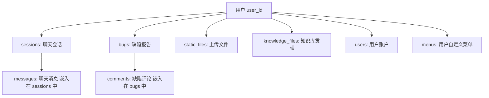
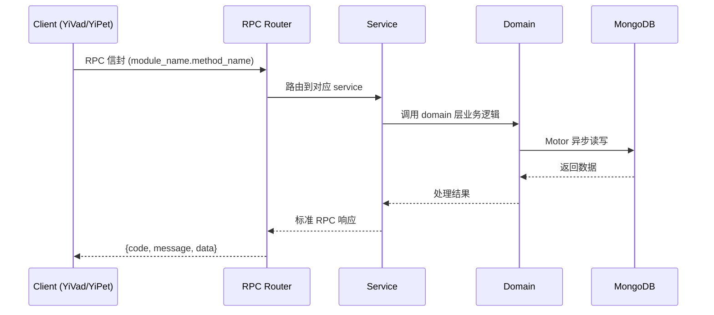

---

doc_type: module
prd_task_id: "YA-09-60"
title: "YA-09-60: 数据导出与合规删除 — GDPR 数据可移植 + 级联清理 — 开发方案"
status: 需求已编写
priority: P2
owner: 陈铭
roles: [engineer]
created: 2026-09-11
updated: 2026-09-14
project: YiAi
project_id: yiai
prd_month: "202609"
estimate_frontend: 1.0
source_prd: "186-需求-数据导出与合规删除.md"
source_okr: [yiai-001]
related_tests: ["186-test-数据导出与合规删除"]

type: task
---

# YA-09-60: 数据导出与合规删除 — GDPR 数据可移植 + 级联清理 — 开发方案

> **文档职责**: 本文档定义**怎么做、为什么这么做、实际做成什么样**（HOW），不含产品目标与测试用例。

> 来源 PRD: [186-需求-数据导出与合规删除.md](../../prds/2026-09/186-需求-数据导出与合规删除.md)
> 需求编号: YA-09-60 · 优先级: P2 · 人天: 1.0d

---

<a id="sec-1"></a>
## 一、架构概览



<a id="sec-2"></a>
## 二、文件清单

| 文件 | 操作 | 说明 |
|------|------|------|
| `domain/XXX/models.py` | 新增 | 数据模型定义 |
| `domain/XXX/service.py` | 新增 | 核心服务逻辑 |
| `services/XXX/rpc_handler.py` | 新增 | RPC 路由处理器 |
| `tests/test_XXX.py` | 新增 | 单元测试 |

<a id="sec-3"></a>
## 三、模块设计

### 2. 核心组件

```python
 services/privacy/data_handler.py (新增)

import json
import zipfile
import io
from datetime import datetime, timedelta
from typing import Dict, List, Any, Optional
from motor.motor_asyncio import AsyncIOMotorDatabase
from .data_lineage import DATA_LINEAGE_CONFIG

class DataDiscovery:
    """跨集合数据发现服务"""

    def __init__(self, db: AsyncIOMotorDatabase):
        self.db = db
        self.lineage = DATA_LINEAGE_CONFIG

    async def discover_user_data(self, user_id: str) -> Dict[str, Any]:
        """发现用户在所有集合中的数据"""
        result = {
            "user_id": user_id,
            "discovery_time": datetime.utcnow().isoformat(),
            "collections": {},
        }

# ... (完整实现见 PRD)
```

### 3. 核心组件

```python
 services/privacy/activity_logger.py (新增)

from datetime import datetime
from typing import Dict, Any, Optional
from motor.motor_asyncio import AsyncIOMotorDatabase

class ActivityLogger:
    """数据处理活动记录器"""

    ACTIVITY_TYPES = [
        "data_export",           # 数据导出
        "data_deletion",         # 数据删除
        "data_restore",          # 数据恢复
        "consent_change",        # 同意变更
        "retention_enforcement", # 保留策略执行
        "data_access",           # 数据访问
        "data_discovery",        # 数据发现
    ]

    def __init__(self, db: AsyncIOMotorDatabase):
        self.db = db
        self.collection = db["privacy_activities"]

    async def log_activity(
        self,
# ... (完整实现见 PRD)
```


<a id="sec-4"></a>
## 四、数据流



**调用链路**: `Client → RPC Router → Service → Domain → MongoDB`  
**响应格式**: `{code: 0, message: "ok", data: ...}`  
**异步模型**: 全链路 `async/await`，Motor 异步 MongoDB 驱动。

<a id="sec-5"></a>
## 五、实施路线图

**预估人天**: 1.0d

| 步骤 | 操作 | 路径 | 验证 | 人天 |
|------|------|------|------|------|
| 1 | 定义数据血缘配置 | `data_lineage.py` | 所有集合的用户关联字段正确 | 0.02 |
| 2 | 实现数据发现服务 | `data_handler.py` | 跨集合扫描返回完整数据 | 0.05 |
| 3 | 实现数据导出服务 | `data_handler.py` | ZIP 文件包含所有集合的 JSON | 0.04 |
| 4 | 实现级联删除服务 | `data_handler.py` | 软删除用户所有关联数据 | 0.05 |
| 5 | 实现保留策略执行器 | `retention_service.py` | 定时清理过期数据 | 0.04 |
| 6 | 实现处理活动日志 | `activity_logger.py` | 活动记录完整可查询 | 0.03 |
| 7 | 实现 RPC 路由处理器 | `rpc_handler.py` | RPC 信封正确路由 | 0.03 |
| 8 | 注册定时任务 | `main.py` | apscheduler 定时任务正常运行 | 0.02 |
| 9 | 编写单元测试 | `test_privacy_handler.py` | 测试覆盖率 > 80% | 0.02 |

**总人天：0.3d**


<a id="sec-6"></a>
## 六、代码审查检查清单

- [ ] 数据血缘配置覆盖所有用户数据集合
- [ ] 数据发现服务正确处理 MongoDB ObjectId 序列化
- [ ] 数据导出使用流式处理，避免大数据集内存溢出
- [ ] ZIP 打包使用标准库 zipfile，兼容性良好
- [ ] 级联删除正确处理嵌入文档（如 sessions.messages）
- [ ] 软删除使用 `update_many` 确保原子性
- [ ] 硬删除定时任务有幂等性保护
- [ ] 数据恢复功能恢复所有关联数据
- [ ] 保留策略正确处理 `None` 值（永久保留）
- [ ] 处理活动日志异步写入，不阻塞主流程
- [ ] RPC 路由处理器参数验证完整
- [ ] 单元测试覆盖所有服务方法


<a id="sec-7"></a>
## 七、风险评估

| 风险 | 概率 | 影响 | 缓解措施 |
|------|------|------|----------|
| 大量数据导出导致内存溢出 | 中 | 高 | 使用流式导出，分批读取 MongoDB 数据 |
| 级联删除遗漏关联数据 | 中 | 高 | 数据血缘配置覆盖所有集合，单元测试验证 |
| 定时任务与业务操作冲突 | 低 | 中 | 定时任务在低峰期执行（凌晨 3 点） |
| 软删除后数据恢复窗口过短 | 中 | 低 | 30 天恢复窗口，可配置 |


<a id="sec-8"></a>
## 八、回滚方案

| 场景 | 回滚操作 | 影响 |
|------|----------|------|
| 数据导出功能异常 | 禁用导出 API，返回功能维护中 | 失去导出功能 |
| 级联删除误删数据 | 30 天内可通过 restore 恢复 | 数据可恢复 |
| 保留策略误删数据 | 从备份中恢复数据 | 依赖备份 |

