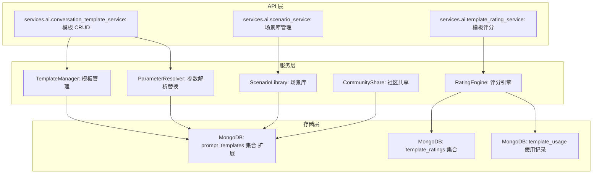
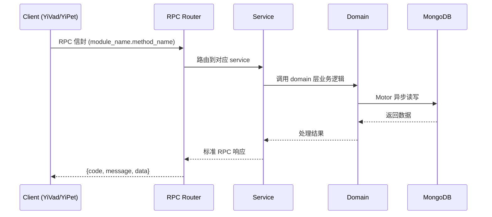

---

doc_type: module
prd_task_id: "YA-09-137"
title: "YA-09-137: 对话模板与场景库 — 预置模板 + 参数化 — 开发方案"
status: 需求已编写
priority: P2
owner: 陈铭
roles: [engineer]
created: 2026-09-11
updated: 2026-09-14
project: YiAi
project_id: yiai
prd_month: "202609"
estimate_frontend: 0.5
source_prd: "187-需求-对话模板与场景库.md"
source_okr: [yiai-002]
related_tests: ["187-test-对话模板与场景库"]

type: task
---

# YA-09-137: 对话模板与场景库 — 预置模板 + 参数化 — 开发方案

> **文档职责**: 本文档定义**怎么做、为什么这么做、实际做成什么样**（HOW），不含产品目标与测试用例。

> 来源 PRD: [187-需求-对话模板与场景库.md](../../prds/2026-09/187-需求-对话模板与场景库.md)
> 需求编号: YA-09-137 · 优先级: P2 · 人天: 0.5d

---

<a id="sec-1"></a>
## 一、架构概览



<a id="sec-2"></a>
## 二、文件清单

| 文件 | 操作 | 说明 |
|------|------|------|
| `domain/XXX/models.py` | 新增 | 数据模型定义 |
| `domain/XXX/service.py` | 新增 | 核心服务逻辑 |
| `services/XXX/rpc_handler.py` | 新增 | RPC 路由处理器 |
| `tests/test_XXX.py` | 新增 | 单元测试 |

<a id="sec-3"></a>
## 三、模块设计

### 1. 核心组件

```python
 services/ai/conversation_template_service.py (新增)

from typing import List, Optional, Dict, Any
from datetime import datetime
from pydantic import BaseModel, Field

class TemplateParameter(BaseModel):
    """模板参数定义"""
    name: str                          # 参数名
    label: str                         # 显示标签
    type: str = "string"              # 参数类型: string/number/select/multiline
    required: bool = True             # 是否必填
    default: Optional[str] = None     # 默认值
    placeholder: Optional[str] = None # 输入提示
    options: Optional[List[str]] = None  # select 类型的选项

class ConversationTemplate(BaseModel):
    """对话模板"""
    id: Optional[str] = None
    name: str                          # 模板名称
    description: str                   # 模板描述
    template_type: str = "conversation"  # 区分 Prompt 模板
    scenario: str                      # 场景: code_review/brainstorming/debugging/writing/planning
    tags: List[str] = []              # 自定义标签
    icon: str = "💬"                  # 图标
# ... (完整实现见 PRD)
```

### 2. 核心组件

```python
 services/ai/conversation_template_service.py (续)

import re
from typing import List, Optional, Dict, Tuple
from motor.motor_asyncio import AsyncIOMotorDatabase

class ParameterResolver:
    """模板参数解析器"""

    PLACEHOLDER_PATTERN = re.compile(r'\{\{(\w+)\}\}')

    @classmethod
    def extract_parameters(cls, template_text: str) -> List[str]:
        """从模板文本中提取参数名"""
        return list(set(cls.PLACEHOLDER_PATTERN.findall(template_text)))

    @classmethod
    def resolve(cls, template_text: str, params: Dict[str, str]) -> Tuple[str, List[str]]:
        """替换模板中的占位符"""
        missing = []
        def replacer(match):
            var_name = match.group(1)
            if var_name in params:
                return params[var_name]
            missing.append(var_name)
# ... (完整实现见 PRD)
```

### 3. 核心组件


<a id="sec-4"></a>
## 四、数据流



**调用链路**: `Client → RPC Router → Service → Domain → MongoDB`  
**响应格式**: `{code: 0, message: "ok", data: ...}`  
**异步模型**: 全链路 `async/await`，Motor 异步 MongoDB 驱动。

<a id="sec-5"></a>
## 五、实施路线图

**预估人天**: 0.5d

| 步骤 | 操作 | 路径 | 验证 | 人天 |
|------|------|------|------|------|
| 1 | 定义模板数据模型 | `conversation_template_service.py` | Pydantic 模型验证通过 | 0.02 |
| 2 | 实现参数解析器 | `conversation_template_service.py` | 占位符提取和替换正确 | 0.02 |
| 3 | 实现模板 CRUD 服务 | `conversation_template_service.py` | 创建/查询/更新/删除正常 | 0.05 |
| 4 | 实现模板评分服务 | `template_rating_service.py` | 评分写入和计算正确 | 0.04 |
| 5 | 创建内置模板数据 | `builtin_templates.py` | 5 个场景模板数据完整 | 0.03 |
| 6 | 实现场景库查询 | `conversation_template_service.py` | 场景列表和模板数量正确 | 0.02 |
| 7 | 实现 RPC 路由处理器 | `template_rpc_handler.py` | RPC 信封正确路由 | 0.03 |
| 8 | 扩展 Prompt 模板系统 | `prompt_template_service.py` | 向后兼容 | 0.03 |
| 9 | 初始化内置模板 | `main.py` | 启动时自动导入内置模板 | 0.02 |
| 10 | 编写单元测试 | `test_conversation_template.py` | 覆盖率 > 80% | 0.04 |

**总人天：0.3d**


<a id="sec-6"></a>
## 六、代码审查检查清单

- [ ] 模板参数提取使用正则表达式，正确匹配 `{{variable}}` 格式
- [ ] 参数替换时检查缺失参数，抛出明确错误
- [ ] 模板 CRUD 操作使用 MongoDB 事务保证原子性
- [ ] 内置模板在应用启动时自动导入，使用 `is_builtin` 标记
- [ ] 用户评分使用 upsert，同一用户同一模板只能有一个评分
- [ ] 综合效果评分计算逻辑正确，归一化处理合理
- [ ] 场景列表查询包含模板数量，使用聚合管道
- [ ] 社区模板有审核标记，未审核的社区模板不公开
- [ ] RPC 路由处理器参数验证完整
- [ ] 向后兼容 YA-09-15 Prompt 模板系统
- [ ] 单元测试覆盖所有服务方法


<a id="sec-7"></a>
## 七、风险评估

| 风险 | 概率 | 影响 | 缓解措施 |
|------|------|------|----------|
| 模板参数注入攻击 | 低 | 高 | 使用正则替换而非模板引擎，不执行代码 |
| 社区模板内容不当 | 中 | 中 | 社区模板需审核，内置敏感词过滤 |
| 评分系统被刷分 | 低 | 中 | 同一用户对同一模板只能评分一次（upsert） |
| 内置模板与用户模板冲突 | 低 | 低 | 内置模板使用 `is_builtin: True` 标记，不可删除 |


<a id="sec-8"></a>
## 八、回滚方案

| 场景 | 回滚操作 | 影响 |
|------|----------|------|
| 模板功能异常 | 禁用模板 API，仅保留自由对话 | 失去模板功能 |
| 评分系统错误 | 清空评分数据，重新计算 | 评分数据丢失 |
| 社区模板质量问题 | 关闭社区共享功能 | 无法分享模板 |

