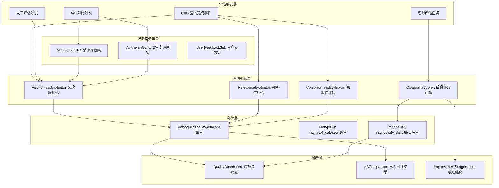
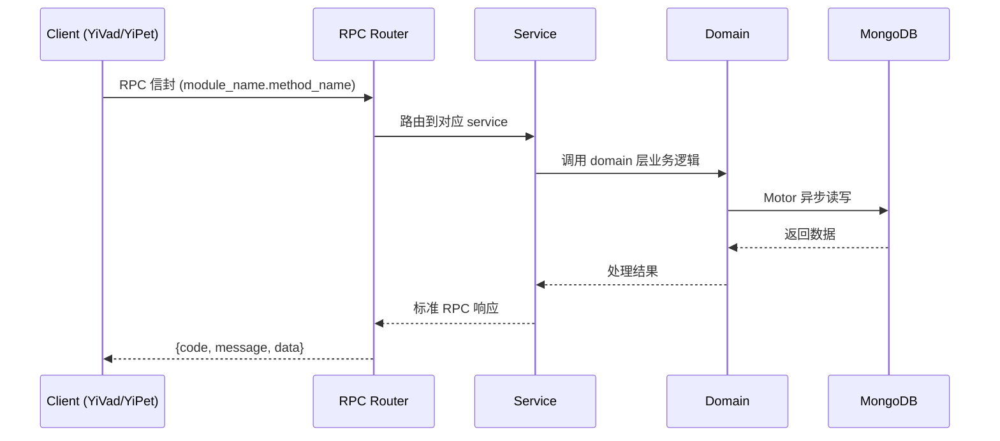

---

doc_type: module
prd_task_id: "YA-09-127"
title: "YA-09-127: RAG 问答质量评估 — 忠实度/相关性/完整性评分 — 开发方案"
status: 需求已编写
priority: P2
owner: 陈铭
roles: [engineer]
created: 2026-09-11
updated: 2026-09-14
project: YiAi
project_id: yiai
prd_month: "202609"
estimate_frontend: 0.5
source_prd: "188-需求-知识库问答质量评估.md"
source_okr: [yiai-001]
related_tests: ["188-test-知识库问答质量评估"]

type: task
---

# YA-09-127: RAG 问答质量评估 — 忠实度/相关性/完整性评分 — 开发方案

> **文档职责**: 本文档定义**怎么做、为什么这么做、实际做成什么样**（HOW），不含产品目标与测试用例。

> 来源 PRD: [188-需求-知识库问答质量评估.md](../../prds/2026-09/188-需求-知识库问答质量评估.md)
> 需求编号: YA-09-127 · 优先级: P2 · 人天: 0.5d

---

<a id="sec-1"></a>
## 一、架构概览



<a id="sec-2"></a>
## 二、文件清单

| 文件 | 操作 | 说明 |
|------|------|------|
| `domain/XXX/models.py` | 新增 | 数据模型定义 |
| `domain/XXX/service.py` | 新增 | 核心服务逻辑 |
| `services/XXX/rpc_handler.py` | 新增 | RPC 路由处理器 |
| `tests/test_XXX.py` | 新增 | 单元测试 |

<a id="sec-3"></a>
## 三、模块设计

### 1. 核心组件

```python
 services/rag/quality_evaluator.py (新增)

from typing import Dict, List, Any, Optional
from datetime import datetime
from motor.motor_asyncio import AsyncIOMotorDatabase
from pydantic import BaseModel

class EvaluationResult(BaseModel):
    """质量评估结果"""
    query_id: str
    question: str
    answer: str
    source_documents: List[str]
    faithfulness_score: float      # 忠实度 0-100
    relevance_score: float         # 相关性 0-100
    completeness_score: float      # 完整性 0-100
    composite_score: float         # 综合评分 0-100
    faithfulness_reason: str       # 忠实度评估理由
    relevance_reason: str          # 相关性评估理由
    completeness_reason: str       # 完整性评估理由
    evaluation_method: str         # auto / human
    evaluator: str                 # 评估者标识
    created_at: datetime

class RAGQualityEvaluator:
# ... (完整实现见 PRD)
```

### 2. 核心组件

```python
 services/rag/eval_dataset_service.py (新增)

from typing import List, Dict, Any
from datetime import datetime
from motor.motor_asyncio import AsyncIOMotorDatabase

class EvalDatasetService:
    """评估数据集管理服务"""

    def __init__(self, db: AsyncIOMotorDatabase):
        self.db = db
        self.collection = db["rag_eval_datasets"]

    async def create_manual_dataset(
        self, name: str, questions: List[Dict[str, Any]]
    ) -> str:
        """创建手动评估数据集"""
        doc = {
            "name": name,
            "type": "manual",
            "questions": questions,
            "question_count": len(questions),
            "created_at": datetime.utcnow(),
        }
        result = await self.collection.insert_one(doc)
# ... (完整实现见 PRD)
```


<a id="sec-4"></a>
## 四、数据流



**调用链路**: `Client → RPC Router → Service → Domain → MongoDB`  
**响应格式**: `{code: 0, message: "ok", data: ...}`  
**异步模型**: 全链路 `async/await`，Motor 异步 MongoDB 驱动。

<a id="sec-5"></a>
## 五、实施路线图

**预估人天**: 0.5d

| 步骤 | 操作 | 路径 | 验证 | 人天 |
|------|------|------|------|------|
| 1 | 实现忠实度评估器 | `quality_evaluator.py` | LLM 忠实度评估输出正确 JSON | 0.05 |
| 2 | 实现相关性评估器 | `quality_evaluator.py` | LLM 相关性评估输出正确 JSON | 0.03 |
| 3 | 实现完整性评估器 | `quality_evaluator.py` | LLM 完整性评估输出正确 JSON | 0.03 |
| 4 | 实现综合评分计算 | `quality_evaluator.py` | 加权计算正确 | 0.02 |
| 5 | 实现质量趋势查询 | `quality_evaluator.py` | 聚合管道输出正确 | 0.03 |
| 6 | 实现改进建议生成 | `quality_evaluator.py` | 低分分析逻辑正确 | 0.03 |
| 7 | 实现 A/B 对比 | `quality_evaluator.py` | 两套配置对比结果正确 | 0.04 |
| 8 | 实现评估数据集管理 | `eval_dataset_service.py` | CRUD 操作正常 | 0.03 |
| 9 | 集成 RAG 服务 | `rag_service.py` | 查询完成后自动触发评估 | 0.02 |
| 10 | 编写单元测试 | `test_quality_evaluator.py` | 覆盖率 > 80% | 0.02 |

**总人天：0.3d**


<a id="sec-6"></a>
## 六、代码审查检查清单

- [ ] 忠实度评估的 LLM prompt 设计合理，输出格式规范
- [ ] 相关性评估正确判断回答与问题的关联度
- [ ] 完整性评估正确识别遗漏信息
- [ ] 综合评分计算使用正确的权重
- [ ] 评估结果异步写入数据库，不阻塞 RAG 响应
- [ ] 评估结果 JSON 解析有异常处理
- [ ] 质量趋势聚合管道使用正确的日期分组
- [ ] A/B 对比结果清晰，胜出方标注明确
- [ ] 改进建议基于实际数据分析，非固定文本
- [ ] 评估数据集 CRUD 操作完整
- [ ] 单元测试覆盖所有评估方法


<a id="sec-7"></a>
## 七、风险评估

| 风险 | 概率 | 影响 | 缓解措施 |
|------|------|------|----------|
| LLM 评估不准确 | 中 | 中 | 人工评估 5% 采样校准，定期对比自动/人工评估差异 |
| 评估耗时影响用户体验 | 中 | 中 | 异步评估，不阻塞 RAG 查询响应 |
| 评估数据集过时 | 中 | 低 | 定期自动生成新评估问题，手动审核 |
| 评估成本过高 | 低 | 中 | 使用本地 Ollama 模型，无需 API 费用 |


<a id="sec-8"></a>
## 八、回滚方案

| 场景 | 回滚操作 | 影响 |
|------|----------|------|
| 评估导致响应变慢 | 降低评估频率（采样 10%），更高可禁用 | 评估数据减少 |
| LLM 评估质量差 | 切换为基于规则的关键词匹配评估 | 评估准确性降低 |
| 评估数据存储过大 | 缩短评估数据保留期（30 天） | 历史趋势数据减少 |

