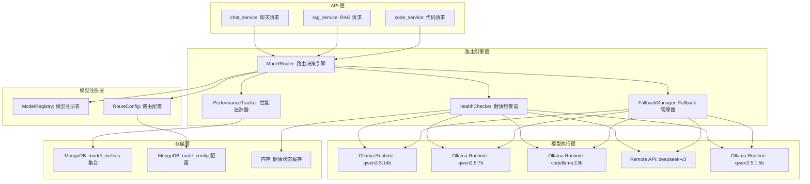
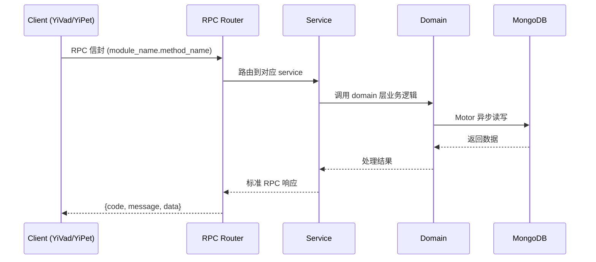

---

doc_type: module
prd_task_id: "YA-09-81"
title: "YA-09-81: 多模型路由与 Fallback — 成本/延迟/健康多维路由 — 开发方案"
status: 需求已编写
priority: P2
owner: 陈铭
roles: [engineer]
created: 2026-09-11
updated: 2026-09-14
project: YiAi
project_id: yiai
prd_month: "202609"
estimate_frontend: 1.5
source_prd: "189-需求-多模型路由与fallback.md"
source_okr: [yiai-002]
related_tests: ["189-test-多模型路由与fallback"]

type: task
---

# YA-09-81: 多模型路由与 Fallback — 成本/延迟/健康多维路由 — 开发方案

> **文档职责**: 本文档定义**怎么做、为什么这么做、实际做成什么样**（HOW），不含产品目标与测试用例。

> 来源 PRD: [189-需求-多模型路由与fallback.md](../../prds/2026-09/189-需求-多模型路由与fallback.md)
> 需求编号: YA-09-81 · 优先级: P2 · 人天: 1.5d

---

<a id="sec-1"></a>
## 一、架构概览



<a id="sec-2"></a>
## 二、文件清单

| 文件 | 操作 | 说明 |
|------|------|------|
| `domain/XXX/models.py` | 新增 | 数据模型定义 |
| `domain/XXX/service.py` | 新增 | 核心服务逻辑 |
| `services/XXX/rpc_handler.py` | 新增 | RPC 路由处理器 |
| `tests/test_XXX.py` | 新增 | 单元测试 |

<a id="sec-3"></a>
## 三、模块设计

### 1. 核心组件

```python
 services/model/model_registry.py (新增)

from typing import Dict, List, Optional, Any
from enum import Enum
from pydantic import BaseModel

class ModelProvider(str, Enum):
    OLLAMA = "ollama"
    REMOTE_API = "remote_api"

class TaskType(str, Enum):
    CHAT = "chat"              # 通用聊天
    CODE = "code"              # 代码相关
    RAG = "rag"                # 知识库问答
    SUMMARY = "summary"        # 摘要
    CLASSIFICATION = "classification"  # 分类
    LIGHT = "light"            # 轻量任务（问候、简单问答）

class ModelInfo(BaseModel):
    """模型信息"""
    name: str                           # 模型标识
    provider: ModelProvider             # 提供者
    display_name: str                   # 显示名称
    capabilities: List[TaskType]        # 能力列表
    priority: int                       # 优先级（1=最高）
# ... (完整实现见 PRD)
```

### 3. 核心组件

```python
 services/model/model_router.py (新增)

import time
import asyncio
from typing import Dict, List, Optional, Any, Tuple
from datetime import datetime
from motor.motor_asyncio import AsyncIOMotorDatabase

from .model_registry import MODEL_REGISTRY, TaskType, ModelInfo
from .route_config import ROUTE_CONFIG

class HealthChecker:
    """模型健康检查器"""

    def __init__(self, ollama_service):
        self.ollama = ollama_service
        self.health_cache: Dict[str, bool] = {}
        self.last_check: Dict[str, float] = {}
        self.check_interval = 30  # 秒

    async def check_model(self, model_name: str) -> bool:
        """主动探测模型健康状态"""
        model_info = MODEL_REGISTRY.get(model_name)
        if not model_info:
            return False
# ... (完整实现见 PRD)
```


<a id="sec-4"></a>
## 四、数据流



**调用链路**: `Client → RPC Router → Service → Domain → MongoDB`  
**响应格式**: `{code: 0, message: "ok", data: ...}`  
**异步模型**: 全链路 `async/await`，Motor 异步 MongoDB 驱动。

<a id="sec-5"></a>
## 五、实施路线图

**预估人天**: 1.5d

| 步骤 | 操作 | 路径 | 验证 | 人天 |
|------|------|------|------|------|
| 1 | 定义模型注册表 | `model_registry.py` | 5 个模型信息完整 | 0.02 |
| 2 | 定义路由配置 | `route_config.py` | 6 个任务类型路由配置正确 | 0.02 |
| 3 | 实现健康检查器 | `model_router.py` | 主动探测 + 被动标记 | 0.04 |
| 4 | 实现性能追踪器 | `model_router.py` | 延迟/成功率记录与更新 | 0.03 |
| 5 | 实现路由决策引擎 | `model_router.py` | 主模型优先 + Fallback 链 | 0.05 |
| 6 | 实现 execute_with_fallback | `model_router.py` | 自动 Fallback 执行 | 0.04 |
| 7 | 实现 Fallback 日志 | `model_router.py` | 事件记录和查询 | 0.02 |
| 8 | 集成到 chat/rag 服务 | `chat_service.py`, `rag_service.py` | ModelRouter 替代直接调用 | 0.04 |
| 9 | 实现 RPC 路由处理器 | `router_rpc_handler.py` | 路由状态查询 API | 0.02 |
| 10 | 编写单元测试 | `test_model_router.py` | 覆盖率 > 80% | 0.02 |

**总人天：0.3d**


<a id="sec-6"></a>
## 六、代码审查检查清单

- [ ] 模型注册表包含所有可用模型，信息完整
- [ ] 路由配置覆盖所有任务类型，Fallback 链合理
- [ ] 健康检查使用连续 3 次失败标记，避免误判
- [ ] 性能追踪使用指数移动平均更新指标
- [ ] `execute_with_fallback` 正确处理异常和 Fallback
- [ ] Fallback 日志有大小限制（1000 条），防止内存泄漏
- [ ] 路由决策 < 1ms，不阻塞 AI 请求
- [ ] 路由配置支持热更新（从 MongoDB 读取）
- [ ] 远端 API 调用有超时设置
- [ ] 单元测试覆盖主路由、Fallback、全部不可用场景
- [ ] 集成到 chat_service 和 rag_service 后功能正常


<a id="sec-7"></a>
## 七、风险评估

| 风险 | 概率 | 影响 | 缓解措施 |
|------|------|------|----------|
| 健康检查误判 | 中 | 中 | 连续 3 次失败才标记不健康，避免网络抖动误判 |
| Fallback 链耗尽 | 低 | 高 | 至少保留 1 个远端 API 模型作为最终 Fallback |
| 远端 API 成本过高 | 中 | 中 | 成本优化策略优先使用本地模型，远端仅作 Fallback |
| 路由配置错误 | 低 | 高 | 路由配置热更新前校验，错误配置拒绝加载 |


<a id="sec-8"></a>
## 八、回滚方案

| 场景 | 回滚操作 | 影响 |
|------|----------|------|
| 路由系统异常 | 禁用路由，直接使用默认模型 | 失去多模型和 Fallback |
| 健康检查误判 | 手动标记所有模型为健康，禁用自动健康检查 | 失去自动故障检测 |
| 远端 API 成本超支 | 移除远端 API 从 Fallback 链 | 失去最终 Fallback |

