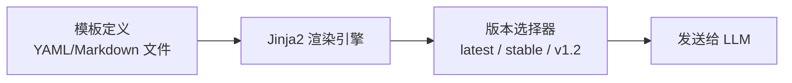

# YA-09-25: Prompt 模板管理与版本控制 — 可复用提示词工程体系 — 开发方案

> **文档职责**：本文档定义**怎么做、为什么这么做、实际做成什么样**（HOW），不含产品目标与测试用例。

> 来源 PRD：[19-需求-LLM-Prompt模板管理与版本控制.md](../../prds/2026-09/19-需求-LLM-Prompt模板管理与版本控制.md)
> 需求编号：YA-09-25 · 优先级：P2 · 人天：2.0d · 状态：需求已编写

---

<a id="sec-1"></a>
## 一、方案

当前 Prompt 散落在代码中（`domain/ai/chat.py`、各 Service 文件）。建立集中管理的模板系统，支持变量插值、版本控制和 A/B 测试。



### 模板格式

```yaml
# prompts/chat_system.yaml
version: "1.2"
description: "通用聊天系统提示词"
variables:
  - role_name
  - knowledge_context
template: |
  你是 {{ role_name }}，一个专业的 AI 助手。
  
  ## 知识上下文
  {{ knowledge_context }}
  
  ## 规则
  1. 基于提供的知识回答，不编造信息
  2. 不确定时明确告知用户
```

### Jinja2 渲染

```python
from jinja2 import Environment, FileSystemLoader

env = Environment(loader=FileSystemLoader("prompts/"))
tmpl = env.get_template("chat_system.yaml")
rendered = tmpl.render(role_name="架构师", knowledge_context="...")
```

### 版本策略

| 标签 | 说明 |
|------|------|
| `latest` | 最新版本（开发环境） |
| `stable` | 生产稳定版 |
| `v1.2` | 固定版本（A/B 测试） |

---

<a id="sec-2"></a>
## 二、实施步骤

| 步骤 | 验证 | 人天 |
|------|------|------|
| 1 | Jinja2 模板引擎 + 变量插值 | 模板渲染正确 | 0.5 |
| 2 | 版本管理 + YAML 模板文件组织 | `latest`/`stable` 切换 | 0.75 |
| 3 | A/B 测试框架 + 效果评估 | 两版本对比数据 | 0.75 |

**合计：2.0d**。

---

<a id="sec-3"></a>
## 三、关联模块

- 集成：[YA-07-04 AI 聊天服务](../2026-07/04-prd-task-AI聊天服务.md)

---

## 四、已知缺口与技术债

| # | 技术债 | 优先级 | 说明 | 状态 |
|---|--------|--------|------|------|
| 1 | 模板变量无类型校验 | P3 | 渲染时才发现变量缺失 | 待实施 |
| 2 | AB 测试统计无显著性检验 | P3 | 仅均值对比 | 待实施 |
- 集成：[YA-08-13 Agent 工具系统](../2026-08/13-prd-task-Agent工具系统.md)