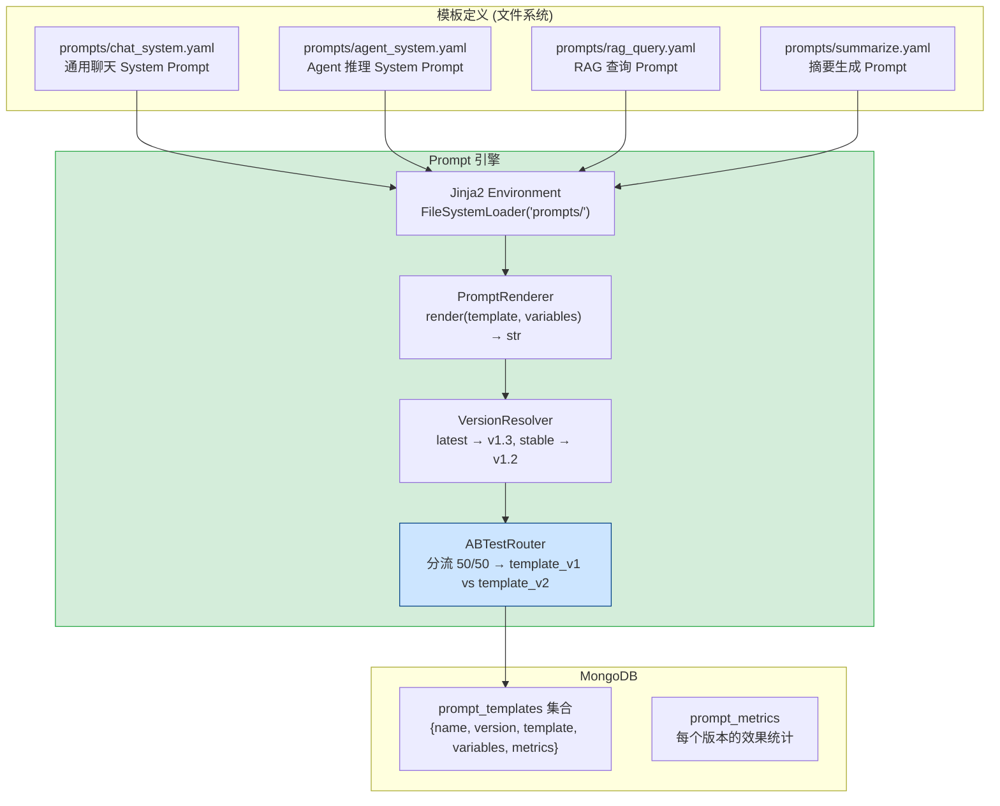

---

doc_type: module
prd_task_id: "YA-09-25"
title: "YA-09-25: LLM Prompt 模板管理与版本控制 — Jinja2 渲染 + YAML 定义 + A/B 测试框架 — 开发方案"
status: 需求已编写
priority: P2
owner: 陈铭
roles: [engineer]
created: 2026-09-11
updated: 2026-09-23
project: YiAi
project_id: yiai
prd_month: "202609"
estimate_frontend: 2.0
source_prd: "19-需求-LLM-Prompt模板管理与版本控制.md"
source_okr: [yiai-002]
related_tests: ["19-prd-test-LLM-Prompt模板管理与版本控制"]

type: task
---

# YA-09-25: LLM Prompt 模板管理与版本控制 — Jinja2 渲染 + YAML 定义 + A/B 测试框架 — 开发方案

> 来源 PRD：[19-需求-LLM-Prompt模板管理与版本控制.md](../../prds/2026-09/19-需求-LLM-Prompt模板管理与版本控制.md)
> 需求编号：YA-09-25 · 优先级：P2 · 人天：2.0d
> 类型：开发者体验 · 状态：需求已编写

---

## 一、架构概述

当前 Prompt 散落在各 Service 文件的代码字符串中（`domain/ai/chat.py`、各 Service），修改 Prompt 需要改动 Python 代码并重新部署。本方案建立集中管理的 Prompt 模板系统：YAML 文件定义模板 → Jinja2 引擎渲染变量 → 版本标签选择 (latest/stable/v1.2) → MongoDB 持久化版本历史 → A/B 测试分流评估。


```mermaid
graph TD
  subgraph TemplateStore["模板定义 (文件系统)"]
    T1["prompts/chat_system.yaml<br/>通用聊天 System Prompt"]
    T2["prompts/agent_system.yaml<br/>Agent 推理 System Prompt"]
    T3["prompts/rag_query.yaml<br/>RAG 查询 Prompt"]
    T4["prompts/summarize.yaml<br/>摘要生成 Prompt"]
  end

  subgraph Engine["Prompt 引擎"]
    JINJA["Jinja2 Environment<br/>FileSystemLoader('prompts/')"]
    RENDER["PromptRenderer<br/>render(template, variables) → str"]
    VERSION["VersionResolver<br/>latest → v1.3, stable → v1.2"]
    ABTEST["ABTestRouter<br/>分流 50/50 → template_v1 vs template_v2"]
  end

  subgraph Storage["MongoDB"]
    MONGO["prompt_templates 集合<br/>{name, version, template, variables, metrics}"]
    METRICS["prompt_metrics<br/>每个版本的效果统计"]
  end

  T1 --> JINJA
  T2 --> JINJA
  T3 --> JINJA
  T4 --> JINJA
  JINJA --> RENDER
  RENDER --> VERSION
  VERSION --> ABTEST
  ABTEST --> MONGO

  style Engine fill:#d4edda,stroke:#28a745
  style ABTEST fill:#cce5ff,stroke:#004085
```

### 版本标签策略

| 标签 | 说明 | 更新时机 | 使用场景 |
|------|------|---------|---------|
| `latest` | 最新版本 | CI/CD 自动部署时 | 开发环境 |
| `stable` | 生产稳定版 | 人工确认后标记 | 生产环境 |
| `v1.2` | 固定版本 (不可变) | 每次模板变更自动创建 | A/B 测试、回滚 |
| `canary` | 灰度测试版 | 手动标记 | 小流量验证 |

---

## 二、文件清单

| # | 文件 | 操作 | 说明 | 预估行数 |
|---|------|------|------|----------|
| 1 | `prompts/chat_system.yaml` | 新增 | 通用聊天 System Prompt 模板 (v1.2) | ~30 |
| 2 | `prompts/agent_system.yaml` | 新增 | Agent 推理 System Prompt 模板 | ~40 |
| 3 | `prompts/rag_query.yaml` | 新增 | RAG 查询 Prompt 模板 | ~20 |
| 4 | `prompts/summarize.yaml` | 新增 | 摘要生成 Prompt 模板 | ~25 |
| 5 | `domain/prompt/engine.py` | 新增 | Jinja2 渲染 + VersionResolver + ABTestRouter | ~120 |
| 6 | `domain/prompt/repository.py` | 新增 | MongoDB 模板持久化 + 版本历史 | ~80 |
| 7 | `domain/prompt/__init__.py` | 新增 | 模块导出 | ~5 |
| 8 | `config.yaml` | 修改 | 新增 `prompt` 配置段 | +10 |

**改动汇总：** 7 新增 + 1 修改 = **8 文件，~330 行**

---

## 三、模块设计

### 3.1 YAML 模板格式

```yaml
# prompts/chat_system.yaml
name: chat_system
version: "1.2"
description: "通用聊天系统提示词——控制 AI 角色和行为"
author: "陈铭"
created: "2026-09-15"

variables:
  - name: role_name
    type: str
    required: true
    description: "AI 角色名称"
  - name: knowledge_context
    type: str
    required: false
    default: ""
    description: "RAG 检索到的知识上下文"
  - name: language
    type: str
    required: false
    default: "中文"
    description: "回复语言"

template: |
  你是 {{ role_name }}，一个专业的 AI 助手。

  
  ## 知识上下文
  以下是从知识库中检索到的相关信息，请基于这些信息回答问题：
  {{ knowledge_context }}
  

  ## 核心规则
  1. 基于提供的知识回答，不编造信息
  2. 不确定时明确告知用户
  3. 回答使用{{ language }}
  4. 保持回答简洁、专业

  ## 当前对话
```

### 3.2 Prompt 引擎 — `domain/prompt/engine.py`

```python
import random
from typing import Dict, Optional, List
from jinja2 import Environment, FileSystemLoader, TemplateNotFound, TemplateSyntaxError

class PromptRenderer:
    """提示词渲染引擎——Jinja2 模板 + 变量插值 + 变量验证。

    使用 Jinja2 的条件、循环、过滤器等特性支持复杂 Prompt 构建。
    """

    def __init__(self, templates_dir: str = "prompts/"):
        self._env = Environment(
            loader=FileSystemLoader(templates_dir),
            trim_blocks=True,
            lstrip_blocks=True,
        )

    def render(self, template_name: str, variables: Dict[str, str]) -> str:
        """渲染模板——验证必需变量 → Jinja2 渲染 → 返回字符串。

        异常:
          TemplateNotFound: 模板文件不存在
          MissingVariableError: 缺少必需变量
          TemplateSyntaxError: YAML/模板语法错误
        """
        template_def = self._load_template_def(template_name)

        # 变量验证
        for var_def in template_def.get("variables", []):
            if var_def.get("required") and var_def["name"] not in variables:
                if "default" in var_def:
                    variables[var_def["name"]] = var_def["default"]
                else:
                    raise ValueError(
                        f"模板 '{template_name}' 缺少必需变量 '{var_def['name']}'"
                    )

        # Jinja2 渲染
        try:
            tmpl = self._env.get_template(f"{template_name}.yaml")
            rendered = tmpl.render(**variables)
        except TemplateNotFound:
            raise ValueError(f"模板文件 'prompts/{template_name}.yaml' 不存在")

        return rendered.strip()

    def _load_template_def(self, name: str) -> dict:
        """从 YAML 文件解析模板定义——提取 variables 和 version 元数据。"""
        import yaml
        path = os.path.join(self._env.loader.searchpath[0], f"{name}.yaml")
        with open(path) as f:
            return yaml.safe_load(f)

    def list_templates(self) -> List[Dict]:
        """列出所有可用模板及其描述。"""
        ...
```

### 3.3 版本解析器 — `domain/prompt/engine.py`

```python
class VersionResolver:
    """模板版本解析——支持 latest/stable/v1.2 标签。

    版本规则:
      - latest → 始终指向最新版本 (开发环境)
      - stable → 指向人工标记为 stable 的最新版本 (生产环境)
      - v1.2 → 指向固定版本 (A/B 测试 + 回滚)
      - canary → 灰度测试版 (小流量验证)

    MongoDB 中每个模板版本存储为独立文档，版本号递增 (v1.0 → v1.1 → ...)。
    """

    def __init__(self, repository: "PromptRepository"):
        self._repo = repository

    async def resolve(self, template_name: str, tag: str = "stable") -> str:
        """解析版本标签 → 获取模板内容。

        示例:
          resolve("chat_system", "latest") → 返回 v1.3 的模板内容
          resolve("chat_system", "stable") → 返回 v1.2 的模板内容
          resolve("chat_system", "v1.1")   → 返回 v1.1 的模板内容
        """
        if tag == "latest":
            versions = await self._repo.get_versions(template_name)
            return versions[-1]["template"] if versions else ""
        elif tag == "stable":
            stable = await self._repo.get_stable(template_name)
            return stable["template"] if stable else ""
        else:
            # 固定版本: v1.2
            version = await self._repo.get_version(template_name, tag)
            return version["template"] if version else ""

    async def promote_to_stable(self, template_name: str, version: str):
        """将指定版本标记为 stable——人工确认后调用。"""
        await self._repo.set_tag(template_name, version, "stable")

    async def create_version(self, template_name: str, template_content: str) -> str:
        """从文件系统 YAML 创建新版本到 MongoDB。"""
        return await self._repo.insert_version(template_name, template_content)
```

### 3.4 A/B 测试路由 — `domain/prompt/engine.py`

```python
@dataclass
class ABTestConfig:
    """A/B 测试配置。"""
    template_name: str
    variant_a: str         # 版本号 (如 "v1.2")
    variant_b: str         # 版本号 (如 "v1.3")
    split_ratio: float = 0.5   # 流量分配: A 占 50%, B 占 50%
    session_key: str = ""  # 固定 session 使用相同变体 (哈希分配)

class ABTestRouter:
    """A/B 测试分流——基于 session_key 哈希的一致性分配。

    一致性保证: 同一 session 始终路由到同一变体 (避免用户体验不一致)。
    """

    def __init__(self, resolver: VersionResolver, test_configs: Dict[str, ABTestConfig] = None):
        self._resolver = resolver
        self._configs = test_configs or {}

    def register_test(self, config: ABTestConfig):
        """注册 A/B 测试。"""
        self._configs[config.template_name] = config

    async def route(self, template_name: str, session_key: str) -> str:
        """路由模板——如果配置了 A/B 测试则分流，否则返回 stable。

        算法:
          1. 检查 template_name 是否在 ABTestConfig 中
          2. 使用 session_key hash → 0-1 的归一化值
          3. hash < split_ratio → variant_a, 否则 → variant_b
          4. 返回对应版本的模板内容
        """
        config = self._configs.get(template_name)
        if not config:
            # 无 A/B 测试 → 返回 stable 版本
            return await self._resolver.resolve(template_name, "stable")

        # 一致性哈希: 同一 session 始终命中同一变体
        import hashlib
        hash_val = int(hashlib.md5(session_key.encode()).hexdigest()[:8], 16)
        bucket = (hash_val % 100) / 100.0  # 0-1 归一化

        variant = config.variant_a if bucket < config.split_ratio else config.variant_b
        return await self._resolver.resolve(template_name, variant)
```

### 3.5 仓库层 — `domain/prompt/repository.py`

```python
from motor.motor_asyncio import AsyncIOMotorDatabase

class PromptRepository:
    """Prompt 模板 MongoDB 仓库——版本化存储。

    prompt_templates 集合文档结构:
      {
        "_id": ObjectId,
        "name": "chat_system",
        "version": "v1.2",
        "template": "你是 {{ role_name }}...",
        "variables": [...],
        "tags": ["stable"],
        "metrics": {"usage_count": 0, "avg_rating": 0},
        "created_at": ISODate,
        "created_by": "陈铭",
      }
    """

    COLLECTION = "prompt_templates"

    def __init__(self, db: AsyncIOMotorDatabase):
        self._collection = db[self.COLLECTION]

    async def insert_version(self, name: str, template_def: dict) -> str:
        """插入新版本——版本号自动递增。"""
        latest = await self._collection.find_one(
            {"name": name},
            sort=[("version", -1)],
        )

        if latest:
            current = int(latest["version"].lstrip("v"))
            new_version = f"v{current + 1}"
        else:
            new_version = "v1.0"

        doc = {
            "name": name,
            "version": new_version,
            "template": template_def.get("template", ""),
            "variables": template_def.get("variables", []),
            "tags": [],
            "metrics": {"usage_count": 0, "avg_rating": 0, "avg_tokens": 0},
            "created_at": datetime.now(),
        }
        await self._collection.insert_one(doc)
        return new_version

    async def get_version(self, name: str, version: str) -> Optional[Dict]:
        """获取指定版本。"""
        return await self._collection.find_one({"name": name, "version": version})

    async def get_stable(self, name: str) -> Optional[Dict]:
        """获取 stable 标记的版本。"""
        return await self._collection.find_one(
            {"name": name, "tags": "stable"},
            sort=[("version", -1)],
        )

    async def set_tag(self, name: str, version: str, tag: str):
        """为指定版本添加/移除标签。"""
        if tag == "stable":
            # stable 标签唯一——先移除旧 stable
            await self._collection.update_many(
                {"name": name, "tags": "stable"},
                {"$pull": {"tags": "stable"}},
            )
        await self._collection.update_one(
            {"name": name, "version": version},
            {"$addToSet": {"tags": tag}},
        )

    async def get_versions(self, name: str) -> List[Dict]:
        """获取模板的所有版本 (按时间排序)。"""
        cursor = self._collection.find({"name": name}).sort("created_at", 1)
        try:
            return await cursor.to_list(length=None)
        finally:
            await cursor.close()
```

---

## 四、数据流

### 4.1 Prompt 渲染 + A/B 测试完整流程

```
用户发送消息到 AI 聊天
  │
  ▼
ChatService.chat_stream()
  │
  ├── session_key = "sess_abc123"
  │
  ├── ab_router.route("chat_system", "sess_abc123")
  │     ├── 检查 ABTestConfig: chat_system: v1.2 (50%) vs v1.3 (50%)
  │     ├── hash("sess_abc123") = 42 → 42% < 50% → variant_a (v1.2)
  │     ├── resolver.resolve("chat_system", "v1.2")
  │     │     └── MongoDB prompt_templates.find({"name": "chat_system", "version": "v1.2"})
  │     └── 返回模板内容
  │
  ├── renderer.render("chat_system", {
  │       role_name: "YiAi 助手",
  │       knowledge_context: "RAG 检索结果...",
  │       language: "中文",
  │   })
  │     ├── 变量验证: role_name ✓, knowledge_context ✓, language ✓
  │     └── Jinja2 渲染: "你是 YiAi 助手，一个专业的 AI 助手..."
  │
  └── LLM 推理: [{"role": "system", "content": rendered_prompt},
                 {"role": "user", "content": user_message}]
```

### 4.2 模板版本发布流程

```
开发者修改 prompts/chat_system.yaml
  │
  ▼
git push → CI/CD
  │
  ├── 1. 自动创建新版本到 MongoDB
  │     └── PromptRepository.insert_version("chat_system", v1.3)
  │
  ├── 2. 自动标记 latest = v1.3 (开发环境使用)
  │
  ├── 3. (可选) 创建 A/B 测试: v1.2(50%) vs v1.3(50%)
  │
  ├── 4. 人工验证: 查看 v1.3 的实际效果 (avg_rating, usage_count)
  │
  └── 5. 验证通过 → promote_to_stable("chat_system", "v1.3")
        └── set_tag("chat_system", "v1.3", "stable")
```

---

## 五、实施路线图

| 步骤 | 内容 | 涉及文件 | 验证方式 | 人天 |
|------|------|---------|---------|------|
| 1 | Jinja2 模板引擎 + FileSystemLoader | `engine.py` | `renderer.render("chat_system", {...})` 生成正确 prompt | 0.5 |
| 2 | 4 个 YAML 模板文件定义 (chat/agent/rag/summarize) | `prompts/*.yaml` | 各模板 Jinja2 语法正确，变量定义完整 | 0.3 |
| 3 | VersionResolver: latest/stable/v1.2 标签 | `engine.py` | `resolve("chat_system", "stable")` 返回正确的版本 | 0.3 |
| 4 | MongoDB PromptRepository 持久化 | `repository.py` | 创建版本 → 查询版本 → 标记 stable | 0.3 |
| 5 | ABTestRouter: session_hash → 变体选择 | `engine.py` | 同一 session 始终路由到同一变体 | 0.3 |
| 6 | A/B 测试效果统计 (avg_rating, usage_count) | `repository.py` | 两个版本的效果数据可对比 | 0.3 |
| **合计** | | | | **2.0d** |

---

## 六、代码审查检查清单

- [ ] Jinja2 `FileSystemLoader` 正确加载 `prompts/` 目录下的 YAML 文件
- [ ] `render()` 在缺少 `required=True` 变量时抛出 `ValueError`
- [ ] `version` 标签正确: latest → 最新, stable → 标记版本, v1.2 → 固定版本
- [ ] ABTestRouter 一致性: 同一 `session_key` 哈希始终命中同一变体
- [ ] MongoDB 版本历史: 每次变更创建新版本记录 (不覆盖)
- [ ] `stable` 标签唯一: 新的 stable 会清除旧的 stable
- [ ] 模板变量类型校验 (`type: str` 检查)
- [ ] ruff + mypy 通过

---

## 七、技术风险评估

| 风险 | 概率 | 影响 | 等级 | 缓解措施 | 应急预案 |
|------|------|------|------|---------|---------|
| Jinja2 模板语法错误导致运行时渲染失败 | 中 | 中 | 中 | CI/CD 中 `render(dry_run=True)` 语法检查 | 回退到 stable 版本 |
| 模板变量缺失——渲染时才发现 | 中 | 低 | 低 | `variables[].required` 在 `render()` 时检查 | 使用 default 值 |
| A/B 测试分流 hash 不均匀 (50/50 实际 40/60) | 低 | 低 | 低 | MD5 hash 分布均匀 (理论偏差 < 1%) | 不做处理 |
| 模板文件系统与 MongoDB 不一致 | 低 | 中 | 低 | CI/CD 自动同步: 文件 → MongoDB | 手动触发同步脚本 |

---

## 八、已知缺口与技术债务

| # | 技术债 | 优先级 | 预计人天 | 说明 | 状态 |
|---|--------|--------|---------|------|------|
| 1 | 模板变量无 JSON Schema 类型校验 | P3 | 0.2 | 渲染时才发现变量缺失 | 待实施 |
| 2 | A/B 测试统计无显著性检验 (仅均值对比) | P3 | 0.3 | 无法确认改进是否显著 | 待实施 |
| 3 | prompt 模板无在线编辑器 (需要手动编辑 YAML) | P3 | 0.5 | 非技术人员无法修改 Prompt | 待设计 |
| 4 | 模板热更新未实现 (修改文件后需重启/CICD) | P3 | 0.3 | 当前从文件系统读取，文件变更后下次请求生效 | 待实施 |

---

## 九、关联模块

- 集成：[YA-07-04 AI 聊天服务](../2026-07/04-prd-task-AI聊天服务.md)（所有 chat 调用使用 Prompt 引擎）
- 集成：[YA-08-13 Agent 工具系统](../2026-08/13-prd-task-Agent工具系统.md)（Agent System Prompt 使用模板）
- 集成：[YA-09-05 RAG 引擎](./05-prd-task-RAG引擎.md)（RAG 查询 Prompt 使用模板）
- 数据层：MongoDB `prompt_templates` 集合