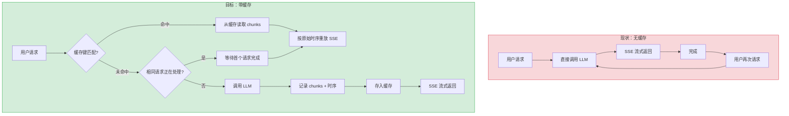
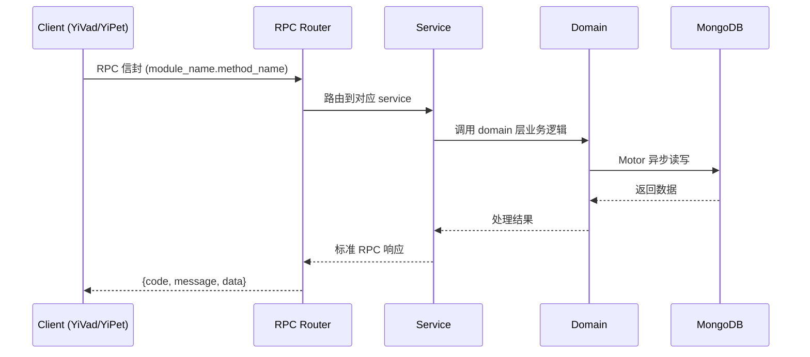

---

doc_type: module
prd_task_id: "YA-09-185"
title: "YA-09-185: 流式响应缓存与重放 — SSE 响应缓存、重复请求去重、原始时序重放、缓存 TTL、流压缩、缓存命中分析 — 开发任务"
status: 需求已编写
priority: P2
owner: 陈铭
roles: [engineer]
created: 2026-09-11
updated: 2026-09-11
project: YiAi
project_id: yiai
prd_month: "202609"
estimate_frontend: 0.3
source_prd: "190-需求-流式响应缓存与重放.md"
source_okr: [yiai-001]
related_tests: ["190-test-流式响应缓存与重放"]

type: task
---

# YA-09-185: 流式响应缓存与重放 — SSE 响应缓存、重复请求去重、原始时序重放、缓存 TTL、流压缩、缓存命中分析 — 开发任务

> **文档职责**: 本文档定义**怎么做、为什么这么做、实际做成什么样**（HOW），不含产品目标与测试用例。

> 来源 PRD: [190-需求-流式响应缓存与重放.md](../../prds/2026-09/190-需求-流式响应缓存与重放.md)
> 需求编号: YA-09-185 · 优先级: P2 · 人天: 0.3d

---

<a id="sec-1"></a>
## 一、架构概览



<a id="sec-2"></a>
## 二、文件清单

| 文件 | 操作 | 说明 |
|------|------|------|
| `domain/XXX/models.py` | 新增 | 数据模型定义 |
| `domain/XXX/service.py` | 新增 | 核心服务逻辑 |
| `services/XXX/rpc_handler.py` | 新增 | RPC 路由处理器 |
| `tests/test_XXX.py` | 新增 | 单元测试 |

<a id="sec-3"></a>
## 三、模块设计

### 1. 核心组件

```python
 YiAi/src/domain/stream_cache/cache_key.py (新增)

import hashlib
import json
from dataclasses import dataclass


@dataclass(frozen=True)
class CacheKey:
    """SSE 流式响应缓存键"""

    model: str
    system_prompt: str
    messages_hash: str
    temperature: float
    max_tokens: int

    def to_string(self) -> str:
        """生成唯一缓存键字符串"""
        raw = json.dumps({
            "model": self.model,
            "system": self.system_prompt,
            "messages": self.messages_hash,
            "temp": round(self.temperature, 4),
            "max_tokens": self.max_tokens,
# ... (完整实现见 PRD)
```

### 2. 核心组件

```python
 YiAi/src/domain/stream_cache/cache_entry.py (新增)

import time
import gzip
from dataclasses import dataclass, field
from typing import Optional


@dataclass
class StreamChunk:
    """单个 SSE chunk 记录"""
    data: str              # chunk 内容
    timestamp: float       # 相对于请求开始的秒数
    event_type: str = "message"  # SSE event 类型


@dataclass
class StreamCacheEntry:
    """流式响应缓存条目"""
    key: str
    chunks: list[StreamChunk] = field(default_factory=list)
    total_duration: float = 0.0       # 总耗时（秒）
    created_at: float = 0.0
    expires_at: float = 0.0
    model: str = ""
# ... (完整实现见 PRD)
```

### 3. 核心组件


<a id="sec-4"></a>
## 四、数据流



**调用链路**: `Client → RPC Router → Service → Domain → MongoDB`  
**响应格式**: `{code: 0, message: "ok", data: ...}`  
**异步模型**: 全链路 `async/await`，Motor 异步 MongoDB 驱动。

<a id="sec-5"></a>
## 五、实施路线图

**预估人天**: 0.3d

| 步骤 | 操作 | 路径 | 验证 | 人天 |
|------|------|------|------|------|
| 1 | 实现缓存键构建器 | `domain/stream_cache/cache_key.py` | SHA-256 哈希生成正确 | 0.03 |
| 2 | 实现缓存条目 + gzip 压缩 | `domain/stream_cache/cache_entry.py` | 序列化/反序列化 + 压缩率 > 60% | 0.04 |
| 3 | 实现内存 LRU 缓存存储 | `domain/stream_cache/lru_store.py` | LRU 淘汰 + 内存限制正确 | 0.05 |
| 4 | 实现飞行中请求注册表 | `domain/stream_cache/in_flight.py` | 并发请求去重正确 | 0.04 |
| 5 | 实现流式缓存服务 | `services/stream_cache/stream_cache_service.py` | 缓存命中/未命中 + 重放时序正确 | 0.06 |
| 6 | 集成到 chat_service | `services/ai/chat_service.py` | 缓存层对调用方透明 | 0.04 |
| 7 | 编写单元测试 | `tests/test_stream_cache.py` | 覆盖缓存命中/未命中/去重/过期 | 0.04 |

**总人天：0.3d**


<a id="sec-6"></a>
## 六、代码审查检查清单

- [ ] 缓存键包含所有影响 LLM 输出的参数（model, system_prompt, messages, temperature, max_tokens）
- [ ] skip_cache 参数在缓存键中正确处理（添加 nonce 或跳过）
- [ ] LRU 缓存存储有内存限制（max_memory_mb）和条目数限制（max_entries）
- [ ] 缓存条目序列化/反序列化正确处理 gzip 压缩
- [ ] 飞行中请求注册表使用 asyncio.Lock 保证线程安全
- [ ] 重放时按原始时序（asyncio.sleep）发送 chunks
- [ ] 缓存 TTL 过期检查在 get 时执行
- [ ] 缓存统计指标正确记录（命中/未命中/淘汰）
- [ ] 流式缓存服务对 chat_service 透明（接口兼容）
- [ ] 缓存清除 API 可用（用于调试和管理）


<a id="sec-7"></a>
## 七、风险评估

| 风险 | 概率 | 影响 | 缓解措施 |
|------|------|------|----------|
| 内存 LRU 缓存占满导致 OOM | 中 | 高 | 设置 max_memory_mb=50 硬限制；监控内存使用率 |
| 缓存键碰撞（不同请求生成相同哈希） | 极低 | 高 | SHA-256 碰撞概率极低（2^-256），可接受 |
| 飞行中请求等待超时 | 低 | 中 | 设置 120s 超时，超时后当前请求作为新请求 |
| gzip 压缩对短文本效果差 | 低 | 低 | 仅对 > 1KB 的缓存条目压缩 |
| 模型更新后缓存过时 | 中 | 中 | 模型版本作为缓存键的一部分；提供缓存清除 API |


<a id="sec-8"></a>
## 八、回滚方案

| 场景 | 回滚操作 | 影响 |
|------|----------|------|
| 缓存导致响应异常 | 在 chat_service 中禁用缓存层（环境变量控制） | 回到无缓存状态，功能正常 |
| LRU 缓存内存泄漏 | 限制 max_entries=10，降低内存压力 | 缓存命中率降低 |
| 飞行中去重导致死锁 | 禁用飞行中去重，仅保留缓存层 | 并发送请求不再合并 |
| gzip 压缩性能问题 | 关闭压缩，直接存储原始数据 | 缓存内存占用增加 |

