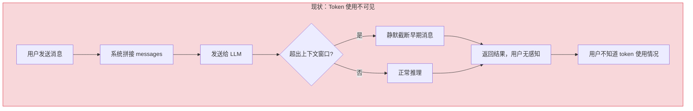
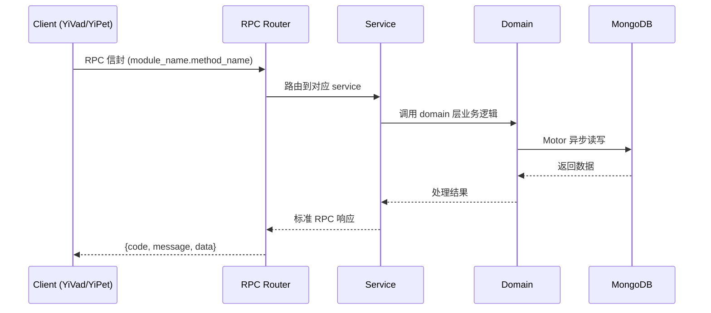

---

doc_type: module
prd_task_id: "YA-09-138"
title: "YA-09-138: 上下文窗口可视化 — Token 用量实时展示 — 开发方案"
status: 需求已编写
priority: P2
owner: 陈铭
roles: [engineer]
created: 2026-09-11
updated: 2026-09-14
project: YiAi
project_id: yiai
prd_month: "202609"
estimate_frontend: 0.5
source_prd: "191-需求-上下文窗口可视化.md"
source_okr: [yiai-002]
related_tests: ["191-test-上下文窗口可视化"]

type: task
---

# YA-09-138: 上下文窗口可视化 — Token 用量实时展示 — 开发方案

> **文档职责**: 本文档定义**怎么做、为什么这么做、实际做成什么样**（HOW），不含产品目标与测试用例。

> 来源 PRD: [191-需求-上下文窗口可视化.md](../../prds/2026-09/191-需求-上下文窗口可视化.md)
> 需求编号: YA-09-138 · 优先级: P2 · 人天: 0.5d

---

<a id="sec-1"></a>
## 一、架构概览



<a id="sec-2"></a>
## 二、文件清单

| 文件 | 操作 | 说明 |
|------|------|------|
| `domain/XXX/models.py` | 新增 | 数据模型定义 |
| `domain/XXX/service.py` | 新增 | 核心服务逻辑 |
| `services/XXX/rpc_handler.py` | 新增 | RPC 路由处理器 |
| `tests/test_XXX.py` | 新增 | 单元测试 |

<a id="sec-3"></a>
## 三、模块设计

### 1. 核心组件

```python
 YiAi/src/domain/context_window/token_counter.py (新增)

import tiktoken
from typing import Optional
from dataclasses import dataclass, field


@dataclass
class TokenBreakdown:
    """Token 分配分解"""
    system_prompt: int = 0       # 系统提示词
    user_messages: int = 0        # 用户消息
    assistant_messages: int = 0   # 助手消息
    tool_calls: int = 0           # 工具调用
    response_reserve: int = 0     # 响应预留
    total: int = 0                # 总计

    @property
    def usage_ratio(self) -> float:
        """返回各部分占比"""
        if self.total == 0:
            return {}
        return {
            "system_prompt": self.system_prompt / self.total,
            "user_messages": self.user_messages / self.total,
# ... (完整实现见 PRD)
```

### 2. 核心组件

```python
 YiAi/src/domain/context_window/tracker.py (新增)

from typing import Optional
from collections import deque
from .token_counter import TokenCounter, ContextWindowInfo


class ContextWindowTracker:
    """追踪会话的上下文窗口使用情况"""

    def __init__(self, model: str, max_history: int = 100):
        self.counter = TokenCounter(model)
        self.model = model
        self.history: deque[ContextWindowInfo] = deque(maxlen=max_history)

    def track(
        self,
        system_prompt: str,
        messages: list[dict],
        tool_definitions: list[dict] = None,
        max_response_tokens: int = 2048,
    ) -> ContextWindowInfo:
        """追踪当前请求的上下文窗口使用"""
        info = self.counter.analyze(
            system_prompt, messages, tool_definitions, max_response_tokens
# ... (完整实现见 PRD)
```

### 3. 核心组件


<a id="sec-4"></a>
## 四、数据流



**调用链路**: `Client → RPC Router → Service → Domain → MongoDB`  
**响应格式**: `{code: 0, message: "ok", data: ...}`  
**异步模型**: 全链路 `async/await`，Motor 异步 MongoDB 驱动。

<a id="sec-5"></a>
## 五、实施路线图

**预估人天**: 0.5d

| 步骤 | 操作 | 路径 | 验证 | 人天 |
|------|------|------|------|------|
| 1 | 添加 tiktoken 依赖 | `requirements.txt` | pip install 成功 | 0.01 |
| 2 | 实现 TokenCounter 核心 | `domain/context_window/token_counter.py` | 计数结果与 OpenAI tokenizer 一致 | 0.08 |
| 3 | 实现 ContextWindowTracker | `domain/context_window/tracker.py` | 历史追踪 + 趋势分析正确 | 0.05 |
| 4 | 实现 TokenBreakdown 分配分解 | `domain/context_window/token_counter.py` | 5 层分解计算正确 | 0.03 |
| 5 | 实现优化建议生成 | `domain/context_window/token_counter.py` | 建议合理且可操作 | 0.03 |
| 6 | 集成到 chat_service | `services/ai/chat_service.py` | SSE 中包含 token_info 事件 | 0.05 |
| 7 | 编写单元测试 | `tests/test_token_counter.py` | 覆盖计数/分解/建议/警告 | 0.05 |

**总人天：0.3d**


<a id="sec-6"></a>
## 六、代码审查检查清单

- [ ] tiktoken 编码器正确加载，非 OpenAI 模型有 fallback
- [ ] TokenBreakdown 各部分之和等于 total
- [ ] 警告级别阈值正确：80% -> warning, 90% -> critical
- [ ] 优化建议在合理条件下触发，内容可操作
- [ ] 逐消息计数与总计数一致
- [ ] ContextWindowTracker 的 history 限制 maxlen
- [ ] SSE token_info 事件格式正确，前端可解析
- [ ] 模型上下文窗口大小从映射表获取，有默认值 4096
- [ ] 字符估算 fallback 使用 4 字符 ≈ 1 token


<a id="sec-7"></a>
## 七、风险评估

| 风险 | 概率 | 影响 | 缓解措施 |
|------|------|------|----------|
| tiktoken 对非 OpenAI 模型计数不准确 | 中 | 中 | 使用字符估算 fallback；模型 API 返回的 usage 用于校验 |
| Token 计数增加请求延迟 | 低 | 低 | tiktoken 编码 < 5ms，可忽略 |
| 不同模型 tokenizer 差异大 | 中 | 中 | 维护模型-编码器映射表，定期更新 |
| 上下文窗口大小配置错误 | 低 | 中 | 从模型 API 动态获取 max_tokens（如 Ollama 的 /api/show） |


<a id="sec-8"></a>
## 八、回滚方案

| 场景 | 回滚操作 | 影响 |
|------|------|------|
| Token 计数导致请求延迟增加 | 关闭 token 计数，仅在前端估算 | 精度降低，功能正常 |
| tiktoken 依赖安装失败 | 降级为字符估算（4 字符 ≈ 1 token） | 精度降低 10-30% |
| SSE token_info 事件导致前端解析异常 | 移除 token_info 事件，前端不显示 token 信息 | 失去 token 可视化 |

