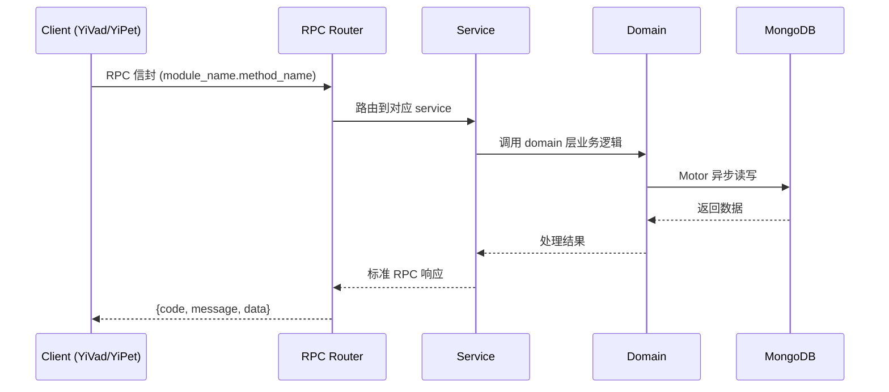

---

doc_type: module
prd_task_id: "YA-09-98"
title: "YA-09-98: LLM 响应多样性控制 — 温度/惩罚/创意滑块 — 开发方案"
status: 需求已编写
priority: P2
owner: 陈铭
roles: [engineer]
created: 2026-09-11
updated: 2026-09-14
project: YiAi
project_id: yiai
prd_month: "202609"
estimate_frontend: 0.5
source_prd: "192-需求-响应多样性控制.md"
source_okr: [yiai-002]
related_tests: ["192-test-响应多样性控制"]

type: task
---

# YA-09-98: LLM 响应多样性控制 — 温度/惩罚/创意滑块 — 开发方案

> **文档职责**: 本文档定义**怎么做、为什么这么做、实际做成什么样**（HOW），不含产品目标与测试用例。

> 来源 PRD: [192-需求-响应多样性控制.md](../../prds/2026-09/192-需求-响应多样性控制.md)
> 需求编号: YA-09-98 · 优先级: P2 · 人天: 0.5d

---

<a id="sec-1"></a>
## 一、架构概览

```mermaid
graph TD
    subgraph Current["现状：固定参数"]
        C1[用户请求] --> C2[固定 temperature=0.7]
        C2 --> C3[LLM 推理]
        C3 --> C4[所有场景相同策略]
        C4 --> C5[创意不足 / 事实幻觉 / 重复循环]
    end

    subgraph Target["目标：多样性控制"]
        T1[用户请求] --> T2[意图识别]
        T2 --> T3[加载意图预设]
        T3 --> T4[用户创意滑块调整]
        T4 --> T5[计算采样参数]
        T5 --> T6[LLM 推理 + 重复惩罚]
        T6 --> T7[n-gram 后处理]
        T7 --> T8[多样性响应]
    end

    style Current fill:#f8d7da,stroke:#dc3545
    style Target fill:#d4edda,stroke:#28a745
```



<a id="sec-2"></a>
## 二、文件清单

| 文件 | 操作 | 说明 |
|------|------|------|
| `domain/XXX/models.py` | 新增 | 数据模型定义 |
| `domain/XXX/service.py` | 新增 | 核心服务逻辑 |
| `services/XXX/rpc_handler.py` | 新增 | RPC 路由处理器 |
| `tests/test_XXX.py` | 新增 | 单元测试 |

<a id="sec-3"></a>
## 三、模块设计

### 1. 核心组件

```python
 YiAi/src/domain/diversity/presets.py (新增)

from dataclasses import dataclass
from enum import Enum


class IntentType(str, Enum):
    CREATIVE = "creative"        # 创意写作
    FACTUAL = "factual"          # 事实查询
    CODE = "code"                # 代码生成
    ANALYSIS = "analysis"        # 分析推理
    TRANSLATION = "translation"  # 翻译
    CHAT = "chat"                # 闲聊
    CUSTOM = "custom"            # 自定义


@dataclass
class SamplingParams:
    temperature: float
    top_p: float
    top_k: int
    repetition_penalty: float
    frequency_penalty: float = 0.0
    presence_penalty: float = 0.0
    min_p: float = 0.0
# ... (完整实现见 PRD)
```

### 2. 核心组件

```python
 YiAi/src/domain/diversity/sampling_resolver.py (新增)

from .presets import (
    IntentType, DiversityPreset, SamplingParams, DIVERSITY_PRESETS
)


class SamplingParameterResolver:
    """根据意图和创意滑块计算采样参数"""

    def resolve(
        self,
        intent: IntentType,
        creativity_slider: int = 50,
    ) -> SamplingParams:
        """
        根据意图和创意滑块（0-100）计算采样参数。

        创意滑块区间:
        0-20: 精确模式（接近 precise_params）
        21-40: 保守模式
        41-60: 平衡模式
        61-80: 开放模式
        81-100: 创意模式（接近 creative_params）
        """
# ... (完整实现见 PRD)
```

### 3. 核心组件


<a id="sec-4"></a>
## 四、数据流



**调用链路**: `Client → RPC Router → Service → Domain → MongoDB`  
**响应格式**: `{code: 0, message: "ok", data: ...}`  
**异步模型**: 全链路 `async/await`，Motor 异步 MongoDB 驱动。

<a id="sec-5"></a>
## 五、实施路线图

**预估人天**: 0.5d

| 步骤 | 操作 | 路径 | 验证 | 人天 |
|------|------|------|------|------|
| 1 | 定义 6 种意图预设 | `domain/diversity/presets.py` | 每种意图有合理的参数范围 | 0.04 |
| 2 | 实现分段映射解析器 | `domain/diversity/sampling_resolver.py` | 滑块 0/50/100 映射正确 | 0.04 |
| 3 | 实现意图识别器 | `domain/diversity/intent_recognizer.py` | 6 种意图识别准确率 > 70% | 0.05 |
| 4 | 实现 n-gram 阻止器 | `domain/diversity/ngram_blocker.py` | 重复检测 + 截断正确 | 0.04 |
| 5 | 集成到 chat_service | `services/ai/chat_service.py` | 意图识别 + 参数传递 + 阻止 | 0.05 |
| 6 | 添加 SSE 事件 | `services/ai/chat_service.py` | diversity_info 事件正确 | 0.03 |
| 7 | 编写单元测试 | `tests/test_diversity.py` | 覆盖预设/解析/识别/阻止 | 0.05 |

**总人天：0.3d**


<a id="sec-6"></a>
## 六、代码审查检查清单

- [ ] 6 种意图预设的参数范围合理（temperature: 0.0-1.5）
- [ ] 创意滑块 0-100 映射到正确的参数范围
- [ ] Sigmoid 权重在 0 和 100 时分别接近 0 和 1
- [ ] 意图识别器覆盖所有 6 种意图的正则模式
- [ ] n-gram 阻止器仅在 creativity_slider < 60 时启用
- [ ] 重复惩罚优先使用模型原生参数
- [ ] diversity_info SSE 事件包含 intent 和 creativity 字段
- [ ] 用户手动选择意图时覆盖自动识别结果
- [ ] 采样参数通过 ModelRuntime 统一接口传递


<a id="sec-7"></a>
## 七、风险评估

| 风险 | 概率 | 影响 | 缓解措施 |
|------|------|------|----------|
| 意图识别错误导致不合适的采样参数 | 中 | 中 | 提供手动覆盖选项；显示当前识别意图 |
| n-gram 阻止误判（正常内容被截断） | 中 | 中 | 仅在精确/保守模式下启用；设置合理的 max_repeat |
| 某些 LLM 后端不支持 repetition_penalty | 中 | 低 | 应用层 n-gram 阻止作为通用 fallback |
| 创意滑块映射过于激进/保守 | 低 | 低 | 预设参数可配置，支持用户自定义 |


<a id="sec-8"></a>
## 八、回滚方案

| 场景 | 回滚操作 | 影响 |
|------|------|------|
| 意图识别导致用户体验差 | 关闭自动识别，恢复默认 CHAT 意图 | 失去自动适配，用户需手动选择 |
| n-gram 阻止误判频繁 | 关闭 n-gram 阻止，仅保留 repetition_penalty | 可能继续出现重复 |
| 采样参数导致 LLM 输出异常 | 回退到固定 temperature=0.7 | 失去多样性控制 |
| 性能下降 | 关闭意图识别和 n-gram 阻止 | 功能正常，失去高级特性 |

