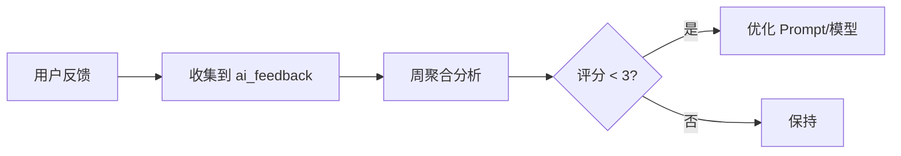

# YA-09-82: 用户反馈闭环 — 收集/分析/驱动 Prompt 改进 — 开发方案

> **文档职责**：本文档定义**怎么做、为什么这么做、实际做成什么样**（HOW），不含产品目标与测试用例。

> 来源 PRD：[193-需求-用户反馈闭环.md](../../prds/2026-09/193-需求-用户反馈闭环.md)
> 需求编号：YA-09-82 · 优先级：P2 · 人天：1.5d · 状态：需求已编写

---

<a id="sec-1"></a>
## 一、方案

每次 AI 回复后提供 👍/👎 反馈按钮，反馈数据存入 `ai_feedback` 集合，定期聚合分析驱动 Prompt 和模型选择优化。

```python
class FeedbackCollector:
    async def record(self, session_id: str, message_id: str, rating: int, tags: list[str], comment: str = ""):
        await db.ai_feedback.insert_one({
            "session_id": session_id, "message_id": message_id,
            "rating": rating,  # 1-5
            "tags": tags,       # ["准确", "有帮助"] or ["错误", "不相关"]
            "comment": comment,
            "model": current_model, "prompt_version": current_prompt_version,
            "created": datetime.now(timezone.utc),
        })

    async def aggregate(self, since: timedelta = timedelta(days=7)) -> dict:
        """按模型/Prompt 版本聚合"""
        pipeline = [
            {"$match": {"created": {"$gte": datetime.now(timezone.utc) - since}}},
            {"$group": {"_id": {"model": "$model", "prompt": "$prompt_version"}, "avg_rating": {"$avg": "$rating"}, "count": {"$sum": 1}}},
        ]
        return await db.ai_feedback.aggregate(pipeline).to_list(None)
```

### 闭环流程



---

<a id="sec-2"></a>
## 二、实施步骤

| 步骤 | 验证 | 人天 |
|------|------|------|
| 1 | 反馈 API + MongoDB 存储 | 反馈数据正确入库 | 0.5 |
| 2 | 聚合分析 + Dashboard + 测试 | 按模型/Prompt 维度的评分可视化 | 1.0 |

**合计：1.5d**。