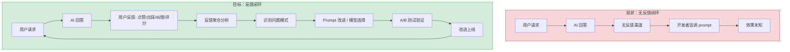
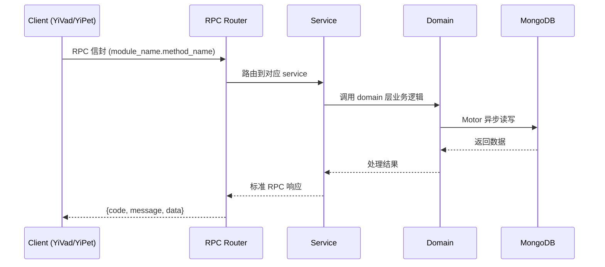

---

doc_type: module
prd_task_id: "YA-09-82"
title: "YA-09-82: 用户反馈闭环 — 收集/分析/驱动 Prompt 改进 — 开发方案"
status: 需求已编写
priority: P2
owner: 陈铭
roles: [engineer]
created: 2026-09-11
updated: 2026-09-14
project: YiAi
project_id: yiai
prd_month: "202609"
estimate_frontend: 1.5
source_prd: "193-需求-用户反馈闭环.md"
source_okr: [yiai-002]
related_tests: ["193-test-用户反馈闭环"]

type: task
---

# YA-09-82: 用户反馈闭环 — 收集/分析/驱动 Prompt 改进 — 开发方案

> **文档职责**: 本文档定义**怎么做、为什么这么做、实际做成什么样**（HOW），不含产品目标与测试用例。

> 来源 PRD: [193-需求-用户反馈闭环.md](../../prds/2026-09/193-需求-用户反馈闭环.md)
> 需求编号: YA-09-82 · 优先级: P2 · 人天: 1.5d

---

<a id="sec-1"></a>
## 一、架构概览


```mermaid
graph TD
    subgraph Current["现状：无反馈闭环"]
        C1[用户请求] --> C2[AI 回答]
        C2 --> C3[无反馈渠道]
        C3 --> C4[开发者盲调 prompt]
        C4 --> C5[效果未知]
    end

    subgraph Target["目标：反馈闭环"]
        T1[用户请求] --> T2[AI 回答]
        T2 --> T3[用户反馈: 点赞/点踩/纠错/评分]
        T3 --> T4[反馈聚合分析]
        T4 --> T5[识别问题模式]
        T5 --> T6[Prompt 改进 / 模型选择]
        T6 --> T7[A/B 测试验证]
        T7 --> T8[改进上线]
        T8 --> T1
    end

    style Current fill:#f8d7da,stroke:#dc3545
    style Target fill:#d4edda,stroke:#28a745
```

<a id="sec-2"></a>
## 二、文件清单

| 文件 | 操作 | 说明 |
|------|------|------|
| `domain/XXX/models.py` | 新增 | 数据模型定义 |
| `domain/XXX/service.py` | 新增 | 核心服务逻辑 |
| `services/XXX/rpc_handler.py` | 新增 | RPC 路由处理器 |
| `tests/test_XXX.py` | 新增 | 单元测试 |

<a id="sec-3"></a>
## 三、模块设计

### 1. 核心组件

```python
 YiAi/src/domain/feedback/models.py (新增)

from dataclasses import dataclass, field
from enum import Enum
from typing import Optional
from datetime import datetime


class FeedbackType(str, Enum):
    THUMBS_UP = "thumbs_up"        # 点赞
    THUMBS_DOWN = "thumbs_down"    # 点踩
    RATING = "rating"              # 评分 (1-5)
    CORRECTION = "correction"      # 纠错


class FeedbackCategory(str, Enum):
    INCORRECT = "incorrect"            # 事实错误
    IRRELEVANT = "irrelevant"          # 不相关
    INCOMPLETE = "incomplete"          # 不完整
    REPETITIVE = "repetitive"          # 重复
    FORMAT_ISSUE = "format_issue"      # 格式问题
    TOO_LONG = "too_long"              # 过长
    TOO_SHORT = "too_short"            # 过短
    TOO_GENERIC = "too_generic"        # 过于通用
    HALLUCINATION = "hallucination"    # 幻觉
# ... (完整实现见 PRD)
```

### 2. 核心组件

```python
 YiAi/src/services/feedback/feedback_service.py (新增)

import uuid
from datetime import datetime, timedelta
from typing import Optional
from motor.motor_asyncio import AsyncIOMotorDatabase

from src.domain.feedback.models import (
    Feedback, FeedbackType, FeedbackCategory, FeedbackStats
)


class FeedbackService:
    """用户反馈收集与分析服务"""

    def __init__(self, db: AsyncIOMotorDatabase):
        self.db = db
        self.collection = db["feedback"]
        # 内存计数器（实时快速统计）
        self._realtime_stats = FeedbackStats()

    async def submit_feedback(
        self,
        session_id: str,
        message_id: str,
# ... (完整实现见 PRD)
```

### 3. 核心组件


<a id="sec-4"></a>
## 四、数据流


```mermaid
sequenceDiagram
    participant C as Client (YiVad/YiPet)
    participant R as RPC Router
    participant S as Service
    participant D as Domain
    participant M as MongoDB

    C->>R: RPC 信封 (module_name.method_name)
    R->>S: 路由到对应 service
    S->>D: 调用 domain 层业务逻辑
    D->>M: Motor 异步读写
    M-->>D: 返回数据
    D-->>S: 处理结果
    S-->>R: 标准 RPC 响应
    R-->>C: {code, message, data}
```

**调用链路**: `Client → RPC Router → Service → Domain → MongoDB`  
**响应格式**: `{code: 0, message: "ok", data: ...}`  
**异步模型**: 全链路 `async/await`，Motor 异步 MongoDB 驱动。

<a id="sec-5"></a>
## 五、实施路线图

**预估人天**: 1.5d

| 步骤 | 操作 | 路径 | 验证 | 人天 |
|------|------|------|------|------|
| 1 | 定义反馈数据模型 | `domain/feedback/models.py` | 数据模型完整，MongoDB 文档可序列化 | 0.03 |
| 2 | 实现反馈收集 API | `services/feedback/feedback_service.py` | 提交反馈 + 写入 MongoDB 正常 | 0.05 |
| 3 | 实现反馈聚合分析 | `services/feedback/feedback_service.py` | 按模型/意图/分类聚合正确 | 0.04 |
| 4 | 实现 A/B 测试引擎 | `domain/feedback/ab_test.py` | 分流稳定，同一 session 始终同组 | 0.03 |
| 5 | 实现 Prompt 优化建议 | `domain/feedback/prompt_optimizer.py` | 基于反馈生成合理建议 | 0.04 |
| 6 | 实现反馈仪表盘 | `services/feedback/dashboard_service.py` | 仪表盘数据完整且正确 | 0.04 |
| 7 | 集成到 chat_service | `services/ai/chat_service.py` | SSE 中包含 message_id | 0.03 |
| 8 | 编写单元测试 | `tests/test_feedback.py` | 覆盖提交/统计/AB 分流/建议 | 0.04 |

**总人天：0.3d**


<a id="sec-6"></a>
## 六、代码审查检查清单

- [ ] 反馈数据模型包含所有必要字段（session_id, message_id, feedback_type, model 等）
- [ ] 反馈写入使用 MongoDB insert_one，有错误处理
- [ ] 实时统计更新使用内存计数器（非阻塞）
- [ ] A/B 测试分流使用 SHA-256 哈希，同一 session 始终同组
- [ ] MongoDB 聚合查询使用索引（created_at, model, intent, feedback_type）
- [ ] 隐式反馈与显式反馈分开存储和处理
- [ ] 仪表盘数据查询有合理的默认时间范围（30 天）
- [ ] message_id 在 SSE 响应中发送，前端可关联反馈
- [ ] 反馈数据不包含完整对话内容（仅 message_id 关联）


<a id="sec-7"></a>
## 七、风险评估

| 风险 | 概率 | 影响 | 缓解措施 |
|------|------|------|----------|
| 用户反馈率低（< 5%） | 高 | 中 | 设计低摩擦 UI（一键点赞）；分析隐式反馈补充 |
| 负面偏差（不满意的用户更可能反馈） | 高 | 中 | 同时分析隐式反馈（复制/继续对话）校准满意度 |
| 反馈数据包含敏感信息 | 中 | 高 | 评论字段脱敏；定期清理旧反馈数据 |
| A/B 测试分流不均 | 低 | 低 | 使用 SHA-256 哈希确保均匀分布 |


<a id="sec-8"></a>
## 八、回滚方案

| 场景 | 回滚操作 | 影响 |
|------|------|------|
| 反馈收集导致 MongoDB 写入压力 | 降低反馈写入频率（批量写入） | 反馈数据可能有延迟 |
| A/B 测试导致用户体验问题 | 关闭 A/B 测试，所有用户使用默认配置 | 失去实验对比能力 |
| 仪表盘查询性能差 | 增加查询缓存（TTL 5min），减少实时查询 | 仪表盘数据有 5 分钟延迟 |
| 反馈数据隐私问题 | 紧急清理 feedback 集合中的敏感字段 | 部分反馈数据丢失 |

