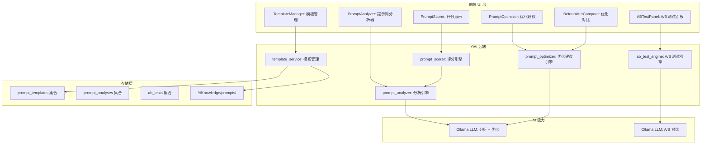
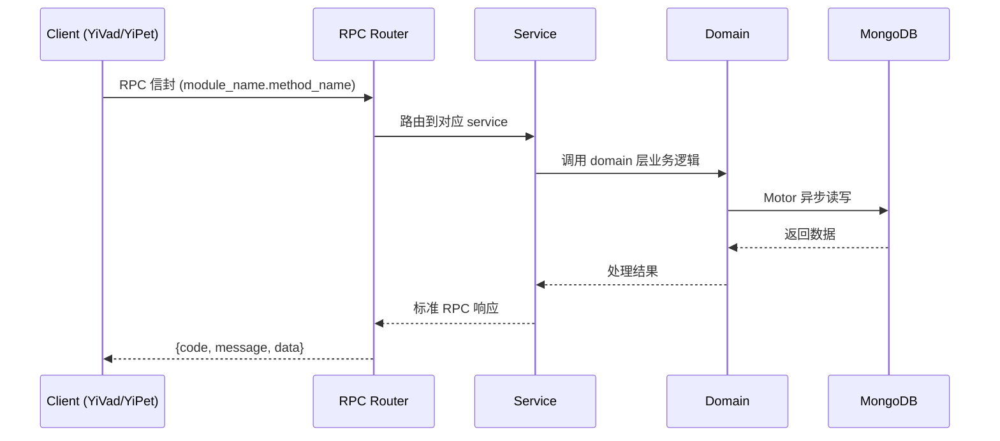

---

doc_type: module
prd_task_id: "YA-09-189"
title: "YA-09-189: 智能提示词优化器 — 提示词分析、改进建议、A/B 测试、评分、模板优化 — 开发任务"
status: 需求已编写
priority: P2
owner: 陈铭
roles: [engineer]
created: 2026-09-11
updated: 2026-09-11
project: YiAi
project_id: yiai
prd_month: "202609"
estimate_frontend: 0.3
source_prd: "194-需求-智能提示词优化器.md"
source_okr: [yiai-001]

type: task
---

# YA-09-189: 智能提示词优化器 — 提示词分析、改进建议、A/B 测试、评分、模板优化 — 开发任务

> **文档职责**: 本文档定义**怎么做、为什么这么做、实际做成什么样**（HOW），不含产品目标与测试用例。

> 来源 PRD: [194-需求-智能提示词优化器.md](../../prds/2026-09/194-需求-智能提示词优化器.md)
> 需求编号: YA-09-189 · 优先级: P2 · 人天: 0.3d

---

<a id="sec-1"></a>
## 一、架构概览



<a id="sec-2"></a>
## 二、文件清单

| 文件 | 操作 | 说明 |
|------|------|------|
| `domain/XXX/models.py` | 新增 | 数据模型定义 |
| `domain/XXX/service.py` | 新增 | 核心服务逻辑 |
| `services/XXX/rpc_handler.py` | 新增 | RPC 路由处理器 |
| `tests/test_XXX.py` | 新增 | 单元测试 |

<a id="sec-3"></a>
## 三、模块设计

### 1. 核心组件

```python
 src/domain/prompt/prompt_analyzer.py (新增)

"""提示词分析引擎——规则 + AI 双模分析。"""

import re
from typing import Optional
from dataclasses import dataclass, field
from src.shared.logging import get_logger

logger = get_logger(__name__)


@dataclass
class PromptAnalysis:
    """提示词分析结果。"""
    clarity_score: float = 0.0       # 清晰度 0-100
    specificity_score: float = 0.0   # 特异性 0-100
    structure_score: float = 0.0     # 结构 0-100
    completeness_score: float = 0.0  # 完整性 0-100
    conciseness_score: float = 0.0   # 简洁性 0-100
    overall_score: float = 0.0       # 综合评分 0-100

    # 规则检查结果
    has_examples: bool = False
    has_output_format: bool = False
# ... (完整实现见 PRD)
```

### 2. 核心组件

```python
 src/domain/prompt/prompt_optimizer.py (新增)

"""提示词优化器——AI 辅助的提示词改进。"""

from src.shared.logging import get_logger

logger = get_logger(__name__)


class PromptOptimizer:
    """AI 辅助的提示词优化器。"""

    def __init__(self, llm_client):
        self._llm = llm_client

    async def optimize(self, prompt: str, focus_areas: list[str] = None) -> dict:
        """优化提示词。

        Args:
            prompt: 原始提示词
            focus_areas: 重点优化的维度列表

        Returns:
            {
                'optimized_prompt': str,
# ... (完整实现见 PRD)
```


<a id="sec-4"></a>
## 四、数据流



**调用链路**: `Client → RPC Router → Service → Domain → MongoDB`  
**响应格式**: `{code: 0, message: "ok", data: ...}`  
**异步模型**: 全链路 `async/await`，Motor 异步 MongoDB 驱动。

<a id="sec-5"></a>
## 五、实施路线图

**预估人天**: 0.3d

| 步骤 | 操作 | 路径 | 验证 | 人天 |
|------|------|------|------|------|
| 1 | 实现规则分析器 | `prompt_analyzer.py` | 规则检查正确 | 0.04 |
| 2 | 实现 AI 分析器 | `prompt_analyzer.py` | AI 分析结果合理 | 0.05 |
| 3 | 实现综合评分 | `prompt_analyzer.py` + `prompt_scorer.py` | 评分准确 | 0.04 |
| 4 | 实现优化建议引擎 | `prompt_optimizer.py` | 优化后提示词质量提升 | 0.06 |
| 5 | 实现 A/B 测试引擎 | `ab_test_engine.py` | 对比结果正确 | 0.05 |
| 6 | 实现模板管理服务 | `template_service.py` | 模板 CRUD | 0.03 |
| 7 | 实现 RPC 接口 | `prompt_optimization_service.py` | 接口可调用 | 0.02 |
| 8 | 编写测试 | `tests/domain/prompt/` | 覆盖率 > 80% | 0.01 |

**总人天：0.3d**


<a id="sec-6"></a>
## 六、代码审查检查清单

- [ ] 规则分析器覆盖所有 5 个维度
- [ ] AI 分析器使用结构化 prompt 确保 JSON 输出
- [ ] 综合评分正确计算加权平均和惩罚分
- [ ] 优化器保持原意不变
- [ ] A/B 测试使用相同测试输入
- [ ] 模板服务支持文件系统 + 数据库双写
- [ ] 分析结果包含可操作的建议
- [ ] 优化前后对比显示 diff 视图
- [ ] 测试覆盖分析器、优化器、评分器


<a id="sec-7"></a>
## 七、风险评估

| 风险 | 概率 | 影响 | 缓解措施 |
|------|------|------|----------|
| AI 分析质量不稳定 | 中 | 中 | 规则分析作为基础保障，AI 分析结果标注"仅供参考" |
| A/B 测试样本不足 | 中 | 中 | 提供 10 个标准测试问题，支持用户自定义测试集 |
| 优化后提示词偏离原意 | 中 | 中 | 保留原始提示词，优化结果需人工审核确认 |
| 模板文件与数据库不一致 | 低 | 中 | 模板修改时同步更新文件和数据库，定期校验 |


<a id="sec-8"></a>
## 八、回滚方案

| 场景 | 回滚操作 | 影响 |
|------|----------|------|
| 分析器异常 | 返回基础规则分析结果 | 失去 AI 分析 |
| 优化器异常 | 返回原始提示词 + 通用建议 | 失去 AI 优化 |
| A/B 测试异常 | 降级为手动对比 | 失去自动对比 |
| 模板损坏 | 从 Git 历史恢复模板文件 | 模板恢复 |

