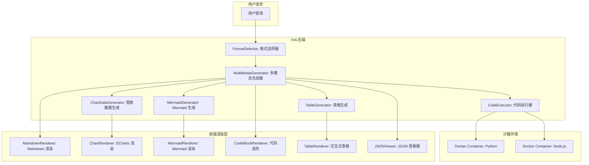
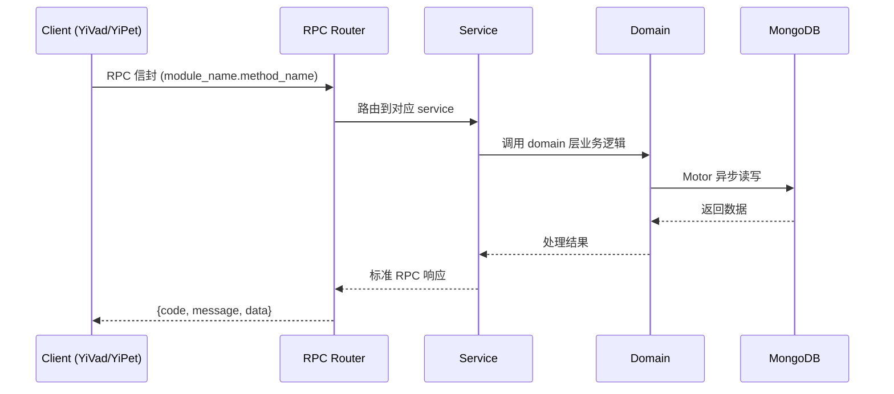

---

doc_type: module
prd_task_id: "YA-09-141"
title: "YA-09-141: 多模态输出生成 — 图表/表格/Mermaid/代码 — 开发方案"
status: 需求已编写
priority: P2
owner: 陈铭
roles: [engineer]
created: 2026-09-11
updated: 2026-09-14
project: YiAi
project_id: yiai
prd_month: "202609"
estimate_frontend: 0.5
source_prd: "195-需求-多模态输出生成.md"
source_okr: [yiai-003]

type: task
---

# YA-09-141: 多模态输出生成 — 图表/表格/Mermaid/代码 — 开发方案

> **文档职责**: 本文档定义**怎么做、为什么这么做、实际做成什么样**（HOW），不含产品目标与测试用例。

> 来源 PRD: [195-需求-多模态输出生成.md](../../prds/2026-09/195-需求-多模态输出生成.md)
> 需求编号: YA-09-141 · 优先级: P2 · 人天: 0.5d

---

<a id="sec-1"></a>
## 一、架构概览



<a id="sec-2"></a>
## 二、文件清单

| 文件 | 操作 | 说明 |
|------|------|------|
| `domain/XXX/models.py` | 新增 | 数据模型定义 |
| `domain/XXX/service.py` | 新增 | 核心服务逻辑 |
| `services/XXX/rpc_handler.py` | 新增 | RPC 路由处理器 |
| `tests/test_XXX.py` | 新增 | 单元测试 |

<a id="sec-3"></a>
## 三、模块设计

### 1. 核心组件

```python
 src/domain/multimodal/multimodal_generator.py (新增)

"""多模态输出生成器——文本+图片/表格/代码/图表/JSON Schema/Mermaid。"""

import json
from typing import Optional
from enum import Enum
from dataclasses import dataclass
from src.shared.logging import get_logger

logger = get_logger(__name__)


class OutputFormat(Enum):
    TEXT = 'text'
    TABLE = 'table'
    CODE = 'code'
    CHART = 'chart'
    MERMAID = 'mermaid'
    JSON_SCHEMA = 'json_schema'
    MIXED = 'mixed'


@dataclass
class MultiModalBlock:
# ... (完整实现见 PRD)
```

### 2. 核心组件

```python
 src/domain/multimodal/code_executor.py (新增)

"""代码执行器——Docker 沙箱安全的代码执行。"""

import subprocess
import tempfile
import os
from typing import Optional
from src.shared.logging import get_logger

logger = get_logger(__name__)


class CodeExecutor:
    """Docker 沙箱代码执行器。"""

    EXECUTION_TIMEOUT = 5  # 秒
    MEMORY_LIMIT = '256m'
    CPU_LIMIT = '0.5'

    async def execute(self, code: str, language: str = 'python') -> Optional[str]:
        """在 Docker 沙箱中执行代码。

        Args:
            code: 代码内容
# ... (完整实现见 PRD)
```


<a id="sec-4"></a>
## 四、数据流



**调用链路**: `Client → RPC Router → Service → Domain → MongoDB`  
**响应格式**: `{code: 0, message: "ok", data: ...}`  
**异步模型**: 全链路 `async/await`，Motor 异步 MongoDB 驱动。

<a id="sec-5"></a>
## 五、实施路线图

**预估人天**: 0.5d

| 步骤 | 操作 | 路径 | 验证 | 人天 |
|------|------|------|------|------|
| 1 | 实现格式选择器 | `format_selector.py` | 规则匹配正确 | 0.03 |
| 2 | 实现多模态生成器 | `multimodal_generator.py` | 各格式生成正确 | 0.08 |
| 3 | 实现代码执行器 | `code_executor.py` | Docker 沙箱执行 | 0.05 |
| 4 | 实现扩展 Markdown 解析 | `response.py` | `:::type` 解析 | 0.04 |
| 5 | 实现前端渲染器 | `MultiModalRenderer.vue` | 各类型渲染正确 | 0.05 |
| 6 | 实现 RPC 接口 | `multimodal_chat_service.py` | 接口可调用 | 0.03 |
| 7 | 编写测试 | `tests/domain/multimodal/` | 覆盖率 > 80% | 0.02 |

**总人天：0.3d**


<a id="sec-6"></a>
## 六、代码审查检查清单

- [ ] 格式选择器规则匹配覆盖所有格式类型
- [ ] 多模态生成器支持 6 种输出格式
- [ ] 代码执行器使用 Docker 沙箱隔离
- [ ] 代码执行限制 5 秒超时 + 256MB 内存
- [ ] 扩展 Markdown 语法 `:::type` 兼容降级
- [ ] 前端渲染器支持所有内容块类型
- [ ] SSE 流式传输支持多模态事件类型
- [ ] 图表数据生成后验证 ECharts JSON 格式
- [ ] 用户可手动覆盖 AI 格式选择
- [ ] 测试覆盖所有格式类型和边界情况


<a id="sec-7"></a>
## 七、风险评估

| 风险 | 概率 | 影响 | 缓解措施 |
|------|------|------|----------|
| Docker 沙箱逃逸 | 低 | 高 | 使用 --network none、--read-only、限制资源 |
| 代码执行安全漏洞 | 中 | 高 | 限制执行时间 5s、禁止网络、限制内存 |
| 图表数据格式错误 | 中 | 中 | 验证 ECharts JSON 格式，格式错误时降级为文本 |
| 多模态渲染性能 | 中 | 中 | 渲染大图表时使用虚拟 DOM，限制数据点数量 |
| AI 格式选择错误 | 中 | 低 | 用户可手动指定格式，支持覆盖 AI 选择 |


<a id="sec-8"></a>
## 八、回滚方案

| 场景 | 回滚操作 | 影响 |
|------|----------|------|
| 代码执行安全漏洞 | 禁用代码执行功能 | 失去代码执行 |
| Docker 不可用 | 代码块不显示执行按钮 | 仅显示代码不执行 |
| 图表渲染异常 | 降级为图片展示 | 失去交互性 |
| 多模态解析失败 | 降级为纯文本渲染 | 失去格式增强 |
| 完全回滚 | 禁用多模态功能 | 回到纯文本输出 |

