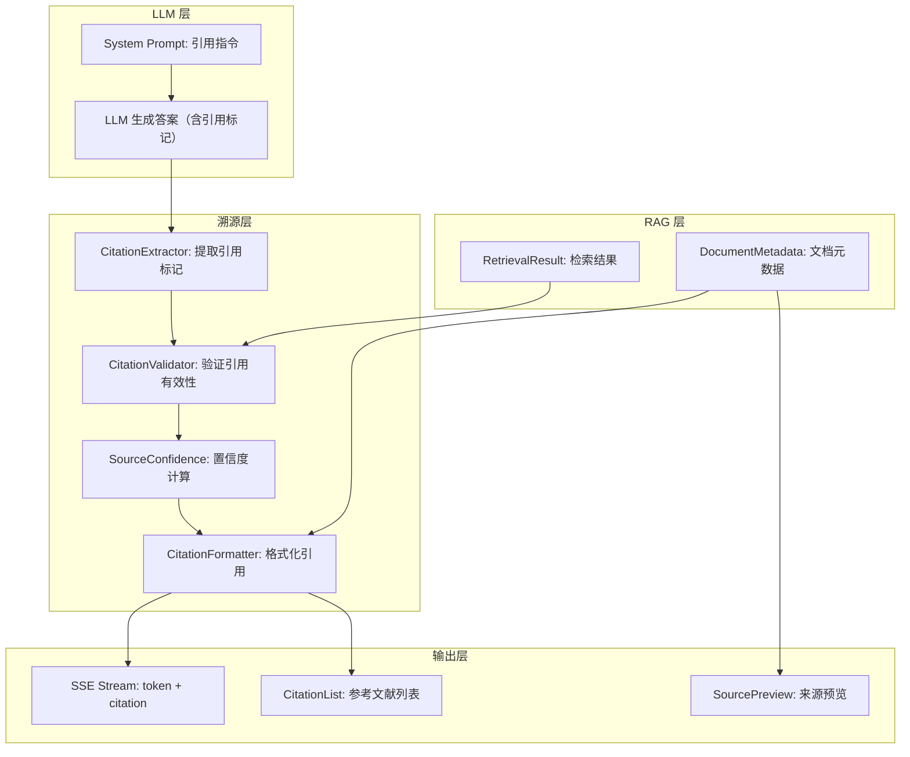
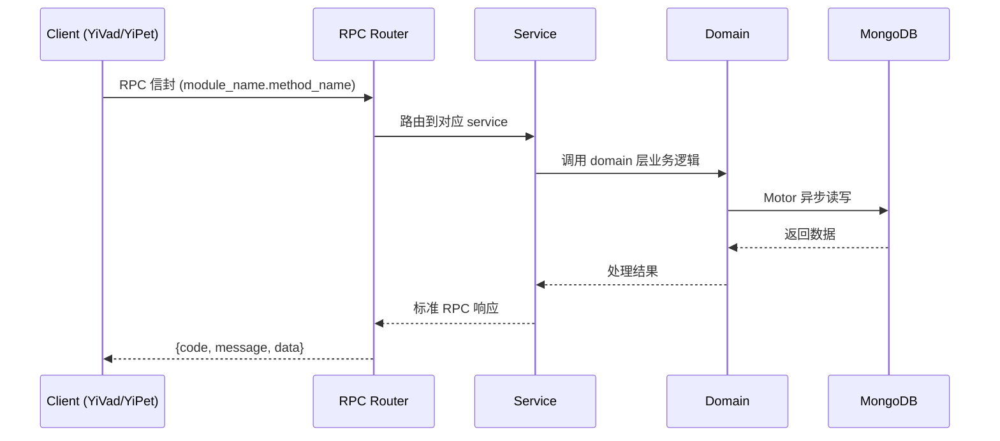

---

doc_type: module
prd_task_id: "YA-09-191"
title: "YA-09-191: 答案溯源与引用 — 内联引用标记、来源文档链接、置信度评分、引用格式自定义、悬停预览、参考文献导出 — 开发任务"
status: 需求已编写
priority: P2
owner: 陈铭
roles: [engineer]
created: 2026-09-11
updated: 2026-09-11
project: YiAi
project_id: yiai
prd_month: "202609"
estimate_frontend: 0.3
source_prd: "196-需求-答案溯源与引用.md"
source_okr: [yiai-001]

type: task
---

# YA-09-191: 答案溯源与引用 — 内联引用标记、来源文档链接、置信度评分、引用格式自定义、悬停预览、参考文献导出 — 开发任务

> **文档职责**: 本文档定义**怎么做、为什么这么做、实际做成什么样**（HOW），不含产品目标与测试用例。

> 来源 PRD: [196-需求-答案溯源与引用.md](../../prds/2026-09/196-需求-答案溯源与引用.md)
> 需求编号: YA-09-191 · 优先级: P2 · 人天: 0.3d

---

<a id="sec-1"></a>
## 一、架构概览



<a id="sec-2"></a>
## 二、文件清单

| 文件 | 操作 | 说明 |
|------|------|------|
| `domain/XXX/models.py` | 新增 | 数据模型定义 |
| `domain/XXX/service.py` | 新增 | 核心服务逻辑 |
| `services/XXX/rpc_handler.py` | 新增 | RPC 路由处理器 |
| `tests/test_XXX.py` | 新增 | 单元测试 |

<a id="sec-3"></a>
## 三、模块设计

### 1. 核心组件

```python
 YiAi/src/services/rag/citation_service.py (新增)

from dataclasses import dataclass, field
from typing import Optional
from datetime import datetime

@dataclass
class SourceMetadata:
    """检索来源元数据"""
    id: str
    title: str
    path: str
    retrieval_score: float
    quality_score: float
    freshness_score: float

    @property
    def confidence(self) -> float:
        """多维度综合置信度"""
        return (
            0.40 * self.retrieval_score +
            0.30 * self.quality_score +
            0.30 * self.freshness_score
        )

# ... (完整实现见 PRD)
```

### 2. 核心组件

```python
 YiAi/src/services/ai/chat_service.py (修改)

CITATION_SYSTEM_PROMPT = """
你是一个知识库助手。回答问题时：

1. 使用检索到的知识库内容回答
2. 在引用知识库内容时，用 [来源N] 标记（N 为来源编号，从 1 开始）
3. 每个段落最多 2 个引用标记
4. 不要编造来源编号——只引用实际提供的来源
5. 如果多个来源支持同一观点，引用最相关的那个

示例：
"FastAPI 使用 Pydantic 进行请求参数验证，支持自动类型转换和校验 [来源1]。对于复杂场景，可以使用依赖注入系统 [来源2]。"
"""

async def build_rag_prompt(query: str, sources: list[dict]) -> str:
    """构建带引用指令的 RAG Prompt"""
    source_texts = []
    for i, src in enumerate(sources, 1):
        source_texts.append(
            f"[来源{i}] 标题: {src['title']}\n"
            f"内容: {src['snippet']}\n"
            f"路径: {src['path']}"
        )

# ... (完整实现见 PRD)
```

### 3. 核心组件


<a id="sec-4"></a>
## 四、数据流



**调用链路**: `Client → RPC Router → Service → Domain → MongoDB`  
**响应格式**: `{code: 0, message: "ok", data: ...}`  
**异步模型**: 全链路 `async/await`，Motor 异步 MongoDB 驱动。

<a id="sec-5"></a>
## 五、实施路线图

**预估人天**: 0.3d

| 步骤 | 操作 | 路径 | 验证 | 人天 |
|------|------|------|------|------|
| 1 | 实现引用服务 | `citation_service.py` | 引用提取 + 验证正确 | 0.08 |
| 2 | 增强 RAG Prompt | `chat_service.py` | LLM 输出含 [来源N] | 0.05 |
| 3 | 实现置信度计算 | `citation_service.py` | 三维度综合评分 | 0.04 |
| 4 | 实现引用格式化 | `citation_service.py` | APA/MLA/Chicago | 0.04 |
| 5 | 添加 SSE 引用帧 | `sse_utils.py` | citation 帧正常发送 | 0.03 |
| 6 | 集成测试 | `test_citation_service.py` + `test_rag_citation.py` | 覆盖提取/验证/格式 | 0.06 |

**总人天：0.3d**


<a id="sec-6"></a>
## 六、代码审查检查清单

- [ ] CitationExtractor 正确匹配 [来源N] 模式
- [ ] 无效引用（N > 来源数）标记为 is_valid=False
- [ ] 三维度置信度计算（retrieval + quality + freshness）
- [ ] Prompt 中引用指令清晰明确
- [ ] SSE citation 帧正确发送
- [ ] APA/MLA/Chicago 三种格式正确
- [ ] 自定义模板变量正确替换（{index}/{title}/{confidence}/{path}）
- [ ] 参考文献列表渲染为 Markdown
- [ ] 单元测试覆盖引用提取/验证/格式
- [ ] 集成测试覆盖完整 RAG + 引用流程


<a id="sec-7"></a>
## 七、风险评估

| 风险 | 概率 | 影响 | 缓解措施 |
|------|------|------|----------|
| LLM 不遵循引用格式 | 中 | 中 | 后处理步骤检测并提示用户无引用可用 |
| 引用编号与来源不匹配 | 中 | 中 | 后处理验证 + 修正无效引用 |
| 增加 token 消耗 | 高 | 低 | 引用指令 ~200 tokens，可接受 |
| 置信度计算不准确 | 中 | 低 | 三个维度可独立调整权重 |
| 引用格式在不同前端渲染不一致 | 低 | 中 | 后端返回结构化数据，前端自行渲染 |


<a id="sec-8"></a>
## 八、回滚方案

| 场景 | 回滚操作 | 影响 |
|------|----------|------|
| 引用影响答案质量 | 关闭引用功能，恢复原始 Prompt | 失去引用能力 |
| SSE citation 帧导致前端错误 | 移除 citation 帧，仅保留文本引用 | 前端无预览 |
| 置信度计算异常 | 使用检索分数作为唯一置信度 | 置信度单一维度 |
| 完全回滚 | 移除 citation_service 和 Prompt 增强 | 功能回到改造前 |

