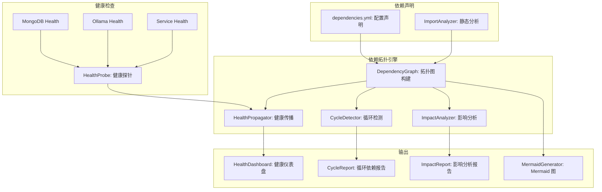
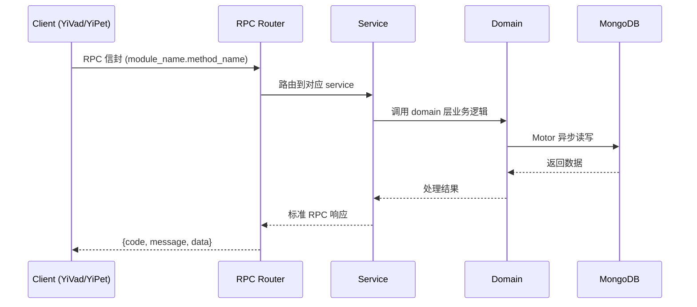

---

doc_type: module
prd_task_id: "YA-09-133"
title: "YA-09-133: 服务依赖拓扑图 — 可视化 + 健康传播 + 循环检测 — 开发方案"
status: 需求已编写
priority: P2
owner: 陈铭
roles: [engineer]
created: 2026-09-11
updated: 2026-09-14
project: YiAi
project_id: yiai
prd_month: "202609"
estimate_frontend: 0.5
source_prd: "197-需求-服务依赖拓扑图.md"
source_okr: [yiai-001]

type: task
---

# YA-09-133: 服务依赖拓扑图 — 可视化 + 健康传播 + 循环检测 — 开发方案

> **文档职责**: 本文档定义**怎么做、为什么这么做、实际做成什么样**（HOW），不含产品目标与测试用例。

> 来源 PRD: [197-需求-服务依赖拓扑图.md](../../prds/2026-09/197-需求-服务依赖拓扑图.md)
> 需求编号: YA-09-133 · 优先级: P2 · 人天: 0.5d

---

<a id="sec-1"></a>
## 一、架构概览



<a id="sec-2"></a>
## 二、文件清单

| 文件 | 操作 | 说明 |
|------|------|------|
| `domain/XXX/models.py` | 新增 | 数据模型定义 |
| `domain/XXX/service.py` | 新增 | 核心服务逻辑 |
| `services/XXX/rpc_handler.py` | 新增 | RPC 路由处理器 |
| `tests/test_XXX.py` | 新增 | 单元测试 |

<a id="sec-3"></a>
## 三、模块设计

### 1. 核心组件

```python
 YiAi/src/domain/dependency/topology.py (新增)

from dataclasses import dataclass, field
from enum import Enum
from typing import Optional
import yaml
from collections import defaultdict, deque

class HealthStatus(Enum):
    GREEN = "green"
    YELLOW = "yellow"
    RED = "red"
    UNKNOWN = "unknown"

class DependencyType(Enum):
    STRONG = "strong"
    WEAK = "weak"

@dataclass
class ServiceNode:
    name: str
    display_name: str
    description: str = ""
    dependencies: list["DependencyEdge"] = field(default_factory=list)
    dependents: list[str] = field(default_factory=list)
# ... (完整实现见 PRD)
```


<a id="sec-4"></a>
## 四、数据流



**调用链路**: `Client → RPC Router → Service → Domain → MongoDB`  
**响应格式**: `{code: 0, message: "ok", data: ...}`  
**异步模型**: 全链路 `async/await`，Motor 异步 MongoDB 驱动。

<a id="sec-5"></a>
## 五、实施路线图

**预估人天**: 0.5d

| 步骤 | 操作 | 路径 | 验证 | 人天 |
|------|------|------|------|------|
| 1 | 编写依赖声明配置 | `config/dependencies.yml` | YAML 格式正确 | 0.03 |
| 2 | 实现拓扑引擎 | `topology.py` | 拓扑排序 + 循环检测 | 0.08 |
| 3 | 实现健康状态传播 | `topology.py` propagate_health | Green→Yellow→Red 正确 | 0.05 |
| 4 | 实现影响分析 | `topology.py` analyze_impact | 1-hop + N-hop 正确 | 0.04 |
| 5 | 实现 Mermaid 导出 | `topology.py` to_mermaid | 图表渲染正确 | 0.03 |
| 6 | 实现 API 端点 | `dependency_routes.py` | GET 拓扑/健康/循环/影响 | 0.04 |
| 7 | 编写测试 | `test_topology.py` + `test_dependency_api.py` | 覆盖核心逻辑 | 0.03 |

**总人天：0.3d**


<a id="sec-6"></a>
## 六、代码审查检查清单

- [ ] 依赖配置文件 YAML 格式正确
- [ ] 拓扑排序算法正确（Kahn 算法）
- [ ] 循环检测正确（DFS + 路径记录）
- [ ] 健康传播规则：强依赖 RED → 上游 RED
- [ ] 健康传播规则：弱依赖不影响上游
- [ ] 影响分析覆盖直接 + 间接（BFS 传播）
- [ ] Mermaid 导出格式正确
- [ ] API 端点在 rpc_router 中注册
- [ ] 单元测试覆盖拓扑构建/排序/检测/传播
- [ ] 集成测试覆盖完整 API


<a id="sec-7"></a>
## 七、风险评估

| 风险 | 概率 | 影响 | 缓解措施 |
|------|------|------|----------|
| 配置文件与实际代码不一致 | 中 | 中 | 静态分析 import 补充 + CI 校验 |
| 大依赖图渲染慢 | 低 | 低 | 支持子图过滤（仅强依赖/仅某服务） |
| 循环依赖导致拓扑排序失败 | 中 | 中 | 检测并报告循环，不阻断拓扑构建 |
| 健康状态更新开销 | 低 | 低 | 健康状态缓存 30s，避免频繁检查 |


<a id="sec-8"></a>
## 八、回滚方案

| 场景 | 回滚操作 | 影响 |
|------|----------|------|
| 配置格式错误 | 修正 YAML 格式 | 服务重启即可 |
| 拓扑图渲染异常 | 返回 JSON 数据（降级为非可视化） | 失去可视化 |
| 健康传播误报 | 调整阈值（YELLOW 阈值提高） | 告警减少 |
| 完全回滚 | 移除 dependency 模块 | 功能回到改造前 |

