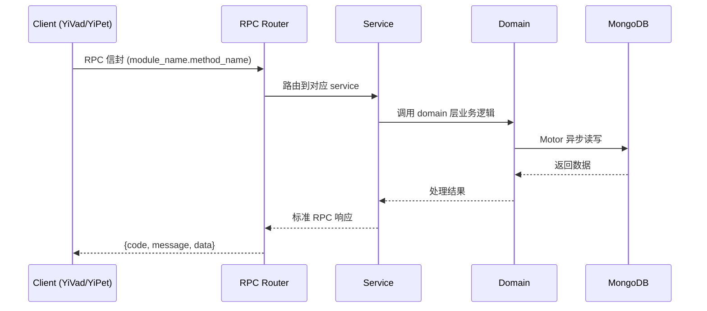

---

doc_type: module
prd_task_id: "YA-09-193"
title: "YA-09-193: 批量推理与离线处理 — 批量 LLM 推理、任务提交与进度、并发控制、结果聚合、成本估算、任务调度、历史与重试 — 开发任务"
status: 需求已编写
priority: P2
owner: 陈铭
roles: [engineer]
created: 2026-09-11
updated: 2026-09-11
project: YiAi
project_id: yiai
prd_month: "202609"
estimate_frontend: 0.3
source_prd: "198-需求-批量推理与离线处理.md"
source_okr: [yiai-002]

type: task
---

# YA-09-193: 批量推理与离线处理 — 批量 LLM 推理、任务提交与进度、并发控制、结果聚合、成本估算、任务调度、历史与重试 — 开发任务

> **文档职责**: 本文档定义**怎么做、为什么这么做、实际做成什么样**（HOW），不含产品目标与测试用例。

> 来源 PRD: [198-需求-批量推理与离线处理.md](../../prds/2026-09/198-需求-批量推理与离线处理.md)
> 需求编号: YA-09-193 · 优先级: P2 · 人天: 0.3d

---

<a id="sec-1"></a>
## 一、架构概览

```mermaid
graph TD
    subgraph "API 层"
        A1[POST /batch-task/submit: 提交任务]
        A2[GET /batch-task/{id}/status: 查询状态]
        A3[GET /batch-task/{id}/results: 获取结果]
        A4[POST /batch-task/{id}/retry-failed: 重试失败项]
    end

    subgraph "任务管理"
        B1[BatchTaskManager: 任务管理器]
        B2[TaskScheduler: 任务调度]
        B3[ConcurrencyController: 并发控制]
        B4[ProgressTracker: 进度追踪]
        B5[CostEstimator: 成本估算]
    end

    subgraph "执行层"
        C1[Ollama LLM: 推理引擎]
        C2[RetryHandler: 重试处理]
    end

    subgraph "持久化"
        D1[MongoDB batch_tasks: 任务数据]
        D2[MongoDB batch_results: 结果数据]
    end

    A1 --> B1
    A2 --> B4
    A3 --> D2
    B1 --> B2
    B2 --> B3
    B3 --> C1
    C1 --> C2
    B3 --> B4
    B5 --> B1
    B2 --> D1
    B2 --> D2
```

<a id="sec-2"></a>
## 二、文件清单

| 文件 | 操作 | 说明 |
|------|------|------|
| `domain/XXX/models.py` | 新增 | 数据模型定义 |
| `domain/XXX/service.py` | 新增 | 核心服务逻辑 |
| `services/XXX/rpc_handler.py` | 新增 | RPC 路由处理器 |
| `tests/test_XXX.py` | 新增 | 单元测试 |

<a id="sec-3"></a>
## 三、模块设计

### 1. 核心组件

```python
 YiAi/src/domain/batch/models.py (新增)

from dataclasses import dataclass, field
from enum import Enum
from typing import Optional
from datetime import datetime

class BatchTaskStatus(str, Enum):
    PENDING = "pending"
    RUNNING = "running"
    COMPLETED = "completed"
    PARTIAL = "partial"
    FAILED = "failed"
    CANCELLED = "cancelled"

@dataclass
class BatchTask:
    id: str
    name: str
    status: BatchTaskStatus = BatchTaskStatus.PENDING
    # 子任务数据列表
    items: list[dict] = field(default_factory=list)
    # 每个子任务的 prompt 模板
    prompt_template: str = ""
    # 并发数
# ... (完整实现见 PRD)
```

### 2. 核心组件

```python
 YiAi/src/services/batch/batch_service.py (新增)

import asyncio
import time
from typing import Optional
from datetime import datetime
from motor.motor_asyncio import AsyncIOMotorDatabase

from src.domain.batch.models import (
    BatchTask, BatchItemResult, BatchTaskStatus)

class BatchTaskManager:
    """批量任务管理器"""

    def __init__(self, db: AsyncIOMotorDatabase):
        self.db = db
        self._running_tasks: dict[str, asyncio.Task] = {}
        self._semaphore = asyncio.Semaphore(3)  # 全局最多 3 个批量任务
        self.MAX_CONCURRENT_ITEMS = 5  # 单个批量任务内最大并发

    async def submit_task(self, task: BatchTask) -> BatchTask:
        """提交批量任务"""
        task.total_items = len(task.items)
        await self.db.batch_tasks.insert_one(task.__dict__)
        # 异步启动执行
# ... (完整实现见 PRD)
```


<a id="sec-4"></a>
## 四、数据流



**调用链路**: `Client → RPC Router → Service → Domain → MongoDB`  
**响应格式**: `{code: 0, message: "ok", data: ...}`  
**异步模型**: 全链路 `async/await`，Motor 异步 MongoDB 驱动。

<a id="sec-5"></a>
## 五、实施路线图

**预估人天**: 0.3d

| 步骤 | 操作 | 路径 | 验证 | 人天 |
|------|------|------|------|------|
| 1 | 定义数据模型 | `models.py` | 状态机正确 | 0.03 |
| 2 | 实现任务管理器 | `batch_service.py` | 提交/执行/轮询 | 0.1 |
| 3 | 实现并发控制 | `batch_service.py` Semaphore | 并发度控制正确 | 0.04 |
| 4 | 实现重试逻辑 | `batch_service.py` 指数退避 | 超时重试 3 次 | 0.04 |
| 5 | 实现成本估算 | `batch_service.py` estimate_cost | token 估算合理 | 0.02 |
| 6 | 实现 API 端点 | `batch_routes.py` | submit/status/results | 0.04 |
| 7 | 编写测试 | `test_batch_*.py` | 覆盖状态机/并发/重试 | 0.03 |

**总人天：0.3d**


<a id="sec-6"></a>
## 六、代码审查检查清单

- [ ] 批量任务状态机正确（pending → running → completed/partial/failed/cancelled）
- [ ] Semaphore 控制并发度正确
- [ ] 超时/连接错误重试 3 次（1s/2s/4s 退避）
- [ ] 业务错误不重试
- [ ] 任务状态持久化到 MongoDB
- [ ] 服务重启后恢复 running/pending 任务
- [ ] 成本估算公式合理（prompt tokens + estimated output tokens）
- [ ] 单个批量任务最多 500 个子任务
- [ ] 全局最多 3 个并发批量任务
- [ ] API 端点注册到 rpc_router


<a id="sec-7"></a>
## 七、风险评估

| 风险 | 概率 | 影响 | 缓解措施 |
|------|------|------|----------|
| Ollama 并发过载 | 中 | 高 | 硬限制最大并发 5，Semaphore 控制 |
| 服务重启丢失运行中任务 | 中 | 中 | 任务状态持久化到 MongoDB，重启后恢复 pending/running 任务 |
| 内存占用过大（大量子任务） | 中 | 中 | 限制单个批量任务最多 500 个子任务 |
| Token 成本不可控 | 中 | 低 | 提交时估算成本，超过预算时提示 |
| 超长任务堵塞其他请求 | 低 | 中 | 全局 Semaphore(3) 限制并发批量任务数 |


<a id="sec-8"></a>
## 八、回滚方案

| 场景 | 回滚操作 | 影响 |
|------|----------|------|
| 批量任务管理器异常 | 停止接受新批量任务，等待运行中任务完成 | 新任务无法提交 |
| Ollama 过载 | 降低并发上限（5 → 2），取消低优先级任务 | 处理速度变慢 |
| 成本估算严重偏差 | 标记估算为"仅供参考"，不阻止任务提交 | 成本信息不准确 |
| 完全回滚 | 移除 batch 模块，保留历史数据 | 功能回到改造前 |

