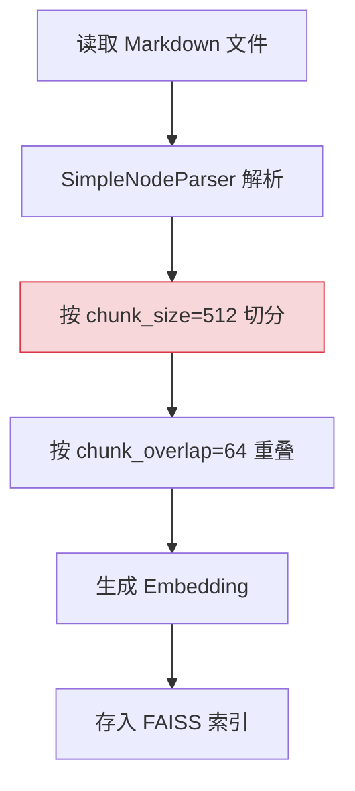
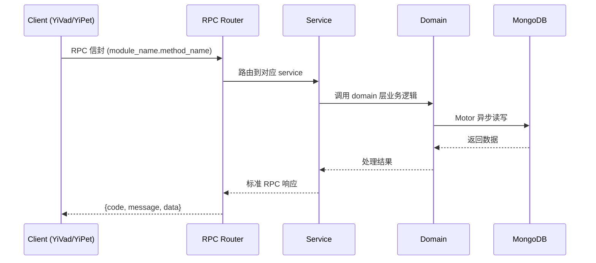

---

doc_type: module
prd_task_id: "YA-09-139"
title: "YA-09-139: 语义分块优化 — 按语义分段替代固定大小 — 开发方案"
status: 需求已编写
priority: P2
owner: 陈铭
roles: [engineer]
created: 2026-09-11
updated: 2026-09-14
project: YiAi
project_id: yiai
prd_month: "202609"
estimate_frontend: 0.5
source_prd: "199-需求-语义分块优化.md"
source_okr: [yiai-001]

type: task
---

# YA-09-139: 语义分块优化 — 按语义分段替代固定大小 — 开发方案

> **文档职责**: 本文档定义**怎么做、为什么这么做、实际做成什么样**（HOW），不含产品目标与测试用例。

> 来源 PRD: [199-需求-语义分块优化.md](../../prds/2026-09/199-需求-语义分块优化.md)
> 需求编号: YA-09-139 · 优先级: P2 · 人天: 0.5d

---

<a id="sec-1"></a>
## 一、架构概览



<a id="sec-2"></a>
## 二、文件清单

| 文件 | 操作 | 说明 |
|------|------|------|
| `domain/XXX/models.py` | 新增 | 数据模型定义 |
| `domain/XXX/service.py` | 新增 | 核心服务逻辑 |
| `services/XXX/rpc_handler.py` | 新增 | RPC 路由处理器 |
| `tests/test_XXX.py` | 新增 | 单元测试 |

<a id="sec-3"></a>
## 三、模块设计

### 1. 核心组件

```python
 改造前: SimpleNodeParser(chunk_size=512, chunk_overlap=64)
# 改造后: YiAi/services/rag/semantic_chunker.py

from dataclasses import dataclass, field
from typing import List, Optional
from enum import Enum

class ChunkLevel(Enum):
    DOCUMENT = "document"
    SECTION = "section"
    PARAGRAPH = "paragraph"

class ContentType(Enum):
    TEXT = "text"
    CODE = "code"
    TABLE = "table"
    LIST = "list"

@dataclass
class ChunkMetadata:
    source_file: str
    title: str
    section_headers: List[str]  # 从 H1 到当前层级的标题链
    content_type: ContentType
    chunk_level: ChunkLevel
# ... (完整实现见 PRD)
```


<a id="sec-4"></a>
## 四、数据流



**调用链路**: `Client → RPC Router → Service → Domain → MongoDB`  
**响应格式**: `{code: 0, message: "ok", data: ...}`  
**异步模型**: 全链路 `async/await`，Motor 异步 MongoDB 驱动。

<a id="sec-5"></a>
## 五、实施路线图

**预估人天**: 0.5d

| 步骤 | 操作 | 路径 | 验证 | 人天 |
|------|------|------|------|------|
| 1 | 实现 Markdown AST 解析 | `semantic_chunker.py` | 正确解析各级标题/代码块/表格/列表 | 0.05 |
| 2 | 实现三级层级构建 | `semantic_chunker.py` | 文档/章节/段落 chunk 生成正确 | 0.05 |
| 3 | 实现自适应分块策略 | `semantic_chunker.py` | 不同内容类型使用不同策略 | 0.05 |
| 4 | 实现质量评分器 | `quality_scorer.py` | 完整性/自包含性/长度评分正确 | 0.04 |
| 5 | 创建分块配置 | `chunking_rules.yaml` | 规则可配置生效 | 0.03 |
| 6 | 集成到 RAG 服务 | `rag_service.py` | 替换旧分块器，RAG 检索正常 | 0.04 |
| 7 | 单元测试 | `tests/unit/` | 测试覆盖所有内容类型 | 0.04 |

**总人天：0.3d**


<a id="sec-6"></a>
## 六、代码审查检查清单

- [ ] Markdown AST 正确解析标题/代码块/表格/列表
- [ ] 三级层级（文档/章节/段落）正确构建
- [ ] 代码块被整体保留为一个 chunk
- [ ] 表格 chunk 包含表头行
- [ ] 段落 chunk 不在句子中间截断
- [ ] Chunk 元数据包含完整标题层级路径
- [ ] 自适应规则从 YAML 配置文件加载
- [ ] 质量评分规则正确（完整性/自包含性/长度）
- [ ] 超大代码块按函数边界拆分
- [ ] 分块策略变更触发 reindex
- [ ] 向后兼容旧分块策略的索引数据


<a id="sec-7"></a>
## 七、风险评估

| 风险 | 概率 | 影响 | 缓解措施 |
|------|------|------|----------|
| Markdown AST 解析错误 | 中 | 中 | 降级为递归分块策略 |
| 超大代码块（>1500 tokens） | 中 | 中 | 按函数/类边界拆分（AST 解析） |
| 全量 reindex 耗时 | 高 | 中 | 增量迁移：先索引新策略 chunk，再逐步删除旧的 |
| 质量评分误判 | 低 | 低 | 评分仅用于日志和优化建议，不影响索引流程 |
| chunk 数量爆炸（层级分块） | 中 | 高 | 设置总 chunk 数上限 / 文件 |


<a id="sec-8"></a>
## 八、回滚方案

| 场景 | 回滚操作 | 影响 |
|------|----------|------|
| 语义分块性能下降 | 回退到 SimpleNodeParser | 失去语义分块优势 |
| 索引文件数爆炸 | 回退为仅段落级分块（无层级） | 检索失去多粒度能力 |
| AST 解析异常率过高 | 降级为递归分块 + 警告日志 | 语义边界可能不精确 |

