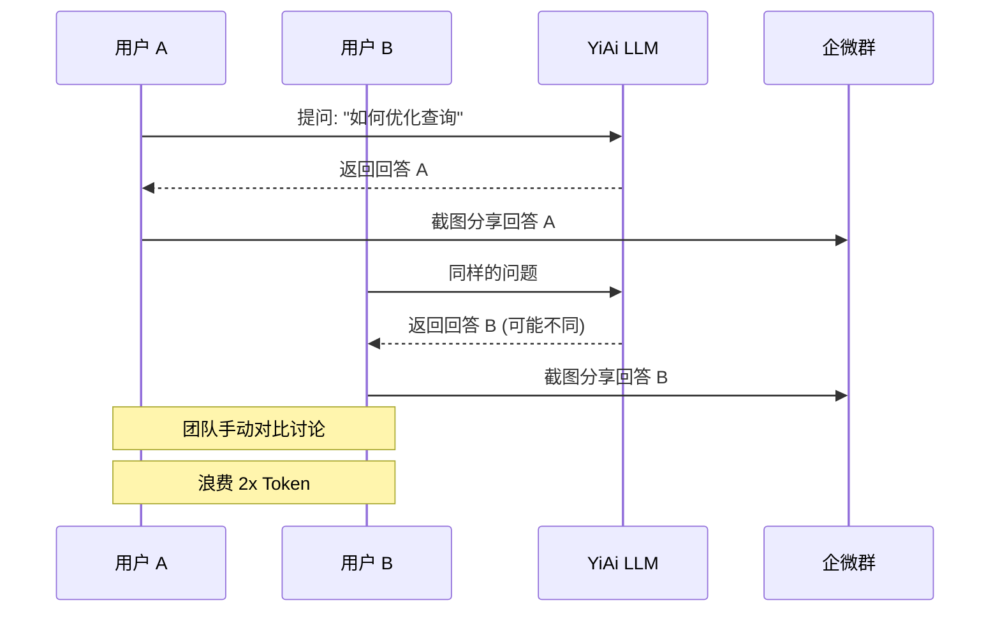
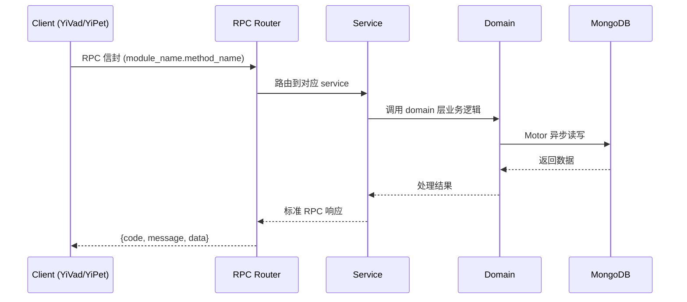

---

doc_type: module
prd_task_id: "YA-09-195"
title: "YA-09-195: 实时协作推理 — 共享 LLM 会话、轮流发言管理、共享上下文构建、响应投票、协作 Prompt 优化 — 开发任务"
status: 需求已编写
priority: P2
owner: 陈铭
roles: [engineer]
created: 2026-09-11
updated: 2026-09-11
project: YiAi
project_id: yiai
prd_month: "202609"
estimate_frontend: 0.3
source_prd: "200-需求-实时协作推理-变体A.md"
source_okr: [yiai-002]

type: task
---

# YA-09-195: 实时协作推理 — 共享 LLM 会话、轮流发言管理、共享上下文构建、响应投票、协作 Prompt 优化 — 开发任务

> **文档职责**: 本文档定义**怎么做、为什么这么做、实际做成什么样**（HOW），不含产品目标与测试用例。

> 来源 PRD: [200-需求-实时协作推理-变体A.md](../../prds/2026-09/200-需求-实时协作推理-变体A.md)
> 需求编号: YA-09-195 · 优先级: P2 · 人天: 0.3d

---

<a id="sec-1"></a>
## 一、架构概览



<a id="sec-2"></a>
## 二、文件清单

| 文件 | 操作 | 说明 |
|------|------|------|
| `domain/XXX/models.py` | 新增 | 数据模型定义 |
| `domain/XXX/service.py` | 新增 | 核心服务逻辑 |
| `services/XXX/rpc_handler.py` | 新增 | RPC 路由处理器 |
| `tests/test_XXX.py` | 新增 | 单元测试 |

<a id="sec-3"></a>
## 三、模块设计

### 1. 核心组件

```python
 改造前: 会话仅单用户绑定
# 改造后: YiAi/services/ai/collab_session_service.py

from dataclasses import dataclass, field
from typing import Dict, List, Optional, Set
from enum import Enum
import asyncio
import uuid

class Visibility(Enum):
    SHARED = "shared"       # 所有参与者可见
    PRIVATE = "private"     # 仅作者可见

class VoteValue(Enum):
    UP = "up"
    DOWN = "down"
    NEUTRAL = "neutral"

@dataclass
class Participant:
    user_id: str
    display_name: str
    joined_at: str
    is_host: bool = False
    is_typing: bool = False
# ... (完整实现见 PRD)
```


<a id="sec-4"></a>
## 四、数据流



**调用链路**: `Client → RPC Router → Service → Domain → MongoDB`  
**响应格式**: `{code: 0, message: "ok", data: ...}`  
**异步模型**: 全链路 `async/await`，Motor 异步 MongoDB 驱动。

<a id="sec-5"></a>
## 五、实施路线图

**预估人天**: 0.3d

| 步骤 | 操作 | 路径 | 验证 | 人天 |
|------|------|------|------|------|
| 1 | 实现共享会话数据模型 | `collab_session_service.py` | 会话创建/加入/离开 | 0.05 |
| 2 | 实现 SSE 多播引擎 | `sse_multicast.py` | 多客户端同时收到流 | 0.05 |
| 3 | 实现投票服务 | `vote_service.py` | 投票计数和广播 | 0.03 |
| 4 | 实现私有分支管理 | `private_branch_service.py` | 创建分支/合并分支 | 0.05 |
| 5 | 创建协作路由 | `routers/collab.py` | API 端点正常工作 | 0.04 |
| 6 | 集成到现有 SSE 基础设施 | 扩展现有 SSE | 流式回答多播 | 0.04 |
| 7 | 单元测试 | `tests/unit/` | 完整协作流程测试 | 0.04 |

**总人天：0.3d**


<a id="sec-6"></a>
## 六、代码审查检查清单

- [ ] 共享会话创建/加入/离开流程正确
- [ ] SSE 多播：所有订户同时收到流式回答
- [ ] 发言锁定：Host 可控制发言权
- [ ] 投票：实时计数广播
- [ ] 私有分支：仅创建者可见
- [ ] 分支合并：合并到主会话并通知所有人
- [ ] 参与者退出时 SSE 连接正确清理
- [ ] 上下文窗口溢出时自动压缩
- [ ] 会话关闭时所有 SSE 连接断开
- [ ] 权限校验：仅 Host 可踢人/锁定/关闭
- [ ] 参与者加入时同步当前消息历史


<a id="sec-7"></a>
## 七、风险评估

| 风险 | 概率 | 影响 | 缓解措施 |
|------|------|------|----------|
| SSE 流冲突（多人同时发消息） | 中 | 中 | 消息队列 + 推理排队 |
| 上下文窗口溢出 | 中 | 高 | 上下文窗口监控 + 自动压缩历史 |
| 恶意参与者注入有害 Prompt | 低 | 高 | Host 可踢出参与者 + 消息审核 |
| SSE 连接泄漏 | 中 | 中 | 心跳检测 + 超时断开 |
| 私有分支数据隔离失败 | 低 | 高 | 分支查询时强制校验 owner |


<a id="sec-8"></a>
## 八、回滚方案

| 场景 | 回滚操作 | 影响 |
|------|----------|------|
| SSE 多播性能问题 | 降级为轮询模式（3s 间隔） | 实时性下降 |
| 共享会话导致 Token 超量 | 限制会话最大消息数 | 长会话需新建 |
| 私有分支隔离失败 | 禁用私有分支功能 | 失去个人探索空间 |

