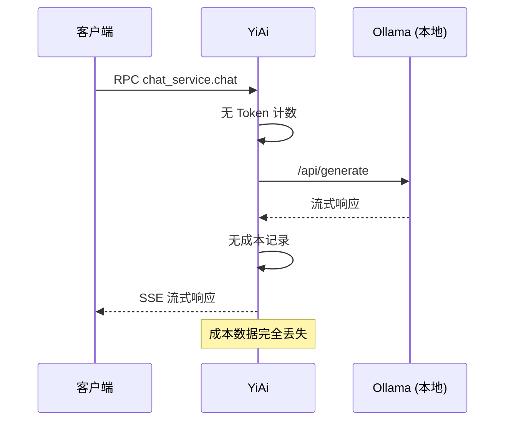
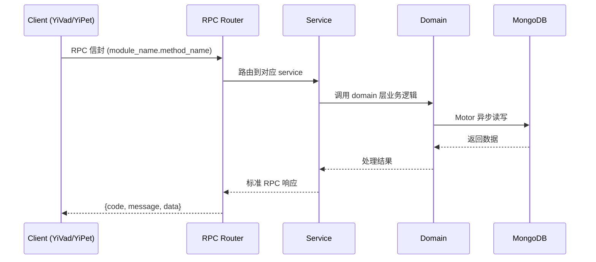

---

doc_type: module
prd_task_id: "YA-09-86"
title: "YA-09-86: AI 成本优化引擎 — Token 追踪 + 模型降本 + 预算告警 — 开发方案"
status: 需求已编写
priority: P2
owner: 陈铭
roles: [engineer]
created: 2026-09-11
updated: 2026-09-14
project: YiAi
project_id: yiai
prd_month: "202609"
estimate_frontend: 1.5
source_prd: "201-需求-成本优化引擎.md"
source_okr: [yiai-002]

type: task
---

# YA-09-86: AI 成本优化引擎 — Token 追踪 + 模型降本 + 预算告警 — 开发方案

> **文档职责**: 本文档定义**怎么做、为什么这么做、实际做成什么样**（HOW），不含产品目标与测试用例。

> 来源 PRD: [201-需求-成本优化引擎.md](../../prds/2026-09/201-需求-成本优化引擎.md)
> 需求编号: YA-09-86 · 优先级: P2 · 人天: 1.5d

---

<a id="sec-1"></a>
## 一、架构概览



<a id="sec-2"></a>
## 二、文件清单

| 文件 | 操作 | 说明 |
|------|------|------|
| `domain/XXX/models.py` | 新增 | 数据模型定义 |
| `domain/XXX/service.py` | 新增 | 核心服务逻辑 |
| `services/XXX/rpc_handler.py` | 新增 | RPC 路由处理器 |
| `tests/test_XXX.py` | 新增 | 单元测试 |

<a id="sec-3"></a>
## 三、模块设计

### 1. 核心组件

```python
 改造前：无成本追踪
# 改造后：YiAi/services/cost/cost_engine.py

from dataclasses import dataclass, field
from typing import Dict, List, Optional
from enum import Enum
import hashlib
import time

class ModelTier(Enum):
    LIGHT = "light"     # 轻量模型 (e.g., qwen2:0.5b)
    MEDIUM = "medium"   # 中等模型 (e.g., qwen2:7b)
    HEAVY = "heavy"     # 大模型 (e.g., qwen2:72b)

@dataclass
class ModelPricing:
    model_name: str
    provider: str  # ollama / openai / anthropic / deepseek
    input_price_per_1k: float  # 每 1K input tokens 价格 (美元)
    output_price_per_1k: float
    tier: ModelTier

@dataclass
class TokenUsage:
    input_tokens: int
# ... (完整实现见 PRD)
```


<a id="sec-4"></a>
## 四、数据流



**调用链路**: `Client → RPC Router → Service → Domain → MongoDB`  
**响应格式**: `{code: 0, message: "ok", data: ...}`  
**异步模型**: 全链路 `async/await`，Motor 异步 MongoDB 驱动。

<a id="sec-5"></a>
## 五、实施路线图

**预估人天**: 1.5d

| 步骤 | 操作 | 路径 | 验证 | 人天 |
|------|------|------|------|------|
| 1 | 实现 Token 计数器 | `token_counter.py` | Token 估算合理 | 0.03 |
| 2 | 实现成本计算器 | `cost_engine.py` | 不同模型成本计算正确 | 0.04 |
| 3 | 实现分层缓存 | `cache_manager.py` | L1/L2/L3 缓存工作正常 | 0.05 |
| 4 | 实现模型路由器 | `model_router.py` | 按任务类型路由正确 | 0.04 |
| 5 | 实现预算管理器 | `budget_manager.py` | 多级告警正确触发 | 0.05 |
| 6 | 实现成本预测器 | `cost_predictor.py` | 预测趋势合理 | 0.04 |
| 7 | 集成到 LLM 调用链 | `chat_service.py` | 每次请求产生成本记录 | 0.03 |
| 8 | 单元测试 | `tests/unit/` | 覆盖核心路径 | 0.02 |

**总人天：0.3d**


<a id="sec-6"></a>
## 六、代码审查检查清单

- [ ] Token 计数器在每次请求前后执行
- [ ] 成本计算区分不同模型和提供商的定价
- [ ] L1 缓存基于精确 Prompt hash
- [ ] L2 缓存仅在 temperature=0 时启用
- [ ] 预算检查在 LLM 调用前执行
- [ ] 多级预算告警（80/90/100/120%）
- [ ] 成本日志写入 cost_logs 集合
- [ ] 90 天 TTL 索引自动清理旧日志
- [ ] 模型路由规则可配置
- [ ] 成本预测基于历史数据
- [ ] Ollama 本地模型 Token 估算合理


<a id="sec-7"></a>
## 七、风险评估

| 风险 | 概率 | 影响 | 缓解措施 |
|------|------|------|----------|
| Token 计数不准确 | 中 | 中 | 使用 tiktoken 精确计数（接入外部 API 后） |
| 缓存语义误匹配 | 低 | 中 | temperature=0 才启用语义缓存 |
| 模型路由错误 | 中 | 中 | 提供手动覆盖选项 |
| 预算计算延迟 | 低 | 中 | 使用滑动窗口实时计算 |
| 成本日志膨胀 | 中 | 中 | 设置 TTL 自动清理 90 天前的日志 |


<a id="sec-8"></a>
## 八、回滚方案

| 场景 | 回滚操作 | 影响 |
|------|----------|------|
| 缓存导致错误回答 | 禁用 L2 语义缓存，仅保留 L1 精确缓存 | 缓存命中率下降 |
| 模型路由错误率高 | 回退到默认模型（手动指定） | 无法自动优化模型选择 |
| 预算检查影响性能 | 预算检查异步化，不阻塞请求 | 预算数据有秒级延迟 |

