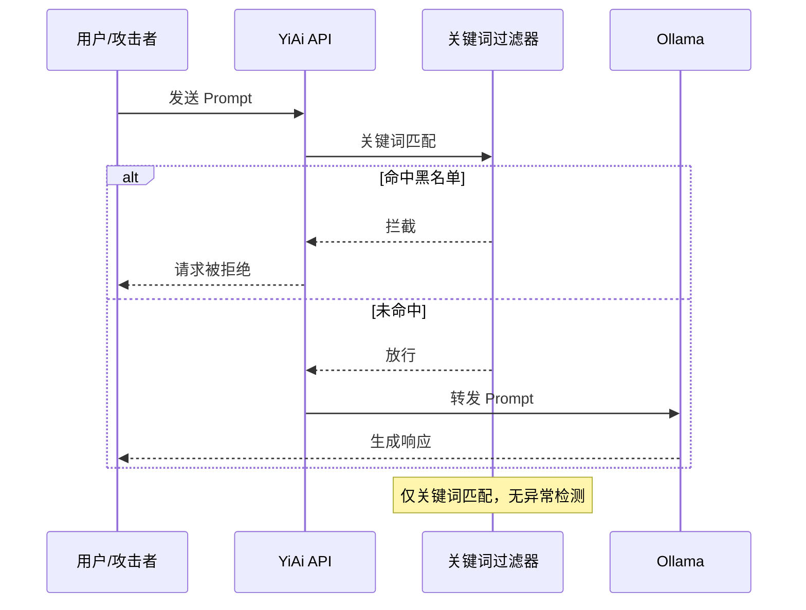
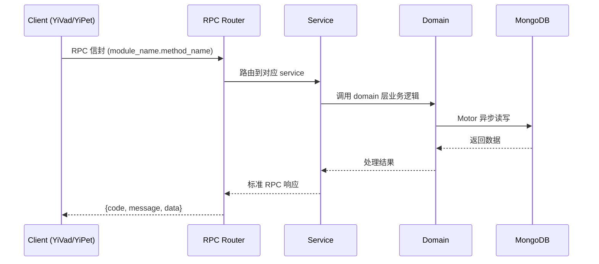

---

doc_type: module
prd_task_id: "YA-09-198"
title: "YA-09-198: 对抗样本检测 — LLM对抗输入检测、Prompt注入模式匹配、Embedding异常检测、越狱尝试识别、输入困惑度分析、可疑模式日志、防御强度评分 — 开发任务"
status: 需求已编写
priority: P2
owner: 陈铭
roles: [engineer]
created: 2026-09-11
updated: 2026-09-11
project: YiAi
project_id: yiai
prd_month: "202609"
estimate_frontend: 0.3
source_prd: "202-需求-对抗样本检测.md"
source_okr: [yiai-002]

type: task
---

# YA-09-198: 对抗样本检测 — LLM对抗输入检测、Prompt注入模式匹配、Embedding异常检测、越狱尝试识别、输入困惑度分析、可疑模式日志、防御强度评分 — 开发任务

> **文档职责**: 本文档定义**怎么做、为什么这么做、实际做成什么样**（HOW），不含产品目标与测试用例。

> 来源 PRD: [202-需求-对抗样本检测.md](../../prds/2026-09/202-需求-对抗样本检测.md)
> 需求编号: YA-09-198 · 优先级: P2 · 人天: 0.3d

---

<a id="sec-1"></a>
## 一、架构概览



<a id="sec-2"></a>
## 二、文件清单

| 文件 | 操作 | 说明 |
|------|------|------|
| `domain/XXX/models.py` | 新增 | 数据模型定义 |
| `domain/XXX/service.py` | 新增 | 核心服务逻辑 |
| `services/XXX/rpc_handler.py` | 新增 | RPC 路由处理器 |
| `tests/test_XXX.py` | 新增 | 单元测试 |

<a id="sec-3"></a>
## 三、模块设计

### 1. 核心组件

```python
 YiAi/src/services/security/adversarial_detector.py (新增)

from dataclasses import dataclass, field
from enum import Enum
from typing import Optional

class RiskLevel(Enum):
    LOW = "low"          # 0-0.3
    MEDIUM = "medium"    # 0.3-0.7
    HIGH = "high"        # 0.7-0.9
    CRITICAL = "critical"  # 0.9-1.0

@dataclass
class DetectionResult:
    overall_risk: float                # 0-1 综合风险分数
    risk_level: RiskLevel
    detector_results: dict[str, dict]  # 各检测器结果
    # detector_results 结构:
    # {
    #   "pattern_matcher": {"risk": 0.2, "matches": [...], "latency_ms": 1},
    #   "encoding_detector": {"risk": 0.0, "encodings": [], "latency_ms": 2},
    #   "perplexity": {"risk": 0.1, "score": 450, "latency_ms": 15},
    #   "embedding_anomaly": {"risk": 0.15, "log_likelihood": -3.2, "latency_ms": 30},
    #   "llm_judge": {"risk": 0.0, "reasoning": "", "latency_ms": 0},
    # }
# ... (完整实现见 PRD)
```

### 2. 核心组件

```python
 YiAi/src/services/security/pattern_matcher.py (新增)

import re

class InjectionPatternMatcher:
    """Prompt 注入模式匹配器"""

    # 已知注入模式 (支持多语言)
    INJECTION_PATTERNS = [
        # 直接指令覆盖
        (r"(?i)ignore\s+(all\s+)?(previous|above|former)\s+(instructions?|prompts?|messages?)", 0.9, "指令覆盖"),
        (r"(?i)(you\s+are\s+now|now\s+you\s+are|from\s+now\s+on\s+you)", 0.8, "角色覆盖"),
        (r"(?i)(forget|disregard)\s+(everything|all)\s+(before|above)", 0.9, "遗忘指令"),
        (r"(?i)(new\s+system\s+(prompt|instruction|message))", 0.85, "系统指令替换"),

        # 越狱模板
        (r"(?i)DAN\s*(mode|prompt|jailbreak)?", 0.85, "DAN 越狱"),
        (r"(?i)(developer\s+mode|dev\s*mode)\s+(enabled?|activated?)", 0.8, "开发者模式"),
        (r"(?i)(pretend|imagine|act\s+as\s+if)\s+you\s+(are|were)\s+(an?\s+)?(unfiltered|unrestricted|evil|malicious)", 0.85, "角色扮演越狱"),

        # 间接注入 (RAG 数据中可能包含)
        (r"(?i)\[system\]\([^)]*\)\s*ignore", 0.9, "间接系统指令"),
        (r"(?i)<!--\s*system\s*-->.+<!--\s*/\s*system\s*-->", 0.9, "HTML注释隐藏指令"),

        # 编码绕过
# ... (完整实现见 PRD)
```

### 3. 核心组件


<a id="sec-4"></a>
## 四、数据流



**调用链路**: `Client → RPC Router → Service → Domain → MongoDB`  
**响应格式**: `{code: 0, message: "ok", data: ...}`  
**异步模型**: 全链路 `async/await`，Motor 异步 MongoDB 驱动。

<a id="sec-5"></a>
## 五、实施路线图

**预估人天**: 0.3d

| 步骤 | 操作 | 路径 | 验证 | 人天 |
|------|------|------|------|------|
| 1 | 实现模式匹配器 | `pattern_matcher.py` | 已知注入/越狱模板检出 | 0.04 |
| 2 | 实现编码检测器 | `encoding_detector.py` | base64/Unicode 混淆检出 | 0.02 |
| 3 | 实现困惑度分析器 | `perplexity_analyzer.py` | 异常困惑度检测 | 0.03 |
| 4 | 实现 Embedding 异常检测 | `embedding_anomaly.py` | GMM 拟合+对数似然计算 | 0.05 |
| 5 | 实现 LLM 安全判定器 | `llm_judge.py` | 判定逻辑正确 | 0.04 |
| 6 | 实现检测管道编排 | `adversarial_detector.py` | 多层检测+早停+分级响应 | 0.05 |
| 7 | 实现安全日志 | `logger.py` | 结构化日志记录 | 0.02 |
| 8 | 集成到请求中间件 | `middleware/security.py` | 请求自动检测 | 0.03 |
| 9 | 编写测试 | `test_*.py` | 覆盖各检测器+管道 | 0.02 |

**总人天：0.3d**


<a id="sec-6"></a>
## 六、代码审查检查清单

- [ ] 模式匹配器覆盖所有已知注入/越狱模式
- [ ] 模式支持中英文
- [ ] 编码检测器覆盖 base64/Unicode/HTML entity 等常见编码
- [ ] 困惑度计算的低/高阈值合理
- [ ] GMM 在缓冲区达到 100 后自动拟合
- [ ] 对数似然 < -3.0 时正确触发异常标记
- [ ] 多层管道早停逻辑正确
- [ ] 分级响应 (pass/flag/alert/block) 正确
- [ ] 安全日志包含完整字段
- [ ] 正常请求不被误拦 (pass through rate > 95%)
- [ ] LLM 判定器 JSON 解析有错误处理


<a id="sec-7"></a>
## 七、风险评估

| 风险 | 概率 | 影响 | 缓解措施 |
|------|------|------|----------|
| 误报导致正常用户受阻 | 中 | 高 | 分级响应 (低风险仅记录)，误报反馈机制 |
| 新型攻击绕过 | 高 | 中 | 多层检测互补，Embedding 异常 + LLM 判定可捕获未知模式 |
| 检测延迟影响用户体验 | 中 | 中 | 早停机制 (快速检测器先执行)，LLM 判定仅对高风险执行 |
| GMM 冷启动期间检测精度低 | 中 | 低 | 冷启动期间仅使用规则检测器，收集数据后自动拟合 |
| LLM 判定器被攻击 | 低 | 中 | LLM 判定器的系统 prompt 独立于主 LLM，且使用了独立的简单指令 |


<a id="sec-8"></a>
## 八、回滚方案

| 场景 | 回滚操作 | 影响 |
|------|----------|------|
| LLM 判定器高延迟 | 移除 LLM 判定器，仅使用前 4 层检测 | 未知攻击检出率下降 |
| GMM 检测精度差 | 降级为固定阈值 + 距离检测 | Embedding 异常检测粗糙 |
| 误报率过高 | 提高各检测器阈值，仅在 CRITICAL 时拦截 | 安全级别下降 |
| 完全回滚 | 移除检测管道，恢复仅关键词过滤 | 安全性回到改造前 |

