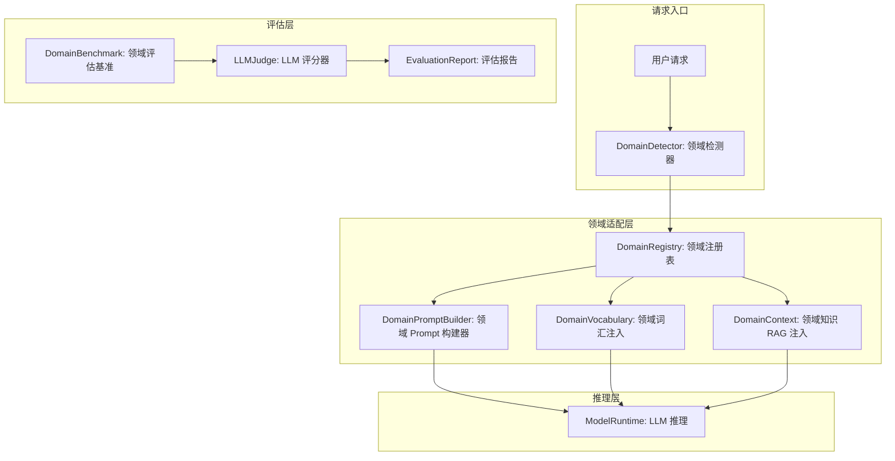
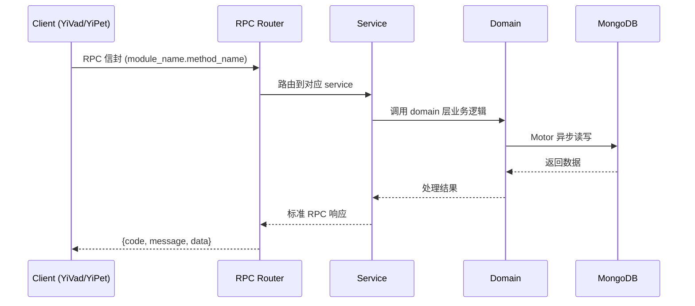

---

doc_type: module
prd_task_id: "YA-09-199"
title: "YA-09-199: 领域自适应微调 — 特定领域知识适配、领域词汇增强、领域Prompt模板、领域评估基准、领域模型注册表、推理时领域切换 — 开发任务"
status: 需求已编写
priority: P2
owner: 陈铭
roles: [engineer]
created: 2026-09-11
updated: 2026-09-11
project: YiAi
project_id: yiai
prd_month: "202609"
estimate_frontend: 0.3
source_prd: "203-需求-领域自适应微调.md"
source_okr: [yiai-002]

type: task
---

# YA-09-199: 领域自适应微调 — 特定领域知识适配、领域词汇增强、领域Prompt模板、领域评估基准、领域模型注册表、推理时领域切换 — 开发任务

> **文档职责**: 本文档定义**怎么做、为什么这么做、实际做成什么样**（HOW），不含产品目标与测试用例。

> 来源 PRD: [203-需求-领域自适应微调.md](../../prds/2026-09/203-需求-领域自适应微调.md)
> 需求编号: YA-09-199 · 优先级: P2 · 人天: 0.3d

---

<a id="sec-1"></a>
## 一、架构概览



<a id="sec-2"></a>
## 二、文件清单

| 文件 | 操作 | 说明 |
|------|------|------|
| `domain/XXX/models.py` | 新增 | 数据模型定义 |
| `domain/XXX/service.py` | 新增 | 核心服务逻辑 |
| `services/XXX/rpc_handler.py` | 新增 | RPC 路由处理器 |
| `tests/test_XXX.py` | 新增 | 单元测试 |

<a id="sec-3"></a>
## 三、模块设计

### 1. 核心组件

```python
 YiAi/src/domain/adaptation/models.py (新增)

from dataclasses import dataclass, field
from enum import Enum
from typing import Optional

class DomainCategory(str, Enum):
    TECHNICAL = "technical"
    TOOL = "tool"
    GENERAL = "general"

@dataclass
class DomainDefinition:
    id: str                              # "code_review"
    name: str                            # "代码审查"
    category: DomainCategory
    description: str                     # 领域描述
    parent_id: Optional[str] = None      # 父领域 ID

    # System Prompt 配置
    role_description: str = ""           # 角色描述 ("你是代码审查专家...")
    output_format: str = ""              # 输出格式要求 ("请以要点列表形式...")
    tone: str = "professional"           # 语气: professional/casual/academic

    # 领域词汇
# ... (完整实现见 PRD)
```

### 2. 核心组件

```python
 YiAi/src/services/domain/domain_registry.py (新增)

class DomainRegistry:
    """领域注册表 —— 管理所有领域定义"""

    def __init__(self, db):
        self.db = db
        self._cache: dict[str, DomainDefinition] = {}
        self._cache_ttl = 300  # 5 分钟缓存
        self._last_refresh = 0

    async def register(self, domain: DomainDefinition) -> str:
        """注册新领域"""
        result = await self.db.domains.insert_one(
            asdict(domain)
        )
        self._invalidate_cache()
        return str(result.inserted_id)

    async def get_domain(self, domain_id: str) -> Optional[DomainDefinition]:
        """获取领域定义 (带缓存)"""
        await self._refresh_cache_if_needed()

        if domain_id in self._cache:
            return self._cache[domain_id]
# ... (完整实现见 PRD)
```

### 3. 核心组件


<a id="sec-4"></a>
## 四、数据流



**调用链路**: `Client → RPC Router → Service → Domain → MongoDB`  
**响应格式**: `{code: 0, message: "ok", data: ...}`  
**异步模型**: 全链路 `async/await`，Motor 异步 MongoDB 驱动。

<a id="sec-5"></a>
## 五、实施路线图

**预估人天**: 0.3d

| 步骤 | 操作 | 路径 | 验证 | 人天 |
|------|------|------|------|------|
| 1 | 定义领域数据模型 | `models.py` | 模型完整性 | 0.02 |
| 2 | 实现领域注册表 | `domain_registry.py` | CRUD + 缓存 | 0.04 |
| 3 | 实现领域词汇服务 | `vocabulary_service.py` | 词汇 CRUD + 格式化 | 0.03 |
| 4 | 实现领域 Prompt 构建器 | `domain_prompt_builder.py` | System Prompt + 词汇 + RAG | 0.05 |
| 5 | 实现领域检测器 | `domain_detector.py` | 关键字 + 上下文推断 | 0.04 |
| 6 | 实现领域评估基准 | `benchmark.py` | LLM-as-Judge 评分 | 0.05 |
| 7 | 注册 API 端点 + 中间件 | `domain_routes.py` + `middleware` | 领域 CRUD + 自动检测 | 0.04 |
| 8 | 构建初始领域定义 (5 个) | 数据库 | 领域 Prompt 可用 | 0.02 |
| 9 | 编写测试 | `test_*.py` | 覆盖检测/构建/评估 | 0.01 |

**总人天：0.3d**


<a id="sec-6"></a>
## 六、代码审查检查清单

- [ ] 领域注册表 CRUD 操作正确
- [ ] Prompt 构建器正确包含: 角色描述 + 输出格式 + 词汇表
- [ ] 词汇表格式化后不超过 2000 字符
- [ ] 领域检测优先级: 用户指定 > 页面上下文 > 对话历史 > 关键字
- [ ] 关键字匹配阈值为 >= 2 个匹配
- [ ] 领域切换时 System Prompt 实时更新
- [ ] Benchmark 评估所有 5 个维度
- [ ] LLM-as-Judge JSON 解析有错误处理
- [ ] 领域缓存 TTL 5 分钟，更新后立即失效
- [ ] YiKnowledge 同步任务正确提取词汇


<a id="sec-7"></a>
## 七、风险评估

| 风险 | 概率 | 影响 | 缓解措施 |
|------|------|------|----------|
| 领域词汇过多导致 Prompt 过长 | 中 | 中 | 限制词汇表最多 50 个词，按使用频率排序 |
| 领域检测误判 | 中 | 中 | 用户可手动切换，前端预设领域作为兜底 |
| RAG 注入增加延迟 | 中 | 中 | RAG 检索异步进行，超时 1s 则跳过 |
| 领域定义不维护 | 中 | 低 | YiKnowledge 自动同步，管理员 UI 手动管理 |
| 评估基准偏差 | 中 | 低 | LLM-as-Judge 的结果定期与人工评测比对校准 |


<a id="sec-8"></a>
## 八、回滚方案

| 场景 | 回滚操作 | 影响 |
|------|----------|------|
| 领域 Prompt 构建异常 | 回退到通用 System Prompt | 无领域自适应效果 |
| 领域词汇服务不可用 | 跳过词汇注入，仅用基础 Prompt | 术语理解下降 |
| 领域检测完全误判 | 关闭自动检测，仅保留用户指定 | 用户需手动切换 |
| 完全回滚 | 移除领域模块 | 回到通用模型模式 |

