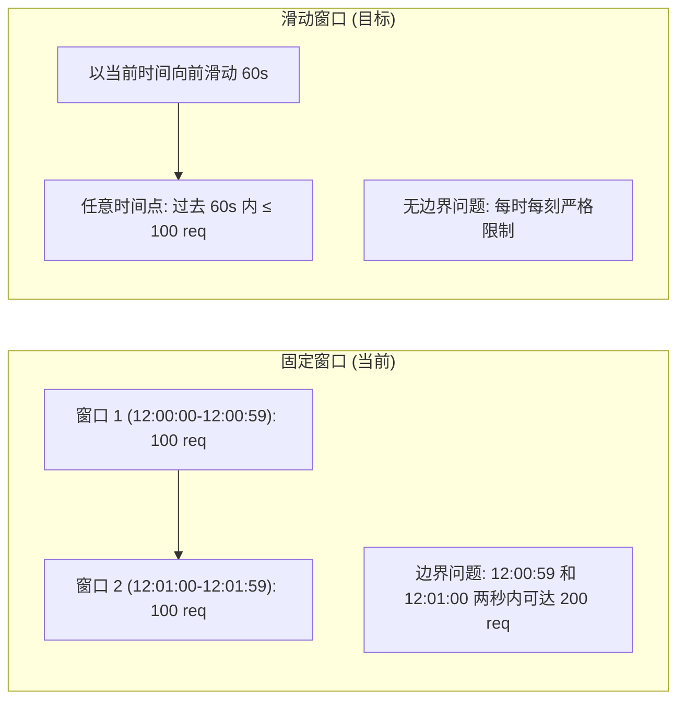
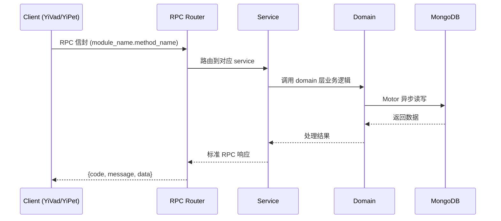

---

doc_type: module
prd_task_id: "YA-09-70"
title: "YA-09-70: 高级限流 — per-user/per-endpoint + 响应头 + 分析面板 — 开发方案"
status: 需求已编写
priority: P2
owner: 陈铭
roles: [engineer]
created: 2026-09-11
updated: 2026-09-14
project: YiAi
project_id: yiai
prd_month: "202609"
estimate_frontend: 1.0
source_prd: "204-需求-API速率限制策略.md"
source_okr: [yiai-002]

type: task
---

# YA-09-70: 高级限流 — per-user/per-endpoint + 响应头 + 分析面板 — 开发方案

> **文档职责**: 本文档定义**怎么做、为什么这么做、实际做成什么样**（HOW），不含产品目标与测试用例。

> 来源 PRD: [204-需求-API速率限制策略.md](../../prds/2026-09/204-需求-API速率限制策略.md)
> 需求编号: YA-09-70 · 优先级: P2 · 人天: 1.0d

---

<a id="sec-1"></a>
## 一、架构概览



<a id="sec-2"></a>
## 二、文件清单

| 文件 | 操作 | 说明 |
|------|------|------|
| `domain/XXX/models.py` | 新增 | 数据模型定义 |
| `domain/XXX/service.py` | 新增 | 核心服务逻辑 |
| `services/XXX/rpc_handler.py` | 新增 | RPC 路由处理器 |
| `tests/test_XXX.py` | 新增 | 单元测试 |

<a id="sec-3"></a>
## 三、模块设计

### 1. 核心组件

```python
 YiAi/src/domain/ratelimit/config.py (新增)

from dataclasses import dataclass, field
from enum import Enum
from typing import Optional

class RateLimitDimension(str, Enum):
    GLOBAL = "global"
    USER = "user"
    ENDPOINT = "endpoint"
    IP = "ip"

@dataclass
class RateLimitRule:
    dimension: RateLimitDimension     # 限流维度
    key_pattern: str                  # Key 模式
    # "global:/" / "user:{token}" / "endpoint:{path}" / "ip:{ip}"
    window_seconds: int               # 时间窗口 (秒)
    max_requests: int                 # 窗口内最大请求数
    burst_multiplier: float = 1.0    # 突发倍数
    # 例: max_requests=60, burst_multiplier=1.5 → 1s 内最多 90
    enabled: bool = True
    priority: int = 100              # 优先级 (数字越小越优先检查)
    description: str = ""

# ... (完整实现见 PRD)
```

### 2. 核心组件

```python
 YiAi/src/services/ratelimit/sliding_window.py (新增)

import time
import redis.asyncio as redis

# Lua 脚本: 原子化滑动窗口计数
SLIDING_WINDOW_LUA = """
local key = KEYS[1]
local window = tonumber(ARGV[1])        -- 窗口大小 (秒)
local max_requests = tonumber(ARGV[2])  -- 最大请求数
local burst_multiplier = tonumber(ARGV[3])  -- 突发倍数
local now = tonumber(ARGV[4])           -- 当前时间戳 (毫秒)

-- 移除窗口外的旧记录
redis.call('ZREMRANGEBYSCORE', key, 0, now - window * 1000)

-- 统计窗口内的请求数
local current_count = redis.call('ZCARD', key)

-- 检查突发容许 (最近 1 秒)
local recent_1s = redis.call('ZCOUNT', key, now - 1000, now)
local burst_limit = math.floor(max_requests * burst_multiplier / 
    math.max(1, window))

if recent_1s >= burst_limit and burst_multiplier > 1.0 then
# ... (完整实现见 PRD)
```

### 3. 核心组件


<a id="sec-4"></a>
## 四、数据流



**调用链路**: `Client → RPC Router → Service → Domain → MongoDB`  
**响应格式**: `{code: 0, message: "ok", data: ...}`  
**异步模型**: 全链路 `async/await`，Motor 异步 MongoDB 驱动。

<a id="sec-5"></a>
## 五、实施路线图

**预估人天**: 1.0d

| 步骤 | 操作 | 路径 | 验证 | 人天 |
|------|------|------|------|------|
| 1 | 定义限流数据模型和默认配置 | `config.py` | 4 维度规则正确 | 0.03 |
| 2 | 实现 Redis 滑动窗口限流器 | `sliding_window.py` | Lua 脚本原子性正确 | 0.06 |
| 3 | 实现多维度组合检查器 | `multi_dim_checker.py` | 最严格策略正确 | 0.04 |
| 4 | 实现限流日志记录 | `logger.py` | 日志写入 MongoDB | 0.03 |
| 5 | 升级限流中间件 | `middleware/rate_limit.py` | 429 + 头部返回正确 | 0.05 |
| 6 | 实现限流分析数据服务 | `analytics.py` | 统计/时间线/排名数据正确 | 0.04 |
| 7 | 新增限流分析 API | `ratelimit_routes.py` | API 返回分析数据 | 0.03 |
| 8 | 集成测试 | 全流程 | 多维度限流 + 降级 + 分析 | 0.02 |

**总人天：0.3d**


<a id="sec-6"></a>
## 六、代码审查检查清单

- [ ] Redis Lua 脚本 ZADD + ZREMRANGEBYSCORE + ZCARD 原子操作
- [ ] 突发容许仅检查最近 1 秒，不影响长窗口计数
- [ ] 滑动窗口 Key 带 TTL (2x 窗口) 自动清理
- [ ] 多维度检查按优先级排序
- [ ] 任一维度拦截时返回 429 + X-RateLimit-Dimension
- [ ] fail-open 降级策略: Redis 错误时放行
- [ ] X-RateLimit-* 系列头部完整返回
- [ ] Retry-After 计算正确 (reset - now)
- [ ] 限流日志异步写入 (不阻塞请求)
- [ ] 排除路径不经过限流 (/health, /metrics, /docs)
- [ ] 分析 API 返回正确的统计和时间线数据


<a id="sec-7"></a>
## 七、风险评估

| 风险 | 概率 | 影响 | 缓解措施 |
|------|------|------|----------|
| Redis 故障导致限流失效 | 低 | 高 | fail-open 降级，仅保留内存限流 |
| Redis Lua 脚本性能瓶颈 | 中 | 中 | 单个 Redis 操作 < 1ms，5 个维度/请求 = 5ms |
| 限流日志数据膨胀 | 中 | 中 | 定时清理 7 天前的日志，仅保留聚合统计 |
| 多维度超限时返回 429 但头部混乱 | 低 | 中 | 仅返回最严格的维度头部，减少混淆 |
| 突发容许配置不当 | 中 | 低 | 默认 burst_multiplier 保守 (1.1-1.5)，可动态调整 |


<a id="sec-8"></a>
## 八、回滚方案

| 场景 | 回滚操作 | 影响 |
|------|----------|------|
| Redis 滑动窗口异常 | 降级为固定窗口 (内存) | 边界问题回归 |
| 限流过于严格 (误拦过多) | 提高所有限额 50% 或关闭低优先级维度 | 限流保护减弱 |
| 中间件性能问题 | 关闭 multi-dimension，仅保留全局限流 | 失去多维度控制 |
| 完全回滚 | 移除 rate_limit 中间件，恢复旧版限流 | 回到单维度内存限流 |

