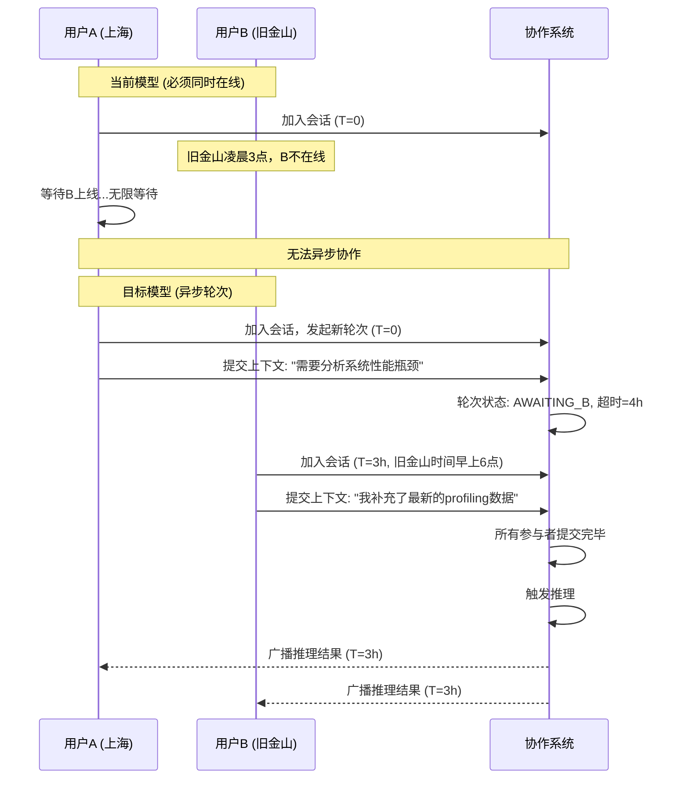
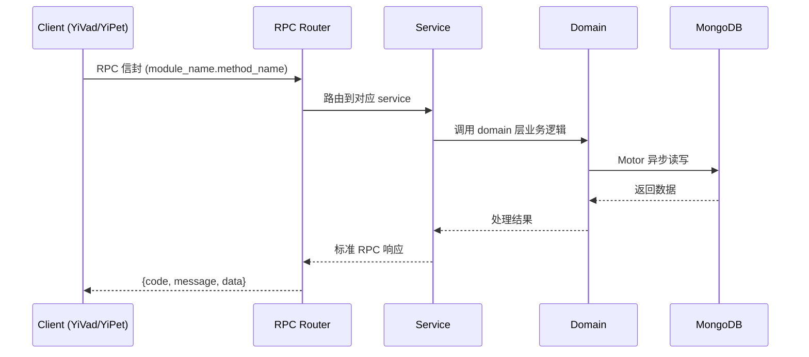

---

doc_type: module
prd_task_id: "YA-09-142"
title: "YA-09-142: 实时协作推理 — 多用户共享会话 + WebSocket 广播 — 开发方案"
status: 需求已编写
priority: P2
owner: 陈铭
roles: [engineer]
created: 2026-09-11
updated: 2026-09-14
project: YiAi
project_id: yiai
prd_month: "202609"
estimate_frontend: 0.5
source_prd: "205-需求-实时协作推理-变体B.md"
source_okr: [yiai-001]

type: task
---

# YA-09-142: 实时协作推理 — 多用户共享会话 + WebSocket 广播 — 开发方案

> **文档职责**: 本文档定义**怎么做、为什么这么做、实际做成什么样**（HOW），不含产品目标与测试用例。

> 来源 PRD: [205-需求-实时协作推理-变体B.md](../../prds/2026-09/205-需求-实时协作推理-变体B.md)
> 需求编号: YA-09-142 · 优先级: P2 · 人天: 0.5d

---

<a id="sec-1"></a>
## 一、架构概览



<a id="sec-2"></a>
## 二、文件清单

| 文件 | 操作 | 说明 |
|------|------|------|
| `domain/XXX/models.py` | 新增 | 数据模型定义 |
| `domain/XXX/service.py` | 新增 | 核心服务逻辑 |
| `services/XXX/rpc_handler.py` | 新增 | RPC 路由处理器 |
| `tests/test_XXX.py` | 新增 | 单元测试 |

<a id="sec-3"></a>
## 三、模块设计

### 1. 核心组件

```python
 YiAi/src/domain/collab/models.py (修改/新增)

from dataclasses import dataclass, field
from enum import Enum
from datetime import datetime
from typing import Optional

class RoundStatus(str, Enum):
    INIT = "init"              # 轮次已创建，待发布
    COLLECTING = "collecting"  # 收集中，等待参与者提交
    INFERRING = "inferring"    # 推理中
    COMPLETED = "completed"    # 已完成
    CANCELLED = "cancelled"    # 已取消
    TIMEOUT = "timeout"        # 已超时

class ParticipantStatus(str, Enum):
    PENDING = "pending"        # 等待提交
    SUBMITTED = "submitted"    # 已提交
    SKIPPED = "skipped"        # 超时跳过
    DECLINED = "declined"      # 主动拒绝

class SessionRole(str, Enum):
    OWNER = "owner"
    COLLABORATOR = "collaborator"
    VIEWER = "viewer"
# ... (完整实现见 PRD)
```

### 2. 核心组件

```python
 YiAi/src/services/collab/round_manager.py (新增)

import asyncio
from datetime import datetime, timedelta

class RoundManager:
    """协作轮次管理器"""

    def __init__(self, db, ws_manager, inference_service):
        self.db = db
        self.ws_manager = ws_manager
        self.inference = inference_service
        self._timeout_tasks: dict[str, asyncio.Task] = {}
        self._rounds: dict[str, CollabRound] = {}  # 内存缓存

    async def create_round(
        self,
        session_id: str,
        creator_token: str,
        title: str,
        participants: list[str],
        timeout_seconds: int = 3600,
        strict_mode: bool = False,
    ) -> CollabRound:
        """创建新的协作轮次"""
# ... (完整实现见 PRD)
```

### 3. 核心组件


<a id="sec-4"></a>
## 四、数据流



**调用链路**: `Client → RPC Router → Service → Domain → MongoDB`  
**响应格式**: `{code: 0, message: "ok", data: ...}`  
**异步模型**: 全链路 `async/await`，Motor 异步 MongoDB 驱动。

<a id="sec-5"></a>
## 五、实施路线图

**预估人天**: 0.5d

| 步骤 | 操作 | 路径 | 验证 | 人天 |
|------|------|------|------|------|
| 1 | 定义数据模型和状态机 | `models.py` | 5 种状态 + 4 种参与者状态 | 0.03 |
| 2 | 实现轮次管理器核心 | `round_manager.py` | 创建/提交/推理/超时流程正确 | 0.08 |
| 3 | 实现访问控制 | `access_control.py` | 3 角色权限检查正确 | 0.04 |
| 4 | 实现 MongoDB 持久化 | `persistence.py` | 轮次/会话 CRUD | 0.04 |
| 5 | 升级 WebSocket 消息路由 | `ws_handler.py` | 新增消息类型路由 | 0.04 |
| 6 | 新增 REST API | `collab_routes.py` | CRUD + 权限管理 API | 0.04 |
| 7 | 集成测试 | 全流程 | 异步协作端到端 | 0.03 |

**总人天：0.3d**


<a id="sec-6"></a>
## 六、代码审查检查清单

- [ ] 轮次状态机 5 种状态 + 合法转换验证
- [ ] 参与者状态 4 种 + 超时正确的 SKIPPED 标记
- [ ] 宽松模式 ready_to_infer() 至少 1 人提交
- [ ] 严格模式 ready_to_infer() 所有人提交
- [ ] asyncio.Task 超时正确取消（cancel + done 检查）
- [ ] WebSocket 广播使用 broadcast 而非逐个发送
- [ ] 权限检查在创建轮次/提交输入/管理成员前
- [ ] 角色层级 OWNER=3, COLLABORATOR=2, VIEWER=1
- [ ] MongoDB 文档使用原子操作避免竞态
- [ ] 上下文构建正确组合多人输入
- [ ] 宽限期重连恢复正确（30s timeout）


<a id="sec-7"></a>
## 七、风险评估

| 风险 | 概率 | 影响 | 缓解措施 |
|------|------|------|----------|
| 超时任务内存泄漏 | 中 | 中 | `_cancel_timeout` 及时取消已完成轮次的计时器 |
| WebSocket 广播风暴 | 中 | 中 | token 级流式输出合并（批量发送而非每 token 广播） |
| MongoDB 写入瓶颈 | 低 | 中 | 高频状态变更使用内存缓存，定时批量持久化 |
| 大上下文（多人长文本）超 Ollama 限制 | 中 | 高 | 输入长度限制（每人 4000 字符） + 上下文截断 |
| 并发创建轮次竞态 | 低 | 中 | 使用 MongoDB 原子操作（find_one_and_update）防止多轮次同时活跃 |


<a id="sec-8"></a>
## 八、回滚方案

| 场景 | 回滚操作 | 影响 |
|------|----------|------|
| 轮次状态机 Bug | 降级为无轮次模式（回退到 YA-09-195 的即时推理） | 异步协作功能不可用 |
| WebSocket 压力过大 | 限制同时活跃会话数为 10 | 新会话排队等待 |
| 持久化性能问题 | 关闭实时持久化，仅内存运行 | 服务重启丢失进行中轮次 |
| 完全回滚 | 关闭协作功能路由 | 协作推理不可用 |

