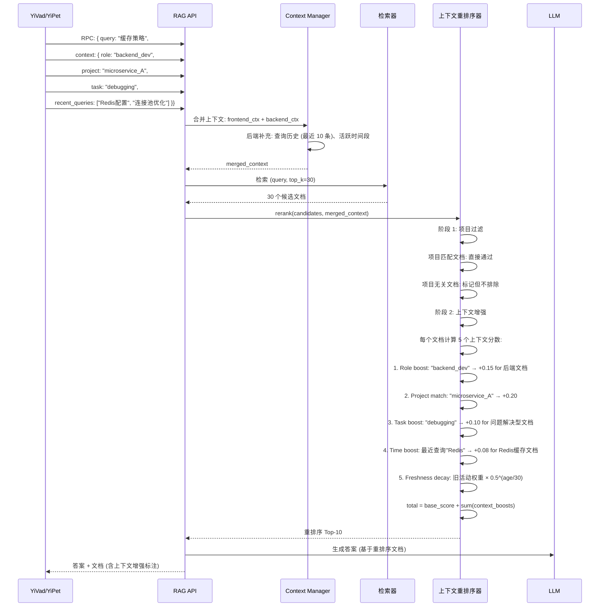
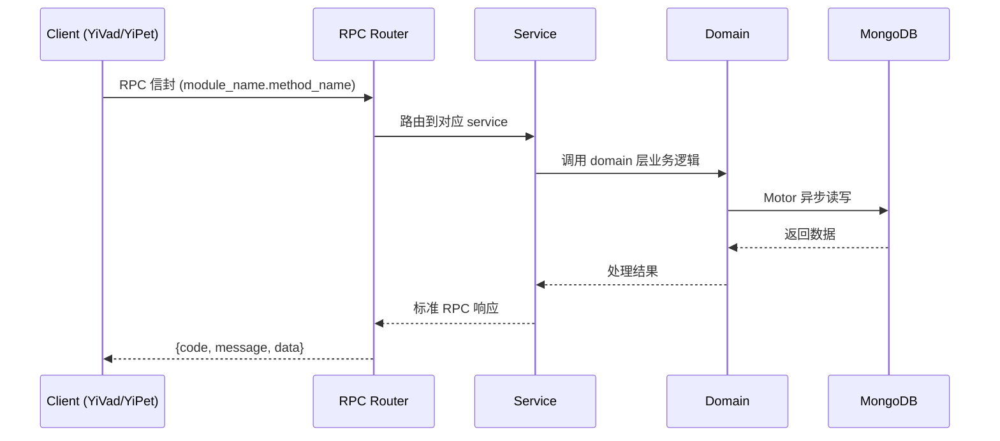

---

doc_type: module
prd_task_id: "YA-09-204"
title: "YA-09-204: 上下文感知重排序 — 上下文感知结果重排序、用户上下文注入(角色/项目/历史)、任务上下文(用户正在做什么)、时间上下文(近期活动)、上下文增强因子、上下文新鲜度衰减 — 开发任务"
status: 需求已编写
priority: P2
owner: 陈铭
roles: [engineer]
created: 2026-09-11
updated: 2026-09-11
project: YiAi
project_id: yiai
prd_month: "202609"
estimate_frontend: 0.3
source_prd: "207-需求-上下文感知重排序.md"
source_okr: [yiai-001]

type: task
---

# YA-09-204: 上下文感知重排序 — 上下文感知结果重排序、用户上下文注入(角色/项目/历史)、任务上下文(用户正在做什么)、时间上下文(近期活动)、上下文增强因子、上下文新鲜度衰减 — 开发任务

> **文档职责**: 本文档定义**怎么做、为什么这么做、实际做成什么样**（HOW），不含产品目标与测试用例。

> 来源 PRD: [207-需求-上下文感知重排序.md](../../prds/2026-09/207-需求-上下文感知重排序.md)
> 需求编号: YA-09-204 · 优先级: P2 · 人天: 0.3d

---

<a id="sec-1"></a>
## 一、架构概览



<a id="sec-2"></a>
## 二、文件清单

| 文件 | 操作 | 说明 |
|------|------|------|
| `domain/XXX/models.py` | 新增 | 数据模型定义 |
| `domain/XXX/service.py` | 新增 | 核心服务逻辑 |
| `services/XXX/rpc_handler.py` | 新增 | RPC 路由处理器 |
| `tests/test_XXX.py` | 新增 | 单元测试 |

<a id="sec-3"></a>
## 三、模块设计

### 1. 核心组件

```python
 YiAi/src/domain/rag/context.py (新增)

from dataclasses import dataclass, field
from enum import Enum
from datetime import datetime
from typing import Optional

class UserRole(str, Enum):
    FRONTEND_DEV = "frontend_dev"
    BACKEND_DEV = "backend_dev"
    FULLSTACK_DEV = "fullstack_dev"
    DBA = "dba"
    DEVOPS = "devops"
    PM = "pm"
    DESIGNER = "designer"
    QA = "qa"
    UNKNOWN = "unknown"

class TaskType(str, Enum):
    LEARNING = "learning"        # 学习/研究
    DEBUGGING = "debugging"      # 调试/解决问题
    DEVELOPING = "developing"    # 开发实现
    REVIEWING = "reviewing"      # 代码/文档审查
    PLANNING = "planning"        # 规划设计
    UNKNOWN = "unknown"
# ... (完整实现见 PRD)
```

### 2. 核心组件

```python
 YiAi/src/services/rag/context_reranker.py (新增)

import math
from datetime import datetime

class ContextReranker:
    """上下文感知重排序器"""

    # 默认权重
    DEFAULT_WEIGHTS = {
        "query": 0.10,    # 原始查询相关性权重
        "role": 0.25,     # 角色权重
        "project": 0.30,  # 项目权重
        "task": 0.20,     # 任务权重
        "time": 0.15,     # 时间权重
    }

    # 半衰期 (分钟)
    DEFAULT_HALF_LIFE_MINUTES = 30

    # 角色 → 文档领域映射
    ROLE_DOMAIN_BOOST = {
        UserRole.FRONTEND_DEV: ["frontend", "react", "vue", "css", "browser", "dom"],
        UserRole.BACKEND_DEV: ["backend", "api", "database", "server", "middleware"],
        UserRole.DBA: ["database", "sql", "nosql", "index", "replication", "backup"],
# ... (完整实现见 PRD)
```

### 3. 核心组件


<a id="sec-4"></a>
## 四、数据流



**调用链路**: `Client → RPC Router → Service → Domain → MongoDB`  
**响应格式**: `{code: 0, message: "ok", data: ...}`  
**异步模型**: 全链路 `async/await`，Motor 异步 MongoDB 驱动。

<a id="sec-5"></a>
## 五、实施路线图

**预估人天**: 0.3d

| 步骤 | 操作 | 路径 | 验证 | 人天 |
|------|------|------|------|------|
| 1 | 定义上下文数据模型 | `context.py` | 5 维度枚举 + QueryContext | 0.02 |
| 2 | 实现上下文合并管理器 | `context_manager.py` | 前后端上下文正确合并 | 0.04 |
| 3 | 实现角色/项目增强因子 | `context_reranker.py` | 领域匹配 → boost 正确 | 0.05 |
| 4 | 实现任务/时间增强因子 | `context_reranker.py` | 任务偏好 + 半衰期衰减 | 0.05 |
| 5 | 实现标准化 + 覆盖保障 | `context_reranker.py` | 标准化 + 项目覆盖率 | 0.03 |
| 6 | 集成到 RAG 服务 | `rag_service.py` | 有上下文/无上下文路径 | 0.05 |
| 7 | 扩展 RPC parameters + 测试 | `rag_routes.py`, 测试 | 上下文注入 + E2E 测试 | 0.06 |

**总人天：0.3d**


<a id="sec-6"></a>
## 六、代码审查检查清单

- [ ] 5 个上下文维度 (Role/Project/Task/Time/Query) 的权重和为 1.0
- [ ] ROLE_DOMAIN_BOOST 覆盖所有 UserRole 枚举值
- [ ] TASK_DOC_PREFERENCE 覆盖所有 TaskType 枚举值
- [ ] 角色增强上限 0.30 正确限制
- [ ] 项目匹配 boost 分级: 直接 ID 匹配 (+0.25) vs 标签匹配 (+0.15)
- [ ] 时间衰减半衰期公式: 0.5^(age/half_life) 计算正确
- [ ] task_boost 的负值不使总分出现不合理偏差
- [ ] 标准化到 [0, 1] 区间: normalized = total / max_possible
- [ ] _ensure_project_coverage 正确提升项目文档排序
- [ ] 无上下文时返回原始排序 (boost = 0)
- [ ] ContextBoostResult 包含完整 boost_breakdown 用于解释


<a id="sec-7"></a>
## 七、风险评估

| 风险 | 概率 | 影响 | 缓解措施 |
|------|------|------|----------|
| 上下文错误 (角色标签不准确) | 中 | 中 | 角色增强权重相对低 (0.25)，错配影响有限 |
| 项目过滤过强 (排除有用信息) | 中 | 中 | 使用 Boost 而非 Filter，相关文档仍可进入 |
| 任务偏好猜测错误 | 高 | 低 | Boost 值较小 (max 0.20)，不会完全改变排序 |
| 查询历史敏感信息泄露 | 低 | 高 | 仅在前端传递的上下文中包含历史（用户主动提供） |
| 重排序延迟增加 | 中 | 中 | 候选数限制 Top-30，5 个因子计算 < 50ms |


<a id="sec-8"></a>
## 八、回滚方案

| 场景 | 回滚操作 | 影响 |
|------|----------|------|
| 上下文增强降低相关性 | 关闭上下文重排序，使用原始检索排序 | 失去个性化 |
| 角色/项目标签匹配错误 | 移除 Role 或 Project 维度 | 维度过少 |
| 重排序延迟过高 | 减少候选数 Top-30 → Top-15 | 可能遗漏好文档 |
| 完全回滚 | 移除 context 参数，回退到无上下文检索 | 丢失所有上下文功能 |

