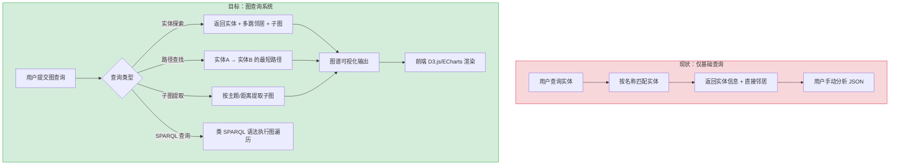
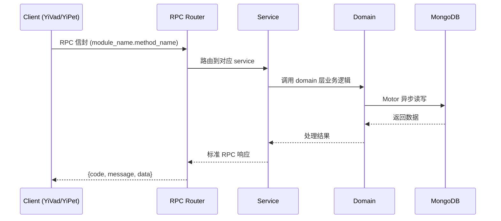

---

doc_type: module
prd_task_id: "YA-09-143"
title: "YA-09-143: 知识图谱查询 — 实体关系遍历 + 图检索 — 开发方案"
status: 需求已编写
priority: P2
owner: 陈铭
roles: [engineer]
created: 2026-09-11
updated: 2026-09-14
project: YiAi
project_id: yiai
prd_month: "202609"
estimate_frontend: 1.0
source_prd: "208-需求-知识图谱查询.md"
source_okr: [yiai-003]

type: task
---

# YA-09-143: 知识图谱查询 — 实体关系遍历 + 图检索 — 开发方案

> **文档职责**: 本文档定义**怎么做、为什么这么做、实际做成什么样**（HOW），不含产品目标与测试用例。

> 来源 PRD: [208-需求-知识图谱查询.md](../../prds/2026-09/208-需求-知识图谱查询.md)
> 需求编号: YA-09-143 · 优先级: P2 · 人天: 1.0d

---

<a id="sec-1"></a>
## 一、架构概览



<a id="sec-2"></a>
## 二、文件清单

| 文件 | 操作 | 说明 |
|------|------|------|
| `domain/XXX/models.py` | 新增 | 数据模型定义 |
| `domain/XXX/service.py` | 新增 | 核心服务逻辑 |
| `services/XXX/rpc_handler.py` | 新增 | RPC 路由处理器 |
| `tests/test_XXX.py` | 新增 | 单元测试 |

<a id="sec-3"></a>
## 三、模块设计

### 1. 核心组件

```python
 YiAi/src/domain/knowledge_graph/models.py (修改/扩展)

from dataclasses import dataclass, field
from typing import Optional, Any
from enum import Enum

class RelationType(str, Enum):
    IS_A = "is_a"
    PART_OF = "part_of"
    DEPENDS_ON = "depends_on"
    RELATED_TO = "related_to"
    HAS_PROPERTY = "has_property"
    USED_BY = "used_by"
    EXAMPLE_OF = "example_of"

@dataclass
class GraphEntity:
    """图谱实体"""
    id: str                            # 唯一标识
    name: str                          # 实体名称
    type: str                          # 实体类型: concept/technology/person/...
    properties: dict[str, Any]         # 属性键值对
    source_docs: list[str]             # 来源文档 ID

@dataclass
# ... (完整实现见 PRD)
```

### 2. 核心组件

```python
 YiAi/src/services/knowledge_graph/graph_query_engine.py (新增)

import networkx as nx
from collections import deque
from typing import Optional

class GraphQueryEngine:
    """知识图谱查询引擎"""

    def __init__(self, graph: nx.Graph):
        self.graph = graph

    def expand_entity(
        self,
        entity_id: str,
        max_hops: int = 2,
        max_nodes: int = 100,
        relation_filter: Optional[list[str]] = None,
    ) -> GraphVisualization:
        """
        实体展开：从指定实体出发，多跳遍历邻居
        """
        if entity_id not in self.graph:
            return GraphVisualization(nodes=[], edges=[], meta={"error": "Entity not found"})

# ... (完整实现见 PRD)
```

### 3. 核心组件


<a id="sec-4"></a>
## 四、数据流



**调用链路**: `Client → RPC Router → Service → Domain → MongoDB`  
**响应格式**: `{code: 0, message: "ok", data: ...}`  
**异步模型**: 全链路 `async/await`，Motor 异步 MongoDB 驱动。

<a id="sec-5"></a>
## 五、实施路线图

**预估人天**: 1.0d

| 步骤 | 操作 | 路径 | 验证 | 人天 |
|------|------|------|------|------|
| 1 | 定义图查询数据模型 | `models.py` | 类型定义完整 | 0.02 |
| 2 | 实现 NetworkX 内存缓存 | `graph_cache.py` | MongoDB → NetworkX 加载成功 | 0.04 |
| 3 | 实现实体展开查询 | `graph_query_engine.py` | 2-hop 展开返回正确节点和边 | 0.05 |
| 4 | 实现路径查找 | `graph_query_engine.py` | BFS 最短路径 + top-K | 0.04 |
| 5 | 实现子图提取 | `graph_query_engine.py` | 多实体 + ego graph | 0.03 |
| 6 | 实现类 SPARQL 解析器 | `sparql_parser.py` | FIND/PATH/NEIGHBORS 解析正确 | 0.04 |
| 7 | 实现可视化格式转换 | `graph_query_engine.py` | nodes + edges + meta | 0.02 |
| 8 | 实现 RPC 路由 | `knowledge_graph_routes.py` | 4 种查询类型均可调用 | 0.03 |
| 9 | 集成测试 | 测试文件 | 端到端图查询测试 | 0.03 |

**总人天：0.3d**


<a id="sec-6"></a>
## 六、代码审查检查清单

- [ ] NetworkX 图加载正确处理实体和关系的字段映射
- [ ] BFS 最短路径正确限制 max_length 参数
- [ ] 实体展开的子图大小限制 max_nodes 生效
- [ ] 子图提取的 ego_graph radius 参数与 max_hops 对应
- [ ] 可视化节点和边去重（相同节点/边不重复）
- [ ] 类 SPARQL 解析器正确处理大小写不敏感的 FIND/WHERE
- [ ] 图缓存刷新使用异步操作，不阻塞请求处理
- [ ] 实体不存在时返回空结果而非异常
- [ ] 可视化输出的 meta 包含查询上下文信息
- [ ] 循环引用保护：BFS visited 集合防止无限循环


<a id="sec-7"></a>
## 七、风险评估

| 风险 | 概率 | 影响 | 缓解措施 |
|------|------|------|----------|
| 图规模过大导致 BFS 性能差 | 中 | 高 | 限制 max_hops ≤ 5；超时保护（2s 自动截断） |
| NetworkX 内存占用过高 | 中 | 中 | 图数据压缩（仅加载必要字段）；大图分片加载 |
| 缓存不一致（MongoDB 更新但内存图未刷新） | 中 | 中 | 定时刷新 5 分钟 + 手动刷新接口 |
| 类 SPARQL 解析器覆盖率不足 | 高 | 低 | 明确文档化支持的语法；不支持的查询返回明确错误 |
| 可视化输出在前端大数据下渲染慢 | 中 | 中 | 节点数 > 500 时在前端做简化；后端限制最大返回节点数 |


<a id="sec-8"></a>
## 八、回滚方案

| 场景 | 回滚操作 | 影响 |
|------|----------|------|
| 图查询引擎崩溃 | 关闭图查询接口，仅保留基础实体检索 | 失去高级图查询 |
| NetworkX 内存溢出 | 降级为 MongoDB 逐条查询（无图遍历） | 性能显著下降 |
| 类 SPARQL 解析错误 | 降级为仅 RESTful API，关闭 DSL | 失去声明式查询 |
| 缓存加载超时 | 关闭缓存预热，查询时实时从 MongoDB 加载 | 首次查询延迟增加 |

