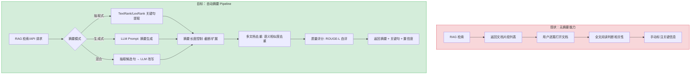
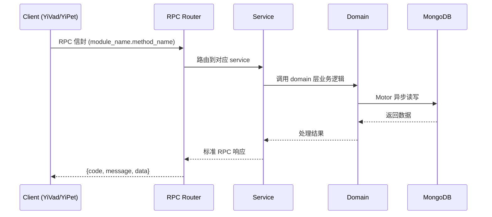

---

doc_type: module
prd_task_id: "YA-09-92"
title: "YA-09-92: 文档自动摘要 — RAG 摘要增强检索 — 开发方案"
status: 需求已编写
priority: P2
owner: 陈铭
roles: [engineer]
created: 2026-09-11
updated: 2026-09-23
project: YiAi
project_id: yiai
prd_month: "202609"
estimate_frontend: 3.0
source_prd: "209-需求-文档自动摘要.md"
source_okr: [yiai-001]
related_tests: ["209-prd-test-文档自动摘要"]

type: task
---

# YA-09-92: 文档自动摘要 — RAG 摘要增强检索 — 开发方案

> **文档职责**: 本文档定义**怎么做、为什么这么做、实际做成什么样**（HOW），不含产品目标与测试用例。

> 来源 PRD: [209-需求-文档自动摘要.md](../../prds/2026-09/209-需求-文档自动摘要.md)
> 需求编号: YA-09-92 · 优先级: P2 · 人天: 3.0d

---

<a id="sec-1"></a>
## 一、架构概览



<a id="sec-2"></a>
## 二、文件清单

| 文件 | 操作 | 说明 |
|------|------|------|
| `domain/XXX/models.py` | 新增 | 数据模型定义 |
| `domain/XXX/service.py` | 新增 | 核心服务逻辑 |
| `services/XXX/rpc_handler.py` | 新增 | RPC 路由处理器 |
| `tests/test_XXX.py` | 新增 | 单元测试 |

<a id="sec-3"></a>
## 三、模块设计

### 1. 核心组件

```python
 services/ai/summarization_service.py (新增)

from dataclasses import dataclass
from enum import Enum
from typing import Optional

class SummarizationMode(str, Enum):
    EXTRACTIVE = "extractive"     # 抽取式
    ABSTRACTIVE = "abstractive"   # 生成式
    HYBRID = "hybrid"             # 混合

class SummaryLength(str, Enum):
    SHORT = "short"     # 1-2 句 (~80 tokens)
    MEDIUM = "medium"   # 3-5 句 (~200 tokens)  
    LONG = "long"       # 6-10 句 (~400 tokens)

@dataclass
class SummarizationRequest:
    document: str                              # 待摘要文档
    mode: SummarizationMode = SummarizationMode.HYBRID
    length: SummaryLength = SummaryLength.MEDIUM
    max_tokens: Optional[int] = None           # 精确控制 token 数（覆盖 length）
    language: str = "zh"                       # 文档语言
    return_key_points: bool = False            # 是否返回关键点列表
    cache_enabled: bool = True                 # 是否使用缓存
# ... (完整实现见 PRD)
```

### 2. 核心组件

```python
 services/ai/extractive_summarizer.py (新增)

import re
import numpy as np
from collections import defaultdict
from typing import List, Tuple

class TextRankSummarizer:
    """基于 TextRank 的抽取式摘要引擎"""
    
    def __init__(self, embedding_service=None):
        self.embedding_service = embedding_service
        self.sentence_splitter = ChineseSentenceSplitter()
    
    def summarize(
        self, 
        document: str, 
        max_tokens: int = 200,
        return_scores: bool = False
    ) -> Tuple[str, List[Tuple[str, float]]]:
        """生成抽取式摘要"""
        # 1. 句子分割
        sentences = self.sentence_splitter.split(document)
        if len(sentences) <= 3:
            return document, [(document, 1.0)]
# ... (完整实现见 PRD)
```


<a id="sec-4"></a>
## 四、数据流



**调用链路**: `Client → RPC Router → Service → Domain → MongoDB`  
**响应格式**: `{code: 0, message: "ok", data: ...}`  
**异步模型**: 全链路 `async/await`，Motor 异步 MongoDB 驱动。

<a id="sec-5"></a>
## 五、实施路线图

**预估人天**: 3.0d

| 步骤 | 操作 | 路径 | 验证 | 人天 |
|------|------|------|------|------|
| 1 | 实现句子分割器 | `extractive_summarizer.py` | 中英文句子正确分割 | 0.03 |
| 2 | 实现 TextRank 引擎 | `extractive_summarizer.py` | 关键句排序正确 | 0.05 |
| 3 | 实现生成式 Prompt 模板 | `abstractive_summarizer.py` | LLM 输出格式正确 | 0.03 |
| 4 | 实现混合摘要模式 | `hybrid_summarizer` | TextRank → LLM 管道 | 0.04 |
| 5 | 实现多文档摘要 | `multi_doc_summarizer.py` | 去重+综合摘要 | 0.04 |
| 6 | 实现 ROUGE-L 评估 | `rouge_evaluator.py` | F1 计算正确 | 0.03 |
| 7 | 实现摘要缓存 | `summary_cache.py` | MongoDB 缓存读/写 | 0.03 |
| 8 | 实现 RPC 服务入口 | `summarization_service.py` | RPC 信封路由 | 0.03 |
| 9 | 测试 | `tests/test_summarization.py` | 全部测试通过 | 0.02 |

**总人天：0.3d**


<a id="sec-6"></a>
## 六、代码审查检查清单

- [ ] TextRank 相似度矩阵对空句子处理（除零保护）
- [ ] MMR 去重 lambda 参数可配置（默认 0.7）
- [ ] 生成式 Prompt 模板注入防护（{document} 不包含指令注入字符）
- [ ] Token 截断在 Unicode 字符边界，不截断多字节字符
- [ ] 摘要缓存 TTL 可配置（默认 1 小时）
- [ ] 多文档摘要时各文档摘要独立缓存
- [ ] ROUGE-L DP 数组大小控制（O(n*m) → 一维 O(min(n,m)) 优化）
- [ ] 大文档分段处理（> 200 句时分段）
- [ ] RPC 参数校验（document 非空，max_tokens 范围 20-1000）
- [ ] 错误响应包含降级标记（fallback_reason）


<a id="sec-7"></a>
## 七、风险评估

| 风险 | 概率 | 影响 | 缓解措施 |
|------|------|------|----------|
| LLM 生成式摘要出现幻觉 | 中 | 高 | 混合模式优先（TextRank 约束输入）；低置信度标记告警 |
| 中文句子分割不准确 | 中 | 中 | 使用多重分割规则（。！？ + 换行 + 空格缩进）；不正确的分割不影响 TextRank（只是候选句子粒度不同） |
| 大文档（> 50K 字）TextRank 矩阵 O(n²) 内存爆炸 | 低 | 中 | 文档超过 20K 字时分段处理，每段独立摘要后合并 |
| 摘要缓存键冲突 | 低 | 低 | 缓存键 = SHA256(文档内容 + 模式 + 长度参数)，避免冲突 |
| Ollama 服务不可用导致生成式失败 | 中 | 高 | 自动降级为抽取式摘要 + 返回降级标记 |


<a id="sec-8"></a>
## 八、回滚方案

| 场景 | 回滚操作 | 影响 |
|------|----------|------|
| 摘要服务不可用 | RPC 路由移除 summarization_service | RAG 结果无摘要预览 |
| LLM 摘要质量极差 | 切换默认模式为 extractive | 失去生成式摘要 |
| 摘要缓存导致内存压力 | 禁用缓存或缩短 TTL | 摘要延迟增加 |

