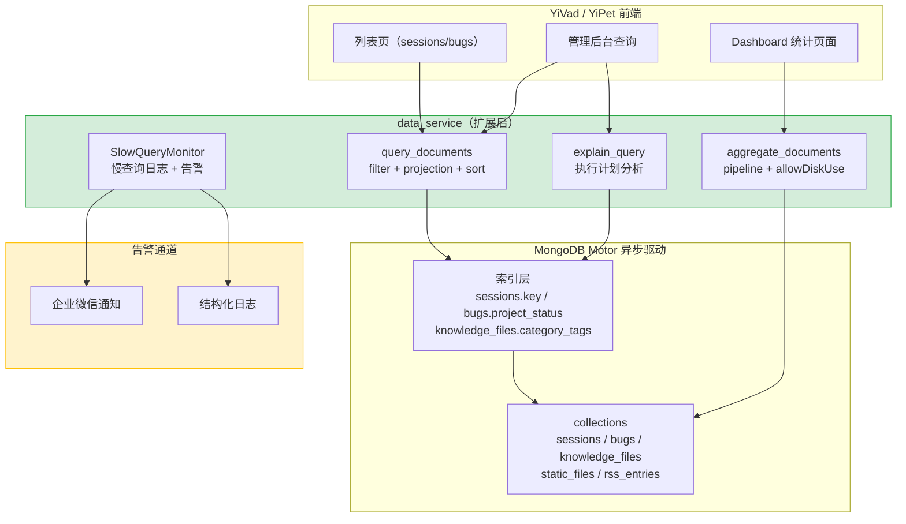

---

doc_type: module
prd_task_id: "YA-09-71"
title: "YA-09-71: 数据访问层查询优化 — 聚合管道 + 字段投影 + 索引策略 — 开发方案"
status: 需求已编写
priority: P2
owner: 陈铭
roles: [engineer]
created: 2026-09-11
updated: 2026-09-23
project: YiAi
project_id: yiai
prd_month: "202609"
estimate_frontend: 1.5
source_prd: "21-需求-数据访问层查询优化.md"
source_okr: [yiai-001]

type: task
---

# YA-09-71: 数据访问层查询优化 — 聚合管道 + 字段投影 + 索引策略 — 开发方案

> 来源 PRD：[21-需求-数据访问层查询优化.md](../../prds/2026-09/21-需求-数据访问层查询优化.md)
> 需求编号：YA-09-71 · 优先级：P2 · 人天：1.5d
> 依赖：YA-09-02（数据层稳定性）· 类型：架构 · 状态：需求已编写

---

## 一、架构概述

当前 `data_service.query_documents` 通过 `collection.find(filter)` 返回完整文档。前端 Dashboard 统计需逐集合发起多次查询后自行聚合（N+1 模式）。`sessions` 集合 50K+ 文档无索引，`messages.content` 查询触发全表扫描。本方案引入三个能力：**字段投影**（按需裁剪传输量）、**聚合管道**（后端一次性统计）、**索引策略**（覆盖高频查询路径）。



### 核心能力矩阵

| 能力 | 当前状态 | 目标状态 | 实现方式 |
|------|---------|---------|---------|
| 字段投影 | 返回全部字段 | `projection` 参数裁剪 | `collection.find(filter, projection={...})` |
| 聚合统计 | 前端 N+1 查询 | 后端单次 pipeline | `collection.aggregate(pipeline)` |
| 索引覆盖 | 无索引分析 | explain + 自动建议 | `collection.find().explain()` |
| 慢查询监控 | 无感知 | 500ms WARNING / 2s CRITICAL | Motor 事件拦截 + 企微告警 |
| 大数据集排序 | 内存溢出风险 | `allowDiskUse` 安全排序 | `aggregate(pipeline, allowDiskUse=True)` |

---

## 二、文件清单

| # | 文件 | 操作 | 说明 | 预估行数 |
|---|------|------|------|----------|
| 1 | `src/services/database/data_service.py` | 修改 | 新增 `aggregate_documents`、`explain_query` 方法；`query_documents` 增加 `projection`/`sort` 参数 | +120 |
| 2 | `src/domain/data/repository.py` | 修改 | Motor 层新增 `aggregate`、`explain` 封装；慢查询拦截装饰器 | +80 |
| 3 | `src/shared/monitoring/slow_query.py` | 新增 | `SlowQueryMonitor` 类：阈值判断、结构化日志、企微告警 | +60 |
| 4 | `src/services/database/__init__.py` | 修改 | 导出新方法签名 | +10 |
| 5 | `tests/services/test_data_service_aggregate.py` | 新增 | 聚合管道 + 字段投影 + explain 测试 | +100 |
| 6 | `YiAi/scripts/create_indexes.js` | 新增 | MongoDB 索引创建脚本（sessions/bugs/knowledge_files） | +40 |
| **合计** | | | | **~410 行** |

### 组件树

```
src/services/database/data_service.py (修改)
├── async def query_documents(cname, filter, projection=None, sort=None, skip=0, limit=100)
├── async def aggregate_documents(cname, pipeline, allow_disk_use=False, max_time_ms=30_000)
├── async def explain_query(cname, filter) -> dict
└── async def _ensure_indexes(cname) -> None

src/domain/data/repository.py (修改)
├── async def aggregate(collection_name, pipeline, **kwargs) -> list[dict]
├── async def explain(collection_name, filter, **kwargs) -> dict
└── def slow_query_monitor(threshold_ms=500) -> Callable  # 装饰器

src/shared/monitoring/slow_query.py (新增)
├── class SlowQueryMonitor
│   ├── async def record(collection, operation, filter, duration_ms, docs_examined)
│   ├── def should_alert(duration_ms) -> bool
│   └── async def _send_wework_alert(record) -> None
```

---

## 三、模块设计

### 3.1 data_service 扩展

```python
from typing import Any, Optional

class DataService:
    """通用数据访问服务 — 新增聚合 + 投影 + explain。"""

    async def query_documents(
        self,
        cname: str,
        filter: dict[str, Any],
        projection: Optional[dict[str, int]] = None,
        sort: Optional[list[tuple[str, int]]] = None,
        skip: int = 0,
        limit: int = 100,
    ) -> dict[str, Any]:
        """
        查询文档 — 新增 projection、sort、分页支持。

        projection 示例:
          {"content": 0, "messages": 0}  # 列表页排除大字段，传输量 -70%
        sort 示例:
          [("updatedAt", -1)]  # 按更新时间倒序
        """
        ...

    async def aggregate_documents(
        self,
        cname: str,
        pipeline: list[dict[str, Any]],
        allow_disk_use: bool = False,
        max_time_ms: int = 30_000,
    ) -> list[dict[str, Any]]:
        """
        MongoDB 聚合管道 — 替代前端 N+1 查询。

        Dashboard 统计示例:
          pipeline = [
            {"$match": {"status": "open"}},
            {"$group": {"_id": "$project_key", "count": {"$sum": 1}}},
            {"$sort": {"count": -1}},
          ]
          # 返回: [{_id: "PLANE", count: 45}, ...]

        参数:
          allow_disk_use: 大数据集排序时启用，避免内存溢出（默认关闭）
          max_time_ms: 超时保护，默认 30s
        """
        ...

    async def explain_query(
        self,
        cname: str,
        filter: dict[str, Any],
    ) -> dict[str, Any]:
        """
        查询计划分析 — 检查索引命中、扫描文档数。

        返回:
          {
            "index_used": "sessions.key_1",
            "docs_examined": 1,
            "docs_returned": 1,
            "execution_time_ms": 2.3,
            "index_efficient": True,  # examined == returned
          }
        """
        ...
```

### 3.2 慢查询监控

```python
from dataclasses import dataclass, field
from datetime import datetime
import logging

logger = logging.getLogger(__name__)

@dataclass
class SlowQueryRecord:
    collection: str
    operation: str          # "find" | "aggregate" | "update"
    filter: dict[str, Any]
    duration_ms: float
    docs_examined: int
    timestamp: datetime = field(default_factory=datetime.utcnow)
    trace_id: str = ""      # 关联 TraceID

class SlowQueryMonitor:
    """慢查询监控 — 阈值判断 + 日志记录 + 企微告警。"""

    WARNING_THRESHOLD_MS: int = 500
    CRITICAL_THRESHOLD_MS: int = 2000

    async def record(self, record: SlowQueryRecord) -> None:
        """记录慢查询并判断告警级别。"""
        if record.duration_ms > self.CRITICAL_THRESHOLD_MS:
            logger.critical(
                f"[SlowQuery CRITICAL] {record.collection}.{record.operation} "
                f"{record.duration_ms:.0f}ms, examined={record.docs_examined}"
            )
            await self._send_wework_alert(record, level="critical")
        elif record.duration_ms > self.WARNING_THRESHOLD_MS:
            logger.warning(
                f"[SlowQuery WARNING] {record.collection}.{record.operation} "
                f"{record.duration_ms:.0f}ms"
            )

    async def _send_wework_alert(
        self, record: SlowQueryRecord, level: str
    ) -> None:
        """通过企业微信发送告警。"""
        ...
```

### 3.3 索引创建脚本

```javascript
// YiAi/scripts/create_indexes.js — MongoDB 索引初始化

// sessions 集合 — 聊天历史核心查询
db.sessions.createIndex({ "key": 1 }, { unique: true });
db.sessions.createIndex({ "updatedAt": -1 });
db.sessions.createIndex({ "tags": 1 });

// bugs 集合 — 按项目+状态联合过滤
db.bugs.createIndex({ "project_key": 1, "status": 1 });

// knowledge_files 集合 — 知识库检索
db.knowledge_files.createIndex({ "frontmatter.category": 1 });
db.knowledge_files.createIndex({ "frontmatter.tags": 1 });
db.knowledge_files.createIndex({ "frontmatter.status": 1 });

// projects 集合 — 全文搜索
db.projects.createIndex(
  { "name": "text", "description": "text" },
  { weights: { "name": 10, "description": 1 } }
);

// static_files 集合 — 按标签过滤
db.static_files.createIndex({ "tags": 1 });
```

---

## 四、数据流

### 4.1 聚合管道流

```
YiVad Dashboard
    │
    │  RPC: module_name="services.database.data_service"
    │       method_name="aggregate_documents"
    │       parameters={cname:"bugs", pipeline:[{$match:...},{$group:...}]}
    ▼
data_service.aggregate_documents()
    │
    │  1. 校验 cname 白名单（仅允许已知 collection）
    │  2. 检查 pipeline 长度 ≤ 20 级（防止滥用）
    │  3. 设置 maxTimeMS=30_000
    ▼
repository.aggregate(collection_name, pipeline, allowDiskUse=False)
    │
    │  Motor 异步聚合
    │  cursor.to_list(length=500)
    ▼
MongoDB ──→ 结果集 [{_id: "PLANE", count: 45}, ...]
    │
    │  记录执行时间
    │  若 > 500ms → SlowQueryMonitor.record()
    ▼
RPC 响应: {code:0, data:[{_id:"PLANE", count:45}, ...]}
```

### 4.2 查询投影流

```
YiVad 列表页（仅需 title/status/updatedAt）
    │
    │  RPC: query_documents(cname="bugs", filter={...},
    │        projection={"content":0, "messages":0})
    ▼
collection.find(filter, projection={"content":0, "messages":0})
    │
    │  只返回 title/status/updatedAt（content/messages 不传输）
    │  传输量从 ~50KB 降至 ~15KB（-70%）
    ▼
RPC 响应: {code:0, data:[{title:"...", status:"open", ...}, ...]}
```

---

## 五、实施路线图

### 阶段一：聚合管道 + 字段投影（0.75d）

| 步骤 | 任务 | 验证方式 | 产出 |
|------|------|---------|------|
| 1 | `repository.py` 新增 `aggregate()`、`explain()` 方法 | Motor 聚合调用成功 | `domain/data/repository.py` |
| 2 | `data_service.py` 新增 `aggregate_documents()`、`explain_query()` | RPC 调用返回聚合结果 | `services/database/data_service.py` |
| 3 | `query_documents` 增加 `projection`/`sort` 参数 | 字段投影减少传输量 70% | 修改同上 |
| 4 | Dashboard 统计接口切换到聚合管道 | 单次请求替代原 5-8 次查询 | 验证 Dashboard 页面 |

### 阶段二：索引策略 + 慢查询监控（0.75d）

| 步骤 | 任务 | 验证方式 | 产出 |
|------|------|---------|------|
| 5 | `create_indexes.js` 创建 8 个索引 | `db.sessions.getIndexes()` 确认 | `scripts/create_indexes.js` |
| 6 | `SlowQueryMonitor` 实现 | 超过 500ms 记录 WARNING 日志 | `shared/monitoring/slow_query.py` |
| 7 | 企微告警集成 | 超过 2s 收到企微通知 | 同上 |
| 8 | 测试覆盖（聚合 + projection + explain） | pytest 全部通过 | `tests/services/test_data_service_aggregate.py` |

**合计：1.5d。**

---

## 六、Code Review 检查清单

- [ ] `aggregate_documents` 校验 `cname` 是否在白名单内（防止任意 collection 聚合）
- [ ] `pipeline` 长度限制（max 20 stages）防止计算资源滥用
- [ ] `allowDiskUse` 默认关闭——仅大数据集排序显式启用
- [ ] `maxTimeMS` 超时保护——避免长时间阻塞 MongoDB 连接
- [ ] `projection` 参数通过 Pydantic model 校验类型（`dict[str, int]`）
- [ ] `explain_query` 返回结果脱敏——不暴露 `filter` 中可能的敏感字段
- [ ] 慢查询监控不阻塞主流程——`record()` 使用 `asyncio.create_task` 异步执行
- [ ] 企微告警在开发环境默认禁用（通过 `config.yaml` 控制）
- [ ] 索引创建脚本标记幂等（`createIndex` 已存在时跳过）
- [ ] 测试覆盖：空 pipeline / 超长 pipeline / 不存在的 collection / 大数据集 allowDiskUse

---

## 七、技术风险评估

| 风险 | 概率 | 影响 | 缓解措施 |
|------|------|------|---------|
| 聚合管道阻塞 MongoDB | 中 | 高 | `maxTimeMS=30s` + 连接池隔离 |
| 字段投影遗漏必填字段 | 低 | 中 | 前端列表页明确需要的字段白名单 |
| 索引创建影响写入性能 | 中 | 低 | 使用 `background:true`（MongoDB 4.2+ 默认） |
| explain 泄露查询条件 | 低 | 低 | explain 接口仅管理员可调用 |
| 慢查询监控日志量爆炸 | 低 | 中 | 按 collection 聚合统计，避免逐条推送 |
| `allowDiskUse` 磁盘 I/O 影响 | 低 | 高 | 默认关闭，按需开启；监控磁盘 IOPS |

---

## 八、关联模块

- 基础：[YA-09-02 数据层稳定性与连接池优化](./06-prd-task-数据层.md)
- 关联：[YA-09-27 Dashboard 预聚合快照](./83-prd-task-Dashboard预聚合快照.md)
- 关联：[YA-09-91 数据访问层缓存](./29-prd-task-数据查询缓存层.md)