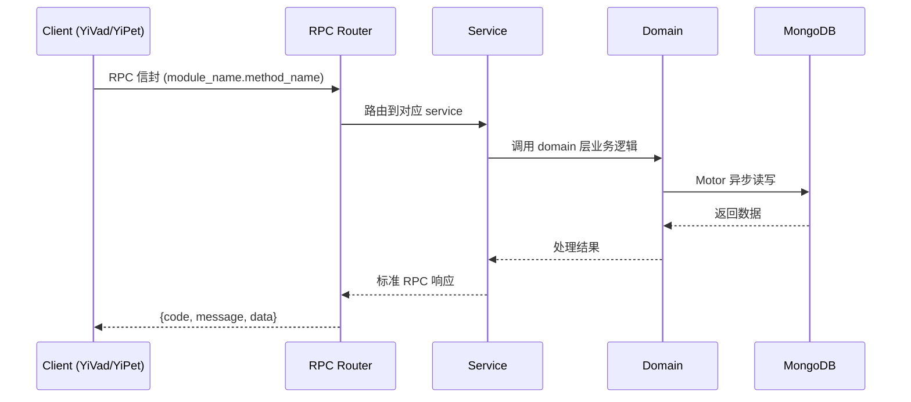

---

doc_type: module
prd_task_id: "YA-09-210"
title: "YA-09-210: 实体链接与消歧 — 命名实体链接到知识库、实体消歧、实体关系抽取、指代消解、实体知识卡片生成 — 开发任务"
status: 需求已编写
priority: P2
owner: 陈铭
roles: [engineer]
created: 2026-09-11
updated: 2026-09-11
project: YiAi
project_id: yiai
prd_month: "202609"
estimate_frontend: 0.3
source_prd: "210-需求-实体链接与消歧.md"
source_okr: [yiai-001]

type: task
---

# YA-09-210: 实体链接与消歧 — 命名实体链接到知识库、实体消歧、实体关系抽取、指代消解、实体知识卡片生成 — 开发任务

> **文档职责**: 本文档定义**怎么做、为什么这么做、实际做成什么样**（HOW），不含产品目标与测试用例。

> 来源 PRD: [210-需求-实体链接与消歧.md](../../prds/2026-09/210-需求-实体链接与消歧.md)
> 需求编号: YA-09-210 · 优先级: P2 · 人天: 0.3d

---

<a id="sec-1"></a>
## 一、架构概览

```mermaid
graph TD
    subgraph Current["现状：仅关键词匹配"]
        C1[用户查询] --> C2[关键词提取]
        C2 --> C3[向量 + 关键词检索]
        C3 --> C4[返回文档列表]
        C4 --> C5[用户自行理解实体关系]
    end

    subgraph Target["目标：实体感知检索"]
        T1[用户查询/文档] --> T2[命名实体识别: 人名/组织/地点/产品]
        T2 --> T3[实体消歧: 链接到知识库]
        T3 --> T4[指代消解: 链接代词到实体]
        T4 --> T5[关系抽取: A-关系-B 三元组]
        T5 --> T6[实体知识卡片: 聚合多文档信息]
        T6 --> T7[增强检索: 实体维度过滤+排序]
    end

    style Current fill:#f8d7da,stroke:#dc3545
    style Target fill:#d4edda,stroke:#28a745
```



<a id="sec-2"></a>
## 二、文件清单

| 文件 | 操作 | 说明 |
|------|------|------|
| `domain/XXX/models.py` | 新增 | 数据模型定义 |
| `domain/XXX/service.py` | 新增 | 核心服务逻辑 |
| `services/XXX/rpc_handler.py` | 新增 | RPC 路由处理器 |
| `tests/test_XXX.py` | 新增 | 单元测试 |

<a id="sec-3"></a>
## 三、模块设计

### 1. 核心组件

```python
 services/nlp/entity_types.py (新增)

from dataclasses import dataclass, field
from enum import Enum
from typing import Optional

class EntityType(str, Enum):
    PERSON = "person"
    ORGANIZATION = "organization"
    LOCATION = "location"
    PRODUCT = "product"
    EVENT = "event"
    DATE = "date"
    MONEY = "money"
    PERCENT = "percent"
    FACILITY = "facility"      # 建筑、设施
    TECHNOLOGY = "technology"  # 技术、框架、语言
    LAW = "law"               # 法律、法规
    OTHER = "other"

class RelationType(str, Enum):
    FOUNDED = "founded"             # 创立
    ACQUIRED = "acquired"           # 收购
    CEO_OF = "ceo_of"              # 担任CEO
    EMPLOYED_AT = "employed_at"    # 任职于
# ... (完整实现见 PRD)
```

### 2. 核心组件

```python
 services/nlp/ner_pipeline.py (新增)

import re
import json
from typing import List, Dict
from .entity_types import EntityMention, EntityType

class NERPipeline:
    """命名实体识别管道（字典 + LLM 双层）"""
    
    def __init__(self, llm_service, entity_repo):
        self.llm = llm_service
        self.entity_repo = entity_repo
        self.dict_matcher = DictMatcher()
        self._load_known_entities()
    
    async def extract(self, text: str) -> List[EntityMention]:
        """提取文本中的所有命名实体"""
        mentions = []
        
        # 1. 字典匹配（快速、准确）
        dict_mentions = self.dict_matcher.match(text)
        mentions.extend(dict_mentions)
        
        # 2. LLM NER（补充未知实体）
# ... (完整实现见 PRD)
```

### 3. 核心组件


<a id="sec-4"></a>
## 四、数据流



**调用链路**: `Client → RPC Router → Service → Domain → MongoDB`  
**响应格式**: `{code: 0, message: "ok", data: ...}`  
**异步模型**: 全链路 `async/await`，Motor 异步 MongoDB 驱动。

<a id="sec-5"></a>
## 五、实施路线图

**预估人天**: 0.3d

| 步骤 | 操作 | 路径 | 验证 | 人天 |
|------|------|------|------|------|
| 1 | 定义实体类型+数据模型 | `entity_types.py` | 数据模型定义完整 | 0.02 |
| 2 | 实现字典匹配器 | `ner_pipeline.py` | 已知实体正确匹配 | 0.03 |
| 3 | 实现 LLM NER Pipeline | `ner_pipeline.py` | LLM 输出 JSON 可解析 | 0.04 |
| 4 | 实现实体链接 | `entity_linker.py` | MongoDB 增删查改 | 0.03 |
| 5 | 实现实体消歧 | `disambiguator.py` | 歧义实体正确区分 | 0.04 |
| 6 | 实现指代消解 | `coref_resolver.py` | 代词正确链接到先行词 | 0.04 |
| 7 | 实现关系抽取 | `relation_extractor.py` | 三元组提取正确 | 0.04 |
| 8 | 实现知识卡片 | `knowledge_card_builder.py` | 聚合多文档信息 | 0.03 |
| 9 | 实现 RPC 服务 | `entity_service.py` | RPC 信封路由 | 0.02 |
| 10 | 测试 | `tests/` | 全部测试通过 | 0.01 |

**总人天：0.3d**


<a id="sec-6"></a>
## 六、代码审查检查清单

- [ ] NER LLM Prompt JSON 输出后备处理（正则提取）
- [ ] 字典匹配使用词边界（\b）避免部分匹配
- [ ] 实体消歧考虑上下文窗口（前后 100 字符）
- [ ] 指代消解结果验证（代词 start/end 在文本范围内）
- [ ] 关系抽取的 subject/object 已在实体集合中存在
- [ ] 知识卡片描述不超过 500 字
- [ ] MongoDB 实体集合建立别名索引（aliases 数组索引）
- [ ] 实体关系集合建立 subject_id + object_id 联合索引
- [ ] 消歧结果在日志中记录 context 和决策理由
- [ ] JSON 解析异常时降级为返回空列表（而非崩溃）


<a id="sec-7"></a>
## 七、风险评估

| 风险 | 概率 | 影响 | 缓解措施 |
|------|------|------|----------|
| LLM NER JSON 输出格式不稳定 | 中 | 中 | 添加 JSON 提取正则后备；仅依赖 LLM NER 的补充部分（字典匹配已覆盖高频实体） |
| 实体消歧错误（链接到错误实体） | 中 | 中 | 显示消歧置信度；用户反馈 API 可纠正错误链接 |
| 指代消解在长距离指代时失败 | 中 | 低 | 标记未解析代词（黄色，表示可能存在的指代链） |
| 关系抽取产生噪声三元组 | 高 | 低 | 设置置信度阈值（> 0.7），低置信度关系不存入知识库 |
| MongoDB 实体集合膨胀 | 低 | 中 | 定期清理 mention_count < 3 的低频实体 |


<a id="sec-8"></a>
## 八、回滚方案

| 场景 | 回滚操作 | 影响 |
|------|----------|------|
| NLP 模块导致 RPC 路由不可用 | 移除 entity_service 路由 | 失去实体感知能力 |
| LLM NER 频繁超时 | 降级为纯字典匹配 | 未知实体无法识别 |
| 实体关系集合损坏 | 清空重建（重新扫描文档） | 暂时失去关系查询 |

