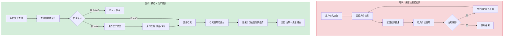
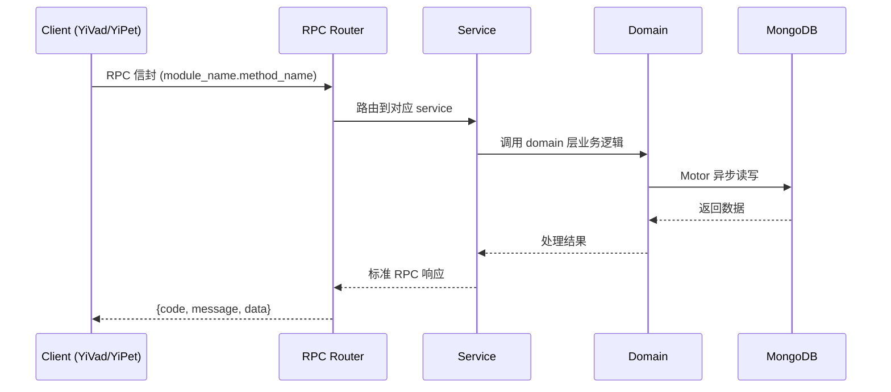

---

doc_type: module
prd_task_id: "YA-09-211"
title: "YA-09-211: 查询性能预测 — 预检索查询性能预测、检索结果质量预估、查询改写建议、置信度评分、历史查询性能数据库 — 开发任务"
status: 需求已编写
priority: P2
owner: 陈铭
roles: [engineer]
created: 2026-09-11
updated: 2026-09-11
project: YiAi
project_id: yiai
prd_month: "202609"
estimate_frontend: 0.3
source_prd: "211-需求-查询性能预测.md"
source_okr: [yiai-001]

type: task
---

# YA-09-211: 查询性能预测 — 预检索查询性能预测、检索结果质量预估、查询改写建议、置信度评分、历史查询性能数据库 — 开发任务

> **文档职责**: 本文档定义**怎么做、为什么这么做、实际做成什么样**（HOW），不含产品目标与测试用例。

> 来源 PRD: [211-需求-查询性能预测.md](../../prds/2026-09/211-需求-查询性能预测.md)
> 需求编号: YA-09-211 · 优先级: P2 · 人天: 0.3d

---

<a id="sec-1"></a>
## 一、架构概览



<a id="sec-2"></a>
## 二、文件清单

| 文件 | 操作 | 说明 |
|------|------|------|
| `domain/XXX/models.py` | 新增 | 数据模型定义 |
| `domain/XXX/service.py` | 新增 | 核心服务逻辑 |
| `services/XXX/rpc_handler.py` | 新增 | RPC 路由处理器 |
| `tests/test_XXX.py` | 新增 | 单元测试 |

<a id="sec-3"></a>
## 三、模块设计

### 1. 核心组件

```python
 services/ai/query_quality_types.py (新增)

from dataclasses import dataclass, field
from enum import Enum
from typing import Optional

class QueryQualityLabel(str, Enum):
    EXCELLENT = "excellent"     # 优秀：具体、明确、可回答
    GOOD = "good"               # 良好：基本清晰
    FAIR = "fair"               # 一般：可能需要细化
    POOR = "poor"               # 差：太简短/太宽泛/太模糊
    UNKNOWN = "unknown"         # 无法判断

class QueryCategory(str, Enum):
    FACTUAL = "factual"         # 事实型："Kubernetes 最新版本是什么"
    PROCEDURAL = "procedural"   # 过程型："如何在 AWS 上部署 EKS"
    CONCEPTUAL = "conceptual"   # 概念型："什么是微服务架构"
    COMPARATIVE = "comparative" # 对比型："Docker vs Podman 区别"
    TROUBLESHOOTING = "troubleshooting"  # 排查型："Pod 一直 Pending 怎么办"
    OTHER = "other"

@dataclass
class QueryQualityScore:
    query: str
    overall_score: float            # 0-1 总分
# ... (完整实现见 PRD)
```

### 2. 核心组件

```python
 services/ai/heuristic_scorer.py (新增)

import re
import math
from typing import Optional, Dict
from .query_quality_types import QueryQualityScore, QueryQualityLabel, QueryCategory

class HeuristicScorer:
    """基于启发式规则的查询质量评分器"""
    
    # 中文停用词（高频无意义词）
    STOP_WORDS = {
        '的', '了', '在', '是', '我', '有', '和', '就', '不', '人', '都', '一',
        '一个', '上', '也', '很', '到', '说', '要', '去', '你', '会', '着',
        '没有', '看', '好', '自己', '这', '他', '她', '它', '们', '那', '什么',
        '怎么', '为什么', '哪个', '哪里', '这个', '那个', '这些', '那些'
    }
    
    # 模糊词（降低评分）
    VAGUE_WORDS = {
        '东西', '那个', '这个', '问题', '事情', '情况', '怎么', '怎么办',
        '有问题', '不行', '不对', '不好使', '用不了', '出错了', '报错',
        '帮忙', '求助', '问一下', '谁知道', '有没有人'
    }
    
# ... (完整实现见 PRD)
```

### 3. 核心组件


<a id="sec-4"></a>
## 四、数据流



**调用链路**: `Client → RPC Router → Service → Domain → MongoDB`  
**响应格式**: `{code: 0, message: "ok", data: ...}`  
**异步模型**: 全链路 `async/await`，Motor 异步 MongoDB 驱动。

<a id="sec-5"></a>
## 五、实施路线图

**预估人天**: 0.3d

| 步骤 | 操作 | 路径 | 验证 | 人天 |
|------|------|------|------|------|
| 1 | 定义类型 | `query_quality_types.py` | 数据类定义完整 | 0.02 |
| 2 | 实现启发式评分 | `heuristic_scorer.py` | 多维度规则计算正确 | 0.05 |
| 3 | 实现语义评分 | `semantic_scorer.py` | Embedding 相似度评分 | 0.03 |
| 4 | 实现 LLM 后备评估 | `query_quality_service.py` | 边界查询深度评估 | 0.03 |
| 5 | 实现改写建议 | `rewrite_suggester.py` | LLM 生成改写建议 | 0.03 |
| 6 | 实现后检索评估 | `post_retrieval_evaluator.py` | post_score 计算合理 | 0.03 |
| 7 | 实现历史存储 | `query_performance_repo.py` | MongoDB 读写 + TTL | 0.03 |
| 8 | 实现 RPC 服务 | `query_quality_service.py` | RPC 信封路由 | 0.02 |
| 9 | 集成到 RAG 管道 | rag pipeline 调用 | 预检→检索→后评 | 0.04 |
| 10 | 测试 | `tests/` | 全部测试通过 | 0.02 |

**总人天：0.3d**


<a id="sec-6"></a>
## 六、代码审查检查清单

- [ ] 启发式评分不依赖任何外部 API（纯 Python 计算）
- [ ] 模糊词表和停用词表可通过配置文件更新（非硬编码）
- [ ] LLM 后备评分仅在启发式分数在 [0.35, 0.65] 区间触发
- [ ] 改写建议去重（避免生成相同的改写）
- [ ] 后检索评分的 diversity 计算使用采样（避免 O(n²) 全量比较）
- [ ] 查询哈希用于重复检测（相同查询 + 相同参数 = 相同哈希）
- [ ] MongoDB TTL 索引正确设置（90 天）
- [ ] 查询评分对空字符串和超长字符串有合理处理
- [ ] 改写建议的最大数量 = 3（避免信息过载）


<a id="sec-7"></a>
## 七、风险评估

| 风险 | 概率 | 影响 | 缓解措施 |
|------|------|------|----------|
| 启发式评分误判高质量查询 | 中 | 中 | 低分查询仍执行检索（非阻塞），但显示质量提示 |
| 改写建议偏离用户意图 | 中 | 中 | 始终保留原始查询选项；用户可手动编辑 |
| 历史数据库膨胀 | 低 | 低 | TTL 索引自动清理 90 天前记录 |
| 冷启动无 IDF 数据 | 高 | 中 | 初始阶段使用默认 IDF 值，随知识库增长自动更新 |
| LLM 改写建议过于自由 | 中 | 低 | Prompt 中约束"保持原始查询的核心意图不变" |


<a id="sec-8"></a>
## 八、回滚方案

| 场景 | 回滚操作 | 影响 |
|------|----------|------|
| 质量预测阻塞检索 | 跳过预检索检查（pass-through 模式） | 失去预测功能 |
| 改写建议质量差 | 禁用改写建议功能 | 仅显示质量评分 |
| 历史数据库异常 | 清空 query_performance 集合 | 失去历史参考 |

