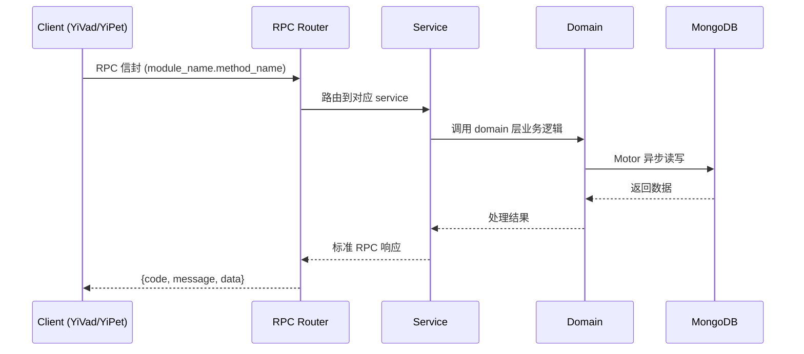

---

doc_type: module
prd_task_id: "YA-09-145"
title: "YA-09-145: HITL 人机协同标注 — 标注管线 + 质量控制 — 开发方案"
status: 需求已编写
priority: P2
owner: 陈铭
roles: [engineer]
created: 2026-09-11
updated: 2026-09-14
project: YiAi
project_id: yiai
prd_month: "202609"
estimate_frontend: 0.5
source_prd: "212-需求-HITL-人机协同标注.md"
source_okr: [yiai-001]

type: task
---

# YA-09-145: HITL 人机协同标注 — 标注管线 + 质量控制 — 开发方案

> **文档职责**: 本文档定义**怎么做、为什么这么做、实际做成什么样**（HOW），不含产品目标与测试用例。

> 来源 PRD: [212-需求-HITL-人机协同标注.md](../../prds/2026-09/212-需求-HITL-人机协同标注.md)
> 需求编号: YA-09-145 · 优先级: P2 · 人天: 0.5d

---

<a id="sec-1"></a>
## 一、架构概览

```mermaid
graph TD
    subgraph Current["现状：手动标注"]
        C1[导出待标注数据到 CSV] --> C2[在 Excel 中逐行标注]
        C2 --> C3[保存 CSV]
        C3 --> C4[不同人的 CSV 手动合并]
        C4 --> C5[手动计算一致性]
        C5 --> C6[导入到评估脚本]
    end

    subgraph Target["目标：HITL 标注系统"]
        T1[创建标注任务: 类型+样本集+标注者] --> T2[主动学习选择样本]
        T2 --> T3[标注者认领任务]
        T3 --> T4[标注界面: 逐条标注]
        T4 --> T5[自动质控: Gold Set 校验]
        T5 --> T6{一致性检查}
        T6 -->|Kappa < 0.6| T7[标记需复审]
        T6 -->|Kappa >= 0.6| T8[标注完成]
        T7 --> T9[管理员复审/仲裁]
        T9 --> T8
        T8 --> T10[导出: JSON/CSV/训练集]
    end

    style Current fill:#f8d7da,stroke:#dc3545
    style Target fill:#d4edda,stroke:#28a745
```



<a id="sec-2"></a>
## 二、文件清单

| 文件 | 操作 | 说明 |
|------|------|------|
| `domain/XXX/models.py` | 新增 | 数据模型定义 |
| `domain/XXX/service.py` | 新增 | 核心服务逻辑 |
| `services/XXX/rpc_handler.py` | 新增 | RPC 路由处理器 |
| `tests/test_XXX.py` | 新增 | 单元测试 |

<a id="sec-3"></a>
## 三、模块设计

### 1. 核心组件

```python
 services/annotation/types.py (新增)

from dataclasses import dataclass, field
from enum import Enum
from typing import Optional, List, Dict, Any

class AnnotationTaskType(str, Enum):
    CLASSIFICATION = "classification"     # 分类标注（相关/不相关/部分相关）
    RANKING = "ranking"                   # 排序标注（1st > 2nd > 3rd）
    RATING = "rating"                     # 评分标注（1-5 星）
    TEXT_LABEL = "text_label"             # 文本标注（NER 实体/关系）

class TaskStatus(str, Enum):
    DRAFT = "draft"                       # 草稿
    ACTIVE = "active"                     # 进行中
    REVIEW = "review"                     # 复审中
    COMPLETED = "completed"               # 已完成
    ARCHIVED = "archived"                 # 已归档

class AnnotationStatus(str, Enum):
    PENDING = "pending"                   # 待标注
    IN_PROGRESS = "in_progress"           # 标注中（已分配给标注者）
    COMPLETED = "completed"               # 已标注
    REVIEWED = "reviewed"                 # 已复审
    DISPUTED = "disputed"                 # 有争议
# ... (完整实现见 PRD)
```

### 2. 核心组件

```python
 data/annotation_repository.py (新增)

from motor.motor_asyncio import AsyncIOMotorCollection
from typing import List, Optional, Dict
from bson import ObjectId

class AnnotationRepository:
    """标注数据 MongoDB 仓库"""
    
    def __init__(self, db):
        self.tasks: AsyncIOMotorCollection = db.annotation_tasks
        self.samples: AsyncIOMotorCollection = db.annotation_samples
        self.annotations: AsyncIOMotorCollection = db.annotations
        self.gold_set: AsyncIOMotorCollection = db.annotation_gold_set
    
    async def create_task(self, task: AnnotationTask) -> str:
        result = await self.tasks.insert_one(task.__dict__)
        return str(result.inserted_id)
    
    async def get_task(self, task_id: str) -> Optional[AnnotationTask]:
        doc = await self.tasks.find_one({"_id": ObjectId(task_id)})
        return AnnotationTask(**doc) if doc else None
    
    async def list_tasks(self, status: Optional[TaskStatus] = None) -> List[AnnotationTask]:
        query = {"status": status} if status else {}
# ... (完整实现见 PRD)
```

### 3. 核心组件


<a id="sec-4"></a>
## 四、数据流



**调用链路**: `Client → RPC Router → Service → Domain → MongoDB`  
**响应格式**: `{code: 0, message: "ok", data: ...}`  
**异步模型**: 全链路 `async/await`，Motor 异步 MongoDB 驱动。

<a id="sec-5"></a>
## 五、实施路线图

**预估人天**: 0.5d

| 步骤 | 操作 | 路径 | 验证 | 人天 |
|------|------|------|------|------|
| 1 | 定义数据模型 | `types.py` | 四类标注类型定义完整 | 0.02 |
| 2 | 实现数据仓库 | `annotation_repository.py` | MongoDB CRUD | 0.04 |
| 3 | 实现任务管理 | `task_service.py` | 任务创建/更新/查询 | 0.03 |
| 4 | 实现样本分配 | `assignment_service.py` | 标注者分配+认领 | 0.03 |
| 5 | 实现主动学习采样 | `active_sampler.py` | Margin/Entropy/Random | 0.03 |
| 6 | 实现质量控制 | `quality_service.py` | Kappa + Gold Set 校验 | 0.05 |
| 7 | 实现数据导出 | `export_service.py` | JSON/CSV/Training数据 | 0.03 |
| 8 | 实现 RPC 服务 | `rpc_handler.py` | RPC 信封路由 | 0.03 |
| 9 | 集成到 YiVad UI | YiVad 标注界面 | 任务列表+标注+复审 | 0.05 |
| 10 | 测试 | `tests/` | 全部测试通过 | 0.02 |

**总人天：0.33d (round to 0.3d: backend 0.25d + YiVad 前端 0.05d)**


<a id="sec-6"></a>
## 六、代码审查检查清单

- [ ] 标注样本的 content 字段支持灵活结构（不硬编码字段名）
- [ ] Gold Set 样本在分配前不被标注者感知（混入普通样本）
- [ ] 重叠标注比例计算正确（至少 2 人标注同一批样本）
- [ ] Cohen's Kappa 对空数据和单类别数据有边界处理
- [ ] 主动学习采样后标记样本为 "已采样，待标注" 防止重复分配
- [ ] 标注者无法查看其他标注者的标注结果（在共识计算前）
- [ ] 导出数据仅包含 REVIEWED 状态的样本（排除 DISPUTED/PENDING）
- [ ] 标注指南支持 Markdown 格式（存储和渲染）
- [ ] 标注耗时统计使用服务端时间戳差（避免客户端时钟问题）
- [ ] MongoDB 集合建立 task_id + status + assigned_to 复合索引


<a id="sec-7"></a>
## 七、风险评估

| 风险 | 概率 | 影响 | 缓解措施 |
|------|------|------|----------|
| 标注者不一致导致 Kappa 过低 | 中 | 中 | 提供详细的标注指南；争议项提交管理员仲裁 |
| Gold Set 标注标准本身有误 | 低 | 高 | Gold Set 需要至少 2 人审核后确认 |
| 标注任务量大标注者疲劳 | 中 | 中 | 支持标注进度保存和恢复；每批次限制 50 条 |
| 主动学习采样偏差 | 中 | 中 | 初始批次混合随机采样（20%）+ margin 采样（80%） |
| 标注数据隐私 | 低 | 中 | 标注数据仅存储在 MongoDB 中，不发送到外部服务 |


<a id="sec-8"></a>
## 八、回滚方案

| 场景 | 回滚操作 | 影响 |
|------|----------|------|
| 标注系统不可用 | 移除 HITL 模块路由 | 失去在线标注能力 |
| 标注数据损坏 | 从备份恢复 annotations 集合 | 最近标注数据丢失 |
| 一致性计算异常 | 禁用自动一致性检查 | 需人工判断标注质量 |

