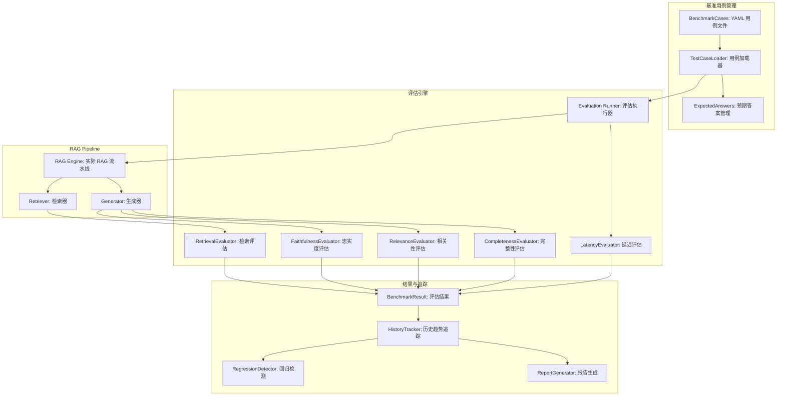
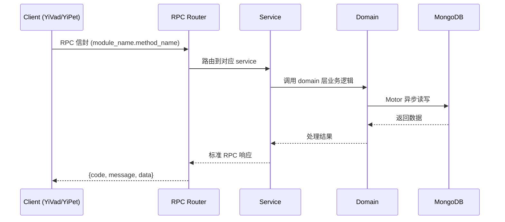

---

doc_type: module
prd_task_id: "YA-09-213"
title: "YA-09-213: RAG评估基准 — 标准测试查询与预期答案、自动化评估指标（忠实度/相关性/完整性/延迟）、RAG变更回归测试、基准历史追踪 — 开发任务"
status: 需求已编写
priority: P2
owner: 陈铭
roles: [engineer]
created: 2026-09-11
updated: 2026-09-11
project: YiAi
project_id: yiai
prd_month: "202609"
estimate_frontend: 0.3
source_prd: "213-需求-RAG评估基准.md"
source_okr: [yiai-001]

type: task
---

# YA-09-213: RAG评估基准 — 标准测试查询与预期答案、自动化评估指标（忠实度/相关性/完整性/延迟）、RAG变更回归测试、基准历史追踪 — 开发任务

> **文档职责**: 本文档定义**怎么做、为什么这么做、实际做成什么样**（HOW），不含产品目标与测试用例。

> 来源 PRD: [213-需求-RAG评估基准.md](../../prds/2026-09/213-需求-RAG评估基准.md)
> 需求编号: YA-09-213 · 优先级: P2 · 人天: 0.3d

---

<a id="sec-1"></a>
## 一、架构概览



<a id="sec-2"></a>
## 二、文件清单

| 文件 | 操作 | 说明 |
|------|------|------|
| `domain/XXX/models.py` | 新增 | 数据模型定义 |
| `domain/XXX/service.py` | 新增 | 核心服务逻辑 |
| `services/XXX/rpc_handler.py` | 新增 | RPC 路由处理器 |
| `tests/test_XXX.py` | 新增 | 单元测试 |

<a id="sec-3"></a>
## 三、模块设计

### 1. 核心组件

```python
 YiAi/src/services/rag/evaluation/runner.py (新增)

import time
import yaml
from dataclasses import dataclass, field
from typing import Optional

@dataclass
class RetrievalMetrics:
    hit_rate_at_3: float = 0.0
    hit_rate_at_5: float = 0.0
    mrr: float = 0.0
    ndcg_at_5: float = 0.0

@dataclass
class GenerationMetrics:
    faithfulness: float = 0.0   # 1-5
    relevance: float = 0.0       # 1-5
    completeness: float = 0.0    # 1-5

@dataclass
class CaseResult:
    case_id: str
    category: str
    question: str
# ... (完整实现见 PRD)
```

### 2. 核心组件

```python
 YiAi/src/services/rag/evaluation/faithfulness.py (新增)

class FaithfulnessEvaluator:
    """使用 LLM 评估生成答案的忠实度（是否基于检索上下文而非幻觉）"""

    FAITHFULNESS_PROMPT = """
    你是一个 RAG 质量评估专家。请评估以下生成答案对其检索上下文的忠实度。

    忠实度定义：答案中的每一个断言是否都能在检索到的上下文中找到依据。
    - 5 分：所有断言都能在上下文中找到明确依据，无任何虚构信息
    - 4 分：几乎所有断言都有依据，仅有微小推断（如概括性语句）
    - 3 分：大部分断言有依据，但包含 1-2 处无法在上下文中验证的信息
    - 2 分：答案中相当一部分信息无法在上下文中找到依据
    - 1 分：答案中的大部分信息与上下文无关或相矛盾

    问题：{question}

    检索到的上下文：
    {context}

    生成的答案：
    {answer}

    请仅返回一个 JSON 对象：
    {{"score": <1-5>, "reason": "<简要理由>"}}
# ... (完整实现见 PRD)
```


<a id="sec-4"></a>
## 四、数据流



**调用链路**: `Client → RPC Router → Service → Domain → MongoDB`  
**响应格式**: `{code: 0, message: "ok", data: ...}`  
**异步模型**: 全链路 `async/await`，Motor 异步 MongoDB 驱动。

<a id="sec-5"></a>
## 五、实施路线图

**预估人天**: 0.3d

| 步骤 | 操作 | 路径 | 验证 | 人天 |
|------|------|------|------|------|
| 1 | 设计并编写基准用例 | `baseline.yaml` | 50+ 用例覆盖 5 种类别 | 0.04 |
| 2 | 实现检索指标评估器 | `retrieval.py` | Hit Rate/MRR/NDCG 计算正确 | 0.03 |
| 3 | 实现忠实度评估器 | `faithfulness.py` | LLM-as-Judge 评分合理 | 0.04 |
| 4 | 实现相关性/完整性评估器 | `relevance.py` + `completeness.py` | 评分与人工一致 > 85% | 0.04 |
| 5 | 实现评估执行器和报告 | `runner.py` + `report.py` | 全流程可运行 | 0.05 |
| 6 | 实现历史追踪和回归检测 | `history.py` | 趋势存储 + 回归告警 | 0.04 |
| 7 | 集成 CI 和 CLI 工具 | `cli.py` + CI workflow | CI 中 2min 内完成 | 0.04 |
| 8 | 编写评估 API | `evaluation_routes.py` | 手动触发 + 查看历史 | 0.02 |

**总人天：0.3d**


<a id="sec-6"></a>
## 六、代码审查检查清单

- [ ] 基准用例覆盖 5 种查询类别（事实/推理/聚合/否定/边缘）
- [ ] 检索指标（Hit Rate/MRR/NDCG）计算正确
- [ ] 忠实度评估 prompt 定义清晰，评分标准明确
- [ ] 评估 LLM 使用独立的模型实例（非 RAG 生成 LLM）
- [ ] 评估结果为 JSON 格式，解析有错误处理
- [ ] 回归检测阈值可配置
- [ ] CI 脚本仅运行 Top-10 用例，2min 内完成
- [ ] 评估报告持久化到 MongoDB（含时间戳和版本）
- [ ] 历史趋势 API 返回时间序列数据
- [ ] 评估 LLM 不可用时降级为跳过生成指标


<a id="sec-7"></a>
## 七、风险评估

| 风险 | 概率 | 影响 | 缓解措施 |
|------|------|------|----------|
| LLM-as-Judge 评估不一致 | 中 | 中 | 使用独立评估模型（非被评估的模型），多次评估取平均 |
| 基准用例过时 | 中 | 中 | 每月审查基准用例，标记需要更新的用例 |
| 全量评估耗时过长 | 中 | 低 | CI 仅跑关键用例，全量在异步任务中运行 |
| 评估 LLM 成本 | 低 | 中 | 使用小的评估专用模型（如 qwen2.5:7b），本地运行无需 API 费用 |
| 误报回归 | 中 | 低 | 回归阈值可配置，支持人工确认和忽略 |


<a id="sec-8"></a>
## 八、回滚方案

| 场景 | 回滚操作 | 影响 |
|------|----------|------|
| 评估器 LLM 不可用 | 跳过需要 LLM 的指标，仅汇报检索指标 | 生成质量指标缺失 |
| 基准用例文件损坏 | 使用上一版本 YAML 文件 | 最近新增用例丢失 |
| CI 评估耗时过长 | 减少 CI 用例至 5 个 | 快速但覆盖减少 |
| 完全回滚 | 禁用基准评估 | 回到手工抽查模式 |

