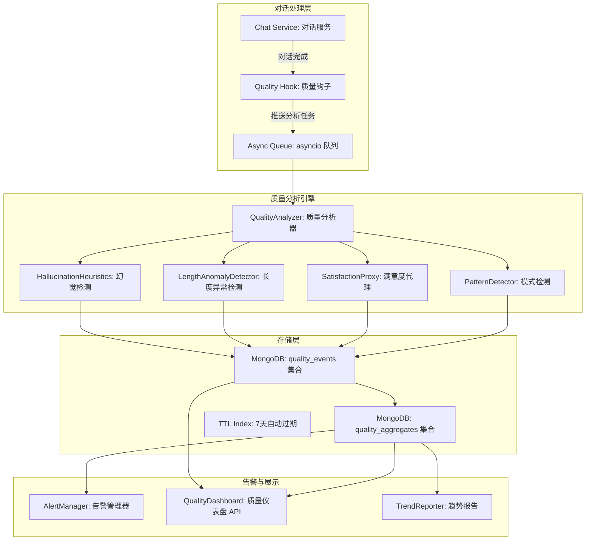
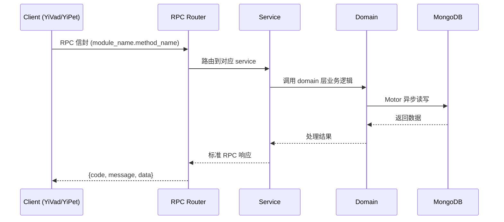

---

doc_type: module
prd_task_id: "YA-09-146"
title: "YA-09-146: 对话质量监控 — 幻觉检测 + 异常告警 — 开发方案"
status: 需求已编写
priority: P2
owner: 陈铭
roles: [engineer]
created: 2026-09-11
updated: 2026-09-14
project: YiAi
project_id: yiai
prd_month: "202609"
estimate_frontend: 0.5
source_prd: "214-需求-对话质量监控.md"
source_okr: [yiai-001]

type: task
---

# YA-09-146: 对话质量监控 — 幻觉检测 + 异常告警 — 开发方案

> **文档职责**: 本文档定义**怎么做、为什么这么做、实际做成什么样**（HOW），不含产品目标与测试用例。

> 来源 PRD: [214-需求-对话质量监控.md](../../prds/2026-09/214-需求-对话质量监控.md)
> 需求编号: YA-09-146 · 优先级: P2 · 人天: 0.5d

---

<a id="sec-1"></a>
## 一、架构概览



<a id="sec-2"></a>
## 二、文件清单

| 文件 | 操作 | 说明 |
|------|------|------|
| `domain/XXX/models.py` | 新增 | 数据模型定义 |
| `domain/XXX/service.py` | 新增 | 核心服务逻辑 |
| `services/XXX/rpc_handler.py` | 新增 | RPC 路由处理器 |
| `tests/test_XXX.py` | 新增 | 单元测试 |

<a id="sec-3"></a>
## 三、模块设计

### 1. 核心组件

```python
 YiAi/src/domain/quality/models.py (新增)

from dataclasses import dataclass, field
from enum import Enum

class HallucinationType(str, Enum):
    OVERCONFIDENT_RESTRICTION = "overconfident_restriction"
    SELF_CONTRADICTION = "self_contradiction"
    FICTITIOUS_REFERENCE = "fictitious_reference"
    UNREASONABLE_PRECISION = "unreasonable_precision"
    FICTITIOUS_API = "fictitious_api"
    OUT_OF_KNOWLEDGE = "out_of_knowledge"
    EVASIVE_PATTERN = "evasive_pattern"

class SatisfactionSignal(str, Enum):
    REGENERATE = "regenerate"       # 用户重新生成回答
    CORRECT_FOLLOWUP = "correct"     # 用户追问修正
    QUICK_END = "quick_end"          # 回答后快速结束（好）
    COPY = "copy"                    # 用户复制回答（好）
    THUMBS_UP = "thumbs_up"          # 显式赞（如果有）
    THUMBS_DOWN = "thumbs_down"      # 显式踩（如果有）

@dataclass
class QualityEvent:
    session_key: str
# ... (完整实现见 PRD)
```

### 2. 核心组件

```python
 YiAi/src/services/quality/hallucination.py (新增)

import re

class HallucinationDetector:
    """基于启发式规则的幻觉检测引擎"""

    # 虚构引用模式
    FICTITIOUS_REF_PATTERNS = [
        r'根据.*[《「].*[》」].*文档',
        r'参见.*第\d+章',
        r'在.*官方文档.*中提到',
        r'参考.*第\d+页',
        r'详见.*README',
    ]

    # 不合理精确数字模式
    UNREASONABLE_PRECISION_PATTERNS = [
        r'\d{2,3}\.\d{1,2}%',                    # 87.3%
        r'平均.*\d+\.\d+.*(?:秒|分钟|小时|天)',    # 平均 3.7 秒
    ]

    # 虚构 API/命令模式
    FICTITIOUS_API_PATTERNS = [
        r'`[a-zA-Z_]+\.[a-zA-Z_]+\(.*\)`',         # `some.api_call()`
# ... (完整实现见 PRD)
```

### 3. 核心组件


<a id="sec-4"></a>
## 四、数据流



**调用链路**: `Client → RPC Router → Service → Domain → MongoDB`  
**响应格式**: `{code: 0, message: "ok", data: ...}`  
**异步模型**: 全链路 `async/await`，Motor 异步 MongoDB 驱动。

<a id="sec-5"></a>
## 五、实施路线图

**预估人天**: 0.5d

| 步骤 | 操作 | 路径 | 验证 | 人天 |
|------|------|------|------|------|
| 1 | 定义质量事件数据模型 | `models.py` | 模型正确 | 0.02 |
| 2 | 实现幻觉检测引擎 | `hallucination.py` | 7 种模式覆盖 | 0.05 |
| 3 | 实现满意度代理计算 | `satisfaction.py` | 4 种信号有效 | 0.04 |
| 4 | 实现长度异常检测 | `anomaly.py` | 滑动窗口 Z-score 准确 | 0.02 |
| 5 | 实现质量分析主引擎 | `analyzer.py` | 全流程正确 | 0.04 |
| 6 | 实现 Conversation Hook | `quality_hook.py` | 零延迟影响 | 0.03 |
| 7 | 实现聚合 + 告警 | `aggregator.py` + `alerting.py` | 天级聚合 + 阈值告警 | 0.04 |
| 8 | 实现仪表盘 API | `quality_routes.py` | 实时/历史数据 | 0.04 |
| 9 | 编写测试 | 测试目录 | 幻觉检测规则准确性 | 0.02 |

**总人天：0.3d**


<a id="sec-6"></a>
## 六、代码审查检查清单

- [ ] Quality Hook 在对话完成后非阻塞推送
- [ ] 幻觉检测 7 种模式均实现且有对应测试用例
- [ ] 满意度代理 4 种信号正确计算
- [ ] 长度异常检测滑动窗口正确维护
- [ ] 分析 Worker 从 asyncio.Queue 消费
- [ ] Worker 异常不影响对话服务（隔离在独立协程）
- [ ] quality_events TTL 索引 7 天后自动删除
- [ ] 质量仪表盘 API 返回正确的时间序列数据
- [ ] 告警规则可配置（阈值/持续时间/静默期）
- [ ] 对话文本不进入 quality_events（仅统计特征）


<a id="sec-7"></a>
## 七、风险评估

| 风险 | 概率 | 影响 | 缓解措施 |
|------|------|------|----------|
| 幻觉检测误报率高 | 中 | 中 | 使用启发式而非硬判断，标记为"疑似"而非"确定"；提供反馈机制标记误报 |
| 满意度代理不准 | 中 | 中 | 多信号融合降低单信号噪声；标注"代理分数"而非"满意度" |
| Worker 消费积压 | 低 | 中 | 监控队列长度，积压 > 1000 时扩容 worker 或降级采样 |
| 对话内容隐私泄露 | 低 | 高 | quality_events 不存储完整对话文本，仅存储分析结果和统计特征 |
| 告警疲劳 | 中 | 低 | 合并相同类型告警（30min 内仅发送一次），提供告警安静期 |


<a id="sec-8"></a>
## 八、回滚方案

| 场景 | 回滚操作 | 影响 |
|------|----------|------|
| 幻觉检测严重误报 | 提高检测阈值或禁用特定规则 | 假阴性增多 |
| Worker 队列积压 | 降级为随机采样（10%）分析 | 数据粒度下降 |
| 告警轰炸 | 关闭自动告警，保留仪表盘手动查看 | 失去主动通知 |
| 完全回滚 | 移除 quality_hook | 回到质量黑盒 |

