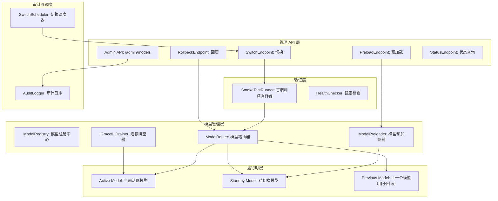
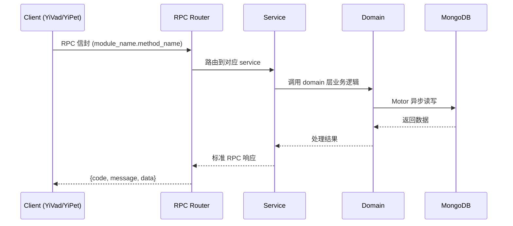

---

doc_type: module
prd_task_id: "YA-09-144"
title: "YA-09-144: 模型热切换 — 原子切换 + 预加载 + 回滚 — 开发方案"
status: 需求已编写
priority: P2
owner: 陈铭
roles: [engineer]
created: 2026-09-11
updated: 2026-09-14
project: YiAi
project_id: yiai
prd_month: "202609"
estimate_frontend: 0.5
source_prd: "215-需求-模型热切换.md"
source_okr: [yiai-002]

type: task
---

# YA-09-144: 模型热切换 — 原子切换 + 预加载 + 回滚 — 开发方案

> **文档职责**: 本文档定义**怎么做、为什么这么做、实际做成什么样**（HOW），不含产品目标与测试用例。

> 来源 PRD: [215-需求-模型热切换.md](../../prds/2026-09/215-需求-模型热切换.md)
> 需求编号: YA-09-144 · 优先级: P2 · 人天: 0.5d

---

<a id="sec-1"></a>
## 一、架构概览



<a id="sec-2"></a>
## 二、文件清单

| 文件 | 操作 | 说明 |
|------|------|------|
| `domain/XXX/models.py` | 新增 | 数据模型定义 |
| `domain/XXX/service.py` | 新增 | 核心服务逻辑 |
| `services/XXX/rpc_handler.py` | 新增 | RPC 路由处理器 |
| `tests/test_XXX.py` | 新增 | 单元测试 |

<a id="sec-3"></a>
## 三、模块设计

### 1. 核心组件

```python
 YiAi/src/services/model/hotswap/registry.py (新增)

from dataclasses import dataclass, field
from enum import Enum
from typing import Optional
import asyncio

class ModelState(str, Enum):
    UNKNOWN = "unknown"
    LOADING = "loading"        # 正在从 Ollama 拉取
    LOADED = "loaded"          # 已加载到 GPU，未激活
    ACTIVE = "active"           # 当前服务中的模型
    DRAINING = "draining"       # 正在排空
    UNLOADED = "unloaded"

@dataclass
class ModelInstance:
    name: str                   # 模型名称，如 "qwen2.5:7b"
    state: ModelState = ModelState.UNKNOWN
    loaded_at: Optional[float] = None
    activated_at: Optional[float] = None
    request_count: int = 0
    error_count: int = 0
    avg_latency_ms: float = 0.0

# ... (完整实现见 PRD)
```

### 2. 核心组件

```python
 YiAi/src/services/model/hotswap/router.py (新增)

from typing import Optional

class ModelRouter:
    """透明模型路由器 —— 所有 LLM 调用通过此层，自动路由到活跃模型"""

    def __init__(self, registry: ModelRegistry, model_runtime):
        self.registry = registry
        self.runtime = model_runtime

    async def generate(self, prompt: str, **kwargs) -> str:
        """透明代理到当前活跃模型"""
        active = self.registry.active
        if not active:
            raise RuntimeError("没有活跃模型可用")

        # 记录请求（用于排空跟踪）
        request_id = self._start_request(active.name)

        try:
            result = await self.runtime.generate(active.name, prompt, **kwargs)
            active.request_count += 1
            return result
        except Exception as e:
# ... (完整实现见 PRD)
```

### 3. 核心组件


<a id="sec-4"></a>
## 四、数据流



**调用链路**: `Client → RPC Router → Service → Domain → MongoDB`  
**响应格式**: `{code: 0, message: "ok", data: ...}`  
**异步模型**: 全链路 `async/await`，Motor 异步 MongoDB 驱动。

<a id="sec-5"></a>
## 五、实施路线图

**预估人天**: 0.5d

| 步骤 | 操作 | 路径 | 验证 | 人天 |
|------|------|------|------|------|
| 1 | 实现模型注册中心 | `registry.py` | 状态机正确 | 0.04 |
| 2 | 实现模型路由器 | `router.py` | 透明代理正确 | 0.03 |
| 3 | 实现预加载和排空器 | `preloader.py` + `drainer.py` | Ollama pull + drain 有效 | 0.04 |
| 4 | 实现冒烟测试 | `smoke_test.py` | 3 个测试通过/失败判断正确 | 0.03 |
| 5 | 实现切换 API | `model_routes.py` | preload/switch/rollback/status | 0.05 |
| 6 | 实现调度器和审计 | `scheduler.py` + `audit.py` | 定时执行 + 日志记录 | 0.04 |
| 7 | 集成到现有 ModelRuntime | `router.py` 替换直接调用 | 所有 LLM 调用通过 Router | 0.04 |
| 8 | 编写测试 | 测试目录 | 状态机 + 切换逻辑 | 0.03 |

**总人天：0.3d**


<a id="sec-6"></a>
## 六、代码审查检查清单

- [ ] ModelRegistry 状态机转换正确（UNKNOWN→LOADING→LOADED→ACTIVE→DRAINING→UNLOADED）
- [ ] ModelRouter 对 LLM 调用方透明（不需要修改调用代码）
- [ ] 预加载检查 GPU 显存，不足时拒绝操作
- [ ] 冒烟测试 3 种场景（推理/语言/代码）全部通过才切换
- [ ] 排空器有超时保护（默认 30s）
- [ ] 回滚无需冒烟测试（上一个已验证模型）
- [ ] 切换 API 有权限控制（需要 ADMIN token）
- [ ] 审计日志持久化到 MongoDB
- [ ] 定时调度器在切换失败时记录日志 + 告警
- [ ] 响应头 `X-Model` 正确反映当前活跃模型
- [ ] asyncio.Lock 保护并发切换操作


<a id="sec-7"></a>
## 七、风险评估

| 风险 | 概率 | 影响 | 缓解措施 |
|------|------|------|----------|
| GPU 显存不足同时加载两个模型 | 高 | 高 | 预加载前检查 GPU 显存可用量；支持 CPU offload 模式（速度降级但不阻塞） |
| 冒烟测试时间过长 | 低 | 中 | 限制冒烟测试 3 个问题，总计 < 10s；提供跳过冒烟选项 |
| 排空窗口内请求积压 | 低 | 中 | 切换期间新请求 → 新模型，不影响吞吐；仅旧请求等待排空 |
| Ollama 不支持模型间 GPU 共享 | 中 | 高 | 通过 Ollama keep_alive 机制保留两个模型；必要时先卸载旧模型再加载新模型 |
| 调度器执行失败无感知 | 低 | 中 | 调度失败时写入审计日志 + 发送告警 |


<a id="sec-8"></a>
## 八、回滚方案

| 场景 | 回滚操作 | 影响 |
|------|----------|------|
| 切换 API 崩溃 | 手动 kill 并重启服务（回退到旧模型） | 停机（回退到旧方式） |
| 预加载导致 OOM | 立即卸载 Standby 模型，标记预加载失败 | 切换需先 OOM 恢复 |
| 调度执行失败 | 手动通过 API 补充切换 | 轻微延迟 |
| 完全回滚 | 禁用 ModelRouter，恢复直接调用 | 回到静态模型配置模式 |

