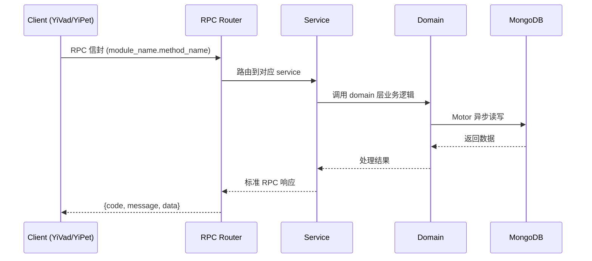

---

doc_type: module
prd_task_id: "YA-09-147"
title: "YA-09-147: 知识新鲜度管理 — 过期评分 + 自动重索引 — 开发方案"
status: 需求已编写
priority: P2
owner: 陈铭
roles: [engineer]
created: 2026-09-11
updated: 2026-09-14
project: YiAi
project_id: yiai
prd_month: "202609"
estimate_frontend: 0.5
source_prd: "216-需求-知识新鲜度管理.md"
source_okr: [yiai-001]

type: task
---

# YA-09-147: 知识新鲜度管理 — 过期评分 + 自动重索引 — 开发方案

> **文档职责**: 本文档定义**怎么做、为什么这么做、实际做成什么样**（HOW），不含产品目标与测试用例。

> 来源 PRD: [216-需求-知识新鲜度管理.md](../../prds/2026-09/216-需求-知识新鲜度管理.md)
> 需求编号: YA-09-147 · 优先级: P2 · 人天: 0.5d

---

<a id="sec-1"></a>
## 一、架构概览

```mermaid
graph TD
    subgraph "数据采集层"
        A1[KnowledgeMonitor: 知识监视器]
        A2[ContentHasher: 内容哈希计算]
        A3[FrontmatterParser: Frontmatter 解析]
    end

    subgraph "新鲜度引擎"
        B1[StalenessCalculator: 过时评分计算]
        B2[TimeDecayModel: 时间衰减模型]
        B3[ContentStability: 内容稳定性分析]
        B4[ReferenceFreshness: 引用新鲜度传播]
        B5[ManualReview: 人工审查标记]
    end

    subgraph "检索增强层"
        C1[FreshnessBooster: 新鲜度增强器]
        C2[BoostConfig: 增强配置]
        C3[ResultAnnotator: 结果标注]
    end

    subgraph "监控与告警"
        D1[FreshnessDashboard: 新鲜度仪表盘]
        D2[StalenessAlerter: 过时告警]
        D3[CategoryThresholds: 分类阈值管理]
    end

    subgraph "存储层"
        E1[MongoDB: knowledge_files (含 freshness 字段)]
        E2[MongoDB: freshness_history (新鲜度变更历史)]
        E3[VectorIndex: llama_index (含 freshness_boost)]
    end

    A1 --> A2 --> A3
    A3 --> B1
    B1 --> B2 & B3 & B4 & B5
    B1 --> E1
    E1 --> C1
    C1 --> C2
    C1 --> C3
    C3 --> E3
    E1 --> D1
    D1 --> D2
    D1 --> D3
```

<a id="sec-2"></a>
## 二、文件清单

| 文件 | 操作 | 说明 |
|------|------|------|
| `domain/XXX/models.py` | 新增 | 数据模型定义 |
| `domain/XXX/service.py` | 新增 | 核心服务逻辑 |
| `services/XXX/rpc_handler.py` | 新增 | RPC 路由处理器 |
| `tests/test_XXX.py` | 新增 | 单元测试 |

<a id="sec-3"></a>
## 三、模块设计

### 1. 核心组件

```python
 YiAi/src/domain/freshness/models.py (新增)

from dataclasses import dataclass, field
from enum import Enum

class FreshnessLevel(str, Enum):
    FRESH = "fresh"               # < 7 天
    NORMAL = "normal"             # 7-30 天
    SLIGHTLY_STALE = "slightly"    # 30-90 天
    STALE = "stale"               # 90-180 天
    VERY_STALE = "very_stale"     # > 180 天

class ReviewStatus(str, Enum):
    VERIFIED = "verified"         # 人工验证内容正确
    NEEDS_REVIEW = "needs_review"  # 需要审查
    OUTDATED = "outdated"         # 标记为已过时

@dataclass
class FreshnessScore:
    document_path: str
    # 四因子评分（0-100，越高越新鲜）
    time_score: float             # 时间衰减分数
    stability_score: float        # 内容稳定性分数
    reference_score: float        # 引用新鲜度分数
    review_score: float           # 人工审查分数
# ... (完整实现见 PRD)
```

### 2. 核心组件

```python
 YiAi/src/services/freshness/calculator.py (新增)

import time
import hashlib
from collections import defaultdict

class StalenessCalculator:
    """多因子过时评分计算器"""

    def __init__(self, db_repo, thresholds: dict = None):
        self.db = db_repo
        self.thresholds = thresholds or CATEGORY_THRESHOLDS

    async def calculate(self, doc: dict) -> FreshnessScore:
        """计算单个文档的过时评分"""
        path = doc['_id']
        category = doc.get('category', 'default')
        now = time.time()

        # 1. 时间衰减分数 (0-100)
        updated_at = doc.get('frontmatter', {}).get('updated', doc.get('mtime', now))
        days_since_update = (now - updated_at) / 86400 if isinstance(updated_at, (int, float)) else 90
        cat_threshold = self.thresholds.get(category, self.thresholds['default'])
        time_score = max(0, 100 - (days_since_update / cat_threshold['fresh_days']) * 100)

# ... (完整实现见 PRD)
```

### 3. 核心组件


<a id="sec-4"></a>
## 四、数据流



**调用链路**: `Client → RPC Router → Service → Domain → MongoDB`  
**响应格式**: `{code: 0, message: "ok", data: ...}`  
**异步模型**: 全链路 `async/await`，Motor 异步 MongoDB 驱动。

<a id="sec-5"></a>
## 五、实施路线图

**预估人天**: 0.5d

| 步骤 | 操作 | 路径 | 验证 | 人天 |
|------|------|------|------|------|
| 1 | 定义数据模型和分类阈值 | `models.py` | frontmatter 解析正确 | 0.02 |
| 2 | 实现多因子过时评分计算 | `calculator.py` | 四因子加权聚合正确 | 0.04 |
| 3 | 实现内容哈希重索引判断 | `reindexer.py` 集成到 monitor | 避免无效重索引 | 0.03 |
| 4 | 实现检索新鲜度增强 | `booster.py` | Boost 后排序变化合理 | 0.04 |
| 5 | 实现新鲜度仪表盘 | `dashboard.py` | 概览/TopN/分类/趋势 | 0.04 |
| 6 | 实现过时告警 | `alerter.py` | 阈值告警正确 | 0.03 |
| 7 | 对现有知识库计算初始新鲜度 | 一次性迁移脚本 | 全库评分完成 | 0.03 |
| 8 | 集成到知识监视器 | `monitor.py` 修改 | 实时计算新鲜度 | 0.04 |
| 9 | 编写 API 和测试 | `freshness_routes.py` + 测试 | API 返回正确 | 0.03 |

**总人天：0.3d**


<a id="sec-6"></a>
## 六、代码审查检查清单

- [ ] 多因子评分模型四因子权重可配置
- [ ] 分类阈值从配置文件加载（支持热更新）
- [ ] 内容哈希使用 SHA-256，mtime 初筛避免无效计算
- [ ] 新鲜度 boost 因子范围 0.5-1.2，不排除任何文档
- [ ] 检索结果正确标注新鲜度等级和标签
- [ ] 级联引用更新有深度限制（3 层）
- [ ] 循环引用检测（visited set）
- [ ] 仪表盘 API 返回正确的统计和时间序列
- [ ] knowledge_files 集合正确索引（staleness_score, freshness_level, category）
- [ ] 知识监视器增量集成新鲜度计算（不显著增加轮询耗时）
- [ ] 迁移脚本为现有文档计算初始新鲜度评分


<a id="sec-7"></a>
## 七、风险评估

| 风险 | 概率 | 影响 | 缓解措施 |
|------|------|------|----------|
| 新鲜度 boost 过度压制过时但仍相关的好文档 | 中 | 中 | boost 范围 0.5-1.2（非 0），过时文档不完全排除；boost 权重可配置 |
| 内容哈希计算增加监视器负载 | 低 | 中 | mtime 初筛：仅 mtime 变化时才计算哈希（99% 轮询无需读文件） |
| 级联引用更新导致循环依赖 | 低 | 高 | 限制引用传播深度为 3 层，检测循环引用 |
| 分类阈值不合理 | 中 | 低 | 初始保守值 + 90 天后自适应调整为实际平均更新周期 |
| 文档 too many 被标记为过时 | 低 | 低 | 过时文档在检索结果中显示"仍相关？反馈帮我们改进"链接 |


<a id="sec-8"></a>
## 八、回滚方案

| 场景 | 回滚操作 | 影响 |
|------|----------|------|
| 新鲜度 boost 导致检索质量下降 | 设置 `freshness_boost_enabled = false` | 回到无新鲜度检索 |
| 内容哈希导致监视器性能下降 | 回退到仅 mtime 检测 | 可能产生无效重索引 |
| 级联更新导致性能问题 | 关闭级联更新 | 引用新鲜度不再自动传播 |
| 完全回滚 | 移除新鲜度模块 | 回到静态知识库 |

