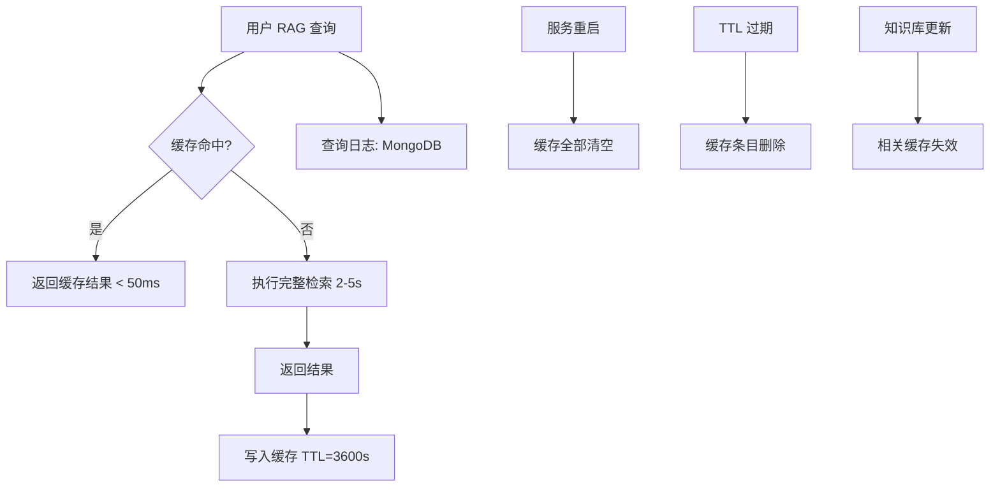
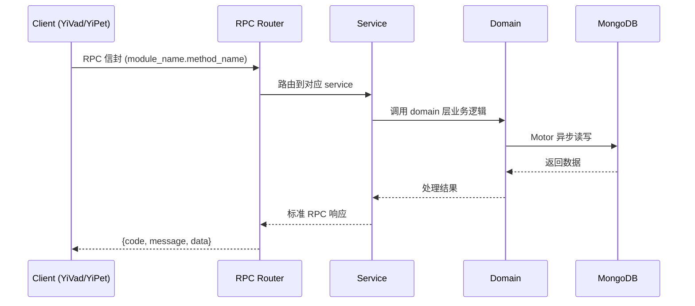

---

doc_type: module
prd_task_id: "YA-09-217"
title: "YA-09-217: 语义缓存预热 — 预测高频查询并提前计算缓存，使用模式分析，预热优先级，缓存命中等比分析，资源感知节流 — 开发任务"
status: 需求已编写
priority: P2
owner: 陈铭
roles: [engineer]
created: 2026-09-11
updated: 2026-09-11
project: YiAi
project_id: yiai
prd_month: "202609"
estimate_frontend: 0.3
source_prd: "217-需求-语义缓存预热.md"
source_okr: [yiai-001]

type: task
---

# YA-09-217: 语义缓存预热 — 预测高频查询并提前计算缓存，使用模式分析，预热优先级，缓存命中等比分析，资源感知节流 — 开发任务

> **文档职责**: 本文档定义**怎么做、为什么这么做、实际做成什么样**（HOW），不含产品目标与测试用例。

> 来源 PRD: [217-需求-语义缓存预热.md](../../prds/2026-09/217-需求-语义缓存预热.md)
> 需求编号: YA-09-217 · 优先级: P2 · 人天: 0.3d

---

<a id="sec-1"></a>
## 一、架构概览



<a id="sec-2"></a>
## 二、文件清单

| 文件 | 操作 | 说明 |
|------|------|------|
| `domain/XXX/models.py` | 新增 | 数据模型定义 |
| `domain/XXX/service.py` | 新增 | 核心服务逻辑 |
| `services/XXX/rpc_handler.py` | 新增 | RPC 路由处理器 |
| `tests/test_XXX.py` | 新增 | 单元测试 |

<a id="sec-3"></a>
## 三、模块设计

### 1. 核心组件

```python
 src/services/ai/warmup/query_predictor.py

from dataclasses import dataclass, field
from typing import Optional
from datetime import datetime, timedelta
from collections import Counter
import math


@dataclass
class PredictedQuery:
    query: str
    frequency: int           # 归一化频率
    decayed_freq: float       # 时间衰减频率
    last_queried: datetime
    priority_score: float     # 预热优先级分数
    layer: str               # L1/L2/L3


@dataclass
class WarmupPlan:
    queries: list[PredictedQuery]
    generated_at: datetime
    total_estimated_time_s: float
    layer_sizes: dict[str, int]
# ... (完整实现见 PRD)
```

### 2. 核心组件

```python
 src/services/ai/warmup/warmup_manager.py

import asyncio
import time
from dataclasses import dataclass, field
from datetime import datetime
from enum import Enum
from typing import Optional


class WarmupStatus(Enum):
    IDLE = "idle"
    RUNNING = "running"
    PAUSED = "paused"
    COMPLETED = "completed"
    FAILED = "failed"


@dataclass
class WarmupTask:
    query: str
    layer: str
    priority: float
    status: str = "pending"
    started_at: Optional[datetime] = None
# ... (完整实现见 PRD)
```

### 3. 核心组件


<a id="sec-4"></a>
## 四、数据流



**调用链路**: `Client → RPC Router → Service → Domain → MongoDB`  
**响应格式**: `{code: 0, message: "ok", data: ...}`  
**异步模型**: 全链路 `async/await`，Motor 异步 MongoDB 驱动。

<a id="sec-5"></a>
## 五、实施路线图

**预估人天**: 0.3d

| 步骤 | 操作 | 验证 | 人天 |
|------|------|------|------|
| 1 | 实现 QueryPredictor 查询预测 | 历史查询 → Top-N 预测列表 | 0.05 |
| 2 | 实现 ResourceMonitor 资源监控 | CPU/内存阈值检测正确 | 0.03 |
| 3 | 实现 WarmupManager 预热执行器 | 预热任务执行 + 暂停/恢复 | 0.06 |
| 4 | 实现预热调度器（事件+空闲触发） | 启动时自动预热，空闲时增量 | 0.04 |
| 5 | 实现 HitAnalyzer 命中分析 | 预热命中 vs 查询命中分类 | 0.04 |
| 6 | 集成预热缓存到 RAG 查询流程 | 查询优先检查预热缓存 | 0.03 |
| 7 | 实现预热进度 API 端点 | GET /warmup/status 返回进度 | 0.02 |
| 8 | 添加仪表盘指标 | Prometheus 指标导出 | 0.03 |

**总人天：0.3d**


<a id="sec-6"></a>
## 六、代码审查检查清单

- [ ] QueryPredictor 的查询归一化逻辑正确处理中文和英文
- [ ] 时间衰减使用 math.exp(-ln(2) * t / half_life) 公式
- [ ] WarmupManager 的并发控制使用 asyncio.Semaphore
- [ ] 资源监控的暂停/恢复逻辑有滞后保护（避免频繁切换）
- [ ] 缓存键使用 "warmup:" 前缀与用户查询缓存区分
- [ ] 预热任务有 30s 超时保护
- [ ] 命中分析区分 warmup_hits 和 query_hits
- [ ] 预热调度器在服务启动时自动触发
- [ ] 知识库变更事件触发针对性预热
- [ ] 所有外部调用有 try/except 错误处理


<a id="sec-7"></a>
## 七、风险评估

| 风险 | 概率 | 影响 | 缓解措施 |
|------|------|------|----------|
| 预热预测不准确，预热内容很少被访问 | 中 | 中 | 持续追踪预热命中率，命中率 < 20% 时调整预测参数 |
| 预热抢占生产资源影响用户请求 | 中 | 高 | 资源感知节流 + 最大并发数 3 + 用户请求优先 |
| 预热缓存随知识库更新而失效 | 高 | 中 | 知识库变更事件触发针对性重预热 |
| psutil 依赖在部分环境不可用 | 低 | 中 | 资源监控降级为仅检查请求队列长度 |
| 预热历史无清理导致 MongoDB 膨胀 | 低 | 低 | TTL 索引自动清理 30 天前的预热日志 |


<a id="sec-8"></a>
## 八、回滚方案

| 场景 | 回滚操作 | 影响 |
|------|------|------|
| 预热导致服务不可用 | 关闭预热功能（环境变量 WARMP_ENABLED=false） | 回退到被动缓存 |
| 预测结果严重偏离 | 清空预热缓存，重新基于最近 3 天数据预测 | 预热短暂中断 |
| 资源监控误判导致预热永不运行 | 提升暂停阈值 + 增加最大并发数 | 预热恢复正常 |
| 预热缓存污染查询分析 | 在分析中排除预热来源的缓存写入 | 分析数据准确 |

