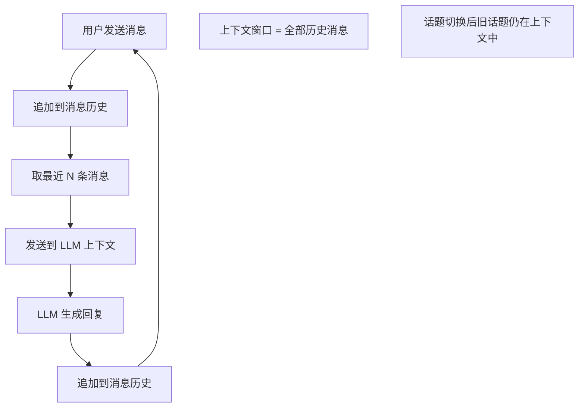
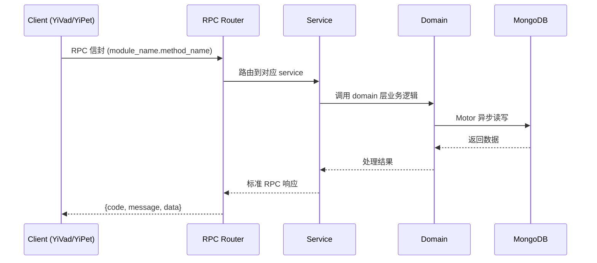

---

doc_type: module
prd_task_id: "YA-09-219"
title: "YA-09-219: 对话意图变更检测 — 检测用户对话中途切换话题，意图偏移检测，上下文窗口裁剪，无缝话题转换，变更分析，多话题会话追踪 — 开发任务"
status: 需求已编写
priority: P2
owner: 陈铭
roles: [engineer]
created: 2026-09-11
updated: 2026-09-11
project: YiAi
project_id: yiai
prd_month: "202609"
estimate_frontend: 0.3
source_prd: "218-需求-对话意图变更检测.md"
source_okr: [yiai-001]

type: task
---

# YA-09-219: 对话意图变更检测 — 检测用户对话中途切换话题，意图偏移检测，上下文窗口裁剪，无缝话题转换，变更分析，多话题会话追踪 — 开发任务

> **文档职责**: 本文档定义**怎么做、为什么这么做、实际做成什么样**（HOW），不含产品目标与测试用例。

> 来源 PRD: [218-需求-对话意图变更检测.md](../../prds/2026-09/218-需求-对话意图变更检测.md)
> 需求编号: YA-09-219 · 优先级: P2 · 人天: 0.3d

---

<a id="sec-1"></a>
## 一、架构概览



<a id="sec-2"></a>
## 二、文件清单

| 文件 | 操作 | 说明 |
|------|------|------|
| `domain/XXX/models.py` | 新增 | 数据模型定义 |
| `domain/XXX/service.py` | 新增 | 核心服务逻辑 |
| `services/XXX/rpc_handler.py` | 新增 | RPC 路由处理器 |
| `tests/test_XXX.py` | 新增 | 单元测试 |

<a id="sec-3"></a>
## 三、模块设计

### 1. 核心组件

```python
 src/services/ai/intent/change_detector.py

from dataclasses import dataclass, field
from typing import Optional
from datetime import datetime
import numpy as np


@dataclass
class IntentShiftResult:
    shift_detected: bool
    distance: float                # 语义距离 0-1
    threshold: float               # 当前阈值
    confidence: float              # 检测置信度 0-1
    current_topic_center: Optional[np.ndarray] = None
    suggested_boundary: bool = False
    reason: str = ""


@dataclass
class Topic:
    topic_id: str
    name: str = ""
    start_index: int = 0            # 消息列表中的起始索引
    end_index: Optional[int] = None
# ... (完整实现见 PRD)
```

### 2. 核心组件

```python
 src/services/ai/intent/topic_manager.py

from typing import Optional
from datetime import datetime
import uuid
import numpy as np


class TopicManager:
    """对话话题管理器"""

    def __init__(self, llm_service, embedding_service):
        self.llm = llm_service
        self.embedding = embedding_service
        self.topics: list[Topic] = []
        self.active_topic: Optional[Topic] = None
        self.topic_counter = 0

    async def start_topic(self, message: str, message_index: int) -> Topic:
        """开始一个新话题"""
        embedding = np.array(await self.embedding.embed(message))

        topic = Topic(
            topic_id=str(uuid.uuid4())[:8],
            start_index=message_index,
# ... (完整实现见 PRD)
```

### 3. 核心组件


<a id="sec-4"></a>
## 四、数据流



**调用链路**: `Client → RPC Router → Service → Domain → MongoDB`  
**响应格式**: `{code: 0, message: "ok", data: ...}`  
**异步模型**: 全链路 `async/await`，Motor 异步 MongoDB 驱动。

<a id="sec-5"></a>
## 五、实施路线图

**预估人天**: 0.3d

| 步骤 | 操作 | 验证 | 人天 |
|------|------|------|------|
| 1 | 实现 IntentChangeDetector | 话题切换语义距离 > 阈值 | 0.05 |
| 2 | 实现 TopicManager 话题管理 | 话题创建/更新/结束/恢复 | 0.05 |
| 3 | 实现 ContextManager 上下文裁剪 | 混合裁剪策略节省 70%+ token | 0.06 |
| 4 | 实现话题渐变追踪 | 滑动窗口偏移检测 | 0.03 |
| 5 | 实现话题名称生成（LLM） | 异步生成有意义的话题名称 | 0.03 |
| 6 | 集成到聊天流程 | 每轮消息检测意图切换 | 0.04 |
| 7 | 实现话题流转 API | 获取会话的话题分析 | 0.02 |
| 8 | 实现多话题会话回放 | 按话题分段查看对话 | 0.02 |

**总人天：0.3d**


<a id="sec-6"></a>
## 六、代码审查检查清单

- [ ] 余弦距离计算有零向量保护
- [ ] 话题中心更新使用指数移动平均（alpha=0.3）
- [ ] 滑动窗口大小可配置，最小 3 条消息
- [ ] LLM 兜底有超时保护（2s）
- [ ] 话题恢复检测排除当前活跃话题
- [ ] 上下文裁剪保留系统提示位置
- [ ] 话题摘要异步生成，失败不阻塞
- [ ] 话题流转记录持久化到 MongoDB
- [ ] Token 估算区分中英文字符权重
- [ ] 意图变更事件有结构化日志


<a id="sec-7"></a>
## 七、风险评估

| 风险 | 概率 | 影响 | 缓解措施 |
|------|------|------|----------|
| 语义嵌入模型对中文混合英文术语效果差 | 中 | 中 | 术语标准化预处理，常见缩写替换 |
| 阈值设置不当导致误判 | 中 | 中 | 线程可配置 + A/B 对比 + 用户反馈 |
| 上下文裁剪丢失关键信息 | 中 | 中 | 摘要保留 + 用户可查看被裁剪的消息 |
| LLM 话题命名/摘要生成超时 | 中 | 低 | 异步执行 + 超时降级为 TF-IDF |
| 滑动窗口趋势计算在小样本时不稳定 | 低 | 低 | 窗口大小自适应（最少 3 条） |


<a id="sec-8"></a>
## 八、回滚方案

| 场景 | 回滚操作 | 影响 |
|------|------|------|
| 话题检测导致频繁误切换 | 环境变量 INTENT_DETECT_ENABLED=false | 回退到全部历史上下文 |
| 上下文裁剪后 LLM 回答质量下降 | 关闭裁剪，仅保留话题追踪 | 话题分析功能保留 |
| LLM 兜底检查显著增加延迟 | 关闭 LLM 兜底，仅使用语义阈值 | 边界判断精度降低 |

