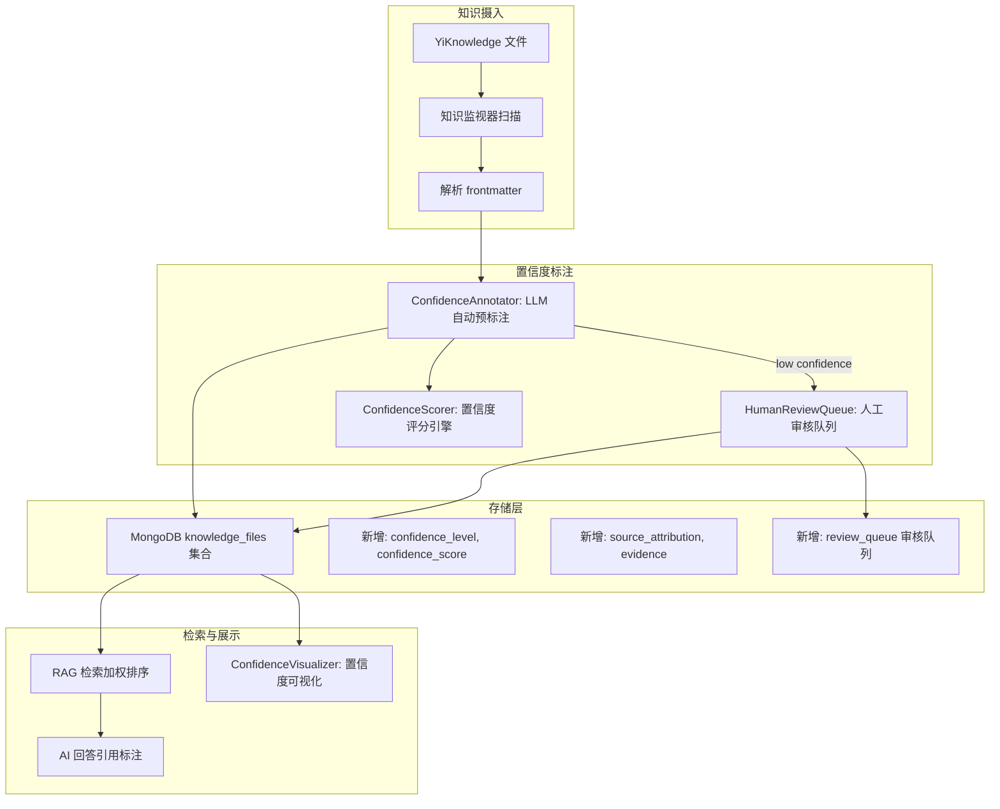
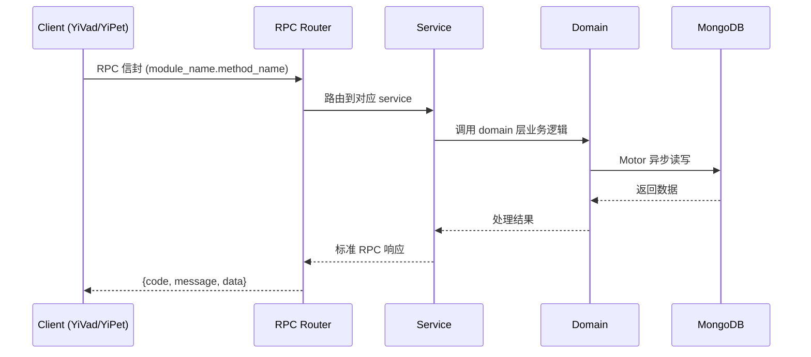

---

doc_type: module
prd_task_id: "YA-09-149"
title: "YA-09-149: 知识置信度标注 — 事实分级 + 来源归因 — 开发方案"
status: 需求已编写
priority: P2
owner: 陈铭
roles: [engineer]
created: 2026-09-11
updated: 2026-09-14
project: YiAi
project_id: yiai
prd_month: "202609"
estimate_frontend: 0.5
source_prd: "219-需求-知识置信度标注.md"
source_okr: [yiai-001]

type: task
---

# YA-09-149: 知识置信度标注 — 事实分级 + 来源归因 — 开发方案

> **文档职责**: 本文档定义**怎么做、为什么这么做、实际做成什么样**（HOW），不含产品目标与测试用例。

> 来源 PRD: [219-需求-知识置信度标注.md](../../prds/2026-09/219-需求-知识置信度标注.md)
> 需求编号: YA-09-149 · 优先级: P2 · 人天: 0.5d

---

<a id="sec-1"></a>
## 一、架构概览



<a id="sec-2"></a>
## 二、文件清单

| 文件 | 操作 | 说明 |
|------|------|------|
| `domain/XXX/models.py` | 新增 | 数据模型定义 |
| `domain/XXX/service.py` | 新增 | 核心服务逻辑 |
| `services/XXX/rpc_handler.py` | 新增 | RPC 路由处理器 |
| `tests/test_XXX.py` | 新增 | 单元测试 |

<a id="sec-3"></a>
## 三、模块设计

### 1. 核心组件

```python
 src/services/knowledge/confidence/models.py

from dataclasses import dataclass, field
from typing import Optional
from datetime import datetime
from enum import Enum


class ConfidenceLevel(str, Enum):
    VERIFIED = "verified"
    LIKELY = "likely"
    UNCERTAIN = "uncertain"
    DISPUTED = "disputed"


@dataclass
class SourceAttribution:
    source_type: str            # official_doc / blog / forum / paper / personal / unknown
    source_url: Optional[str] = None
    source_title: Optional[str] = None
    source_author: Optional[str] = None
    source_date: Optional[datetime] = None
    retrieval_method: str = "manual"  # manual / auto_extracted


# ... (完整实现见 PRD)
```

### 2. 核心组件

```python
 src/services/knowledge/confidence/auto_annotator.py

import re
from datetime import datetime
from typing import Optional


class AutoConfidenceAnnotator:
    """基于 LLM 的知识置信度自动预标注"""

    ANNOTATION_PROMPT = """你是一个知识库质量评估员。请评估以下文档内容的置信度。

评估维度:
1. 权威性: 内容是否来自官方来源/权威机构？
2. 可验证性: 内容是否能被其他来源验证？
3. 时效性: 内容是否可能过时？
4. 客观性: 内容是否客观还是主观意见？

置信度级别:
- verified (0.8-1.0): 官方文档、正式发布、多方验证的确定事实
- likely (0.5-0.8): 广泛认可的最佳实践、多次验证的经验
- uncertain (0.2-0.5): 个人经验、未验证假设、单一来源
- disputed (0.0-0.2): 可能有误、已被证伪、争议性内容

文档标题: {title}
# ... (完整实现见 PRD)
```

### 3. 核心组件


<a id="sec-4"></a>
## 四、数据流



**调用链路**: `Client → RPC Router → Service → Domain → MongoDB`  
**响应格式**: `{code: 0, message: "ok", data: ...}`  
**异步模型**: 全链路 `async/await`，Motor 异步 MongoDB 驱动。

<a id="sec-5"></a>
## 五、实施路线图

**预估人天**: 0.5d

| 步骤 | 操作 | 验证 | 人天 |
|------|------|------|------|
| 1 | 定义置信度数据模型 | MongoDB schema 扩展 | 0.02 |
| 2 | 实现来源归因提取器 | URL 分类正确 | 0.03 |
| 3 | 实现 LLM 自动预标注 | 不同类型文档标注合理性 | 0.06 |
| 4 | 实现审核队列管理 | CRUD + 状态流转 | 0.04 |
| 5 | 实现审核 API 端点 | 提交/审批/驳回/修改 | 0.03 |
| 6 | 集成到知识库扫描流程 | 新/更新文档自动预标注 | 0.04 |
| 7 | 实现 RAG 检索加权 | 置信度影响检索排序 | 0.04 |
| 8 | 实现置信度可视化 | 前端展示置信度标识 | 0.04 |

**总人天：0.3d**


<a id="sec-6"></a>
## 六、代码审查检查清单

- [ ] 4 级置信度定义清晰，每级有明确的分数范围和颜色标识
- [ ] LLM 自动标注结果经过 JSON 解析和验证
- [ ] frontmatter 手动标注优先级高于自动标注
- [ ] expirse_at 字段正确处理为可选
- [ ] 审核队列状态机完整（pending → approved/rejected/modified）
- [ ] 来源归因 URL 分类正确使用正则匹配
- [ ] MongoDB knowledge_files 新增字段有默认值
- [ ] RAG 检索加权不影响原始相似度分数
- [ ] 置信度可视化使用语义化颜色
- [ ] 审核 API 有权限控制


<a id="sec-7"></a>
## 七、风险评估

| 风险 | 概率 | 影响 | 缓解措施 |
|------|------|------|----------|
| LLM 自动标注偏见（对某些来源过度信任） | 中 | 中 | 人工抽样验证 + 标注日志可审计 |
| 审核队列堆积 | 中 | 中 | uncertain 文档仍可被检索（加权降低），审核非阻塞 |
| 置信度过期后未重新标注 | 中 | 低 | expires_at 过期触发重新标注提醒 |
| 人工标注与自动标注冲突 | 低 | 低 | frontmatter 手动标注优先级最高 |
| 审核 API 无权限控制 | 低 | 中 | 审核端点需 curator 角色权限 |


<a id="sec-8"></a>
## 八、回滚方案

| 场景 | 回滚操作 | 影响 |
|------|------|------|
| LLM 标注质量显著下降 | 环境变量 AUTO_ANNOTATE_ENABLED=false | 仅保留手动标注 |
| 检索加权导致结果质量下降 | 关闭置信度加权，回退平等排序 | 置信度仅供展示 |
| 审核队列表数据膨胀 | 归档 30 天前的已处理任务 | 历史数据移至归档集合 |
| 来源归因分类不准 | 关闭自动分类，仅保留手动来源标注 | 来源类型统一为 unknown |

