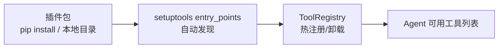

# YA-09-26: Agent 工具链插件化 — 热注册 + 动态发现 — 开发方案

> **文档职责**：本文档定义**怎么做、为什么这么做、实际做成什么样**（HOW），不含产品目标与测试用例。

> 来源 PRD：[22-需求-Agent工具链插件化.md](../../prds/2026-09/22-需求-Agent工具链插件化.md)
> 需求编号：YA-09-26 · 优先级：P2 · 人天：1.5d · 状态：需求已编写

---

<a id="sec-1"></a>
## 一、方案

将 YA-08-13 的三层工具架构升级为插件化——支持运行时热注册/卸载工具，无需重启服务。



### 插件规范

```python
# my_plugin/setup.cfg
[options.entry_points]
yiai.tools =
    web_search = my_plugin.search:WebSearchTool
    calculator = my_plugin.calc:CalculatorTool

# my_plugin/search.py
class WebSearchTool:
    name = "web_search"
    description = "搜索网页内容"
    parameters = {"query": {"type": "string"}}

    async def execute(self, query: str) -> dict:
        ...
```

### 注册表

```python
class ToolRegistry:
    def register(self, tool: ToolDef): ...
    def unregister(self, name: str): ...
    def discover(self):  # 扫描 entry_points
        for ep in importlib.metadata.entry_points(group="yiai.tools"):
            self.register(ep.load()())
    def list(self) -> list[ToolDef]: ...
```

---

<a id="sec-2"></a>
## 二、实施步骤

| 步骤 | 验证 | 人天 |
|------|------|------|
| 1 | entry_points 插件发现 | pip install 后工具自动注册 | 0.5 |
| 2 | ToolRegistry 热注册/卸载 | 运行时增删工具 | 0.5 |
| 3 | 插件隔离 + 测试 | 插件异常不影响核心 | 0.5 |

**合计：1.5d**。

---

<a id="sec-3"></a>
## 三、关联模块

- 基础：[YA-08-13 Agent 工具系统](../2026-08/13-prd-task-Agent工具系统.md)
- 关联：[YA-08-12 MCP 协议服务](../2026-08/12-prd-task-MCP协议服务.md)