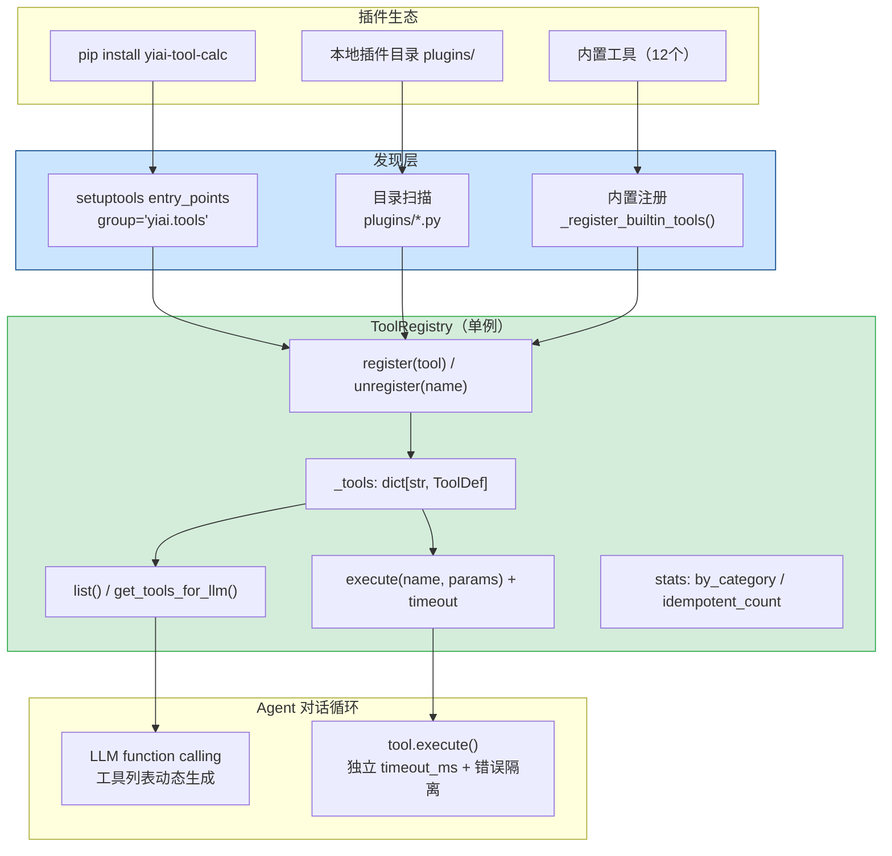

---

doc_type: module
prd_task_id: "YA-09-26"
title: "YA-09-26: Agent 工具链插件化 — 热注册 + 动态发现 — 开发方案"
status: 需求已编写
priority: P2
owner: 陈铭
roles: [engineer]
created: 2026-09-11
updated: 2026-09-23
project: YiAi
project_id: yiai
prd_month: "202609"
estimate_frontend: 1.5
source_prd: "22-需求-Agent工具链插件化.md"
source_okr: [yiai-001]

type: task
---

# YA-09-26: Agent 工具链插件化 — 热注册 + 动态发现 — 开发方案

> 来源 PRD：[22-需求-Agent工具链插件化.md](../../prds/2026-09/22-需求-Agent工具链插件化.md)
> 需求编号：YA-09-26 · 优先级：P2 · 人天：1.5d
> 依赖：YA-08-13（Agent 工具系统）· 类型：架构 · 状态：需求已编写

---

## 一、架构概述

当前 Agent 工具通过硬编码字典注册：`TOOLS = {'search_knowledge': ..., 'read_file': ...}`，新增工具需修改核心 Agent 代码。本方案将 YA-08-13 的三层工具架构升级为**插件化体系**——通过 Python `setuptools entry_points` 实现工具自动发现，`ToolRegistry` 支持运行时热注册/卸载，工具按 4 类分治（knowledge/file/data/external），每个工具独立文件、装饰器自动注册。


```mermaid
graph TD
  subgraph PluginEcosystem["插件生态"]
    P1["pip install yiai-tool-calc"]
    P2["本地插件目录 plugins/"]
    P3["内置工具（12个）"]
  end

  subgraph Discovery["发现层"]
    EPS["setuptools entry_points<br/>group='yiai.tools'"]
    SCAN["目录扫描<br/>plugins/*.py"]
    BUILTIN["内置注册<br/>_register_builtin_tools()"]
  end

  subgraph Registry["ToolRegistry（单例）"]
    TOOLS["_tools: dict[str, ToolDef]"]
    REG["register(tool) / unregister(name)"]
    LIST["list() / get_tools_for_llm()"]
    EXEC["execute(name, params) + timeout"]
    STATS["stats: by_category / idempotent_count"]
  end

  subgraph Agent["Agent 对话循环"]
    LLM["LLM function calling<br/>工具列表动态生成"]
    RUN["tool.execute()<br/>独立 timeout_ms + 错误隔离"]
  end

  P1 --> EPS --> REG
  P2 --> SCAN --> REG
  P3 --> BUILTIN --> REG
  REG --> TOOLS
  TOOLS --> LIST --> LLM
  TOOLS --> EXEC --> RUN

  style Registry fill:#d4edda,stroke:#28a745
  style Discovery fill:#cce5ff,stroke:#004085
```

### 工具分类

| 类别 | 标识 | 典型工具 | 超时 | 幂等 |
|------|------|---------|------|------|
| knowledge | 知识检索 | `web_search`, `web_fetch`, `rag_search` | 15s | 是 |
| file | 文件操作 | `file_read`, `file_write`, `read`, `write` | 10s | 否 |
| data | 数据查询 | `db_query`, `db_aggregate`, `db_stats` | 5s | 是 |
| external | 外部服务 | `http_request`, `mcp_*`, `jira_create` | 30s | 否 |

---

## 二、文件清单

| # | 文件 | 操作 | 说明 | 预估行数 |
|---|------|------|------|----------|
| 1 | `src/domain/ai/tools/__init__.py` | 新增 | 插件包初始化 + `autodiscover()` 入口 | +20 |
| 2 | `src/domain/ai/tools/registry.py` | 新增 | `ToolRegistry` 单例 + `ToolDefinition` dataclass + 装饰器 | +120 |
| 3 | `src/domain/ai/tools/plugin_loader.py` | 新增 | `entry_points` 扫描 + 本地目录发现 + 动态 import | +80 |
| 4 | `src/domain/ai/tools/base.py` | 新增 | `BasePluginTool` 抽象基类（插件开发规范） | +50 |
| 5 | `src/domain/ai/tools/builtin/` | 迁移 | 将原 `tools.py` 中 12 个内置工具拆分为独立文件 | +200（迁移） |
| 6 | `src/domain/ai/tools.py` | 修改 | 删除原 1143 行的内联工具定义，改为调用 registry | -900 / +30 |
| 7 | `src/domain/ai/tools/example_plugin/setup.cfg` | 新增 | 插件开发示例（entry_points 模板） | +15 |
| 8 | `tests/domain/ai/test_tool_registry.py` | 新增 | ToolRegistry 单元测试（注册/卸载/发现/超时/隔离） | +120 |
| 9 | `tests/domain/ai/test_plugin_loader.py` | 新增 | 插件加载测试（entry_points / 目录扫描 / 异常隔离） | +80 |
| **合计** | | | | **~715 行** |

### 组件树

```
src/domain/ai/tools/
├── __init__.py            # autodiscover() 公开接口
├── registry.py            # ToolRegistry 单例 + @register 装饰器
├── plugin_loader.py       # 插件发现（entry_points + 目录扫描）
├── base.py                # BasePluginTool ABC
├── builtin/               # 12 个内置工具（从 tools.py 拆分）
│   ├── web_search.py
│   ├── web_fetch.py
│   ├── rag_search.py
│   ├── file_read.py
│   ├── file_write.py
│   ├── read.py
│   ├── write.py
│   ├── bash.py
│   ├── grep.py
│   ├── find.py
│   ├── ls.py
│   └── edit.py
└── example_plugin/        # 插件开发模板
    ├── setup.cfg          # entry_points 配置模板
    └── calculator.py      # 示例插件：计算器工具
```

---

## 三、模块设计

### 3.1 ToolRegistry 核心

```python
from dataclasses import dataclass, field
from typing import Any, Callable, Coroutine, Optional

@dataclass
class PluginToolDefinition:
    """插件化工具声明 — 扩展 YA-08-13 的 ToolDefinition。"""
    name: str
    description: str
    parameters: dict[str, Any]          # JSON Schema
    execute: Callable[..., Coroutine[Any, Any, dict[str, Any]]]
    category: str = "general"           # knowledge | file | data | external
    idempotent: bool = False            # 可缓存标记（与 YA-09-14 联动）
    timeout_ms: int = 30_000
    requires_confirmation: bool = False # 危险操作需确认
    source: str = "builtin"             # builtin | plugin | dynamic
    version: str = "1.0.0"

class ToolRegistry:
    """Agent 工具注册中心 — 单例模式，支持热注册/卸载。"""

    _instance: Optional["ToolRegistry"] = None
    _tools: dict[str, PluginToolDefinition]
    _lock: asyncio.Lock                 # 并发注册安全

    def __new__(cls) -> "ToolRegistry":
        if cls._instance is None:
            cls._instance = super().__new__(cls)
            cls._instance._tools = {}
            cls._instance._lock = asyncio.Lock()
        return cls._instance

    @classmethod
    def register(
        cls,
        *,
        name: str,
        description: str,
        parameters: dict[str, Any],
        category: str = "general",
        idempotent: bool = False,
        timeout_ms: int = 30_000,
        requires_confirmation: bool = False,
    ) -> Callable:
        """装饰器 — 将 async 函数注册为 Agent 工具。

        用法:
          @ToolRegistry.register(
              name="search_knowledge",
              description="搜索知识库获取相关文档",
              parameters={"query": {"type": "string"}},
              category="knowledge",
              idempotent=True,
          )
          async def search_knowledge(query: str) -> dict: ...
        """
        ...

    async def unregister(self, name: str) -> None:
        """运行时卸载工具 — 不影响正在执行的调用。"""
        async with self._lock:
            if name in self._tools:
                del self._tools[name]
                logger.info(f"[ToolRegistry] 卸载工具: {name}")

    def get_tools_for_llm(
        self, categories: Optional[list[str]] = None
    ) -> list[dict[str, Any]]:
        """生成 LLM function calling 格式的工具列表。"""
        ...

    async def execute(
        self, name: str, params: dict[str, Any]
    ) -> dict[str, Any]:
        """执行工具 — 独立超时 + 错误隔离。"""
        ...

    @property
    def stats(self) -> dict[str, Any]:
        """工具统计：总数 / 按分类 / 按来源 / 幂等数。"""
        ...
```

### 3.2 插件发现机制

```python
import importlib.metadata
import importlib.util
from pathlib import Path

class PluginLoader:
    """插件发现 — entry_points 扫描 + 本地目录扫描。"""

    ENTRY_POINT_GROUP = "yiai.tools"

    @staticmethod
    async def discover_from_entry_points(registry: ToolRegistry) -> int:
        """扫描 setuptools entry_points group='yiai.tools'。

        返回: 成功注册的插件数量。
        """
        count = 0
        try:
            entry_points = importlib.metadata.entry_points(
                group=PluginLoader.ENTRY_POINT_GROUP
            )
            for ep in entry_points:
                try:
                    tool_class = ep.load()
                    tool_instance = tool_class()
                    registry.register_instance(tool_instance)
                    count += 1
                    logger.info(
                        f"[PluginLoader] 发现插件: {ep.name} "
                        f"(from {ep.value})"
                    )
                except Exception as e:
                    logger.error(
                        f"[PluginLoader] 加载插件失败: {ep.name}: {e}"
                    )
                    # 插件异常不影响其他插件加载
        except Exception as e:
            logger.warning(f"[PluginLoader] entry_points 扫描失败: {e}")
        return count

    @staticmethod
    async def discover_from_directory(
        registry: ToolRegistry,
        plugin_dir: Path,
    ) -> int:
        """扫描本地目录 plugins/*.py，动态 import 并注册。"""
        ...
```

### 3.3 插件开发基类

```python
from abc import ABC, abstractmethod

class BasePluginTool(ABC):
    """第三方插件开发基类 — 定义插件规范。"""

    @property
    @abstractmethod
    def name(self) -> str: ...

    @property
    @abstractmethod
    def description(self) -> str: ...

    @property
    @abstractmethod
    def parameters(self) -> dict[str, Any]: ...

    @property
    def category(self) -> str:
        return "external"

    @property
    def idempotent(self) -> bool:
        return False

    @property
    def timeout_ms(self) -> int:
        return 30_000

    @abstractmethod
    async def execute(self, **kwargs: Any) -> dict[str, Any]: ...

    def validate_params(self, params: dict[str, Any]) -> Optional[str]:
        """轻量级 JSON Schema 校验，返回错误描述或 None。"""
        ...
```

---

## 四、数据流

### 4.1 启动时工具发现

```
YiAi 启动 (main.py)
    │
    │  from domain.ai.tools import autodiscover
    ▼
autodiscover()
    │
    ├── 1. 加载内置工具 (builtin/*.py 中的 @register 装饰器)
    │      12 个内置工具自动注册到 ToolRegistry
    │
    ├── 2. PluginLoader.discover_from_entry_points()
    │      扫描 pip 安装的插件包 (importlib.metadata.entry_points)
    │      异常隔离：单个插件加载失败不影响其他插件
    │
    └── 3. PluginLoader.discover_from_directory(Path("plugins/"))
    │      扫描本地插件目录 plugins/*.py
    │      动态 import + 注册
    │
    ▼
ToolRegistry._tools = {
    "web_search": PluginToolDefinition(...),
    "calculator": PluginToolDefinition(...),  # 来自 pip 插件
    ...
}
    │
    │  logger.info(f"[ToolRegistry] 已加载 {len(tools)} 个工具 "
    │              f"(builtin={builtin}, plugin={plugin})")
    ▼
Agent 可用工具列表就绪
```

### 4.2 运行时工具执行

```
LLM 发出 tool_call: {name: "calculator", arguments: {expr: "2+3*4"}}
    │
    ▼
ToolRegistry.execute(name="calculator", params={expr: "2+3*4"})
    │
    ├── 1. 查找工具: tool = _tools.get("calculator")
    │      → 不存在 → 返回 ToolNotFoundError
    │
    ├── 2. 参数校验: validate_params(params, tool.parameters)
    │      → 校验失败 → 返回参数错误信息给 LLM
    │
    ├── 3. 超时保护: asyncio.wait_for(tool.execute(**params), timeout_ms/1000)
    │      → 超时 → 返回 timeout 错误
    │
    └── 4. 错误捕获: try/except Exception
           → 工具执行异常 → 返回错误内容给 LLM（不崩溃 Agent 循环）
    │
    ▼
ToolResult: {call_id: "call_123", content: "14", error: None, duration_ms: 23}
```

---

## 五、实施路线图

### 阶段一：Registry 核心 + 工具拆分（0.5d）

| 步骤 | 任务 | 验证方式 | 产出 |
|------|------|---------|------|
| 1 | 创建 `tools/` 包目录结构 | `tools/__init__.py` 可导入 | 目录骨架 |
| 2 | 实现 `ToolRegistry` 单例 + `@register` 装饰器 | 装饰器注册后 `list()` 可见 | `registry.py` |
| 3 | 将原 `tools.py` 中 12 个工具拆分为 `builtin/*.py` | 每个工具独立文件，@register 注册 | `builtin/` 目录 |

### 阶段二：插件发现 + 动态加载（0.5d）

| 步骤 | 任务 | 验证方式 | 产出 |
|------|------|---------|------|
| 4 | 实现 `PluginLoader` entry_points 扫描 | pip install 示例插件后自动注册 | `plugin_loader.py` |
| 5 | 实现本地目录扫描 `plugins/*.py` | 放入 .py 文件后工具可用 | 同上 |
| 6 | `BasePluginTool` 抽象基类 + `example_plugin` 模板 | 外部开发者可参照开发 | `base.py` + `example_plugin/` |

### 阶段三：隔离 + 测试（0.5d）

| 步骤 | 任务 | 验证方式 | 产出 |
|------|------|---------|------|
| 7 | 插件异常隔离（异常不影响核心 Agent） | 异常插件加载后其他工具仍可用 | `registry.py` |
| 8 | 单元测试（注册/卸载/发现/超时/隔离场景） | pytest 全部通过 | `test_tool_registry.py` |
| 9 | 插件加载测试（mock entry_points + 本地目录） | pytest 全部通过 | `test_plugin_loader.py` |

**合计：1.5d。**

---

## 六、Code Review 检查清单

- [ ] `ToolRegistry` 线程安全 —— `register/unregister` 使用 `asyncio.Lock`
- [ ] 插件异常不影响核心 —— `discover_from_entry_points` 中单个插件异常用 `try/except` 包装
- [ ] `unregister` 不中断正在执行的工具调用（移除注册表条目，但不 cancel task）
- [ ] `get_tools_for_llm` 返回的 function calling 格式符合 OpenAI 规范
- [ ] 工具超时 `timeout_ms` 可单独配置，默认 30s
- [ ] `idempotent` 标记与 YA-09-14 工具缓存联动正确
- [ ] 插件 `execute` 函数的签名通过 `inspect.signature` 校验参数匹配
- [ ] `example_plugin/setup.cfg` 中 `entry_points` 格式正确
- [ ] 删除旧 `tools.py` 中的硬编码字典，避免运行时双注册
- [ ] `registry.stats` 属性实时反映当前工具状态

---

## 七、技术风险评估

| 风险 | 概率 | 影响 | 缓解措施 |
|------|------|------|---------|
| entry_points 扫描在 Python 3.12+ 行为变化 | 低 | 中 | 使用 `importlib.metadata.entry_points(group=...)` 兼容写法 |
| 插件代码注入恶意逻辑 | 低 | 高 | 仅加载可信插件；生产环境禁用本地目录扫描 |
| 插件间命名冲突 | 中 | 中 | `register` 时检测重名 → 拒绝注册 + WARNING 日志 |
| 旧 `tools.py` 与新 registry 并存 | 中 | 高 | 启动时检测 `DomainTools` 类是否存在 → CRITICAL 告警 |
| 动态 import 性能影响启动时间 | 低 | 低 | 插件扫描异步执行，不阻塞 HTTP 服务就绪 |

---

## 八、关联模块

- 基础：[YA-08-13 Agent 工具系统](../2026-08/13-prd-task-Agent工具系统.md)
- 关联：[YA-09-14 Agent 工具调用缓存](./18-prd-task-Agent工具调用结果缓存.md)
- 关联：[YA-08-12 MCP 协议服务](../2026-08/12-prd-task-MCP协议服务.md)