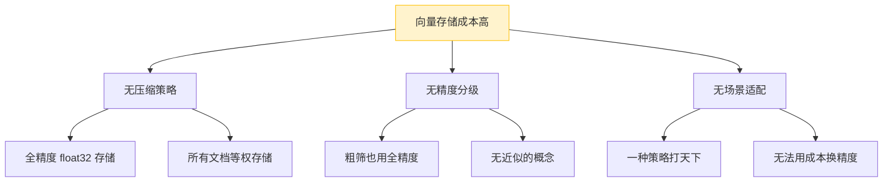
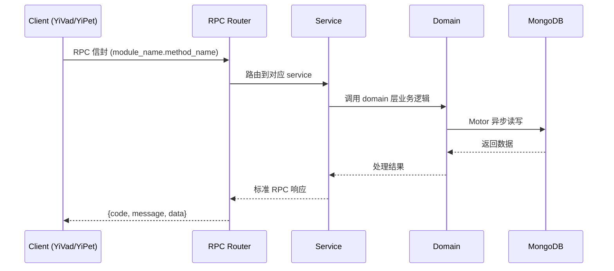

---

doc_type: module
prd_task_id: "YA-09-221"
title: "YA-09-221: 嵌入向量压缩 — PCA降维、乘积量化、标量量化、二值量化与压缩率-精度权衡 — 开发任务"
status: 需求已编写
priority: P2
owner: 陈铭
roles: [engineer]
created: 2026-09-11
updated: 2026-09-11
project: YiAi
project_id: yiai
prd_month: "202609"
estimate_frontend: 0.3
source_prd: "220-需求-嵌入向量压缩.md"
source_okr: [yiai-001]

type: task
---

# YA-09-221: 嵌入向量压缩 — PCA降维、乘积量化、标量量化、二值量化与压缩率-精度权衡 — 开发任务

> **文档职责**: 本文档定义**怎么做、为什么这么做、实际做成什么样**（HOW），不含产品目标与测试用例。

> 来源 PRD: [220-需求-嵌入向量压缩.md](../../prds/2026-09/220-需求-嵌入向量压缩.md)
> 需求编号: YA-09-221 · 优先级: P2 · 人天: 0.3d

---

<a id="sec-1"></a>
## 一、架构概览



<a id="sec-2"></a>
## 二、文件清单

```

<a id="sec-3"></a>
## 三、模块设计

### 1. 核心组件

```python
 domain/embedding/compressor.py
from abc import ABC, abstractmethod
import numpy as np

class VectorCompressor(ABC):
    """向量压缩器抽象基类。"""

    @abstractmethod
    async def fit(self, vectors: np.ndarray) -> None:
        """训练压缩器（PCA 需要训练，SQ/BQ 不需要）。"""
        ...

    @abstractmethod
    async def compress(self, vector: np.ndarray) -> np.ndarray:
        """压缩单个向量。"""
        ...

    @abstractmethod
    async def decompress(self, compressed: np.ndarray) -> np.ndarray:
        """解压向量（近似恢复）。"""
        ...

    @property
    @abstractmethod
    def compression_ratio(self) -> float:
# ... (完整实现见 PRD)
```


<a id="sec-4"></a>
## 四、数据流



**调用链路**: `Client → RPC Router → Service → Domain → MongoDB`  
**响应格式**: `{code: 0, message: "ok", data: ...}`  
**异步模型**: 全链路 `async/await`，Motor 异步 MongoDB 驱动。

<a id="sec-5"></a>
## 五、实施路线图

**预估人天**: 0.3d

| 步骤 | 内容 | 涉及文件 | 验证方式 | 人天 |
|------|------|---------|---------|------|
| 1 | 实现 `VectorCompressor` 抽象基类 + 配置管理 | `compressor.py`, `compression_config.py` | 抽象基类接口定义完整 | 0.03 |
| 2 | 实现 SQ 标量量化压缩器 | `sq_compressor.py` | float32→int8 转换正确，误差 < 1% | 0.03 |
| 3 | 实现 BQ 二值量化压缩器 | `bq_compressor.py` | binary 编码正确，汉明距离计算准确 | 0.03 |
| 4 | 实现 PCA 降维压缩器 | `pca_compressor.py` | 降维后检索召回率 > 95% | 0.05 |
| 5 | 实现 PQ 乘积量化压缩器 | `pq_compressor.py` | 码本训练收敛，重建误差 < 5% | 0.06 |
| 6 | 实现后台异步压缩任务调度 | `compression_task.py` | 异步压缩不阻塞索引，压缩率符合预期 | 0.05 |
| 7 | RAG 服务支持两阶段检索 | `rag_service.py` | 粗筛+精排结果与全精度检索一致率 > 90% | 0.03 |
| 8 | 知识索引服务触发后台压缩 | `knowledge_service.py` | 新文档入库后自动生成压缩向量 | 0.02 |

**总计：0.3d**


<a id="sec-6"></a>
## 六、代码审查检查清单

- [ ] `VectorCompressor` 抽象基类定义了完整的接口（fit/compress/decompress/ratio/name）
- [ ] PCA 压缩器正确实现了 `fit()`（协方差矩阵 + SVD）和 `compress()`（投影）
- [ ] PQ 压缩器正确实现了 K-means 码本训练和码字查表
- [ ] SQ 压缩器 float32→int8 转换时正确处理了值域缩放
- [ ] BQ 压缩器 binary 编码正确（>0 → 1, <=0 → 0）
- [ ] 后台压缩任务使用了 `asyncio.create_task` 且有限并发控制
- [ ] 两阶段检索的 coarse_top_k = top_k × multiplier
- [ ] 压缩向量存储字段与检索查询字段一致
- [ ] 无 Type 错误，所有类型注解完整


<a id="sec-7"></a>
## 七、风险评估

| 风险 | 概率 | 影响 | 等级 | 缓解措施 | 应急预案 |
|------|------|------|------|----------|----------|
| PCA 训练数据不足导致降维质量差 | 中 | 中 | 中 | 训练集至少 1000 条，训练前检查数据量 | 回退到 SQ 压缩（无需训练） |
| PQ 压缩后重排查召回率下降超预期 | 中 | 中 | 中 | 上线前用测试集评估召回率，设定阈值 90% | 增大 coarse_multiplier 或用原始向量重排 |
| 压缩任务队列积压 | 低 | 低 | 低 | 后台任务有限并发（最多 4 个），避免资源争抢 | 暂停压缩任务，手动清理队列 |
| 压缩向量与原始向量不一致 | 低 | 高 | 中 | 压缩后校验向量维度，异常时标记 `compressed: false` | 检索时检测到不一致时回退原始向量 |


<a id="sec-8"></a>
## 八、回滚方案

| 回滚场景 | 回滚方式 | 影响范围 | 恢复时间 |
|----------|----------|----------|----------|
| 压缩算法 bug 导致检索准确率暴跌 | `git revert` + 配置 `compression.enabled: false` | RAG 检索 | < 1min |
| 后台压缩任务耗尽 CPU | 配置 `compression.enabled: false`，停止新任务 | 压缩功能 | < 1min |
| 压缩向量存储损坏 | 从原始向量重新运行压缩任务 | 向量索引 | < 5min（需重新压缩） |

**回滚验证：**
- 回滚后 RAG 检索使用原始 float32 向量，召回率恢复正常
- 回滚后新的文档索引入库正常（不触发压缩）
- 回滚后已压缩的向量数据保留（不影响检索，仅不使用）

