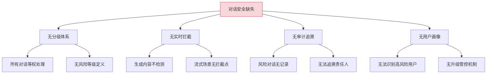
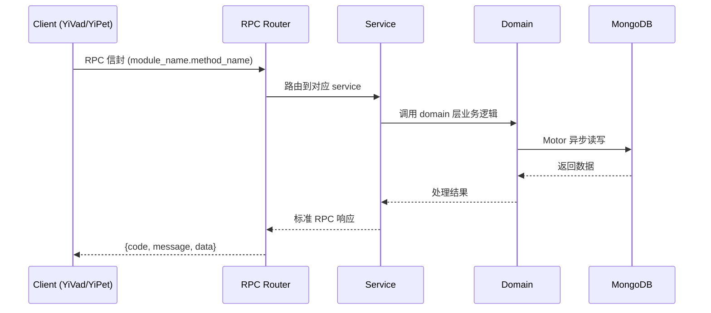

---

doc_type: module
prd_task_id: "YA-09-222"
title: "YA-09-222: 对话安全分级 — 实时内容审核、安全拦截、审计日志与用户安全画像 — 开发任务"
status: 需求已编写
priority: P2
owner: 陈铭
roles: [engineer]
created: 2026-09-11
updated: 2026-09-11
project: YiAi
project_id: yiai
prd_month: "202609"
estimate_frontend: 0.3
source_prd: "221-需求-对话安全分级.md"
source_okr: [yiai-001]

type: task
---

# YA-09-222: 对话安全分级 — 实时内容审核、安全拦截、审计日志与用户安全画像 — 开发任务

> **文档职责**: 本文档定义**怎么做、为什么这么做、实际做成什么样**（HOW），不含产品目标与测试用例。

> 来源 PRD: [221-需求-对话安全分级.md](../../prds/2026-09/221-需求-对话安全分级.md)
> 需求编号: YA-09-222 · 优先级: P2 · 人天: 0.3d

---

<a id="sec-1"></a>
## 一、架构概览



<a id="sec-2"></a>
## 二、文件清单

```

<a id="sec-3"></a>
## 三、模块设计

### 1. 核心组件

```python
 domain/safety/models.py
from enum import Enum
from pydantic import BaseModel, Field
from datetime import datetime

class SafetyLevel(str, Enum):
    SAFE = "safe"              # 正常对话
    SENSITIVE = "sensitive"    # 敏感话题，需标记
    RISKY = "risky"            # 潜在风险，需警告
    HARMFUL = "harmful"        # 有害内容，需阻断

class SafetyResult(BaseModel):
    level: SafetyLevel
    score: float = Field(ge=0.0, le=1.0)      # 风险分数
    reason: str                                  # 判定理由
    keywords_matched: list[str] = []             # 匹配的关键词
    override_by: str | None = None               # 管理员 override

class SafetyAuditEntry(BaseModel):
    session_key: str
    user: str
    level: SafetyLevel
    message_snippet: str                          # 触发判定的消息片段
    action: str                                   # "allowed" | "warned" | "blocked"
    timestamp: datetime = Field(default_factory=datetime.now)
# ... (完整实现见 PRD)
```


<a id="sec-4"></a>
## 四、数据流



**调用链路**: `Client → RPC Router → Service → Domain → MongoDB`  
**响应格式**: `{code: 0, message: "ok", data: ...}`  
**异步模型**: 全链路 `async/await`，Motor 异步 MongoDB 驱动。

<a id="sec-5"></a>
## 五、实施路线图

**预估人天**: 0.3d

| 步骤 | 内容 | 涉及文件 | 验证方式 | 人天 |
|------|------|---------|---------|------|
| 1 | 定义安全分级模型 + 枚举 | `models.py` | SafetyLevel 枚举完整，SafetyResult 模型可序列化 | 0.02 |
| 2 | 实现关键词+规则引擎判定器 | `classifier.py` | 4 个等级判定准确率 > 85%（人工标注测试集） | 0.06 |
| 3 | 实现滑动窗口流式拦截器 | `stream_interceptor.py` | harmful chunk 被正确拦截，safe chunk 正常通过 | 0.05 |
| 4 | 实现用户安全画像 + 分数累积 | `user_profile.py` | 分数计算正确，L1/L2/L3 阈值切换正常 | 0.04 |
| 5 | 实现安全审计日志 | `audit.py` | 每次安全判定写入 MongoDB safety_audit 集合 | 0.03 |
| 6 | 集成到 chat_service（输入+输出判定） | `chat_service.py` | 危险输入被阻断，流式输出被拦截 | 0.05 |
| 7 | 集成到 agent_service | `agent_service.py` | Agent 工具调用结果也经过安全判定 | 0.02 |
| 8 | 实现管理员 override API | `safety_service.py` | override 后重新判定，审计日志记录 | 0.03 |

**总计：0.3d**


<a id="sec-6"></a>
## 六、代码审查检查清单

- [ ] `SafetyLevel` 四个枚举值定义清晰，边界明确
- [ ] `SafetyClassifier` 规则模式使用编译后的正则（`re.compile`）
- [ ] `StreamSafetyInterceptor` 滑动窗口大小可配置
- [ ] safe/sensitive/risky 等级的 SSE chunk 发送不受影响
- [ ] harmful 拦截时正确发送 `safety_block` SSE 事件
- [ ] 安全判定和拦截的异常不会导致聊天服务崩溃（try-except 包裹）
- [ ] 用户安全分数更新使用 MongoDB `$inc` 原子操作
- [ ] 月度衰减使用定时任务（apscheduler）而非每次查询计算
- [ ] 安全审计日志正确记录 action（allowed/warned/blocked）


<a id="sec-7"></a>
## 七、风险评估

| 风险 | 概率 | 影响 | 等级 | 缓解措施 | 应急预案 |
|------|------|------|------|----------|----------|
| 规则引擎误判率高 | 中 | 中 | 中 | 提供管理员 override + 申诉机制 | 紧急关闭安全拦截（配置开关） |
| 滑动窗口判定延迟影响流式体验 | 低 | 低 | 低 | 判定采用异步协程，不阻塞 chunk 发送 | 降低窗口大小到 256 token |
| 恶意用户试探规则边界 | 中 | 中 | 中 | 定期更新规则模式库 | 对 L3 用户全面人工审核 |
| 安全审计日志存储膨胀 | 低 | 低 | 低 | TTL 索引 90 天自动清理 | 归档到冷存储 |


<a id="sec-8"></a>
## 八、回滚方案

| 回滚场景 | 回滚方式 | 影响范围 | 恢复时间 |
|----------|----------|----------|----------|
| 安全拦截大面积误判 | `safety.enabled: false` 配置关闭 | 对话安全 | < 1min |
| 性能下降明显 | `git revert` 安全模块集成 | 聊天/Agent 服务 | < 1min |
| 安全审计日志损坏 | 重建索引 + 从备份恢复 | 安全审计 | < 5min |

**回滚验证：**
- 回滚后对话恢复原有行为（无安全拦截）
- 回滚后聊天服务性能恢复正常（无判定开销）
- 回滚后已记录的安全审计日志保留

