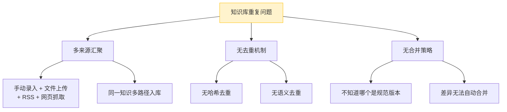
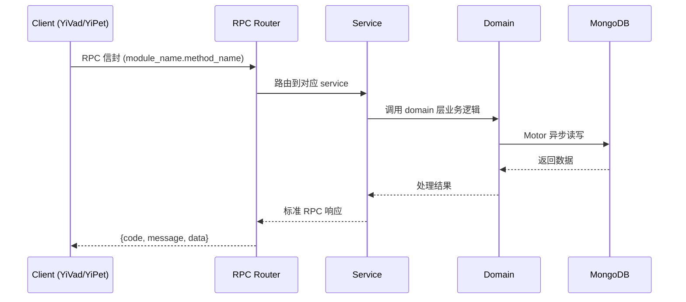

---

doc_type: module
prd_task_id: "YA-09-148"
title: "YA-09-148: 知识去重与合并 — 近似文档检测 + 语义去重 — 开发方案"
status: 需求已编写
priority: P2
owner: 陈铭
roles: [engineer]
created: 2026-09-11
updated: 2026-09-14
project: YiAi
project_id: yiai
prd_month: "202609"
estimate_frontend: 0.5
source_prd: "222-需求-知识去重与合并.md"
source_okr: [yiai-001]

type: task
---

# YA-09-148: 知识去重与合并 — 近似文档检测 + 语义去重 — 开发方案

> **文档职责**: 本文档定义**怎么做、为什么这么做、实际做成什么样**（HOW），不含产品目标与测试用例。

> 来源 PRD: [222-需求-知识去重与合并.md](../../prds/2026-09/222-需求-知识去重与合并.md)
> 需求编号: YA-09-148 · 优先级: P2 · 人天: 0.5d

---

<a id="sec-1"></a>
## 一、架构概览



<a id="sec-2"></a>
## 二、文件清单

```

<a id="sec-3"></a>
## 三、模块设计

### 1. 核心组件

```python
 domain/dedup/hash_index.py
import hashlib
from motor.motor_asyncio import AsyncIOMotorCollection

class HashIndex:
    """MD5 哈希索引 — 快速检测完全重复文档。"""

    def __init__(self):
        self.hashes: dict[str, str] = {}  # md5 → document_key

    @staticmethod
    def compute_hash(content: str) -> str:
        return hashlib.md5(content.encode("utf-8")).hexdigest()

    async def check_duplicate(self, content: str) -> str | None:
        """检查是否已存在相同哈希的文档。返回已有文档 key 或 None。"""
        h = self.compute_hash(content)
        return self.hashes.get(h)

    async def register(self, content: str, doc_key: str) -> None:
        self.hashes[self.compute_hash(content)] = doc_key

    async def load_from_db(self, collection: AsyncIOMotorCollection) -> None:
        """从 MongoDB 加载所有文档的哈希到内存。"""
        async for doc in collection.find(
# ... (完整实现见 PRD)
```


<a id="sec-4"></a>
## 四、数据流



**调用链路**: `Client → RPC Router → Service → Domain → MongoDB`  
**响应格式**: `{code: 0, message: "ok", data: ...}`  
**异步模型**: 全链路 `async/await`，Motor 异步 MongoDB 驱动。

<a id="sec-5"></a>
## 五、实施路线图

**预估人天**: 0.5d

| 步骤 | 内容 | 涉及文件 | 验证方式 | 人天 |
|------|------|---------|---------|------|
| 1 | 实现 MD5 哈希索引（内存+持久化） | `hash_index.py` | 相同内容返回已有 key，不同内容返回 None | 0.03 |
| 2 | 知识索引集成哈希去重 | `knowledge_service.py` | 重复文档入库被拒绝，返回已有文档 key | 0.03 |
| 3 | 实现语义相似度批量扫描器 | `semantic_scanner.py` | 1000 文档扫描 < 5s，重复对准确率 > 90% | 0.06 |
| 4 | 实现 LLM 辅助文档合并引擎 | `merger.py` | 合并结果保留两文档的有效信息 | 0.06 |
| 5 | 实现定时去重任务调度 | `scheduler.py` | 每天凌晨自动运行，完成后生成报告 | 0.04 |
| 6 | 实现去重管理 RPC 服务 | `dedup_service.py` | 查询重复列表、确认/拒绝合并、白名单管理 | 0.04 |
| 7 | MongoDB schema 扩展 | `repository.py` | knowledge_files 增加 content_hash 字段 | 0.02 |
| 8 | 端到端测试 | 全模块 | 完全重复被拒绝、近似重复被标记、合并后文档质量 | 0.02 |

**总计：0.3d**


<a id="sec-6"></a>
## 六、代码审查检查清单

- [ ] `HashIndex` 在应用启动时从 MongoDB 加载所有哈希（warm-up）
- [ ] `HashIndex.register` 同时写入内存和 MongoDB（持久化）
- [ ] `SemanticScanner` 使用分块计算避免 n×n 矩阵内存溢出
- [ ] 语义扫描仅处理 `updated_at` 在扫描窗口内的文档（增量扫描）
- [ ] `DocumentMerger` 的 LLM 调用有超时控制（30s）
- [ ] 合并操作使用 MongoDB 事务确保原子性（删除旧文档+插入合并文档）
- [ ] 白名单机制防止同一对文档被反复标记为重复


<a id="sec-7"></a>
## 七、风险评估

| 风险 | 概率 | 影响 | 等级 | 缓解措施 | 应急预案 |
|------|------|------|------|----------|----------|
| 语义去重误判（把不重复的标为重复） | 中 | 中 | 中 | 所有合并需人工审核，支持"不是重复"操作 | 调整阈值从 0.95 提到 0.97 |
| 大文档量扫描超时 | 低 | 中 | 低 | 分块计算 + 仅扫描最近更新的文档 | 限制单次扫描文档数 < 5000 |
| LLM 合并质量差 | 低 | 中 | 低 | 合并结果需人工审核 | 回退到"保留最新"策略 |
| 去重后 RAG 召回率下降 | 低 | 中 | 低 | 去重前备份被删除文档，支持恢复 | 从备份恢复被误删的文档 |


<a id="sec-8"></a>
## 八、回滚方案

| 回滚场景 | 回滚方式 | 影响范围 | 恢复时间 |
|----------|----------|----------|----------|
| 哈希索引错误导致正常文档被拒绝 | `git revert` 哈希去重逻辑 | 文档入库 | < 1min |
| 语义扫描导致大量误判 | 关闭定时扫描任务 | 去重功能 | < 1min |
| 合并操作误删重要文档 | 从备份恢复被删除文档 | 知识库内容 | < 5min |

**回滚验证：**
- 回滚后文档入库恢复正常（不触发去重检查）
- 回滚后已执行合并的文档需要手动恢复
- 回滚后 RAG 检索恢复到去重前的状态

