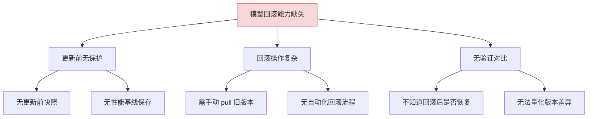
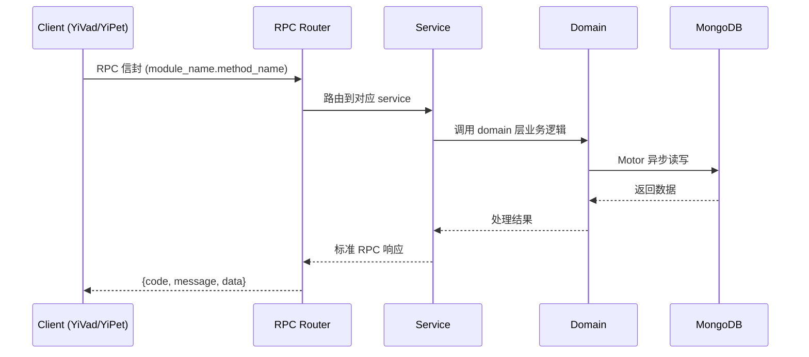

---

doc_type: module
prd_task_id: "YA-09-152"
title: "YA-09-152: 模型版本回滚 — 快照 + 一键回滚 + A/B 对比 — 开发方案"
status: 需求已编写
priority: P2
owner: 陈铭
roles: [engineer]
created: 2026-09-11
updated: 2026-09-14
project: YiAi
project_id: yiai
prd_month: "202609"
estimate_frontend: 0.5
source_prd: "223-需求-模型版本回滚.md"
source_okr: [yiai-002]

type: task
---

# YA-09-152: 模型版本回滚 — 快照 + 一键回滚 + A/B 对比 — 开发方案

> **文档职责**: 本文档定义**怎么做、为什么这么做、实际做成什么样**（HOW），不含产品目标与测试用例。

> 来源 PRD: [223-需求-模型版本回滚.md](../../prds/2026-09/223-需求-模型版本回滚.md)
> 需求编号: YA-09-152 · 优先级: P2 · 人天: 0.5d

---

<a id="sec-1"></a>
## 一、架构概览



<a id="sec-2"></a>
## 二、文件清单

```

<a id="sec-3"></a>
## 三、模块设计

### 1. 核心组件

```python
 domain/model/snapshot.py
from datetime import datetime
from pydantic import BaseModel

class ModelSnapshot(BaseModel):
    model_name: str
    snapshot_tag: str                             # Ollama tag: qwen2.5:snap-20260909-001
    snapshot_id: str                              # 快照唯一 ID
    version_before: str                           # 快照前的版本标识
    config: dict                                  # 模型配置参数
    performance_baseline: dict                    # 性能基线
    sample_queries: list[dict]                    # 样本 query + 原始输出
    created_at: datetime = Field(default_factory=datetime.now)
    created_by: str
    reason: str                                   # 快照原因（如"更新到 v2.2.0"）


# domain/model/snapshot.py (continued)
class SnapshotService:
    """模型快照服务。"""

    def __init__(self, ollama: OllamaCLI):
        self.ollama = ollama

    async def create_snapshot(
# ... (完整实现见 PRD)
```


<a id="sec-4"></a>
## 四、数据流



**调用链路**: `Client → RPC Router → Service → Domain → MongoDB`  
**响应格式**: `{code: 0, message: "ok", data: ...}`  
**异步模型**: 全链路 `async/await`，Motor 异步 MongoDB 驱动。

<a id="sec-5"></a>
## 五、实施路线图

**预估人天**: 0.5d

| 步骤 | 内容 | 涉及文件 | 验证方式 | 人天 |
|------|------|---------|---------|------|
| 1 | 封装 Ollama CLI 操作（tag/version/list） | `ollama_cli.py` | tag 创建成功，version 获取正确 | 0.03 |
| 2 | 实现模型快照服务 | `snapshot.py` | 快照创建后 MongoDB 有记录，Ollama 有 tag | 0.05 |
| 3 | 实现回滚引擎（tag 切换+配置恢复） | `rollback.py` | 回滚后模型恢复到快照版本 | 0.05 |
| 4 | 实现回滚验证器（冒烟+采样对比） | `rollback_validator.py` | 验证通过/失败判断正确 | 0.05 |
| 5 | 实现 AB 对比报告 | `ab_compare.py` | 报告包含延迟/质量/输出差异 | 0.04 |
| 6 | 实现回滚历史管理 | `rollback_history.py` | 每次回滚记录完整可追溯 | 0.03 |
| 7 | Model Service 集成 API | `model_service.py` | snapshot/rollback/compare/history 四个接口 | 0.04 |
| 8 | 端到端测试 | 全模块 | 快照→更新→回滚→验证→历史，全流程 | 0.01 |

**总计：0.3d**


<a id="sec-6"></a>
## 六、代码审查检查清单

- [ ] `OllamaCLI.tag()` 正确执行 `ollama tag source target` 命令
- [ ] `SnapshotService.create_snapshot` 在 Ollama 操作失败时不会留下不完整的快照记录
- [ ] 快照创建时采集样本 query 使用异步并发（asyncio.gather）
- [ ] `RollbackEngine.rollback` 回滚前检查快照 tag 是否仍在 Ollama 中存在
- [ ] 回滚验证的采样对比使用 embedding 余弦相似度
- [ ] 自动清理逻辑仅删除最旧的快照（保留最新 5 个）
- [ ] 快照和回滚历史的 MongoDB 集合有正确的 TTL 和查询索引


<a id="sec-7"></a>
## 七、风险评估

| 风险 | 概率 | 影响 | 等级 | 缓解措施 | 应急预案 |
|------|------|------|------|----------|----------|
| Ollama tag 操作失败 | 低 | 高 | 中 | 操作前检查 Ollama 连接状态 | 手动执行 ollama tag 命令 |
| 快照过多占用磁盘 | 低 | 低 | 低 | 限制保留最近 5 个快照，自动清理旧快照 | 手动 ollama rmi 清理旧 tag |
| 回滚验证误判 | 中 | 中 | 中 | 验证阈值可配置，支持管理员跳过验证 | 管理员手动标记回滚成功 |
| 回滚后性能更差 | 低 | 高 | 低 | 保留回滚前的版本 tag，支持"回滚的回滚" | 创建新快照后再次回滚 |


<a id="sec-8"></a>
## 八、回滚方案

| 回滚场景 | 回滚方式 | 影响范围 | 恢复时间 |
|----------|----------|----------|----------|
| 回滚功能本身异常 | `git revert` + 手动 ollama tag 恢复 | 模型管理 | < 1min |
| 快照数据损坏 | 从备份恢复 model_snapshots 集合 | 快照历史 | < 5min |
| 回滚导致模型不可用 | 重新 pull 最新版本模型 | 聊天/Agent 服务 | < 10min |

**回滚验证：**
- 回滚模型管理功能不影响正在运行的聊天服务（模型已加载）
- 回滚后已创建的 Snapshots 保留
- 回滚后活跃模型不变

