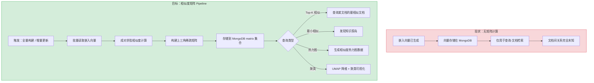
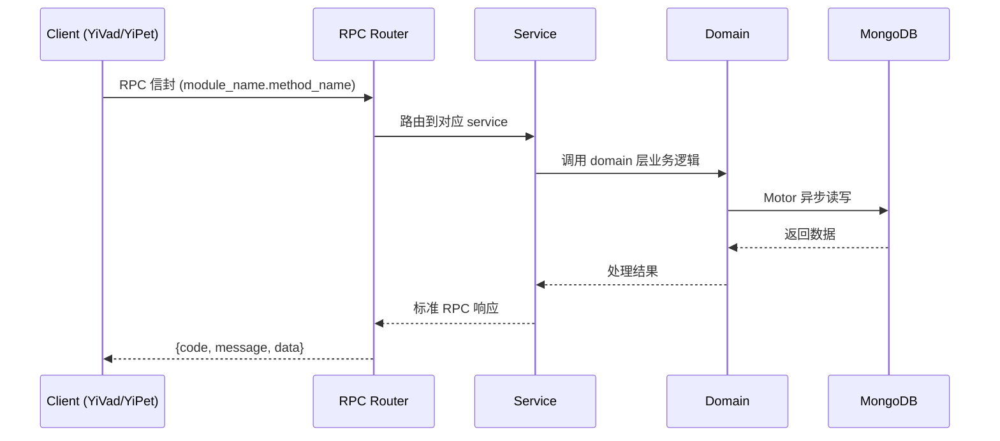

---

doc_type: module
prd_task_id: "YA-09-226"
title: "YA-09-226: 文档相似度矩阵 — 成对余弦相似度计算、相似度热力图、最相似/最不相似文档发现、聚类可视化、增量更新 — 开发任务"
status: 需求已编写
priority: P2
owner: 陈铭
roles: [engineer]
created: 2026-09-11
updated: 2026-09-11
project: YiAi
project_id: yiai
prd_month: "202609"
estimate_frontend: 0.3
source_prd: "224-需求-文档相似度矩阵.md"
source_okr: [yiai-001]

type: task
---

# YA-09-226: 文档相似度矩阵 — 成对余弦相似度计算、相似度热力图、最相似/最不相似文档发现、聚类可视化、增量更新 — 开发任务

> **文档职责**: 本文档定义**怎么做、为什么这么做、实际做成什么样**（HOW），不含产品目标与测试用例。

> 来源 PRD: [224-需求-文档相似度矩阵.md](../../prds/2026-09/224-需求-文档相似度矩阵.md)
> 需求编号: YA-09-226 · 优先级: P2 · 人天: 0.3d

---

<a id="sec-1"></a>
## 一、架构概览



<a id="sec-2"></a>
## 二、文件清单

| 文件 | 操作 | 说明 |
|------|------|------|
| `domain/XXX/models.py` | 新增 | 数据模型定义 |
| `domain/XXX/service.py` | 新增 | 核心服务逻辑 |
| `services/XXX/rpc_handler.py` | 新增 | RPC 路由处理器 |
| `tests/test_XXX.py` | 新增 | 单元测试 |

<a id="sec-3"></a>
## 三、模块设计

### 1. 核心组件

```python
 services/ai/similarity_matrix_service.py (新增)

from dataclasses import dataclass, field
from enum import Enum
from typing import Optional

class BuildMode(str, Enum):
    FULL = "full"                 # 全量重建
    INCREMENTAL = "incremental"   # 增量更新

@dataclass
class BuildMatrixRequest:
    mode: BuildMode = BuildMode.FULL
    cname: str = "knowledge_files"
    similarity_threshold: float = 0.5       # 低于此值不存储
    top_k: int = 20                         # Top-K 索引大小
    affected_doc_ids: Optional[list[str]] = None  # 增量模式：受影响的文档 ID

@dataclass
class SimilarDocPair:
    doc_a_id: str
    doc_a_title: str
    doc_b_id: str
    doc_b_title: str
    similarity: float                       # 余弦相似度 [0, 1]
# ... (完整实现见 PRD)
```

### 2. 核心组件

```python
 services/ai/pairwise_calculator.py (新增)

import numpy as np
from typing import Dict, List, Tuple

class PairwiseCalculator:
    """成对余弦相似度计算引擎"""
    
    def __init__(self, similarity_threshold: float = 0.5, top_k: int = 20):
        self.threshold = similarity_threshold
        self.top_k = top_k
    
    def compute_full_matrix(
        self,
        embeddings: Dict[str, np.ndarray]
    ) -> Tuple[List[dict], Dict[str, List[Tuple[str, float]]]]:
        """全量成对计算"""
        doc_ids = list(embeddings.keys())
        n = len(doc_ids)
        
        # 转换为矩阵 (n, dim)
        dim = embeddings[doc_ids[0]].shape[0]
        matrix = np.zeros((n, dim), dtype=np.float32)
        for i, doc_id in enumerate(doc_ids):
            matrix[i] = embeddings[doc_id]
# ... (完整实现见 PRD)
```

### 3. 核心组件


<a id="sec-4"></a>
## 四、数据流



**调用链路**: `Client → RPC Router → Service → Domain → MongoDB`  
**响应格式**: `{code: 0, message: "ok", data: ...}`  
**异步模型**: 全链路 `async/await`，Motor 异步 MongoDB 驱动。

<a id="sec-5"></a>
## 五、实施路线图

**预估人天**: 0.3d

| 步骤 | 操作 | 路径 | 验证 | 人天 |
|------|------|------|------|------|
| 1 | 实现 EmbeddingLoader（批量加载向量） | `similarity_matrix_service.py` | 批量读取正确 | 0.03 |
| 2 | 实现 PairwiseCalculator（成对计算） | `pairwise_calculator.py` | 小数据集矩阵正确 | 0.06 |
| 3 | 实现增量更新（DeltaUpdater） | `matrix_incremental_updater.py` | 增量结果与全量一致 | 0.05 |
| 4 | 实现 Top-K 索引维护 | `similarity_matrix_service.py` | 查询速度 < 10ms | 0.03 |
| 5 | 实现知识孤岛检测 | `outlier_detector.py` | 孤岛识别准确 | 0.03 |
| 6 | 实现 UMAP 降维可视化数据 | `cluster_visualizer.py` | 2D 坐标合理 | 0.04 |
| 7 | 实现热力图数据接口 | `similarity_matrix_service.py` | 矩阵数据正确 | 0.03 |
| 8 | 测试 | `tests/test_similarity_matrix.py` | 全部测试通过 | 0.03 |

**总人天：0.3d**


<a id="sec-6"></a>
## 六、代码审查检查清单

- [ ] 嵌入向量维度一致性校验（构建前检查所有 dim 是否相同）
- [ ] 除零保护（L2 范数为 0 的零向量处理）
- [ ] 上三角索引键的确定性排序（`min/max` 确保唯一路径）
- [ ] Top-K 索引去重逻辑（同一文档对不能出现两次）
- [ ] 增量更新后旧条目清理完整性（无残留 orphan 条目）
- [ ] UMAP 导入失败时回退到 PCA——不阻断服务
- [ ] 大矩阵分批计算——避免单次 numpy 操作内存爆炸
- [ ] similarity 值范围断言（0.0-1.0）
- [ ] RPC 参数校验（threshold 0.0-1.0，top_k 1-100）
- [ ] 空知识库处理（0 篇文档时返回空矩阵而非错误）


<a id="sec-7"></a>
## 七、风险评估

| 风险 | 概率 | 影响 | 缓解措施 |
|------|------|------|----------|
| 大知识库 O(n²) 计算超时 | 中 | 高 | 分批计算 + 进度回调 + 异步任务模式 |
| 嵌入向量维度不一致 | 低 | 高 | 计算前验证所有向量维度一致，不一致的标记并跳过 |
| 矩阵数据与实际嵌入不同步 | 中 | 中 | 知识监视器变更事件触发增量更新 + 定期全量校验 |
| UMAP 降维结果不稳定 | 中 | 低 | 固定 random_state + 文档明确标注"降维可视化仅展示大致聚类结构" |
| 稀疏矩阵查询（孤岛检测）需全表扫描 | 低 | 中 | 维护每个文档的 connection_count 计数器 |


<a id="sec-8"></a>
## 八、回滚方案

| 场景 | 回滚操作 | 影响 |
|------|----------|------|
| 矩阵计算超时/失败 | 删除 matrix_entries + top_k_index 集合 | 相似文档推荐/孤岛检测/热力图不可用 |
| 相似度阈值设置不当 | 调整 threshold 参数并全量重建 | 短暂不可用（重建耗时） |
| UMAP 依赖安装失败 | 回退到 PCA 降维 | 聚类结构展示精度下降 |
| 增量更新 bug 导致数据不一致 | API 触发全量重建 | 短暂计算资源消耗 |

