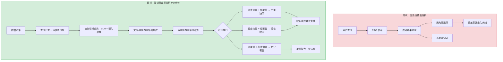
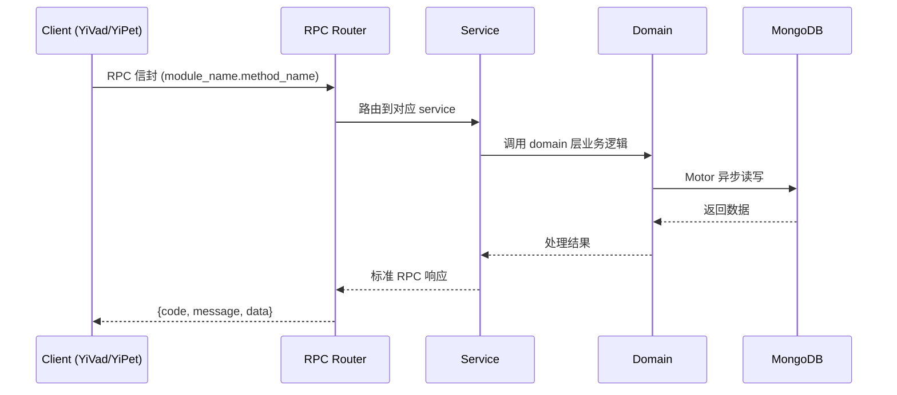

---

doc_type: module
prd_task_id: "YA-09-151"
title: "YA-09-151: 知识覆盖率分析 — 缺口识别 + 填充建议 — 开发方案"
status: 需求已编写
priority: P2
owner: 陈铭
roles: [engineer]
created: 2026-09-11
updated: 2026-09-14
project: YiAi
project_id: yiai
prd_month: "202609"
estimate_frontend: 0.5
source_prd: "225-需求-知识覆盖率分析.md"
source_okr: [yiai-001]

type: task
---

# YA-09-151: 知识覆盖率分析 — 缺口识别 + 填充建议 — 开发方案

> **文档职责**: 本文档定义**怎么做、为什么这么做、实际做成什么样**（HOW），不含产品目标与测试用例。

> 来源 PRD: [225-需求-知识覆盖率分析.md](../../prds/2026-09/225-需求-知识覆盖率分析.md)
> 需求编号: YA-09-151 · 优先级: P2 · 人天: 0.5d

---

<a id="sec-1"></a>
## 一、架构概览



<a id="sec-2"></a>
## 二、文件清单

| 文件 | 操作 | 说明 |
|------|------|------|
| `domain/XXX/models.py` | 新增 | 数据模型定义 |
| `domain/XXX/service.py` | 新增 | 核心服务逻辑 |
| `services/XXX/rpc_handler.py` | 新增 | RPC 路由处理器 |
| `tests/test_XXX.py` | 新增 | 单元测试 |

<a id="sec-3"></a>
## 三、模块设计

### 1. 核心组件

```python
 services/ai/coverage_analysis_service.py (新增)

from dataclasses import dataclass, field
from enum import Enum
from typing import Optional
from datetime import datetime

class CoverageLevel(str, Enum):
    EXCELLENT = "excellent"    # coverage >= 0.8
    GOOD = "good"              # coverage >= 0.6
    FAIR = "fair"              # coverage >= 0.4
    POOR = "poor"              # coverage >= 0.2
    CRITICAL = "critical"      # coverage < 0.2

@dataclass
class TopicCoverage:
    topic_id: str
    topic_name: str                          # 中文主题名称
    topic_description: str                   # 主题描述
    query_count: int                         # 30 天内查询次数
    document_count: int                      # 该主题下文档数量
    coverage_score: float                    # 覆盖评分 (0-1)
    coverage_level: CoverageLevel
    avg_retrieval_quality: float             # 该主题文档的平均检索质量
    freshness_score: float                   # 文档新鲜度 (基于 updated 字段)
# ... (完整实现见 PRD)
```

### 2. 核心组件

```python
 services/ai/topic_classifier.py (新增)

from typing import List, Dict

TOPIC_CATEGORIES = [
    {
        "id": "architecture",
        "name": "架构设计",
        "description": "系统架构、微服务、分布式、设计模式等方面的内容",
        "keywords": ["架构", "微服务", "分布式", "设计模式", "系统设计", "DDD"]
    },
    {
        "id": "frontend",
        "name": "前端开发",
        "description": "Vue、React、CSS、浏览器、UI 组件等方面的内容",
        "keywords": ["Vue", "React", "CSS", "组件", "前端", "浏览器"]
    },
    {
        "id": "backend",
        "name": "后端开发", 
        "description": "Python、FastAPI、数据库、API 设计等方面的内容",
        "keywords": ["Python", "FastAPI", "数据库", "API", "MongoDB", "REST"]
    },
    {
        "id": "ai_llm",
# ... (完整实现见 PRD)
```


<a id="sec-4"></a>
## 四、数据流



**调用链路**: `Client → RPC Router → Service → Domain → MongoDB`  
**响应格式**: `{code: 0, message: "ok", data: ...}`  
**异步模型**: 全链路 `async/await`，Motor 异步 MongoDB 驱动。

<a id="sec-5"></a>
## 五、实施路线图

**预估人天**: 0.5d

| 步骤 | 操作 | 路径 | 验证 | 人天 |
|------|------|------|------|------|
| 1 | 定义主题分类体系（10 大主题 + 关键词） | `topic_classifier.py` | 分类 prompt 正确 | 0.02 |
| 2 | 实现 TopicClassifier（关键词 + LLM 双模式） | `topic_classifier.py` | 查询和文档分类准确率 > 80% | 0.05 |
| 3 | 实现 CoverageScorer（密度加权评分） | `coverage_scorer.py` | 评分公式正确 | 0.04 |
| 4 | 实现 GapAnalyzer（优先级排序） | `gap_analyzer.py` | 高频低覆盖排前面 | 0.04 |
| 5 | 实现 SuggestionGenerator（LLM 生成建议） | `suggestion_generator.py` | 建议具体可执行 | 0.05 |
| 6 | 实现每周快照存储 | `coverage_analysis_service.py` | 快照数据完整 | 0.03 |
| 7 | 实现覆盖报告+趋势 API | `coverage_analysis_service.py` | 报告格式正确 | 0.04 |
| 8 | 测试 | `tests/test_coverage_analysis.py` | 全部测试通过 | 0.03 |

**总人天：0.3d**


<a id="sec-6"></a>
## 六、代码审查检查清单

- [ ] 主题分类关键词列表覆盖所有 10 个主题领域
- [ ] LLM 分类失败时自动降级到关键词分类
- [ ] 覆盖评分中分母为零保护（query_count=0 时返回 None）
- [ ] 新鲜度因子中 updated 字段缺失的处理（默认使用 created）
- [ ] 缺口优先级排序时 business_weight 默认为 1.0
- [ ] 快照 collection 建立日期索引（用于趋势查询）
- [ ] 分类结果中 uncategorized 比例过高时的日志告警（> 30%）
- [ ] LLM 建议生成 prompt 模板防注入
- [ ] 覆盖评分参数可配置（λ, 质量权重, 数量权重）
- [ ] RPC 参数校验（analysis_period_days 7-90）


<a id="sec-7"></a>
## 七、风险评估

| 风险 | 概率 | 影响 | 缓解措施 |
|------|------|------|----------|
| LLM 主题分类结果不稳定 | 中 | 中 | 关键词 fallback 保证基线；LLM 失败自动降级 |
| 查询日志不足（新部署无数据） | 高（新系统） | 中 | 使用 RAG 评估基准的预定义查询集作为种子数据 |
| 覆盖评分与用户实际感受不符 | 中 | 低 | 提供评分公式说明 + 用户可提供反馈修正 |
| 主题分类体系过时 | 低 | 中 | 支持人工添加/修改主题分类；嵌入聚类自动发现新主题候选 |
| 缺口建议质量差 | 中 | 低 | LLM 建议 + 人工审核；标记为"AI 建议"而非"最终决策" |


<a id="sec-8"></a>
## 八、回滚方案

| 场景 | 回滚操作 | 影响 |
|------|----------|------|
| 分类准确率过低 | 切换至纯关键词模式 | 分类粒度变粗 |
| 覆盖评分导致错误决策 | 标记评分系统为"Beta" + 人工验证 | 评分仅供参考 |
| 快照数据损坏 | 从备份恢复 coverage_snapshots 集合 | 趋势历史丢失 |
| 分析服务不可用 | RPC 路由移除 coverage_analysis_service | 覆盖分析暂停 |

