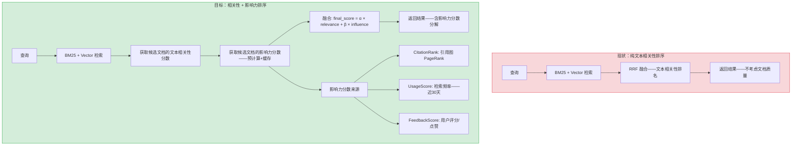
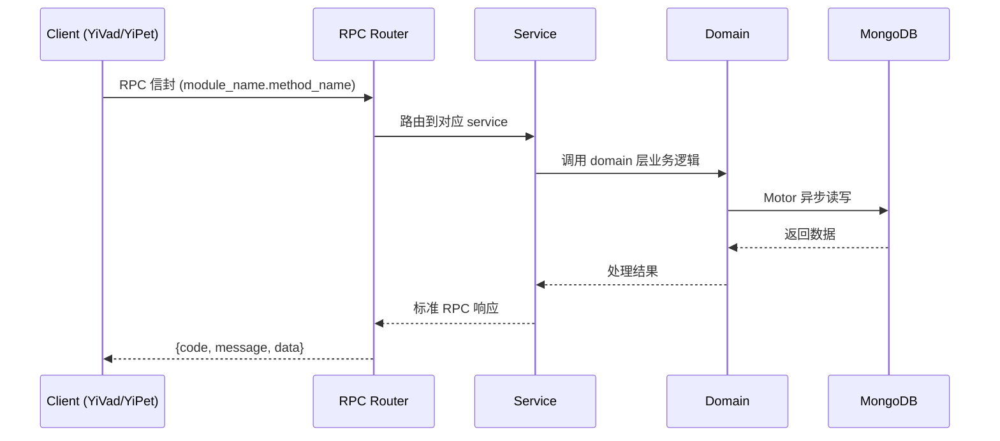

---

doc_type: module
prd_task_id: "YA-09-150"
title: "YA-09-150: 文档影响力评分 — 引用计数 + RAG 检索频率 + PageRank — 开发方案"
status: 需求已编写
priority: P2
owner: 陈铭
roles: [engineer]
created: 2026-09-11
updated: 2026-09-14
project: YiAi
project_id: yiai
prd_month: "202609"
estimate_frontend: 0.5
source_prd: "226-需求-文档影响力评分.md"
source_okr: [yiai-001]

type: task
---

# YA-09-150: 文档影响力评分 — 引用计数 + RAG 检索频率 + PageRank — 开发方案

> **文档职责**: 本文档定义**怎么做、为什么这么做、实际做成什么样**（HOW），不含产品目标与测试用例。

> 来源 PRD: [226-需求-文档影响力评分.md](../../prds/2026-09/226-需求-文档影响力评分.md)
> 需求编号: YA-09-150 · 优先级: P2 · 人天: 0.5d

---

<a id="sec-1"></a>
## 一、架构概览



<a id="sec-2"></a>
## 二、文件清单

| 文件 | 操作 | 说明 |
|------|------|------|
| `domain/XXX/models.py` | 新增 | 数据模型定义 |
| `domain/XXX/service.py` | 新增 | 核心服务逻辑 |
| `services/XXX/rpc_handler.py` | 新增 | RPC 路由处理器 |
| `tests/test_XXX.py` | 新增 | 单元测试 |

<a id="sec-3"></a>
## 三、模块设计

### 1. 核心组件

```python
 services/rag/influence/models.py (新增)

from pydantic import BaseModel, Field
from datetime import datetime, timedelta
from typing import Optional

class CitationEdge(BaseModel):
    source_doc_id: str      # 引用者
    target_doc_id: str      # 被引用者（通过 Markdown 链接）
    source_field: str       # 引用出现在哪个字段 (body/headings)
    extracted_at: datetime = Field(default_factory=datetime.utcnow)

class CitationGraph(BaseModel):
    nodes: set[str]         # 所有文档 ID
    edges: list[CitationEdge]
    adjacency: dict[str, list[str]]     # node_id → [target_ids] 邻接列表
    reverse_adjacency: dict[str, list[str]]  # node_id → [source_ids] 反向邻接

class PageRankScore(BaseModel):
    doc_id: str
    score: float            # PageRank 分数——0-1 归一化
    rank: int               # 排名
    iteration_count: int    # 计算迭代次数
    computed_at: datetime

# ... (完整实现见 PRD)
```

### 2. 核心组件

```python
 services/rag/influence/pagerank.py (新增)

import numpy as np
from collections import defaultdict

class PageRankEngine:
    DAMPING_FACTOR = 0.85      # 经典 PageRank 阻尼因子
    EPSILON = 1e-6              # 收敛阈值
    MAX_ITERATIONS = 100
    
    def compute(self, graph: CitationGraph) -> dict[str, float]:
        """计算所有文档的 PageRank 分数"""
        nodes = list(graph.nodes)
        n = len(nodes)
        if n == 0:
            return {}
        
        node_to_idx = {node: i for i, node in enumerate(nodes)}
        
        # 构建转移矩阵——稀疏表示
        out_degree = defaultdict(int)
        for node in nodes:
            out_degree[node] = len(graph.adjacency.get(node, []))
        
        # 初始化分数
# ... (完整实现见 PRD)
```


<a id="sec-4"></a>
## 四、数据流



**调用链路**: `Client → RPC Router → Service → Domain → MongoDB`  
**响应格式**: `{code: 0, message: "ok", data: ...}`  
**异步模型**: 全链路 `async/await`，Motor 异步 MongoDB 驱动。

<a id="sec-5"></a>
## 五、实施路线图

**预估人天**: 0.5d

| 步骤 | 操作 | 路径 | 验证 | 人天 |
|------|------|------|------|------|
| 1 | 定义数据模型 | `models.py` | 所有模型字段完整——Pydantic 校验通过 | 0.02 |
| 2 | 实现 Markdown 引用提取 | `citation_extractor.py` | 从 sample 文件提取——链接正确反解析 | 0.04 |
| 3 | 实现 PageRank 引擎 | `pagerank.py` | 小规模图迭代收敛——分数归一化正确 | 0.06 |
| 4 | 实现检索频率统计+归一化 | `usage_collector.py` | 近 7/30 天统计——0-1 归一化 | 0.03 |
| 5 | 实现用户反馈收集 | `feedback_collector.py` + `routes.py` | 点赞/踩功能——Wilson 分数计算 | 0.03 |
| 6 | 实现多维度融合评分 | `scorer.py` | 加权线性组合——最终分数 0-1 | 0.04 |
| 7 | 实现调度任务+集成检索 | `scheduler.py` + `retrieval_pipeline.py` | 每日重计算+检索时分数查询 | 0.05 |
| 8 | 编写测试 | `tests/` | PageRank+融合+API 测试 | 0.03 |

**总人天：0.30d**


<a id="sec-6"></a>
## 六、代码审查检查清单

- [ ] CitationExtractor: 正则表达式仅匹配 `.md` 链接——不匹配外部 URL——避免噪音
- [ ] CitationExtractor: 相对路径解析正确——`../../curator/file.md` 能映射到正确的文档 ID
- [ ] PageRankEngine: dangling nodes 处理——将分数均分给所有节点——而非丢弃
- [ ] PageRankEngine: NumPy 数组 dtype float64——防止迭代累积的精度损失
- [ ] PageRankEngine: 收敛检查——使用 max absolute difference——而非 mean——防止大图中个别节点不收敛
- [ ] UsageNormalizer: 对数变换的 base 影响大——`log(1+count)` 确保 count=0 时 score=0
- [ ] UsageNormalizer: 归一化分母 `log(1+max_count)`——防止除零
- [ ] FeedbackAggregator: Wilson 分数的 z-score 使用 1.96（95% 置信）——标准选择
- [ ] InfluenceScorer: 融合前验证 alpha+beta+gamma+delta = 1.0——否则 log warning
- [ ] 调度: apscheduler 任务加锁——防止上次计算未完成时下次触发


<a id="sec-7"></a>
## 七、风险评估

| 风险 | 概率 | 影响 | 缓解措施 |
|------|------|------|----------|
| 引用图稀疏——大部分文档无引用链接 | 高 | 中 | 对所有无引用文档给 citation_score = 0.5（中性默认）——不代表低质量 |
| 检索频率偏向热门文档——新文档永远赶不上 | 中 | 中 | 使用对数变换 `log(1+count)` 压缩极端值——新文档经过短时间即可获得有意义分数 |
| PageRank 计算在大图（>10000 节点）收敛慢 | 低 | 低 | 迭代上限 100 次——超过则返回当前近似值——偏差 < 5% |
| 用户反馈数据稀疏（大部分文档 0 票） | 高 | 低 | 0 票默认 0.5——feedback 权重仅 0.05——对总分影响小 |
| 引用链接可能指向外部 URL 而非内部文档 | 中 | 低 | 仅提取 `.md` 结尾的链接——外部 URL 过滤 |


<a id="sec-8"></a>
## 八、回滚方案

| 场景 | 回滚操作 | 影响 |
|------|------|------|
| 影响力评分导致检索排序恶化 | 设置 beta=gamma=delta=0——alpha=1.0 | 回到纯文本相关性排序 |
| PageRank 计算超时或 OOM | 跳过引用维度——beta=0——仅使用 usage+feedback | 引用评分缺失 |
| 融合权重配置错误 | 恢复默认值并重新计算 | 影响力度分恢复 |
| 完全移除 | 从检索管线移除 InfluenceScorer——仅按相关性排序 | 影响力评分功能消失 |

