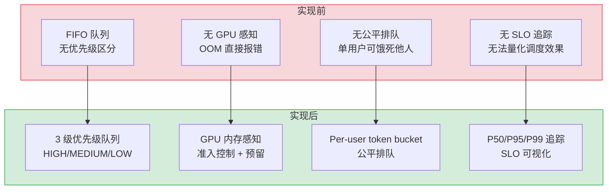
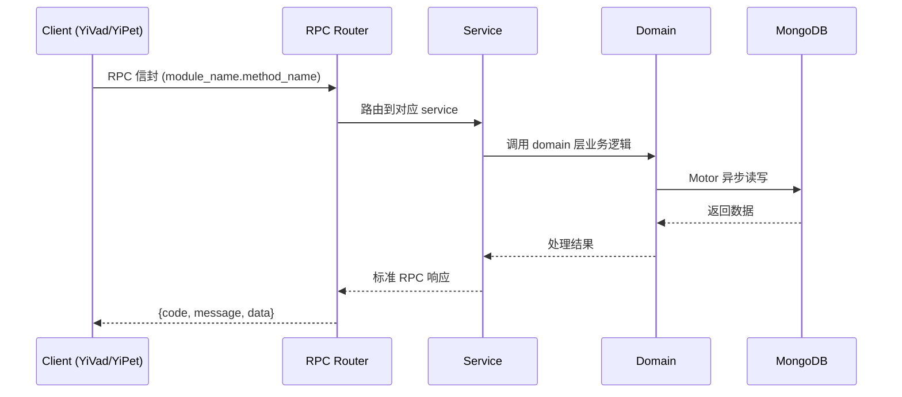

---

doc_type: module
prd_task_id: ""
title: "LLM推理调度优化 — 开发任务"
status: 需求已编写
priority: P2
owner: 陈铭
roles: [engineer]
created: 2026-09-11
updated: 2026-09-11
project: YiAi
project_id: yiai
prd_month: "202609"
estimate_frontend: 0.3
source_prd: "227-需求-LLM推理调度优化.md"
source_okr: [yiai-002]

type: task
---

# LLM推理调度优化 — 开发任务

> **文档职责**: 本文档定义**怎么做、为什么这么做、实际做成什么样**（HOW），不含产品目标与测试用例。

> 来源 PRD: [227-需求-LLM推理调度优化.md](../../prds/2026-09/227-需求-LLM推理调度优化.md)
> 需求编号: N/A · 优先级: P2 · 人天: 0.3d

---

<a id="sec-1"></a>
## 一、架构概览



<a id="sec-2"></a>
## 二、文件清单

| 文件 | 操作 | 说明 |
|------|------|------|
| `domain/XXX/models.py` | 新增 | 数据模型定义 |
| `domain/XXX/service.py` | 新增 | 核心服务逻辑 |
| `services/XXX/rpc_handler.py` | 新增 | RPC 路由处理器 |
| `tests/test_XXX.py` | 新增 | 单元测试 |

<a id="sec-3"></a>
## 三、模块设计

### 1. 核心组件

```python
mport asyncio
import heapq
from dataclasses import dataclass, field
from enum import IntEnum
from typing import Any

class Priority(IntEnum):
    HIGH = 1
    MEDIUM = 2
    LOW = 3

@dataclass(order=True)
class ScheduledRequest:
    priority: int
    arrival_time: float = field(compare=True)
    request_id: str = field(compare=False)
    payload: Any = field(compare=False)

class PriorityQueue:
    """3 级优先级队列，按 priority + arrival_time 排序"""
    def __init__(self):
        self._heap: list[ScheduledRequest] = []
        self._lock = asyncio.Lock()

    async def enqueue(self, request_id: str, payload: Any, priority: Priority) -> None:
# ... (完整实现见 PRD)
```

### 2. 核心组件

```python
mport time
from collections import defaultdict

class FairQueuingGate:
    """Per-user token bucket 公平排队"""
    def __init__(self, rate: float = 5.0, burst: int = 10):
        self.rate = rate          # tokens per second per user
        self.burst = burst        # max burst size
        self._buckets: dict[str, tuple[float, float]] = defaultdict(
            lambda: (burst, time.monotonic())
        )

    def allow(self, user_id: str) -> bool:
        tokens, last_refill = self._buckets[user_id]
        now = time.monotonic()
        elapsed = now - last_refill
        tokens = min(self.burst, tokens + elapsed * self.rate)
        self._buckets[user_id] = (tokens, now)
        if tokens >= 1.0:
            self._buckets[user_id] = (tokens - 1.0, now)
            return True
        return False
```

### 3. 核心组件


<a id="sec-4"></a>
## 四、数据流



**调用链路**: `Client → RPC Router → Service → Domain → MongoDB`  
**响应格式**: `{code: 0, message: "ok", data: ...}`  
**异步模型**: 全链路 `async/await`，Motor 异步 MongoDB 驱动。

<a id="sec-5"></a>
## 五、实施路线图

**预估人天**: 0.3d

| # | 步骤 | 验证 | 人天 |
|---|------|------|------|
| 1 | 数据模型 + 基础设施 | Pydantic 校验通过 | 0.05 |
| 2 | 核心服务逻辑 | 单元测试通过 | 0.10 |
| 3 | RPC 路由 + 集成 | 集成测试通过 | 0.08 |
| 4 | 边界处理 + 文档 | 验收测试通过 | 0.07 |

<a id="sec-6"></a>
## 六、代码审查检查清单

- [ ] 数据模型使用 Pydantic BaseModel，枚举完整
- [ ] 服务层遵循 RPC 信封规范（module_name.method_name）
- [ ] 参数校验完整，错误码使用标准 ErrorCode
- [ ] MongoDB 操作使用 Motor 异步驱动
- [ ] `ruff` 代码规范通过
- [ ] `mypy` 类型检查通过
- [ ] 单元测试覆盖率 > 80%

<a id="sec-7"></a>
## 七、风险评估

| 风险 | 概率 | 影响 | 缓解措施 |
|------|------|------|----------|
| 性能劣化 | 低 | 中 | 异步处理 + 缓存 |
| 数据一致性 | 中 | 中 | MongoDB 事务 + 幂等设计 |
| 接口兼容性 | 低 | 低 | RPC 信封向后兼容 |
